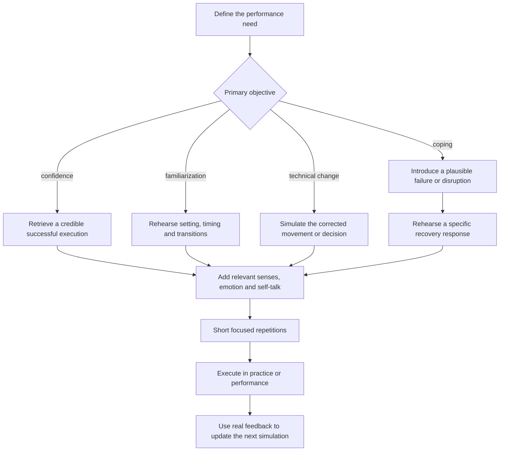

# Mental imagery for performance

Mental imagery is the deliberate simulation of a future or modified performance without completing the full external action. Although often called visualization, useful imagery is not purely visual: it can include movement sensation, sound, smell, emotion, self-talk, environmental cues, and the sequence of decisions. It supplements physical practice by rehearsing attention and responses; it does not reproduce the full physiological loading, sensory error, or feedback of actually performing. (@drandygalpin (Andy Galpin) — "Visualization Techniques for Peak Performance | Dr. Andy Galpin & Dr. Lenny Wiersma", 2026-07-15, [link](https://www.youtube.com/watch?v=15n-gKyU-PY))

## Match the simulation to its purpose

The content should follow the training objective. Confidence imagery retrieves credible successful performances and the feelings associated with them. Coping imagery introduces a plausible disruption and rehearses the planned response. Familiarization imagery previews an unfamiliar setting and its transitions. Technical imagery increases correct mental repetitions of a specific adjustment, especially when an established movement pattern is being changed. Lenny Wiersma’s distinctive framework is therefore to choose the purpose before choosing the scene, rather than treating generic images of success as the technique itself. (@drandygalpin (Andy Galpin) — "Visualization Techniques for Peak Performance | Dr. Andy Galpin & Dr. Lenny Wiersma", 2026-07-15, [link](https://www.youtube.com/watch?v=15n-gKyU-PY))

Coping imagery is not catastrophic rumination. It constrains attention to a plausible obstacle and an actionable recovery sequence: notice the event, regulate, select the next cue, and continue or stop safely. The transcript uses Michael Phelps’s preparation for impaired vision in a race as an illustration of rehearsing both a disruption and the behavioral solution, but it does not establish which element caused his performance. The broader claim—that seeing oneself cope can make a response more available under pressure—is plausible and supported here only by an expert’s summary rather than cited trials or effect sizes. (@drandygalpin (Andy Galpin) — "Visualization Techniques for Peak Performance | Dr. Andy Galpin & Dr. Lenny Wiersma", 2026-07-15, [link](https://www.youtube.com/watch?v=15n-gKyU-PY)) [[stress-threat-discrimination]]

## Fidelity, emotion, and dose

Imagery becomes more task-specific when it incorporates the cues that will govern the real action. Visiting a venue, rehearsing the walk to a ready area, holding equipment, or wearing familiar clothing can supply spatial, tactile, and olfactory context. Emotion is also part of the target state: a simulation of pressure should include manageable arousal and the response used to regulate it. Greater resemblance may improve retrieval, but claims that a uniform or equipment independently improves outcomes are especially tentative in the source. (@drandygalpin (Andy Galpin) — "Visualization Techniques for Peak Performance | Dr. Andy Galpin & Dr. Lenny Wiersma", 2026-07-15, [link](https://www.youtube.com/watch?v=15n-gKyU-PY))

Short, repeatable sequences are easier to make precise than an uninterrupted movie of an entire event. Wiersma uses about ten focused minutes as a practical session for high-level athletes and suggests increasing practice in the weeks approaching competition, while acknowledging time constraints. This is a coaching protocol, not a dose established as optimal by the transcript. Stimulating performance imagery immediately before bed may increase cognitive and emotional activation; low-stakes sleep stories are proposed instead as practice in vivid scene construction and attentional disengagement, but that transfer and the sleep mechanism remain unmeasured here. (@drandygalpin (Andy Galpin) — "Visualization Techniques for Peak Performance | Dr. Andy Galpin & Dr. Lenny Wiersma", 2026-07-15, [link](https://www.youtube.com/watch?v=15n-gKyU-PY)) [[pre-sleep-routines-and-stimulus-control]]

## Practical implications

- **Before a consequential event: define one objective and rehearse one short sequence for up to about ten focused minutes — moderate for mental imagery broadly, limited for this exact dose.** Confidence, coping, familiarization, and technical correction require different scenes; do not combine every objective into one vague success narrative. (@drandygalpin (Andy Galpin) — "Visualization Techniques for Peak Performance | Dr. Andy Galpin & Dr. Lenny Wiersma", 2026-07-15, [link](https://www.youtube.com/watch?v=15n-gKyU-PY))
- **Several times per week, and more often during the final weeks before an important event if useful: rehearse a plausible disruption together with the first recovery action — limited-to-moderate.** Keep the scenario bounded and revise it from real practice feedback; stop if it becomes uncontrolled rumination. (@drandygalpin (Andy Galpin) — "Visualization Techniques for Peak Performance | Dr. Andy Galpin & Dr. Lenny Wiersma", 2026-07-15, [link](https://www.youtube.com/watch?v=15n-gKyU-PY))
- **When the environment is unfamiliar: preview the actual location or reliable images and mentally traverse the key transitions — plausible, limited direct evidence in the source.** This applies to examinations, presentations, procedures, performing arts, and sport. (@drandygalpin (Andy Galpin) — "Visualization Techniques for Peak Performance | Dr. Andy Galpin & Dr. Lenny Wiersma", 2026-07-15, [link](https://www.youtube.com/watch?v=15n-gKyU-PY))
- **Avoid activating performance rehearsal immediately before sleep when it reliably delays sleep — pragmatic, anecdotal evidence.** Schedule it earlier and preserve the pre-sleep period for lower-arousal material. (@drandygalpin (Andy Galpin) — "Visualization Techniques for Peak Performance | Dr. Andy Galpin & Dr. Lenny Wiersma", 2026-07-15, [link](https://www.youtube.com/watch?v=15n-gKyU-PY))

## Gaps & open questions

- Which imagery functions produce meaningful performance gains, and how do they compare with equal time spent in physical practice, planning, or relaxation?
- What dose, perspective, sensory detail, and emotional intensity are optimal for different skills and experience levels?
- When does coping imagery build preparedness, and when does it amplify anxiety or rumination?
- Do equipment, clothing, venue exposure, and olfactory cues add benefit beyond expectancy and greater attention?
- How well do imagery skills transfer between sleep stories, sport, academic work, clinical procedures, and public performance?

## Related

[[mental-strength-and-behavioral-skills]] · [[stress-threat-discrimination]] · [[breathing-mechanics-and-state-regulation]] · [[self-schema-updating-after-achievement]] · [[pre-sleep-routines-and-stimulus-control]] · [[practice-playbook]]
