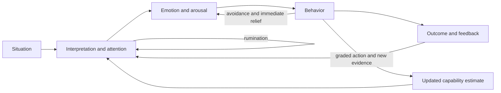
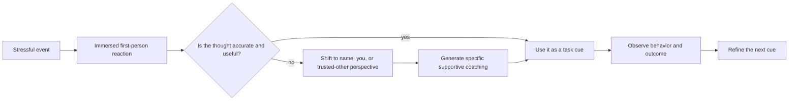

# Mental strength and behavioral skills

Mental strength is the capacity to choose useful thoughts, regulate rather than eliminate emotions, and take value-consistent action under discomfort. It is not constant confidence, positive thinking, emotional suppression, or passive endurance. Amy Morin’s useful organizing framework treats cognition, emotion, and behavior as trainable and mutually reinforcing skill domains; its clinical plausibility is stronger than the transcript’s evidence for any one branded exercise. (@maxlugavere (Max Lugavere) — "Mental Health Expert: Stop Overthinking, Face Discomfort, and Take Back Control - Amy Morin", 2026-07-29, [link](https://www.youtube.com/watch?v=5C6Ji9iDJz8))

## The thought–emotion–behavior system

Thoughts shape the meaning assigned to a situation, emotions change attention and action readiness, and behavior generates evidence that either preserves or updates the original interpretation. Rumination becomes a self-loop when repeated analysis produces neither a decision nor new information. Avoidance can reduce distress immediately while depriving the person of corrective experience; a small, safe action can instead reveal that discomfort is tolerable or that the feared outcome is manageable. This model connects with threat appraisal in [[stress-threat-discrimination]] and automatic defensive patterns in [[protective-threat-responses]]. (@maxlugavere (Max Lugavere) — "Mental Health Expert: Stop Overthinking, Face Discomfort, and Take Back Control - Amy Morin", 2026-07-29, [link](https://www.youtube.com/watch?v=5C6Ji9iDJz8))

Emotions are signals, not verdicts. Anxiety can prompt preparation and hazard detection; too little may permit carelessness, while too much can narrow working memory and impair judgment. The objective is therefore functional regulation—identifying the state, deciding whether its message fits the situation, and selecting an action—not achieving zero anxiety. Morin’s distinctive position is that a person need not feel strong before acting strongly, and that tool selection should depend on the moment rather than treating meditation or positive thinking as universal solutions. (@maxlugavere (Max Lugavere) — "Mental Health Expert: Stop Overthinking, Face Discomfort, and Take Back Control - Amy Morin", 2026-07-29, [link](https://www.youtube.com/watch?v=5C6Ji9iDJz8))

## Interrupting rumination

Productive reflection ends in a decision, experiment, acceptance, or request for information. Rumination repeatedly revisits causes, mistakes, or possible threats without changing the action set. Two proposed interruptions are behavioral channel-changing—brief exercise, a household task, or another absorbing activity—and scheduled worry, in which concerns are recorded and deferred to a fixed short period. The mechanism is attentional containment rather than proof that the concern is false. Morin reports clinical success with these methods, but the transcript provides neither trial details nor effect sizes, so support here is practice-based and limited. (@maxlugavere (Max Lugavere) — "Mental Health Expert: Stop Overthinking, Face Discomfort, and Take Back Control - Amy Morin", 2026-07-29, [link](https://www.youtube.com/watch?v=5C6Ji9iDJz8))

An incubation interval can also improve problem solving when deliberate effort has stalled: attention moves elsewhere while associative processing continues, allowing a later return with less emotional urgency. This is different from indefinite avoidance because the problem has a defined return point. The transcript describes the research direction but does not identify the studies, so the mechanism is plausible rather than quantified here. (@maxlugavere (Max Lugavere) — "Mental Health Expert: Stop Overthinking, Face Discomfort, and Take Back Control - Amy Morin", 2026-07-29, [link](https://www.youtube.com/watch?v=5C6Ji9iDJz8))

## Functional self-talk and psychological distance

Self-talk is better classified by function than by emotional valence. A critical statement can be useful when it is accurate, specific, actionable, and delivered without attacking worth; a positive statement can be useless when it is implausible or distracts from the task. This functional criterion qualifies any simple recommendation to replace negative thoughts with positive ones: the relevant outcomes are attention, emotional regulation, decision quality, and behavior. Lenny Wiersma foregrounds this valence-independent framing, which also resolves the apparent tension between supportive self-acknowledgment in [[self-schema-updating-after-achievement]] and the legitimate use of corrective feedback. (@drandygalpin (Andy Galpin) — "Tool for Reducing Negative Self-Talk | Dr. Andy Galpin &  Dr. Lenny Wiersma", 2026-07-17, [link](https://www.youtube.com/watch?v=Fr97nAnACMU))

Psychological distancing changes the grammatical and imagined vantage point from immersed first-person thought to second-person coaching or the perspective of a trusted other. Using one’s name or nickname can turn an automatic reaction into an instruction addressed to oneself; imagining what a trusted, supportive person would say adds a further shift in perspective. The proposed mechanism is reduced emotional immersion and access to the more balanced guidance people often give a friend. The transcript describes this as highly effective and mentions research linking momentary thought to confidence and happiness, but supplies no studies, effect sizes, or comparison conditions; evidence for this exact protocol is therefore limited in this source. (@drandygalpin (Andy Galpin) — "Tool for Reducing Negative Self-Talk | Dr. Andy Galpin &  Dr. Lenny Wiersma", 2026-07-17, [link](https://www.youtube.com/watch?v=Fr97nAnACMU))

A practical preparation exercise is to identify two or three trusted figures—mostly people known personally—then write how one of them would coach a friend through a recurring high-pressure situation. In the event, the person recalls that voice using their name and selects one concrete next action. Trust is meant to supply benevolent intent, not infallible authority; advice still requires reality checking, and an imagined voice is not a substitute for actual consultation when risk is high. (@drandygalpin (Andy Galpin) — "Tool for Reducing Negative Self-Talk | Dr. Andy Galpin &  Dr. Lenny Wiersma", 2026-07-17, [link](https://www.youtube.com/watch?v=Fr97nAnACMU))

## Discomfort, action, and capability learning

Modern convenience can remove routine encounters with boredom, uncertainty, effort, and unscripted social interaction. Morin’s contrarian hypothesis is that avoiding nearly all discomfort can weaken confidence because people lose opportunities to test their capacities. This is a learning claim, not evidence that contemporary mental illness is primarily caused by comfort, and it must not be used to dismiss trauma, poverty, illness, neurodevelopmental conditions, or the need for treatment. (@maxlugavere (Max Lugavere) — "Mental Health Expert: Stop Overthinking, Face Discomfort, and Take Back Control - Amy Morin", 2026-07-29, [link](https://www.youtube.com/watch?v=5C6Ji9iDJz8))

Useful challenge is individualized and directional: speaking once in a meeting may stretch an inhibited person, while listening without interrupting may stretch an impulsive one. Exercise supplies particularly clear feedback because effort-related predictions can be compared with safe, observable performance. Walking or resistance training may also change mood and perceived agency, but the interview’s stronger claim that physical stress cross-adapts a person to grief or trauma is mechanistically speculative and should not turn cold exposure, strenuous exercise, or wellness rituals into substitutes for care. (@maxlugavere (Max Lugavere) — "Mental Health Expert: Stop Overthinking, Face Discomfort, and Take Back Control - Amy Morin", 2026-07-29, [link](https://www.youtube.com/watch?v=5C6Ji9iDJz8)) [[daily-movement-mobility-and-pain]]

Discipline can reduce dependence on momentary motivation by pre-committing a small behavior and attaching it to a stable cue. Ken Rideout's practical on-ramp is deliberately non-extreme: begin with a 10-minute or one-mile walk, build toward an hour several times weekly, and only then consider added load such as a backpack. He attributes better handling of negative information and a reliable post-exercise mood shift to running, but this is personal observation rather than a controlled effect estimate. His broader belief that health maintenance is a responsibility to family is a moral framing, not a scientific mechanism; it may motivate some people and create guilt in others. (@drandygalpin (Andy Galpin) — "Small Steps for Massive Health Gains | Ken Rideout & Dr. Andy Galpin", 2026-07-09, [link](https://www.youtube.com/watch?v=1_XyRaqWhYc))

Chosen difficulty is useful only inside a safety and values boundary. Rideout uses very high-volume running to regulate mental health and explicitly acknowledges that more rest might improve performance; he does not recommend races or ultramarathons to others. The transferable principle is graded, repeatable effort followed by reflection on function—not copying an extreme dose. This aligns with [[addiction-recovery-and-emotional-sobriety]], where exercise may provide structure and relief but can also become compulsive substitution. (@drandygalpin (Andy Galpin) — "Small Steps for Massive Health Gains | Ken Rideout & Dr. Andy Galpin", 2026-07-09, [link](https://www.youtube.com/watch?v=1_XyRaqWhYc)) (@drandygalpin (Andy Galpin) — "How to Find Peace Through Suffering | Ken Rideout & Dr. Andy Galpin", 2026-07-06, [link](https://www.youtube.com/watch?v=EfbtNG5P3gU))

## Digital environments and social skill

Phones make immediate relief from boredom and social uncertainty continuously available. Mindless scrolling, rage-driven content, and comparison can occupy attention and reinforce reactive behavior; deliberate boundaries change the environment rather than demanding endless willpower. The interview cites experiments in which moving the phone out of the bedroom reduced anxiety for many participants and a phone-free camp week improved children’s emotion recognition and conversation, but it supplies no study identifiers or methodological detail. These findings are suggestive, not a basis for the reported percentages as settled facts. (@maxlugavere (Max Lugavere) — "Mental Health Expert: Stop Overthinking, Face Discomfort, and Take Back Control - Amy Morin", 2026-07-29, [link](https://www.youtube.com/watch?v=5C6Ji9iDJz8))

AI chatbots may retrieve coping ideas, but they see the story the user supplies, can select the wrong skill, may confidently produce poor advice, and often accommodate pushback. A therapist can observe discrepancies, context, risk, and interpersonal patterns that are absent from a one-sided prompt. The transcript therefore supports chatbots as limited aids, not autonomous diagnosis, crisis care, or substitutes for a therapeutic relationship. (@maxlugavere (Max Lugavere) — "Mental Health Expert: Stop Overthinking, Face Discomfort, and Take Back Control - Amy Morin", 2026-07-29, [link](https://www.youtube.com/watch?v=5C6Ji9iDJz8)) [[human-centered-ai-and-learning]]

## Practical implications

- **For an inactive person, schedule a 10-minute or one-mile walk on most days and extend duration only after it is repeatable — strong for gradual activity adoption; limited for discipline or mood mechanisms in this source.** The relevant experiment is whether bounded effort improves function and consistency, not whether one can tolerate an extreme event. (@drandygalpin (Andy Galpin) — "Small Steps for Massive Health Gains | Ken Rideout & Dr. Andy Galpin", 2026-07-09, [link](https://www.youtube.com/watch?v=1_XyRaqWhYc))
- **Weekly: audit whether chosen difficulty supports health, recovery, relationships, and purpose or has become self-punishment and avoidance — limited, safety-oriented.** Reduce the dose and seek appropriate support when exercise becomes compulsory or displaces care. (@drandygalpin (Andy Galpin) — "How to Find Peace Through Suffering | Ken Rideout & Dr. Andy Galpin", 2026-07-06, [link](https://www.youtube.com/watch?v=EfbtNG5P3gU))
- **Daily: identify one consequential thought, the emotion present, and the next value-consistent behavior — moderate as a skills framework.** Judge success by whether the action was useful, not whether discomfort disappeared. (@maxlugavere (Max Lugavere) — "Mental Health Expert: Stop Overthinking, Face Discomfort, and Take Back Control - Amy Morin", 2026-07-29, [link](https://www.youtube.com/watch?v=5C6Ji9iDJz8))
- **When analysis becomes repetitive: record the concern, choose either a concrete next step or a scheduled return time, and shift into an absorbing activity — limited-to-moderate.** Persistent intrusive thoughts, severe anxiety, or impaired function warrant professional assessment rather than escalating self-help. (@maxlugavere (Max Lugavere) — "Mental Health Expert: Stop Overthinking, Face Discomfort, and Take Back Control - Amy Morin", 2026-07-29, [link](https://www.youtube.com/watch?v=5C6Ji9iDJz8))
- **Most days: practice one small, safe, personally relevant discomfort — moderate for graded learning, individualized in dose.** Increase challenge only when the current step is tolerable; do not use exposure to override medical limits or recreate trauma without clinical support. (@maxlugavere (Max Lugavere) — "Mental Health Expert: Stop Overthinking, Face Discomfort, and Take Back Control - Amy Morin", 2026-07-29, [link](https://www.youtube.com/watch?v=5C6Ji9iDJz8))
- **Nightly and during shared meals: test phone-free boundaries — limited-to-moderate.** A practical experiment is charging the phone outside the bedroom and reviewing sleep, anxiety, and adherence after two to four weeks. (@maxlugavere (Max Lugavere) — "Mental Health Expert: Stop Overthinking, Face Discomfort, and Take Back Control - Amy Morin", 2026-07-29, [link](https://www.youtube.com/watch?v=5C6Ji9iDJz8))
- **During low mood: add one small outward action, such as a sincere message or manageable act of help — limited.** Prosocial action may interrupt self-focused rumination, but it does not replace treatment or justify giving beyond one’s capacity. (@maxlugavere (Max Lugavere) — "Mental Health Expert: Stop Overthinking, Face Discomfort, and Take Back Control - Amy Morin", 2026-07-29, [link](https://www.youtube.com/watch?v=5C6Ji9iDJz8))
- **During a recurring pressure episode: address yourself by name and give the specific instruction you would give a trusted friend — limited-to-moderate for distancing generally; limited for this exact exercise.** Judge the cue by whether it improves the next action, not whether it sounds positive. (@drandygalpin (Andy Galpin) — "Tool for Reducing Negative Self-Talk | Dr. Andy Galpin &  Dr. Lenny Wiersma", 2026-07-17, [link](https://www.youtube.com/watch?v=Fr97nAnACMU))
- **Weekly: audit several recurring self-statements for accuracy, actionability, and effect — pragmatic, limited direct evidence.** Retain useful correction, rewrite global attacks as task cues, and seek care when self-talk is intrusive, commanding, or linked to self-harm. (@drandygalpin (Andy Galpin) — "Tool for Reducing Negative Self-Talk | Dr. Andy Galpin &  Dr. Lenny Wiersma", 2026-07-17, [link](https://www.youtube.com/watch?v=Fr97nAnACMU))

## Gaps & open questions

- Which thought–emotion–behavior exercises improve function in randomized trials, for whom, and relative to which established therapies?
- When does scheduled worry reduce rumination, and when does it reinforce attention to threat?
- How much discomfort practice generalizes across domains rather than improving only the practiced task?
- Which phone boundaries improve sleep, anxiety, social cognition, or loneliness after expectancy effects and self-selection are controlled?
- What safety and effectiveness thresholds would make an AI mental-health tool appropriate for screening, coaching, or adjunctive care?
- How should ordinary grief and distress be distinguished from conditions requiring treatment without pathologizing the former or neglecting the latter?
- How much does second- or third-person self-talk improve performance or well-being beyond cue specificity, expectancy, and ordinary problem solving?
- Which people benefit from stern but functional self-talk, and when does it increase shame, anxiety, or avoidance?
- Which doses of chosen physical difficulty improve mood regulation or behavioral agency, and when do they instead reinforce compulsion or self-punishment?

## Related

[[stress-threat-discrimination]] · [[protective-threat-responses]] · [[social-evaluative-threat-and-criticism]] · [[self-schema-updating-after-achievement]] · [[mental-imagery-for-performance]] · [[combat-sports-as-controlled-stress-training]] · [[durable-well-being-and-hedonic-adaptation]] · [[addiction-recovery-and-emotional-sobriety]] · [[daily-movement-mobility-and-pain]] · [[cognitive-reserve-and-brain-health]] · [[human-centered-ai-and-learning]] · [[practice-playbook]] · [[aging-model]]
