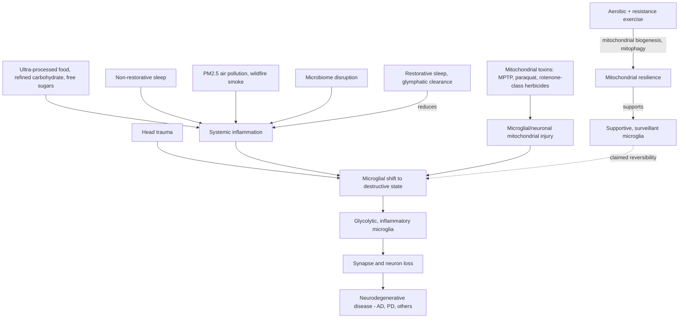

# Microglia and neuroinflammation

Microglia are the brain's resident immune cells. In their surveillant state they support neurons and synapses — pruning, clearing debris, releasing trophic factors; under inflammatory activation they shift toward a destructive phenotype that releases inflammatory mediators and can digest synapses and neurons. Neurologist David Perlmutter teaches this with the older M1 (destructive) / M2 (supportive) polarization dichotomy; current immunology treats that binary as a didactic simplification — single-cell studies show a continuum of many context-dependent microglial states — but the underlying claim that microglial activation state matters for neurodegeneration is well supported. (@maxlugavere (Max Lugavere) — "What to Eat to BEAT Alzheimer's - Dr. David Perlmutter", 2026-08-19, [link](https://www.youtube.com/watch?v=HiL3Phwl2d0)) [[inflammaging-and-il-6]] [[immune-recognition-and-trafficking]]

The strong version of the claim, and the thesis of Perlmutter's book Brain Defenders, is convergence: that disrupted metabolism, acting on the brain's immune cells through immunometabolism, is the shared upstream event across neurodegenerative diseases — Alzheimer's, Parkinson's, and the conditions without a signature misfolded protein (frontotemporal dementia, multiple system atrophy, PSP, ALS). This is expert interpretation, not established consensus: microglial activation is genuinely observed across these diseases (microglial genes such as TREM2 are Alzheimer's risk loci, supporting a causal role), but whether it is the upstream driver, an amplifier, or partly a response to disease-specific proteinopathy remains unresolved, and the amyloid and synuclein frameworks retain substantial independent evidence. Record the convergence thesis as an attributed position that competes with, rather than replaces, the protein-centric models on [[alzheimers-spectrum-and-diagnosis]]. (@maxlugavere (Max Lugavere) — "What to Eat to BEAT Alzheimer's - Dr. David Perlmutter", 2026-08-19, [link](https://www.youtube.com/watch?v=HiL3Phwl2d0)) [[hallmarks-of-aging]]

## Mechanism: what flips the switch

In the model presented, systemic inflammation from any source reaches the brain and shifts microglia toward the destructive state; the proposed proximate switch is mitochondrial. Supportive microglia run on functional mitochondrial respiration; in the destructive state mitochondria fail and the cell falls back on glycolysis, a far less efficient energy pathway — so, in this account, mitochondrial health in microglia dictates which phenotype predominates. Metabolic-immune coupling in myeloid cells (glycolytic shift with inflammatory activation) is real and well described in immunology; treating microglial mitochondrial failure as the master switch for neurodegeneration is the speculative extension. (@maxlugavere (Max Lugavere) — "What to Eat to BEAT Alzheimer's - Dr. David Perlmutter", 2026-08-19, [link](https://www.youtube.com/watch?v=HiL3Phwl2d0)) [[mitochondrial-dysfunction]]

Two lines of evidence anchor the causal direction. The MPTP story: in the 1980s J. William Langston traced acute parkinsonism in intravenous drug users to street drug contaminated with MPTP, a mitochondrial toxin; autopsy of one patient 13 years later showed microglia still active in the substantia nigra from that single exposure, having destroyed the dopaminergic neurons — establishing both that a mitochondrial toxin can produce neurodegeneration and that microglial activation can persist for over a decade after the trigger. (Perlmutter dates the ER presentations to 1988 in the interview; the canonical MPTP case series was published in 1983 — treat the date loosely, the mechanism report is standard neurology.) The imaging line: TSPO PET ligands label activated microglia in vivo, and Perlmutter reports TSPO positivity across essentially every neurodegenerative condition — a research tool, not a clinical test. (@maxlugavere (Max Lugavere) — "What to Eat to BEAT Alzheimer's - Dr. David Perlmutter", 2026-08-19, [link](https://www.youtube.com/watch?v=HiL3Phwl2d0))

## Reversibility and the lifestyle evidence

The empowering claim is that microglial state is bidirectional — that removing inflammatory inputs and restoring metabolic health reverts destructive microglia to supportive. The human evidence offered is the Ornish–Tanzi lifestyle trial in existing Alzheimer's disease: roughly 20 weeks, some 50-odd participants, multidomain intervention (diet, activity, social connection, stress reduction), with Perlmutter summarizing the result as arrest or improvement in about 70% of the treated cohort. The published trial (Ornish et al., 2024) was randomized but small, short, unblinded, and mixed across cognitive endpoints; it is hypothesis-supporting for lifestyle modification in early disease, not proof of microglial reversal (microglial state was not measured) and not a demonstrated treatment effect exceeding drugs. Systemic inflammatory markers (hs-CRP, ESR, fasting insulin, HbA1c) are offered as accessible upstream proxies; none is a validated microglial surrogate. (@maxlugavere (Max Lugavere) — "What to Eat to BEAT Alzheimer's - Dr. David Perlmutter", 2026-08-19, [link](https://www.youtube.com/watch?v=HiL3Phwl2d0)) [[cognitive-reserve-and-brain-health]]

Dietary inputs are covered on their own pages with this page as the brain-facing mechanism: ultra-processed food and Alzheimer's risk on [[ultra-processed-food]]; fructose loading, uric acid, and the mitochondrial-suppression account of juicing and smoothies on [[free-sugars-and-glycemic-response]]; sleep's glymphatic clearance and next-day metabolic damage on [[sleep-quality-and-circadian-alignment]]; particulate air pollution on [[environmental-pollution-and-health]]. Perlmutter additionally cites, as single food associations: one egg per day associated with reduced Alzheimer's risk (choline proposed as one active component, with the food-matrix caveat that extracting the thing misses the point), and higher cheese consumption associated with lower dementia risk ([[cheese-and-mortality]]). Both are cohort associations subject to the usual confounding. His exercise prescription for brain health is the combination of aerobic and resistance training — different metabolic targets (perfusion and nitric oxide; glycemic control, mitophagy, and mitochondrial biogenesis) — with a claimed overtraining inflection around 180 minutes per week for an average person, a U-shaped-curve estimate he presents without trial support; mainstream guidance treats considerably higher volumes as safe for most people, so record the 180-minute ceiling as attributed opinion. (@maxlugavere (Max Lugavere) — "What to Eat to BEAT Alzheimer's - Dr. David Perlmutter", 2026-08-19, [link](https://www.youtube.com/watch?v=HiL3Phwl2d0)) [[exercise-intensity-and-health-outcomes]] [[cardiorespiratory-fitness]]

The timeline claim matters for prevention framing: the metabolic groundwork for late-life neurodegeneration is laid in the 30s–50s, decades before symptoms — consistent with cohort evidence that midlife metabolic syndrome and diabetes (a roughly two-to-three-fold Alzheimer's risk elevation in the account given) predict late-life dementia. Hence the monitoring emphasis on dynamic glucose (a time-limited continuous glucose monitor rather than an annual fasting draw), fasting insulin, HbA1c, and waist-to-hip ratio by tape measure over BMI. (@maxlugavere (Max Lugavere) — "What to Eat to BEAT Alzheimer's - Dr. David Perlmutter", 2026-08-19, [link](https://www.youtube.com/watch?v=HiL3Phwl2d0)) [[insulin-resistance]] [[proactive-health-monitoring]] [[visceral-and-ectopic-fat]]

## Therapeutic horizon

Perlmutter reports early-stage work on pharmacologic microglial reprogramming, mitochondrial transplantation, and instillation of progenitor-derived microglia into spinal fluid — including, he says, a human intervention within the last year for a universally fatal neurodegenerative condition that was effective. No trial identifiers are given; treat these as unverified frontier reports. He also flags GLP-1 receptor agonists as the pharmaceutical bright spot for neurodegeneration, consistent with their anti-inflammatory and metabolic profile and ongoing Alzheimer's trials. Nicotine is noted as having genuinely positive early evidence as a neuroprotectant, excluded from his recommendations because of addiction risk. (@maxlugavere (Max Lugavere) — "What to Eat to BEAT Alzheimer's - Dr. David Perlmutter", 2026-08-19, [link](https://www.youtube.com/watch?v=HiL3Phwl2d0)) [[glp-1-receptor-agonists]] [[anti-amyloid-immunotherapy]]

## Practical implications

- **Daily, from midlife or earlier: the anti-inflammatory foundations — minimally processed diet, restorative sleep, combined aerobic and resistance exercise — moderate for dementia-risk reduction as a bundle (multidomain-trial and cohort evidence), unproven as microglial reversal.** These duplicate the existing playbook foundations; the microglial account adds rationale, not new actions. (@maxlugavere (Max Lugavere) — "What to Eat to BEAT Alzheimer's - Dr. David Perlmutter", 2026-08-19, [link](https://www.youtube.com/watch?v=HiL3Phwl2d0)) [[practice-playbook]]
- **Periodically: track inflammatory and metabolic markers (hs-CRP, fasting insulin, HbA1c) and waist-to-hip ratio; a time-limited CGM trial can reveal dynamic glucose behavior — moderate as risk assessment; none of these is a validated brain-outcome surrogate.** (@maxlugavere (Max Lugavere) — "What to Eat to BEAT Alzheimer's - Dr. David Perlmutter", 2026-08-19, [link](https://www.youtube.com/watch?v=HiL3Phwl2d0)) [[blood-marker-variability-and-reference-change]]
- **Avoid identified mitochondrial toxins where feasible: minimize herbicide/pesticide exposure (paraquat in particular), and filter indoor air where PM2.5 is elevated — moderate for the exposure–Parkinson's and pollution–dementia associations, precautionary at the individual level.** (@maxlugavere (Max Lugavere) — "What to Eat to BEAT Alzheimer's - Dr. David Perlmutter", 2026-08-19, [link](https://www.youtube.com/watch?v=HiL3Phwl2d0)) [[environmental-pollution-and-health]]
- **Do not treat the 180-minutes-per-week exercise ceiling as a limit — attributed opinion conflicting with guideline evidence that higher volumes remain beneficial for most people.** [[exercise-intensity-and-health-outcomes]]
- **Microglial reprogramming, mitochondrial transplantation, and microglial transplantation are experimental — no patient action.** (@maxlugavere (Max Lugavere) — "What to Eat to BEAT Alzheimer's - Dr. David Perlmutter", 2026-08-19, [link](https://www.youtube.com/watch?v=HiL3Phwl2d0))

## Gaps & open questions

- Is microglial activation upstream cause, amplifier, or partly consequence of proteinopathy in each neurodegenerative disease — and does the answer differ by disease?
- Can microglial state be measured clinically (beyond research TSPO PET), and does any intervention demonstrably revert it in humans?
- Does the immunometabolic model explain why anti-amyloid clearance yields small clinical benefit, and would microglia-targeted drugs do better?
- What are the dose–response and interaction structures among the inflammatory inputs (diet, sleep, PM2.5, toxins) for brain outcomes?
- Is there a true overtraining threshold for brain health, and where?

## Related

[[alzheimers-spectrum-and-diagnosis]] · [[anti-amyloid-immunotherapy]] · [[inflammaging-and-il-6]] · [[inflammation-and-depression]] · [[mitochondrial-dysfunction]] · [[ultra-processed-food]] · [[environmental-pollution-and-health]] · [[sleep-quality-and-circadian-alignment]] · [[insulin-resistance]] · [[cognitive-reserve-and-brain-health]] · [[david-perlmutter]] · [[practice-playbook]] · [[aging-model]]
