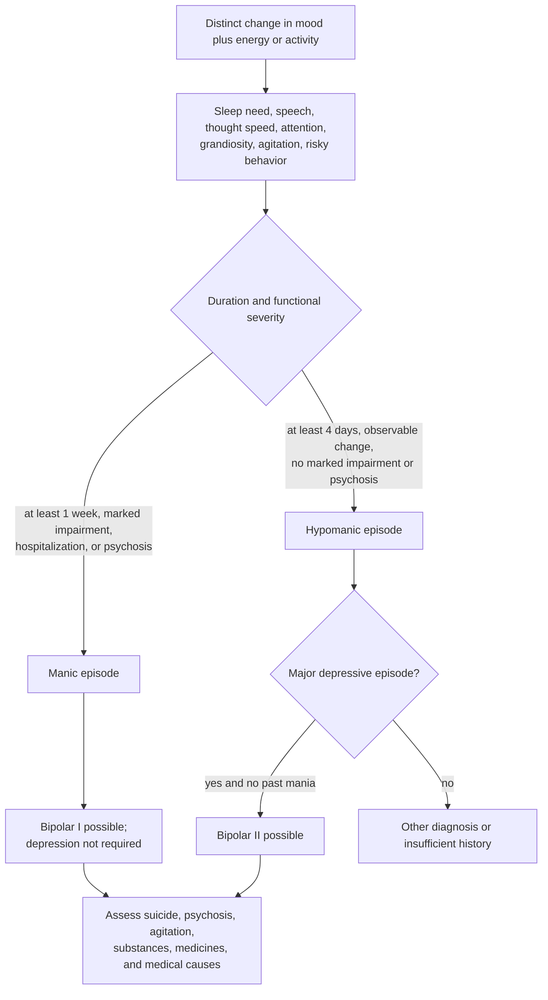
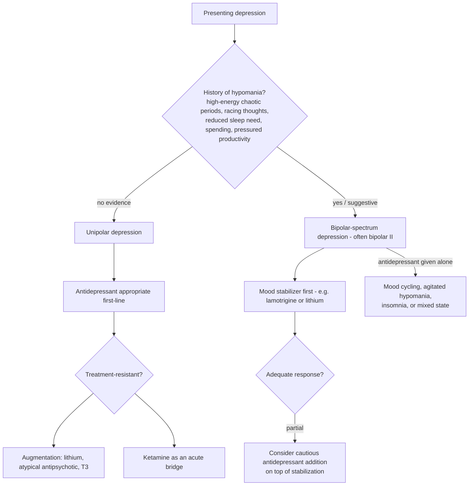

# Mood-disorder pharmacology and the bipolar boundary

Psychiatric pharmacotherapy for mood and anxiety disorders historically works by modulating monoamine neurotransmission — serotonin, dopamine, and norepinephrine — and its central diagnostic boundary is whether a depression is unipolar or belongs to the bipolar spectrum, because the two respond differently and the wrong first drug can worsen bipolar illness. Psychiatry still lacks the blood biomarkers and imaging findings that anchor diagnosis elsewhere in medicine, so diagnosis rests on history-taking, and a medication trial itself generates diagnostic information: an adverse or paradoxical response is durable, actionable evidence about that patient, not merely a failed drug. (@PeterAttiaMD (Peter Attia MD) — "404 ‒ Mental health beyond neurotransmitters: hormones in psychiatry, psychedelic therapies, & more", 2026-08-17, [link](https://www.youtube.com/watch?v=fs89fhQCfj4))

## Bipolar episodes and diagnostic structure

Bipolar disorder is organized by episodes, not by a requirement to oscillate regularly between emotional poles. Mania combines a distinct period of elevated, expansive, or irritable mood and increased energy or goal-directed activity with symptoms such as reduced need for sleep, inflated self-esteem or grandiosity, pressured speech, racing thoughts, distractibility, agitation, or risky behavior. In adults, a manic episode generally lasts at least one week and causes marked impairment, hospitalization, or psychotic features; bipolar I requires a manic episode and does not require a major depressive episode. Hypomania uses much of the same symptom set but is less impairing and lasts at least four consecutive days; bipolar II requires both hypomania and a major depressive episode and excludes any history of mania. A longitudinal history is therefore more informative than a cross-sectional mood snapshot. (@hubermanlab (Andrew Huberman) — "The Science & Treatment of Bipolar Disorder | Huberman Lab Essentials", 2026-07-16, [link](https://www.youtube.com/watch?v=UTB5gAkjevk))[^vadod-bipolar]

Reduced need for sleep differs from insomnia: the person sleeps little yet feels little fatigue and continues at high energy. Hypomania can be missed because productivity or confidence may temporarily improve, whereas the depressive phase drives help-seeking. Family history, antidepressant-associated activation, early or recurrent depression, psychosis, substance use, and extended high-energy periods on little sleep increase suspicion but are not individually diagnostic; validated screening instruments can support, not replace, a clinical assessment. (@hubermanlab (Andrew Huberman) — "The Science & Treatment of Bipolar Disorder | Huberman Lab Essentials", 2026-07-16, [link](https://www.youtube.com/watch?v=UTB5gAkjevk))[^vadod-bipolar]

## Mechanistic models and their limits

Lithium's clinical efficacy does not identify one unitary cause of bipolar disorder. Proposed actions include intracellular signaling changes, neuroprotective effects, and modulation of inflammatory and excitatory pathways, but these mechanisms sit below the established outcome that lithium can treat mania and reduce recurrence. The transcript proposes a more specific chain in which circuit hyperactivity produces excitotoxic injury and progressive atrophy of interoceptive circuits, reducing awareness of sleep loss, speech, and internal state; this is a mechanistic hypothesis, not an established diagnostic model, and no cited biomarker in the episode shows that it mediates illness progression or lithium response. (@hubermanlab (Andrew Huberman) — "The Science & Treatment of Bipolar Disorder | Huberman Lab Essentials", 2026-07-16, [link](https://www.youtube.com/watch?v=UTB5gAkjevk))

The reported association between eminent creative occupations and mood disorder also cannot show that mania causes creativity. The historical dataset inferred diagnoses from biographies, sampled unusually successful people, and is vulnerable to selection and retrospective classification. Even if some elevated-state traits facilitate idea generation, the disorder is defined by impairment and carries severe risks; romanticizing mania can discourage treatment without preserving a proven creative benefit. (@hubermanlab (Andrew Huberman) — "The Science & Treatment of Bipolar Disorder | Huberman Lab Essentials", 2026-07-16, [link](https://www.youtube.com/watch?v=UTB5gAkjevk))

## Drug classes and their trade-offs

Tricyclic antidepressants and monoamine-oxidase inhibitors preceded modern agents and remain effective but carry severe anticholinergic effects, overdose lethality (tricyclics), and hypertensive-crisis risk with tyramine-containing foods (MAOIs). Selective serotonin reuptake inhibitors (SSRIs), beginning with fluoxetine, achieved a far more benign side-effect profile by selectively blocking the serotonin reuptake pump; serotonin–norepinephrine reuptake inhibitors (SNRIs, such as venlafaxine and desvenlafaxine) add norepinephrine modulation. The classes form a continuum rather than categories — some SSRIs carry secondary pharmacology (sertraline is described as also a mild dopamine reuptake inhibitor, while escitalopram is presented as the purest serotonin-selective agent). Two clinically important interpretive claims from the source are expert positions rather than settled quantitative findings: SSRIs as a class treat anxiety at least as well as depression (making the label antidepressant misleadingly narrow, with OCD and PTSD specifically benefiting from aggressive serotonergic amplification), and raising serotonergic tone can secondarily lower dopamine and norepinephrine signaling, producing the recognized phenomenon of feeling better but blunted — reduced vitality, cognitive dulling, or worsened attention in latent ADHD — alongside sexual and appetitive effects. (@PeterAttiaMD (Peter Attia MD) — "404 ‒ Mental health beyond neurotransmitters: hormones in psychiatry, psychedelic therapies, & more", 2026-08-17, [link](https://www.youtube.com/watch?v=fs89fhQCfj4))

Dysthymia — a chronic, lower-amplitude depressive tendency with irritability, pessimism, and reduced quality of life — is distinguished from major depressive episodes, which have larger amplitude but typically lower frequency. Both can respond to serotonergic agents, and a treated patient sometimes discovers a baseline better than the premorbid one, revealing that chronic dysthymia had been mistaken for personality. (@PeterAttiaMD (Peter Attia MD) — "404 ‒ Mental health beyond neurotransmitters: hormones in psychiatry, psychedelic therapies, & more", 2026-08-17, [link](https://www.youtube.com/watch?v=fs89fhQCfj4))

## The unipolar–bipolar boundary

Bipolar II — hypomania rather than full mania — commonly goes undiagnosed because hypomanic drive can be highly adaptive; patients present for the depressive phase, not the elevated one. The pharmacological asymmetry is the clinical crux: an antidepressant given alone to a person with bipolar depression can trigger mood cycling, agitated hypomania, or a mixed state combining depressive mood with physical agitation, whereas mood stabilizers such as lamotrigine (a sodium-channel modulator) or lithium (mechanism not established) can themselves treat bipolar depression as monotherapy, with antidepressants added only after stabilization if needed. Irritability alone does not make the diagnosis — dysthymic irritability is common — but volatility, racing thoughts, and episodic high-energy chaos in the history do the discriminating work. A hormonal transition can be the unmasking event: the source describes a perimenopausal woman presenting for hormones whose lifetime of chaotic high-energy periods and a past antidepressant-triggered racing-thought episode resolved into a bipolar-II diagnosis treated with lamotrigine ([[neuroendocrine-regulation-of-mood]], [[menopause-related-cognitive-impairment]]). (@PeterAttiaMD (Peter Attia MD) — "404 ‒ Mental health beyond neurotransmitters: hormones in psychiatry, psychedelic therapies, & more", 2026-08-17, [link](https://www.youtube.com/watch?v=fs89fhQCfj4))

## Treatment-resistant depression and augmentation

When unipolar depression resists monotherapy, described augmentation strategies include lithium, atypical antipsychotics (aripiprazole, brexpiprazole, olanzapine and related agents), and thyroid hormone (T3), with ketamine available as a rapid-acting bridge for dangerous depression ([[ketamine-and-psychedelic-therapy]]). Atypical antipsychotics carry the class risk of tardive dyskinesia and tardive dystonia — potentially irreversible involuntary movements of mouth, tongue, and throat that scale with dose and years of exposure — so simplification is attempted once a patient is stably well, removing drugs in order of least demonstrated efficacy for that patient as a shared decision. Deprescribing after recovery is described practice, not a validated protocol; drug choice, dosing, and tapering belong with the prescriber. (@PeterAttiaMD (Peter Attia MD) — "404 ‒ Mental health beyond neurotransmitters: hormones in psychiatry, psychedelic therapies, & more", 2026-08-17, [link](https://www.youtube.com/watch?v=fs89fhQCfj4))

For bipolar disorder specifically, pharmacotherapy is the treatment foundation and episode polarity determines the option: a drug useful for acute mania is not automatically effective for acute bipolar depression or maintenance. Lithium has evidence across mania and recurrence prevention, while lamotrigine is useful for preventing depressive recurrence but is not an acute antimanic treatment. Structured psychotherapy—including cognitive behavioral, family or conjoint, interpersonal and social rhythm, and non-brief psychoeducation—can be offered as an adjunct outside acute mania; guideline review supports the class weakly and does not establish CBT as uniquely superior. ECT is a specialist option for urgent or refractory bipolar depression and may also be considered for mania resistant to or intolerant of pharmacotherapy, contrary to the transcript's claim that it only targets treatment-resistant depression. (@hubermanlab (Andrew Huberman) — "The Science & Treatment of Bipolar Disorder | Huberman Lab Essentials", 2026-07-16, [link](https://www.youtube.com/watch?v=UTB5gAkjevk))[^vadod-bipolar]

## Evidence conflicts and update — 2026-09-02

- **Hypomania duration:** the transcript says bipolar II can be diagnosed from elevated episodes lasting four days or even less. VA/DoD's DSM-5-TR-based summary requires four days or longer for hypomania; shorter episodes may be clinically relevant but do not satisfy that episode-duration criterion. (@hubermanlab (Andrew Huberman) — "The Science & Treatment of Bipolar Disorder | Huberman Lab Essentials", 2026-07-16, [link](https://www.youtube.com/watch?v=UTB5gAkjevk))[^vadod-bipolar]
- **Psychotherapy ranking:** the transcript calls CBT the best-supported talk therapy. Current VA/DoD review suggests adjunctive structured psychotherapy but finds insufficient comparative evidence to rank CBT, family/conjoint therapy, interpersonal and social rhythm therapy, or non-brief psychoeducation. (@hubermanlab (Andrew Huberman) — "The Science & Treatment of Bipolar Disorder | Huberman Lab Essentials", 2026-07-16, [link](https://www.youtube.com/watch?v=UTB5gAkjevk))[^vadod-bipolar]
- **ECT scope:** the transcript restricts ECT to treatment-resistant depression. VA/DoD includes ECT in both the mania/hypomania and bipolar-depression pathways under specialist indications. (@hubermanlab (Andrew Huberman) — "The Science & Treatment of Bipolar Disorder | Huberman Lab Essentials", 2026-07-16, [link](https://www.youtube.com/watch?v=UTB5gAkjevk))[^vadod-bipolar]
- **Omega-3 and inositol:** the transcript highlights one 30-person, four-month fish-oil trial using 9.6 g/day and presents high-dose omega-3 as beneficial adjunctive treatment. Later VA/DoD synthesis found that most omega-3 trials showed no difference from placebo, with very-low-confidence evidence, and judged evidence insufficient for or against nutritional-supplement augmentation; CANMAT/ISBD lists omega-3 as not recommended for acute mania, while a separate nutraceutical guideline finds only weak support in bipolar depression and no support for inositol. No dose enters practical guidance. (@hubermanlab (Andrew Huberman) — "The Science & Treatment of Bipolar Disorder | Huberman Lab Essentials", 2026-07-16, [link](https://www.youtube.com/watch?v=UTB5gAkjevk))[^vadod-bipolar][^canmat-2023][^wfsbp-nutra]

## Practical implications

- **Before any antidepressant is started for depression, the history should be probed for hypomania — strong clinical principle from established pharmacological asymmetry.** Ask about high-energy chaotic periods, racing thoughts, reduced sleep need, and past paradoxical antidepressant responses; a prior activation reaction to an antidepressant is diagnostic information to carry forward permanently. (@PeterAttiaMD (Peter Attia MD) — "404 ‒ Mental health beyond neurotransmitters: hormones in psychiatry, psychedelic therapies, & more", 2026-08-17, [link](https://www.youtube.com/watch?v=fs89fhQCfj4))
- **Report blunting, dulled attention, or lost vitality on an SSRI rather than accepting it as the price of symptom relief — moderate.** Class switches (for example toward an SNRI or an agent with dopaminergic activity) are described options the prescriber can weigh.
- **On any atypical antipsychotic, know the tardive-movement risk and keep dose and duration under periodic review — strong for the risk itself; the simplification order is practice, not protocol.**
- **Expect first-episode treatment after sustained prior wellness to be time-limited (the source cites an 8–12-month evidence-based course before a slow taper), while chronic or bipolar conditions may need indefinite treatment — described practice consistent with common guidance; individualized with the prescriber.** (@PeterAttiaMD (Peter Attia MD) — "404 ‒ Mental health beyond neurotransmitters: hormones in psychiatry, psychedelic therapies, & more", 2026-08-17, [link](https://www.youtube.com/watch?v=fs89fhQCfj4))
- **Treat suspected mania, psychosis, dangerous impulsivity, or suicidal thinking as an urgent clinical problem — strong.** Do not wait for a seven-day duration threshold when safety or marked impairment is present; assessment should include immediate risk, substances, medication effects, and medical causes. (@hubermanlab (Andrew Huberman) — "The Science & Treatment of Bipolar Disorder | Huberman Lab Essentials", 2026-07-16, [link](https://www.youtube.com/watch?v=UTB5gAkjevk))[^vadod-bipolar]
- **Use sleep regularity, exercise, nutrition, daylight, and stable social rhythms as adjunctive supports, not replacements for indicated treatment — moderate for supportive care; strong against substitution during active bipolar illness.** Track changes in sleep need and energy because they can be early episode signals. (@hubermanlab (Andrew Huberman) — "The Science & Treatment of Bipolar Disorder | Huberman Lab Essentials", 2026-07-16, [link](https://www.youtube.com/watch?v=UTB5gAkjevk))
- **If prescribed lithium, follow a formal monitoring plan — strong.** NICE recommends baseline renal, thyroid, calcium, blood-count, weight, and pregnancy-relevant assessment; plasma levels weekly until stable after initiation or dose change, every three months for the first year, then generally every six months or every three months in higher-risk groups, with renal, thyroid, calcium, and weight checks every six months. Illness with vomiting or diarrhea, major fluid loss, pregnancy planning, and interacting medicines require prompt prescriber contact; do not start, stop, or change lithium independently. (@hubermanlab (Andrew Huberman) — "The Science & Treatment of Bipolar Disorder | Huberman Lab Essentials", 2026-07-16, [link](https://www.youtube.com/watch?v=UTB5gAkjevk))[^nice-bipolar]
- **Do not use high-dose fish oil or inositol as a bipolar treatment protocol — strong against replacement; insufficient evidence for adjunctive use.** The episode's 9.6-g/day trial does not establish a general dose, and high-dose omega-3 also carries product-specific bleeding and atrial-fibrillation considerations discussed at [[omega-3-fatty-acids]]. (@hubermanlab (Andrew Huberman) — "The Science & Treatment of Bipolar Disorder | Huberman Lab Essentials", 2026-07-16, [link](https://www.youtube.com/watch?v=UTB5gAkjevk))[^vadod-bipolar]

## Gaps & open questions

- No validated biomarker yet distinguishes unipolar from bipolar depression before a treatment trial; what would one look like?
- How large and how common is SSRI-induced blunting, and does it reflect measurable dopamine or norepinephrine change in humans?
- Why does lithium work in bipolar disorder, and what molecular change underlies antidepressant-triggered mood cycling?
- Which patients with treatment-resistant depression respond preferentially to T3, lithium, or atypical augmentation?
- How often do hormonal transitions unmask latent bipolar disorder, and should perimenopausal psychiatric evaluation routinely screen for it?
- Does interoceptive-circuit change precede recurrent episodes, result from them, or merely correlate with illness duration, and does it predict lithium response?
- Which adjunctive psychotherapy works best for which phase, comorbidity, and patient preference?
- Can any nutritional intervention improve patient-important outcomes when added to evidence-based pharmacotherapy, and which formulation and baseline status would identify a responder?

## Related

[[neuroendocrine-regulation-of-mood]] · [[ketamine-and-psychedelic-therapy]] · [[neuromodulators-and-state-control]] · [[creatine-for-depression]] · [[adhd-and-reproductive-hormone-transitions]] · [[menopause-related-cognitive-impairment]] · [[mental-strength-and-behavioral-skills]] · [[omega-3-fatty-acids]] · [[sleep-quality-and-circadian-alignment]]

## References

[^vadod-bipolar]: U.S. Department of Veterans Affairs and Department of Defense. *VA/DoD Clinical Practice Guideline for Management of Bipolar Disorder*. 2023. [professional guideline; evidence reviewed through 2021]. [guideline](https://www.healthquality.va.gov/guidelines/MH/bd/VA-DOD-CPG-BD-Full-CPGFinal508.pdf)
[^nice-bipolar]: National Institute for Health and Care Excellence. *Bipolar Disorder: Assessment and Management* (CG185), updated 2025. [professional guideline]. [recommendations](https://www.nice.org.uk/guidance/cg185/chapter/recommendations)
[^canmat-2023]: Keramatian K, Chithra NK, Yatham LN. “The CANMAT and ISBD Guidelines for the Treatment of Bipolar Disorder: Summary and a 2023 Update of Evidence.” *Focus*, 2023. [professional guideline summary]. [doi:10.1176/appi.focus.20230009](https://doi.org/10.1176/appi.focus.20230009)
[^wfsbp-nutra]: Sarris J, et al. “Clinician Guidelines for the Treatment of Psychiatric Disorders with Nutraceuticals and Phytoceuticals.” *World Journal of Biological Psychiatry*, 2022. [professional guideline]. [PMID:35311615](https://pubmed.ncbi.nlm.nih.gov/35311615/)
