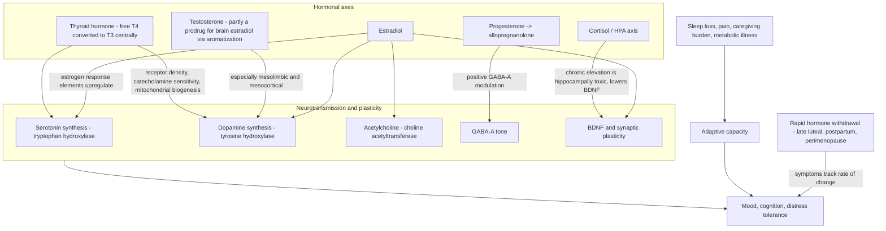

# Neuroendocrine regulation of mood

Mood and cognition are regulated at two coupled levels: neurotransmitter signaling within circuits, and the hormonal milieu that sets the conditions in which that signaling occurs. Estradiol, testosterone, progesterone metabolites, thyroid hormone, and cortisol each modulate monoamine synthesis, receptor density, neuroplasticity, or stress circuitry, so psychiatric presentation cannot be fully separated from endocrine state. A useful framing from psychiatrist Linus Abrams distinguishes psychotropic drugs as signal amplifiers acting on specific neurotransmitter systems from hormones as system modulators that create the conditions within which neurotransmission occurs; the framing is expert interpretation, but the underlying receptor biology is established. (@PeterAttiaMD (Peter Attia MD) — "404 ‒ Mental health beyond neurotransmitters: hormones in psychiatry, psychedelic therapies, & more", 2026-08-17, [link](https://www.youtube.com/watch?v=fs89fhQCfj4))

A second organizing principle is that mood symptoms often track the **rate of change** of hormone levels rather than the absolute level. A woman feels well through the low-progesterone follicular phase; symptoms arise when progesterone falls steeply from a high late-luteal level, and the most extreme natural example is postpartum, when estradiol and progesterone drop from pregnancy peaks to near-menopausal values within one to two days. Susceptibility to these transitions varies widely between individuals and appears substantially genetic, attributed in the source to receptor morphology and responsivity rather than to hormone levels themselves. (@PeterAttiaMD (Peter Attia MD) — "404 ‒ Mental health beyond neurotransmitters: hormones in psychiatry, psychedelic therapies, & more", 2026-08-17, [link](https://www.youtube.com/watch?v=fs89fhQCfj4))

## Estradiol as a system modulator

Estradiol acts in the brain through membrane estrogen receptors alpha and beta and through estrogen response elements that regulate transcription. Through the latter it upregulates synthesis of serotonin (via tryptophan hydroxylase), dopamine (via tyrosine hydroxylase), and acetylcholine (via choline acetyltransferase), and it modulates GABA, NMDA, and glutamate signaling and promotes neuroplasticity through BDNF. The evolutionary interpretation offered — that a reproduction hormone became a pleiotropic regulator because successful reproduction requires nurturing, social bonding, and resource acquisition, not only conception — explains why estrogen loss can present as multi-domain change in cognition, mood regulation, and anxiety. Men obtain brain estradiol largely by aromatization of testosterone, which is why suppressing aromatization pharmacologically (for example with anastrozole during testosterone therapy, on the theory that estrogen is bad for men) removes a hormone the male brain also depends on. (@PeterAttiaMD (Peter Attia MD) — "404 ‒ Mental health beyond neurotransmitters: hormones in psychiatry, psychedelic therapies, & more", 2026-08-17, [link](https://www.youtube.com/watch?v=fs89fhQCfj4)) This mechanism section extends the cholinergic and hippocampal account in [[menopause-related-cognitive-impairment]].

## Testosterone and dopaminergic function

Testosterone modulates dopamine signaling in the mesolimbic pathway (reward salience and reward prediction) and the mesocortical pathway (executive function and working memory). Gradual testosterone decline in men — slower and less recognizable than menopause — can therefore present as dulling, reduced drive, and ADHD-like executive symptoms in addition to the familiar libido and physical effects. Women's testosterone, roughly ten times their estradiol level once units are normalized but a tenth of men's, is presented as principally important for libido, with men more dependent on it for mood and cognitive tone; the asymmetry is attributed reasoning, not trial evidence. An empirical clinical observation with treatment implications: men whose testosterone is raised indirectly with clomiphene often normalize their laboratory numbers yet remain symptomatically dissatisfied compared with exogenous testosterone, a laboratory–symptom mismatch plausibly related to clomiphene's estrogen-receptor blockade at the hypothalamus ([[testosterone-replacement-therapy]], [[male-fertility-and-exogenous-testosterone]]). (@PeterAttiaMD (Peter Attia MD) — "404 ‒ Mental health beyond neurotransmitters: hormones in psychiatry, psychedelic therapies, & more", 2026-08-17, [link](https://www.youtube.com/watch?v=fs89fhQCfj4))

## Hormone withdrawal and reproductive mood episodes

Premenstrual dysphoric disorder (PMDD) is tied mechanistically to the late-luteal fall of allopregnanolone, a progesterone metabolite (via 5-alpha-reductase and 3-alpha-hydroxysteroid dehydrogenase) that positively modulates GABA-A receptors. Postpartum depression spans a heterogeneous spectrum: the severe early form with psychosis — hypervigilance, intense separation anxiety, and intrusive, OCD-like harm ideation appearing within about a week of delivery, in well under 1% of births — is distinguished from the commoner weeks-to-months presentation of failing to return to baseline. For the acute severe form, synthetic neurosteroid analogues of allopregnanolone exist: brexanolone (an intravenous infusion given in a monitored setting) and zuranolone (an oral successor); both are FDA-approved specifically for postpartum depression, and the source describes zuranolone as typically used alone rather than layered on a new SSRI. Later, community-presenting postpartum depression is treated much like other major depression, with prior depressive or bipolar history the main risk stratifier; a first episode may also unmask a longstanding dysthymic baseline that treatment then improves beyond the pre-pregnancy state. (@PeterAttiaMD (Peter Attia MD) — "404 ‒ Mental health beyond neurotransmitters: hormones in psychiatry, psychedelic therapies, & more", 2026-08-17, [link](https://www.youtube.com/watch?v=fs89fhQCfj4))

## Thyroid state and depression

Thyroid hormone upregulates catecholamine receptor responsiveness, serotonin receptor density, and mitochondrial biogenesis, so hypothyroid states commonly present as depression while hyperthyroid states present as somatic anxiety — palpitations, restlessness, insomnia — rather than cognitive worry. Abrams's contrarian screening position is that TSH alone under-detects clinically relevant thyroid insufficiency: TSH reports what the pituitary perceives, so he anchors on free T4 (and free T3), treating a low-normal free T4 in a depressed patient as a signal for endocrine consultation or treatment even when TSH sits within range. He prefers combination T4/T3 replacement titrated primarily to symptoms with laboratory monitoring, and uses immediate-release T3 alone (starting as low as 2.5 micrograms twice daily, up to 25 micrograms twice daily) as a long-standing augmentation strategy for treatment-resistant unipolar depression that has failed antidepressant monotherapy, combinations, and lithium or atypical augmentation. These prescriptions are **investigational practice** on this page: symptom-titrated combination dosing and T3 augmentation at the upper range are clinician practice positions from the source, not admitted protocols; frankly abnormal thyroid results (for example markedly elevated TSH or a suppressed TSH with a hot nodule) belong with endocrinology, and thyroid storm is an emergency. (@PeterAttiaMD (Peter Attia MD) — "404 ‒ Mental health beyond neurotransmitters: hormones in psychiatry, psychedelic therapies, & more", 2026-08-17, [link](https://www.youtube.com/watch?v=fs89fhQCfj4))

## Cortisol, hyperarousal, and adaptive capacity

The HPA axis evolved for acute threat: vigilance, resource diversion away from immune function, and fragmented sleep are adaptive briefly and maladaptive chronically ([[stress-threat-discrimination]], [[sleep-quality-and-circadian-alignment]]). Unlike the other axes, chronic cortisol excess has no direct pharmacological antidote in routine psychiatric care, and the source's position is that elevated cortisol should be read as a signal of unmanaged stress load — caregiving burden, occupational overload, untreated illness — to be addressed at its source rather than treated as the primary lesion. Chronically elevated cortisol is described as toxic to the hippocampus and suppressive of BDNF, linking sustained hyperarousal to memory complaints and reduced plasticity. The complementary concept of adaptive capacity (Peter Attia's distress-tolerance window) holds that sleep, exercise, pain, metabolic health, social support, and purpose jointly set how much perturbation — hormonal or situational — a person can absorb before symptoms emerge, which is one reason identical endocrine transitions produce disabling symptoms in one person and none in another. (@PeterAttiaMD (Peter Attia MD) — "404 ‒ Mental health beyond neurotransmitters: hormones in psychiatry, psychedelic therapies, & more", 2026-08-17, [link](https://www.youtube.com/watch?v=fs89fhQCfj4))

## Practical implications

- **When mood, anxiety, or cognitive symptoms arise near a reproductive transition (postpartum, perimenopause, cycle-linked), have endocrine state assessed alongside psychiatric evaluation — moderate-to-strong as an assessment principle.** Hormonal transitions can produce, exacerbate, or unmask psychiatric illness, including bipolar disorder ([[mood-disorder-pharmacology]]). (@PeterAttiaMD (Peter Attia MD) — "404 ‒ Mental health beyond neurotransmitters: hormones in psychiatry, psychedelic therapies, & more", 2026-08-17, [link](https://www.youtube.com/watch?v=fs89fhQCfj4))
- **For severe depressive or psychotic symptoms in the first weeks postpartum: treat as an emergency requiring immediate specialist care — strong.** Approved neurosteroid therapy exists for postpartum depression specifically; intrusive harm ideation warrants urgent evaluation, not watchful waiting.
- **In persistent depression, ensure thyroid assessment beyond a lone TSH before concluding treatment resistance — moderate as an assessment step; the free-T4-anchored treatment threshold and symptom-titrated T3 dosing are investigational practice.** Dosing and monitoring belong with the treating clinician.
- **Treat chronically elevated arousal as a prompt to reduce the stress source and rebuild sleep, exercise, and support — moderate.** There is no validated pill for chronic cortisol excess in this context; widening adaptive capacity is the available lever.
- **Do not suppress aromatization to keep estrogen low during testosterone therapy on anti-estrogen folklore — moderate-to-strong caution from mechanism; estradiol is a working brain hormone in men.** (@PeterAttiaMD (Peter Attia MD) — "404 ‒ Mental health beyond neurotransmitters: hormones in psychiatry, psychedelic therapies, & more", 2026-08-17, [link](https://www.youtube.com/watch?v=fs89fhQCfj4))

## Gaps & open questions

- Which receptor-genetic or other markers predict who will experience disabling mood symptoms from PMDD, postpartum withdrawal, or perimenopause, and how strong is the mother–daughter concordance quantitatively?
- How predictive is PMDD of postpartum depression or of perimenopausal mood and cognitive symptoms?
- Does free-T4-anchored thyroid treatment in depression outperform TSH-guided care in randomized comparisons, and what are the harms of symptom-titrated T3 at higher doses?
- By what proportion do central versus peripheral (metabolic-rate) mechanisms explain T3's antidepressant augmentation effect?
- Can any intervention directly and safely normalize chronic HPA hyperactivity, and would doing so improve outcomes beyond source-directed stress reduction?
- How much of the sex difference in testosterone dependence for mood and cognition is receptor biology versus level-normalization artifact?

## Related

[[mood-disorder-pharmacology]] · [[menopause-related-cognitive-impairment]] · [[menopause-hormone-therapy]] · [[testosterone-replacement-therapy]] · [[male-fertility-and-exogenous-testosterone]] · [[adhd-and-reproductive-hormone-transitions]] · [[neuromodulators-and-state-control]] · [[stress-threat-discrimination]] · [[sleep-quality-and-circadian-alignment]] · [[perimenopause-assessment-and-testing]] · [[ketamine-and-psychedelic-therapy]]
