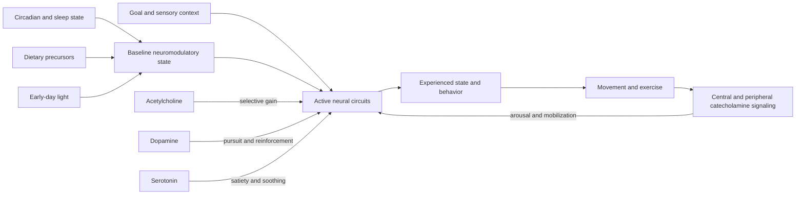

# Neuromodulators and state control

Neuromodulators are chemical signals that change how strongly and readily distributed neural circuits respond. They do not map one-to-one onto emotions: dopamine, norepinephrine/epinephrine, acetylcholine, and serotonin act through multiple receptors, regions, time scales, and baseline states. A useful simplified model associates dopamine with pursuit and motivation, catecholamines with alertness and mobilization, acetylcholine with selective attention, and serotonin with satiety or soothing, but these are dominant tendencies rather than exclusive functions. (@hubermanlab (Andrew Huberman) — "Control Your Brain Chemistry for Focus, Motivation & Well-Being | Huberman Lab Essentials", 2026-08-06, [link](https://www.youtube.com/watch?v=xKvlK7OqZso))

## Baseline, timing, and combination

State depends on both baseline tone and transient release. The source divides the waking day into an earlier dopamine/catecholamine-weighted phase and a later serotonin-weighted phase, with sleep occupying the final phase; this is a teaching heuristic, not a complete account of circadian neurochemistry. The same intervention can therefore feel different with time of day, sleep debt, medication, anxiety, and prior stimulation. Combining several arousal tools also makes attribution and dose control harder. (@hubermanlab (Andrew Huberman) — "Control Your Brain Chemistry for Focus, Motivation & Well-Being | Huberman Lab Essentials", 2026-08-06, [link](https://www.youtube.com/watch?v=xKvlK7OqZso))

Dopamine participates in motivation, pursuit, and reinforcement rather than pleasure alone. Early outdoor light, regular activity, adequate sleep, and engagement with meaningful goals are presented as baseline-supporting behaviors. Caffeine reduces adenosine signaling and raises alertness; the source also describes enhanced D2/D3 receptor availability with habitual intake. L-tyrosine, phenylethylamine, and especially L-DOPA-containing mucuna can acutely drive dopaminergic pathways, but the transcript supplies no controlled outcome evidence for routine cognitive enhancement and notes sensitivity, crashes, mood-disorder risk, and stronger effects from mucuna. (@hubermanlab (Andrew Huberman) — "Control Your Brain Chemistry for Focus, Motivation & Well-Being | Huberman Lab Essentials", 2026-08-06, [link](https://www.youtube.com/watch?v=xKvlK7OqZso))

Central norepinephrine is released broadly from the locus coeruleus, while adrenal epinephrine acts mainly in the body because circulating epinephrine does not freely cross the blood–brain barrier. Movement both recruits catecholamine signaling and is promoted by it, creating a positive arousal loop. Exercise, caffeine, cold exposure, and cyclic hyperventilation can acutely increase alertness; hyperventilation may also provoke agitation or panic and should not be treated as a universally benign focus technique. (@hubermanlab (Andrew Huberman) — "Control Your Brain Chemistry for Focus, Motivation & Well-Being | Huberman Lab Essentials", 2026-08-06, [link](https://www.youtube.com/watch?v=xKvlK7OqZso))

Acetylcholine supports focused processing in the brain and transmits motor-neuron signals at the neuromuscular junction. Dietary choline is a precursor; eggs, meat, fish, soybeans, mushrooms, and beans are among the listed sources. Nicotine activates nicotinic acetylcholine receptors but also engages reinforcement circuitry and can produce dependence, so a short-lived attention effect is not a favorable health trade. Alpha-GPC supplies choline and huperzine reduces acetylcholine breakdown, yet the source’s Alpha-GPC schedule is Huberman’s personal protocol rather than comparative evidence of benefit or long-term safety. (@hubermanlab (Andrew Huberman) — "Control Your Brain Chemistry for Focus, Motivation & Well-Being | Huberman Lab Essentials", 2026-08-06, [link](https://www.youtube.com/watch?v=xKvlK7OqZso))

Serotonin signaling contributes to satiety, affect, pain modulation, and sleep-related processes, but simply raising serotonin does not guarantee well-being. Prescription serotonergic drugs can be beneficial for appropriate indications and can also cause adverse effects; excessive serotonergic activity can be dangerous. Physical affection and receiving or observing gratitude are proposed behavioral routes, while tryptophan is a dietary precursor. The reported benefit from 900 mg myo-inositol every third night is a personal observation and should not be presented as evidence that it improves sleep generally. (@hubermanlab (Andrew Huberman) — "Control Your Brain Chemistry for Focus, Motivation & Well-Being | Huberman Lab Essentials", 2026-08-06, [link](https://www.youtube.com/watch?v=xKvlK7OqZso))

## Practical implications

- **Daily: anchor sleep timing, obtain safe early-day outdoor light, move regularly, eat an adequate diet, and direct effort toward concrete goals — moderate-to-strong for general sleep, health, and performance; indirect for optimizing a named transmitter.** Use subjective state as feedback without assuming it measures a molecule. (@hubermanlab (Andrew Huberman) — "Control Your Brain Chemistry for Focus, Motivation & Well-Being | Huberman Lab Essentials", 2026-08-06, [link](https://www.youtube.com/watch?v=xKvlK7OqZso))
- **For an acute work bout: first use task definition, movement, environment, and a familiar safe caffeine dose if appropriate — moderate for alertness, weaker for durable learning.** Change one variable at a time and avoid late stimulation that impairs sleep. (@hubermanlab (Andrew Huberman) — "Control Your Brain Chemistry for Focus, Motivation & Well-Being | Huberman Lab Essentials", 2026-08-06, [link](https://www.youtube.com/watch?v=xKvlK7OqZso))
- **Do not begin nicotine, mucuna/L-DOPA, phenylethylamine, huperzine, or a multi-supplement stack merely to optimize a presumed neurotransmitter — strong risk-management conclusion from limited benefit evidence.** Discuss any such agent with a clinician or pharmacist, especially with cardiovascular disease, pregnancy, anxiety, bipolar-spectrum illness, Parkinson treatment, or psychiatric medication. [[supplement-evidence-and-safety]] (@hubermanlab (Andrew Huberman) — "Control Your Brain Chemistry for Focus, Motivation & Well-Being | Huberman Lab Essentials", 2026-08-06, [link](https://www.youtube.com/watch?v=xKvlK7OqZso))
- **Avoid cyclic hyperventilation in water, while driving, or where fainting would be dangerous; people prone to panic should avoid or use clinical guidance — strong safety principle.** Acute arousal is not the same as improved judgment or performance. (@hubermanlab (Andrew Huberman) — "Control Your Brain Chemistry for Focus, Motivation & Well-Being | Huberman Lab Essentials", 2026-08-06, [link](https://www.youtube.com/watch?v=xKvlK7OqZso))

## Gaps & open questions

- How accurately do the four-transmitter labels predict individual state or task performance outside laboratory conditions?
- Which behavioral effects are mediated by the named transmitter rather than expectation, general arousal, or correlated systems?
- Do acute supplement-induced changes improve learning or health after tolerance, rebound, sleep disruption, and adverse effects are counted?
- What doses and combinations are safe across medication, psychiatric, cardiovascular, and genetic differences?
- Does receiving or observing gratitude reliably alter serotonin in humans, and does that mediate lasting well-being?

## Related

[[cognitive-reserve-and-brain-health]] · [[adhd-and-reproductive-hormone-transitions]] · [[exercise-enhanced-learning]] · [[supplement-evidence-and-safety]] · [[stress-threat-discrimination]] · [[protective-threat-responses]]
