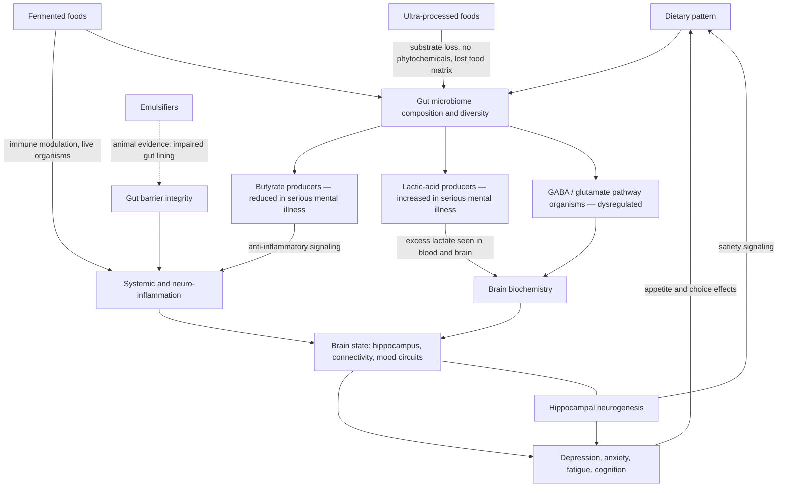

# Nutritional psychiatry

Nutritional psychiatry studies diet as a determinant and treatment lever for mental and brain health. Its founding observation is that several physiological systems firmly linked to mental health — immune function and psychoneuroimmunology, hippocampal neurogenesis, epigenetic regulation — are all modifiable by food, yet psychiatry historically ignored everything "below the neck." The field's core claims now rest on three evidence layers: consistent cross-country observational associations between diet quality and depression risk; a first generation of randomized dietary-intervention trials in diagnosed depression; and a mechanistic program centered on the gut microbiome, its metabolites, and inflammation. Felice Jacka, who helped create the field, names its most damaging myth as the individual-responsibility framing — "It's their responsibility to eat well, and if they don't and they're depressed, then it's their fault" — arguing instead for changing food environments so less healthy options are not the default. (@joinzoe (ZOE) — "How to build a better brain: Your doctor won't mention THIS for mood, memory and dementia", 2026-07-02, [link](https://www.youtube.com/watch?v=yO-myhWDV98))

## Observational base

Across cohorts from childhood to old age and across countries (Brazil, Norway, Japan, and others), higher diet quality — more whole foods — associates with roughly a 30–35% lower risk of depression, with weaker but supportive evidence for anxiety. The association is independent of socioeconomic status, education, other health behaviors, and — contrary to the common assumption that the pathway runs through obesity — of body weight: the link appears at every level of body mass index. Maternal diet during pregnancy associates with child emotional and behavioral outcomes, language acquisition, and neurodevelopmental conditions over the first years of life, with maternal inflammation (the marker glycA) elevated on Western-style diets and associated with slower infant brain development; adolescent cohorts show dose-response relationships between diet unhealthiness and mental health independent of family background. These are well-adjusted observational findings, not causal proof at any single life stage. (@joinzoe (ZOE) — "How to build a better brain: Your doctor won't mention THIS for mood, memory and dementia", 2026-07-02, [link](https://www.youtube.com/watch?v=yO-myhWDV98))

## Interventional evidence

The SMILES trial (2017) was the first randomized controlled trial to test whether improving diet quality treats diagnosed moderate-to-severe major depression, in patients mostly already on treatment that had not worked. Participants were randomized to dietitian-delivered dietary support or matched social support; at trial end roughly a third of the dietary group reached full remission versus about 8% of the social-support group, the degree of diet improvement correlated tightly with the degree of depression improvement, and the effect was not mediated by weight change (mean baseline BMI ~30; weight did not change). The trial was small and the dietary change was adjunctive to existing treatment, so it does not show diet outperforming or replacing antidepressants; Tim Spector's stronger reading — that average dietary effect sizes exceed average antidepressant effect sizes — is expert interpretation across heterogeneous studies, recorded here as his position rather than an established comparison. (@joinzoe (ZOE) — "How to build a better brain: Your doctor won't mention THIS for mood, memory and dementia", 2026-07-02, [link](https://www.youtube.com/watch?v=yO-myhWDV98))

A second randomized result moves the evidence from mood ratings to brain structure. In a placebo-controlled trial, 40 healthy women consumed a small (130 mL) daily commercial fermented dairy drink with an added common probiotic strain, or a well-matched placebo, for 8 weeks. The yogurt group showed an increase in hippocampal volume, increased hippocampus–frontal-lobe connectivity that correlated with the abundance of the probiotic organism in their microbiomes, and a suggestion of higher brain glutathione (the brain's own antioxidant). The sample was small and healthy — effects in depression are untested — and the study was run with a dairy-company partner, but it is a controlled demonstration that a fermented food can produce measurable brain changes in two months. Complementing it at scale, a ZOE community study of about 6,000 people found that 50% of those taking three or more daily fermented-food portions reported improved mood and energy within the first weeks, with a dose-response across portions — self-reported, non-blinded, and run by a commercial actor, so supportive rather than confirmatory. (@joinzoe (ZOE) — "How to build a better brain: Your doctor won't mention THIS for mood, memory and dementia", 2026-07-02, [link](https://www.youtube.com/watch?v=yO-myhWDV98)) [[probiotics-prebiotics-and-postbiotics]] [[food-patterns-and-gut-ecology]]

## Mechanism: the gut–brain route

The transfer experiments are the strongest causal wedge. Transplanting gut microbes from stressed, anxious mice into germ-free mice transfers the anxious behavioral phenotype; stool from humans with major depressive disorder or schizophrenia induces the corresponding behavioral phenotype and some matching biochemical changes in recipient mice (the same paradigm works for hypertension). In humans, a large systematic review comparing microbiomes in major depression, bipolar disorder, and schizophrenia against controls found three consistent cross-diagnostic signatures: reduced butyrate-producing bacteria (butyrate being a potent anti-inflammatory molecule), increased lactic-acid-producing bacteria (with elevated lactate observed in blood and brain in serious mental illness), and altered GABA- and glutamate-pathway organisms mapping onto the neurotransmitter dysregulation seen in these disorders — cause versus effect unresolved, but the biochemical correspondence is striking. Tim Spector adds a fourth consistent finding: pro-inflammatory microbial patterns with modestly elevated markers such as CRP across brain disorders, consistent with the broader inflammation-as-mediator framing in which depressive behavior is read as a protective sickness response fired inappropriately. His synthesis: "we have to look after our guts if we're going to look after our brains." (@joinzoe (ZOE) — "How to build a better brain: Your doctor won't mention THIS for mood, memory and dementia", 2026-07-02, [link](https://www.youtube.com/watch?v=yO-myhWDV98)) [[inflammaging-and-il-6]]

The live-audience Q&A restates and extends this program in Spector's broader idiom: he asserts case–control microbiome abnormality in every brain condition studied — dementia, Alzheimer's, Parkinson's, autism, schizophrenia, depression, anxiety, PTSD, obsessional disorders — while conceding these are associations and that the field is too young for the decade-long prospective cohorts causality needs, leaning instead on the mouse-transplant designs above. The most concrete new datum is prodromal: he reports that a majority of people who develop Parkinson's disease had severe constipation and gut problems roughly a decade before neurological symptoms, with abnormal microbiomes and inflammation-linked proteins detectable in that window — epidemiological and preclinical, but a genuinely testable early-warning claim. His proposed common mediator is immune: microbes regulate the immune system, dysregulation raises inflammation, and inflammation reaches the brain — the same pathway developed from the psychiatric side, with cytokine transport, interoceptive circuits, and the inflammatory-depression subtype estimate, at [[inflammation-and-depression]]. His supporting anatomical claim that the vagus nerve is the body's biggest nerve with about 80% of traffic running gut-to-brain is directionally consistent with vagal-afferent anatomy but is a popularization, not a sourced measurement. A dietary-intervention figure quoted in the episode — patients with severe depression improving symptoms by about 30% — is consistent in direction with the SMILES-tier evidence above but is presented without a citable trial. (@joinzoe (ZOE) — "Tim Spector: They're fooling you! The 3 nutrition scams he wants banned | Live Audience Q&A", 2026-06-25, [link](https://www.youtube.com/watch?v=g3J4phCrvvw))

The hippocampus is the anatomical focus. It supports learning, short-term memory, and satiety signaling; it retains adult neurogenesis supported by trophic proteins; it shrinks with age, with unhealthy diets, and in serious depression, and regrows with successful treatment — one proposed mechanism of SSRIs is precisely increased hippocampal neurogenesis and volume. Short junk-food exposures in healthy adolescents impaired hippocampus-linked cognitive tasks and satiety, suggesting a feedback loop in which poor diet degrades the structure that helps regulate intake. Physical activity also grows hippocampal function, so diet is one input among several. (@joinzoe (ZOE) — "How to build a better brain: Your doctor won't mention THIS for mood, memory and dementia", 2026-07-02, [link](https://www.youtube.com/watch?v=yO-myhWDV98)) [[cognitive-reserve-and-brain-health]]

## Ultra-processed food and the meal-replacement experiment

A BMJ (2024) umbrella review bringing together meta-analyses covering more than 10 million people found roughly 70% of examined health outcomes associated with higher ultra-processed food intake, with the strongest evidence for all-cause mortality, cardiometabolic disease, and the common mental disorders depression and anxiety — outcome-level association, not mechanism. To test whether UPF harm reduces to poor nutrient profiles, Jacka's group ran a small proof-of-concept trial: nearly 50 women with obesity on very-low-energy diets received either nutritionally balanced meal replacements (Optifast) or an equivalently low-calorie whole-food diet built mainly on legumes and vegetables for 3 weeks. Both groups lost the same weight, but microbiome diversity rose on real food and showed evidence of decline on the meal replacements — supporting the position that a nutritionally balanced UPF is still not equivalent food, because processing strips the food matrix, the co-evolved phytochemicals (perhaps 150,000 distinct compounds), and the natural diversity of fibers that feed a varied microbiome. Beyond what UPFs lack, they add candidate harms: emulsifiers, near-ubiquitous in packaged food, impair the gut lining in animal studies, and Jacka uses their presence as her personal avoid-it shorthand — a screening heuristic, not an established human harm threshold. Spector's complementary heuristics: worry about the top two of four processing-risk categories rather than all processed food, escape repeated daily exposure ruts (breakfast, meal-deal sandwiches, ready meals), and treat prominent front-of-pack health claims as a red flag. (@joinzoe (ZOE) — "How to build a better brain: Your doctor won't mention THIS for mood, memory and dementia", 2026-07-02, [link](https://www.youtube.com/watch?v=yO-myhWDV98)) [[food-label-literacy-and-health-halos]]

## Scope: mental health, brain health, and the system

The Global Burden of Disease study reports mental disorders as the leading cause of disability worldwide, with depression and anxiety accounting for most of that burden — which makes a modifiable exposure everyone contacts several times daily unusually consequential. Spector's further position is that mental health and neurodegenerative disease sit on one spectrum served by common risk factors, citing genetic analyses he characterizes as supporting at most two brain-disease types, with poor diet appearing across both and the dietary evidence for dementia avoidance described as being as strong as for depression; type 2 diabetes, itself strongly diet-preventable, is a major dementia risk factor. This unification is expert interpretation ahead of consensus and should not collapse the real clinical distinctions between disorders. The system-level critique is more concrete: psychiatric and psychological training includes essentially no nutrition or metabolic health, mental-hospital food is poor, and in some surveys about 70% of long-term psychotic patients have type 2 diabetes managed by no one on their care team. Adjacent immune observations — shingles and influenza vaccination associating with lower dementia risk — are covered on [[cognitive-reserve-and-brain-health]]. On supplements the guests diverge from the food story: Jacka takes only winter vitamin D and characterizes supplement evidence in mental disorders as weak and adjunctive; Spector prefers food sources for omega-3 (sardines, anchovies, with blood-level monitoring), has started folic acid on preventive-evidence grounds he finds suggestive, and remains undecided on creatine — personal practices, not recommendations. [[creatine-for-depression]] [[omega-3-fatty-acids]] [[vitamin-d]] (@joinzoe (ZOE) — "How to build a better brain: Your doctor won't mention THIS for mood, memory and dementia", 2026-07-02, [link](https://www.youtube.com/watch?v=yO-myhWDV98))

**Evidence conflict — dementia preventability.** In the live Q&A, Federica Amati states that 80% of dementia is preventable with lifestyle and nutrition intervention. This exceeds the most widely cited peer-reviewed estimate — the Lancet Commission's calculation that around 45% of dementia cases are attributable to 14 modifiable risk factors (2024 update) — and no source for the 80% figure is given. Spector's own hedged framing in the same exchange (converging observational evidence, no single blockbuster study, type 2 diabetes as a major diet-linked risk factor) is closer to the published literature. The 80% claim is recorded as an attributed, unsourced expert statement that should not be repeated as established. (@joinzoe (ZOE) — "Tim Spector: They're fooling you! The 3 nutrition scams he wants banned | Live Audience Q&A", 2026-06-25, [link](https://www.youtube.com/watch?v=g3J4phCrvvw))

## Practical implications

- **Daily: feed the microbiome with varied plant foods — whole grains first (oats, barley, rye, spelt, quinoa), legumes, and overall plant diversity (the 30-plants-a-week heuristic) — moderate-to-strong for mental-health association, moderate for intervention evidence.** Jacka's current single-food priority is whole grains, which she reports as the strongest recurring correlate of better physical and mental health outcomes in her group's studies; Spector declines superfood framing in favor of diversity. [[dietary-fiber]] [[food-patterns-and-gut-ecology]] (@joinzoe (ZOE) — "How to build a better brain: Your doctor won't mention THIS for mood, memory and dementia", 2026-07-02, [link](https://www.youtube.com/watch?v=yO-myhWDV98))
- **Daily or near-daily: include fermented foods — moderate for mood, energy, and intermediate brain and inflammatory endpoints (one small controlled brain-imaging trial, large non-blinded community dose-response, immune-marker trials); weak for disease prevention.** More portions associated with larger reported mood effects in the ZOE study. [[probiotics-prebiotics-and-postbiotics]] (@joinzoe (ZOE) — "How to build a better brain: Your doctor won't mention THIS for mood, memory and dementia", 2026-07-02, [link](https://www.youtube.com/watch?v=yO-myhWDV98))
- **For diagnosed depression: pursue dietitian-supported diet-quality improvement as an adjunct to, never a replacement for, clinical treatment — moderate (SMILES randomized evidence with a large remission difference, in a small adjunctive trial).** The dose-response between diet change and symptom change argues for treating adherence support as part of the intervention. (@joinzoe (ZOE) — "How to build a better brain: Your doctor won't mention THIS for mood, memory and dementia", 2026-07-02, [link](https://www.youtube.com/watch?v=yO-myhWDV98))
- **At purchase: minimize routine ultra-processed exposure, prioritizing the highest-processing-risk categories, ready meals, sugar-sweetened drinks, processed meat, and products carrying loud health claims; scan for emulsifiers as a quick screen — moderate for the overall UPF-outcome association; the emulsifier rule is a heuristic resting on animal evidence.** (@joinzoe (ZOE) — "How to build a better brain: Your doctor won't mention THIS for mood, memory and dementia", 2026-07-02, [link](https://www.youtube.com/watch?v=yO-myhWDV98))
- **On a budget: batch-cook a weekly pot rotating cheap whole grains (barley) and dried legumes with frozen vegetables, which retain nutritional density — strong feasibility guidance; the health content is the same pattern evidence as above.** (@joinzoe (ZOE) — "How to build a better brain: Your doctor won't mention THIS for mood, memory and dementia", 2026-07-02, [link](https://www.youtube.com/watch?v=yO-myhWDV98))
- **Do not treat supplements as the brain-health lever — moderate evidence boundary.** Evidence in mental disorders is weak and adjunctive; food-first applies, with vitamin D correction, omega-3 status, and vaccination handled on their own pages. [[supplement-evidence-and-safety]] [[cognitive-reserve-and-brain-health]]

## Gaps & open questions

- Does the SMILES result replicate at scale, in unmedicated patients, and against active dietary-attention controls, and what is the durable effect size?
- Are the cross-diagnostic microbiome signatures (low butyrate producers, high lactic-acid producers, altered GABA/glutamate organisms) causes, consequences, or parallel markers of serious mental illness?
- Does the fermented-dairy hippocampal-volume result replicate in larger samples, in men, in older adults, and in diagnosed depression — and does structural change translate into symptom or function change?
- Which emulsifiers, at what doses, impair the human gut lining, and does removing them change any clinical outcome?
- How much of the UPF–mental-health association survives adjustment for the whole-food displacement it causes versus additive ingredient harms?
- Can maternal-diet intervention in pregnancy shift child neurodevelopmental outcomes in randomized designs, beyond the observational glycA pathway?
- Is fatigue/energy improvement on fermented foods an immune-mediated brain effect, as Spector proposes, and can it be blinded?
- Do genetic analyses actually support Spector's at-most-two-types brain-disease claim, and does dietary prevention evidence for dementia match the depression evidence in quality?
- Does the reported decade-long constipation/gut-inflammation prodrome of Parkinson's disease hold in prospective cohorts, and could gut markers usefully screen for neurodegenerative risk?
- Do fermented foods and plant diversity act additively or synergistically on mood and inflammatory endpoints? Spector notes the combination study has not been done.

## Related

[[inflammation-and-depression]] · [[food-patterns-and-gut-ecology]] · [[probiotics-prebiotics-and-postbiotics]] · [[dietary-fiber]] · [[inflammaging-and-il-6]] · [[tim-spector]] · [[cognitive-reserve-and-brain-health]] · [[mood-disorder-pharmacology]] · [[neuroendocrine-regulation-of-mood]] · [[creatine-for-depression]] · [[omega-3-fatty-acids]] · [[vitamin-d]] · [[food-label-literacy-and-health-halos]] · [[paleolithic-diets-and-modern-paleo]] · [[nutrition-evidence-and-personalization]] · [[felice-jacka]] · [[practice-playbook]] · [[aging-model]]
