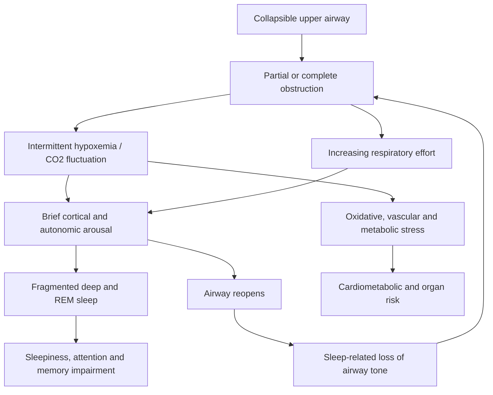

# Obstructive sleep apnea

Obstructive sleep apnea (OSA) is repeated narrowing or closure of the upper airway during sleep. Each event reduces or stops airflow despite continued breathing effort, producing intermittent hypoxemia, carbon-dioxide fluctuation, and arousal. A person may not remember these arousals: loud snoring, witnessed pauses or gasping, nocturia, morning headache, unrefreshing sleep, and daytime sleepiness are clues rather than a diagnosis. OSA can also present as repeated nighttime waking that resembles insomnia. (@FoundMyFitness (FoundMyFitness) — "Why You Can’t Sleep (and How to Fix It) |  Dr. Michael Grandner", 2025-10-06, [link](https://www.youtube.com/watch?v=AQF_eopP1ys))

## Mechanism and consequences

Airway size, pharyngeal tissue and muscle tone, jaw and tongue anatomy, sleep position, alcohol or sedative exposure, nasal resistance, and adipose deposition around the airway can alter collapsibility. During rapid-eye-movement sleep, reduced skeletal-muscle tone can make obstruction more likely. Reopening the airway usually requires a brief arousal; repetition fragments deep and REM sleep even when total time in bed looks adequate. (@FoundMyFitness (FoundMyFitness) — "Why You Can’t Sleep (and How to Fix It) |  Dr. Michael Grandner", 2025-10-06, [link](https://www.youtube.com/watch?v=AQF_eopP1ys))

The mechanistic case for harm is strong: recurrent hypoxemia and sympathetic surges stress vascular and metabolic systems, while fragmentation impairs attention, memory, mood, and daytime performance. Associations with hypertension, cardiovascular disease, cognitive decline, liver and kidney disease are clinically important, but the transcript does not establish how much of every long-term association is caused by OSA rather than shared obesity, age, or vascular risk. (@FoundMyFitness (FoundMyFitness) — "Why You Can’t Sleep (and How to Fix It) |  Dr. Michael Grandner", 2025-10-06, [link](https://www.youtube.com/watch?v=AQF_eopP1ys)) [[sleep-quality-and-circadian-alignment]]

Nocturia deserves specific attention as a presenting clue because it is so readily misattributed. In aging men, waking repeatedly to urinate is commonly blamed on the prostate, but untreated OSA independently drives nighttime awakenings to void, and treating the apnea has been reported to reduce nocturia frequency — so urologic evaluation of nocturia should include an apnea screen rather than stopping at the bladder and prostate ([[benign-prostatic-hyperplasia]]). (@RenaMalikMD (Rena Malik, M.D.) — "Why Men Care So Much About Squirting — And What Actually Matters", 2026-08-28, [link](https://www.youtube.com/watch?v=55KdS4gS6k4))

## Detection and treatment logic

Home sleep-apnea tests primarily measure breathing, oxygenation, and effort; they can identify many straightforward moderate-to-severe cases but usually do not measure sleep itself and can underestimate severity when wake time is counted as sleep time. A negative or ambiguous home study does not reliably exclude OSA when clinical suspicion remains high; laboratory polysomnography adds brain activity, sleep staging, limb movement, cardiac rhythm, and more complete respiratory measurement. (@FoundMyFitness (FoundMyFitness) — "Why You Can’t Sleep (and How to Fix It) |  Dr. Michael Grandner", 2025-10-06, [link](https://www.youtube.com/watch?v=AQF_eopP1ys))

Treatment must keep the airway open and then verify that events and symptoms improve. Positive-airway-pressure therapy pneumatically splints the airway and is the most direct general treatment. Depending on anatomy and severity, clinician-selected alternatives include mandibular-advancement devices, positional therapy, weight management, treatment of nasal obstruction, selected surgery, or hypoglossal-nerve stimulation. Mouth taping does not correct a collapsible pharyngeal airway and may be unsafe when nasal breathing is impaired; it should not substitute for assessment or proven treatment. (@FoundMyFitness (FoundMyFitness) — "Why You Can’t Sleep (and How to Fix It) |  Dr. Michael Grandner", 2025-10-06, [link](https://www.youtube.com/watch?v=AQF_eopP1ys))

## Practical implications

- **When loud snoring, witnessed pauses or gasping, unexplained awakenings, morning headache, resistant hypertension, or daytime sleepiness recur: seek clinical assessment rather than treating the problem as sleep hygiene alone — strong clinical precaution.** Do not drive or perform safety-critical work when dangerously sleepy. (@FoundMyFitness (FoundMyFitness) — "Why You Can’t Sleep (and How to Fix It) |  Dr. Michael Grandner", 2025-10-06, [link](https://www.youtube.com/watch?v=AQF_eopP1ys))
- **After diagnosis: use the prescribed airway treatment nightly and reassess objective event control, mask or device fit, comfort, and daytime function — strong treatment principle; exact cadence is clinician-directed.** A wearable sleep score cannot establish control. (@FoundMyFitness (FoundMyFitness) — "Why You Can’t Sleep (and How to Fix It) |  Dr. Michael Grandner", 2025-10-06, [link](https://www.youtube.com/watch?v=AQF_eopP1ys))
- **If a home test is negative but symptoms or risk remain compelling: ask whether laboratory testing is warranted — moderate diagnostic principle.** Do not self-treat with mouth tape. (@FoundMyFitness (FoundMyFitness) — "Why You Can’t Sleep (and How to Fix It) |  Dr. Michael Grandner", 2025-10-06, [link](https://www.youtube.com/watch?v=AQF_eopP1ys))

## Gaps & open questions

- Which symptom and biomarker combinations best identify clinically important OSA in people without stereotypical sleepiness or obesity?
- Which long-term cognitive and cardiovascular outcomes are reversed by treatment, in whom, and at what adherence threshold?
- How should consumer wearables contribute without delaying diagnostic testing?
- Which patients can use oral, positional, surgical, or stimulation approaches instead of positive airway pressure with comparable outcome control?

## Related

[[sleep-quality-and-circadian-alignment]] · [[cognitive-behavioral-therapy-for-insomnia]] · [[visceral-and-ectopic-fat]] · [[testosterone-replacement-therapy]] · [[benign-prostatic-hyperplasia]] · [[proactive-health-monitoring]] · [[aging-model]] · [[practice-playbook]]
