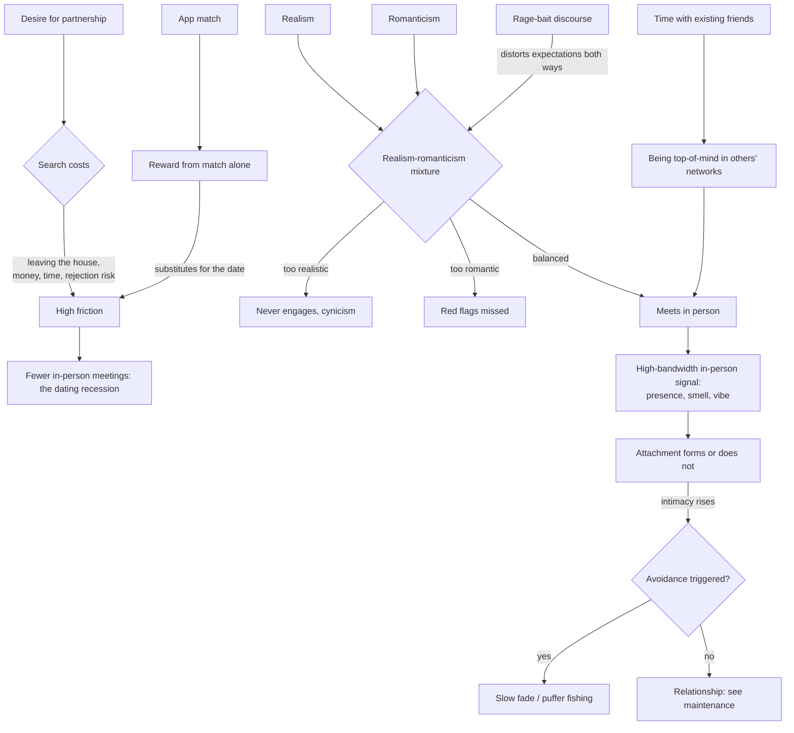

# Partner search and dating behavior

Partner search is the phase before the relationship exists: deciding to look, generating candidates, meeting, and converting acquaintance into attachment. It is a distinct problem from relationship maintenance ([[relationship-maintenance-and-friendship]]), which assumes a bond and asks how to keep it from decaying. Search has its own failure modes — search costs, mismatched selection criteria between parties, avoidance under intimacy, and a discourse environment whose incentives distort what participants believe about each other. Because durable partnership is the strongest single correlate of late-life well-being in long-run cohort data, the search phase is upstream of a large health effect, though almost nothing about how to conduct it has been tested experimentally. This page is built largely on the structured observation of a dating-advice author and comedian rather than research, and is graded accordingly throughout. (@maxlugavere (Max Lugavere) — "The BRUTAL Truth About Modern Dating", 2026-06-10, [link](https://www.youtube.com/watch?v=7bjB0obX-Og))

## The realism–romanticism balance

The core framing offered by Jared Fried, author of Walking Red Flag, is that dating requires two dispositions in mixture, each of which is disabling alone. Excess realism — treating past failures as predictive, reading profiles cynically, calculating rather than engaging — prevents the person from ever going on the date or letting anyone in. Excess romanticism causes glaring incompatibilities and warning signs to be overlooked. The mixture is not stable day to day, which reframes a bad dating week as a state fluctuation rather than evidence about the market. His method is instructive about its own epistemic status: he calls himself not an expert in dating but an expert in his own feelings, an opinionist, and reasons from first-person report on the argument that men's dating cognition varies less between individuals than is usually assumed — his estimate is that describing his own reaction lands within about 10% of most straight men's. That is an assumption, not a measurement, and it is the load-bearing premise under everything he generalizes.

Two structural asymmetries organize his account of straight dating, both presented as descriptions rather than endorsements. First, initial selection criteria differ in kind: men's early filtering is dominated by physical attraction, with compatibility assessment arriving later, while women's early filtering weighs safety, motivation, and trajectory alongside attraction. He draws a non-obvious inference from the male side — if the process is attraction-first, then a woman on a date with a man can take his attraction as given, which he offers as an antidote to appearance anxiety during dates. Second, investment asymmetry: dating is a low-salience topic in male social life and a high-salience one in female social life, which he attributes to differential social evaluation of being single. The consequence is that the loudest online voices in each direction are unrepresentative — the men who engage most with dating discourse are, in his description, disproportionately those doing worst at it. (@maxlugavere (Max Lugavere) — "The BRUTAL Truth About Modern Dating", 2026-06-10, [link](https://www.youtube.com/watch?v=7bjB0obX-Og))

## Search costs and the dating recession

The observed decline in dating activity has a friction explanation that does not require preferences to have changed. Dating requires leaving the house, and app matching supplies a partial reward — the confirmation that someone would go out with you — that can substitute for the date itself; Fried's self-report is matching with someone meeting all his stated criteria and then declining to go out, satisfied by the match. If the reward arrives before the costly step, the costly step gets skipped. Money compounds this: a survey figure cited in the source puts the average US date at about $189, with millennials highest at about $250 (attributed to a bank survey but not identified; treat as illustrative). That prompts the framing question of whether dating is a normal good, a necessity, or a luxury — a question the introduction of paid app tiers effectively answered by putting a price on partner search itself.

His counterargument is that the cost is largely optional and that planning substitutes for spending. The worked example is a roughly $7 date: ask where is convenient for her, choose a public park near her, offer to bring coffee or tea or meet at the coffee shop, plan a walking route with a bench, and — stated explicitly as part of competent male dating conduct — design the whole thing around her safety, including avoiding secluded settings. The claim that carries weight here is about planning rather than price: a man who plans is, in his assessment, already ahead of most of the field. The second-date problem is where the constraint bites, because a repeated coffee-walk starts to read as concealment rather than thrift, and his answer is disclosure — telling a new partner early that big dates are not affordable — while acknowledging the ego cost is high enough that he says he would personally rather go into debt than do it. He does record the counterposition without resolving it: some women experience the coffee date as being devalued, which he attributes to self-consciousness while conceding two men discussing women's feelings is a limited vantage and that his evidence is listener correspondence. He also notes the inverse discomfort — being taken on expensive dates can create a sense of obligation or unsafety. This is all reasoned practical advice from one practitioner, with no outcome data. (@maxlugavere (Max Lugavere) — "The BRUTAL Truth About Modern Dating", 2026-06-10, [link](https://www.youtube.com/watch?v=7bjB0obX-Og))

## Avoidance at the threshold of intimacy

The pattern named puffer fishing in the source — emotional distancing that begins precisely when a relationship starts to feel serious or emotionally real — Fried identifies as the long-standing slow fade under a new label, and he describes practicing it himself, using travel as the mechanism for gradual disappearance. Two claims about it are worth separating. The descriptive one, that avoidance is triggered by rising intimacy rather than by declining interest, is consistent with attachment-theoretic accounts of deactivation under closeness ([[attachment-threat-and-relational-regulation]]). The evaluative one is his contrarian position: fear of commitment is more common and more normal than fear of being alone, and in his own case the operative fear is not solitude but ending up with someone who comes to resent the person he turns out to be. He also rejects the interchangeability assumption behind the cab-light theory — that a man ready to settle takes whoever is next — arguing instead that readiness changes what he can give rather than who will do.

Terminology matters here in a way that affects self-understanding. He distinguishes the ick — a specific, often trivial perceptual trigger that terminates attraction, his stock example being a partner jumping over a puddle — from a turn-off (poor hygiene) and from a character judgment (rudeness to service staff), arguing these get conflated to the confusion of everyone involved. His reading of the ick's underlying structure is that a genuinely trivial trigger usually reveals attraction that was already conditional, which is why it is rare in a process that filters on attraction first: he reports icks as effectively a one-directional phenomenon in his experience, downstream of the asymmetry in early filtering criteria described above. He explicitly refuses to police how many icks are legitimate — one person's ick is another's husband — and locates the harm not in the phenomenon but in its use as public contempt. (@maxlugavere (Max Lugavere) — "The BRUTAL Truth About Modern Dating", 2026-06-10, [link](https://www.youtube.com/watch?v=7bjB0obX-Og))

## Why the online discourse misrepresents the population

The gap between dating discourse and dating experience has a straightforward incentive explanation, and it belongs to the same attention economy documented at [[health-misinformation-and-media-incentives]]. Divisive and extreme positions are what monetize, so the visible sample of opinion is selected for divisiveness rather than representativeness — Fried's test case is that opposing a well-planned, safe, inexpensive park date has no plausible sincere motivation. He describes a specific asymmetry in the permission structure: contemptuous generalizations about men are socially survivable for the speaker in a way the mirror-image content is not, which he attributes partly to unsettled punch-up/punch-down norms in a domain where straight men are read as having no standing to complain. He is visibly careful with this claim, repeatedly acknowledging that dating carries real physical danger for women that the online-speech asymmetry does not offset — the qualification is part of the position, not a hedge on it. The mechanism he proposes is a closed loop: rage-bait content (his example, a woman claiming she cancels dates when a man fails to send a car) draws responses from low-confidence men, whose responses become evidence for the original characterization, while the men actually going on dates and forming partnerships are absent from the sample entirely. He also flags his own susceptibility, noticing that the people he finds himself provoked by online look like him.

The generational framing he offers — millennials as the bridge cohort, native to the internet but not to social media — is used to argue against the assumption that this cohort handles algorithmic manipulation better than older ones. His claim is that each generation has a version of the manipulation it cannot see: what is legible as manipulation in an older cohort's media diet has an exact counterpart in a younger cohort's that its members experience as genuine disagreement. This is cultural observation, offered as such. (@maxlugavere (Max Lugavere) — "The BRUTAL Truth About Modern Dating", 2026-06-10, [link](https://www.youtube.com/watch?v=7bjB0obX-Og)) [[cognitive-dissonance-and-narrative-protection]]

## Self-assessment and the analog channel

Two constructive proposals close the account. The first is a self-assessment step most people skip: rather than asking whether one is ready to date, ask what kind of single, what kind of alone, and what kind of horny one currently is — treating each as a state with gradations rather than a binary. Being alone and being lonely are different states; recently-ended and long-single are different starting conditions; and the ongoing sexual arrangement that reliably meets a need is, in his assessment, incompatible with searching seriously, because it installs a comparison against which new partners are measured and consumes attention the search requires. The value of the taxonomy is diagnostic and communicative — his reported case of a reader using the categories to ask a man she was dating which one he was, and getting a usable answer, illustrates that naming one's state makes it discussable, which vague readiness talk does not.

The second is the analog channel, and it is the least intuitive item here. The advice is not to ask friends for setups but to spend unstructured time with existing friends, including partnered ones — on two grounds. Directly, it is restorative, and one is most oneself there. Indirectly, it addresses an availability problem: friends are not searching on your behalf, but when a single person crosses their path, whoever is top-of-mind gets named, and being pleasant company rather than the friend whose singleness is a difficult subject determines whether that happens. The mechanism is ordinary social-network structure, in which weak ties are disproportionate sources of introductions; it aligns with the deputized-mutual-friends recommendation recorded at [[relationship-maintenance-and-friendship]]. Note the tension with the health literature: spending time with friends is being recommended here instrumentally, while its documented benefit is in the friendship itself. (@maxlugavere (Max Lugavere) — "The BRUTAL Truth About Modern Dating", 2026-06-10, [link](https://www.youtube.com/watch?v=7bjB0obX-Og))

## Practical implications

All items below are Investigational practice: structured observation and reasoning from a dating-advice author, with no trial evidence for any of it. They are low-risk; situations involving coercion, harassment, or safety concerns fall outside their scope.

- **Before searching, name your current state specifically — how single, how alone, how much of the drive is sexual — and treat an ongoing sexual arrangement as a competing commitment rather than a neutral background — Investigational practice.** Vague readiness self-talk is what the taxonomy is meant to replace. (@maxlugavere (Max Lugavere) — "The BRUTAL Truth About Modern Dating", 2026-06-10, [link](https://www.youtube.com/watch?v=7bjB0obX-Og))
- **Plan the date rather than spending on it: choose a location convenient to the other person, design the logistics around their safety, and treat planning effort as the differentiator — Investigational practice.** Cost is a weak constraint on a good first date; effort is the signal. (@maxlugavere (Max Lugavere) — "The BRUTAL Truth About Modern Dating", 2026-06-10, [link](https://www.youtube.com/watch?v=7bjB0obX-Og))
- **When money limits what you can offer past a first or second date, disclose it early rather than managing the appearance — Investigational practice, with the ego cost explicitly acknowledged as high.** Repeated minimal dates without explanation read as concealment. (@maxlugavere (Max Lugavere) — "The BRUTAL Truth About Modern Dating", 2026-06-10, [link](https://www.youtube.com/watch?v=7bjB0obX-Og))
- **Monthly at minimum: keep unstructured time with existing friends, including partnered ones, without treating it as a search tactic — Investigational practice as a dating channel; the underlying social-connection benefit is separately well documented.** (@maxlugavere (Max Lugavere) — "The BRUTAL Truth About Modern Dating", 2026-06-10, [link](https://www.youtube.com/watch?v=7bjB0obX-Og))
- **Discount online dating discourse as a sample: assume the visible opinions are selected for divisiveness and that neither the men nor the women you would actually date are represented in it — Investigational practice, consistent with documented engagement incentives ([[health-misinformation-and-media-incentives]]).** (@maxlugavere (Max Lugavere) — "The BRUTAL Truth About Modern Dating", 2026-06-10, [link](https://www.youtube.com/watch?v=7bjB0obX-Og))
- **Notice when withdrawal follows increasing closeness rather than decreasing interest — Investigational practice.** The distinction changes what the response should be, and it is the point at which the slow fade becomes a choice rather than a drift. [[attachment-threat-and-relational-regulation]] (@maxlugavere (Max Lugavere) — "The BRUTAL Truth About Modern Dating", 2026-06-10, [link](https://www.youtube.com/watch?v=7bjB0obX-Og))

## Gaps & open questions

- How much of the measured decline in dating and partnership formation is explained by search friction and app-mediated reward substitution versus economic conditions, changing preferences, or delayed life-stage transitions?
- Is the male-cognition-within-10% premise underlying most of this material defensible, or does first-person generalization systematically misdescribe a heterogeneous population?
- Does the claimed asymmetry in early selection criteria hold in measured behavior rather than self-report, and how much does it vary by age, orientation, and context?
- Does exposure to adversarial dating discourse causally change expectations, behavior, or partnering success, or does it select an already-disaffected audience?
- Is the ick a discrete phenomenon with an identifiable trigger structure, or a post-hoc label for ordinary attraction decay?
- Do early-intimacy withdrawal patterns respond to the same interventions as attachment deactivation in established relationships?
- Does the friend-network availability route measurably produce introductions, and at what contact frequency?

## Related

[[relationship-maintenance-and-friendship]] · [[attachment-threat-and-relational-regulation]] · [[sexual-desire-arousal-and-aging]] · [[durable-well-being-and-hedonic-adaptation]] · [[social-evaluative-threat-and-criticism]] · [[cognitive-dissonance-and-narrative-protection]] · [[trust-repair-and-safety-learning]] · [[health-misinformation-and-media-incentives]] · [[meaning-boredom-and-technology]] · [[practice-playbook]]
