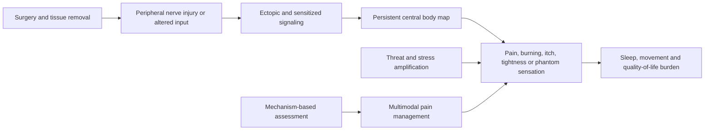

# Post-surgical neuropathic pain and phantom sensation

Post-surgical neuropathic pain arises when surgery injures or alters sensory nerves and the nervous system continues to generate pain, burning, itch, tightness, or sensitivity after ordinary tissue healing. A phantom sensation is perceived in removed tissue or an altered body part; after mastectomy this can include phantom breast symptoms and can overlap with the broader category of persistent post-mastectomy pain. The experience is generated by real peripheral and central signaling even though the original tissue is absent. (@DrDrayzday (Dr Dray) — "Are Copper Peptides Better Than Vitamin C? Dermatologist Explain", 2026-08-01, [link](https://www.youtube.com/watch?v=YuHLRmJMUzI))

## From nerve injury to persistent perception

Peripheral nerve damage can produce abnormal spontaneous input, while spinal and brain circuits can amplify or continue interpreting signals through an established body map. This explains why absence of visible injury or removed tissue does not negate the symptom. The transcript supports the existence and broad mechanism of phantom breast and post-mastectomy pain but does not establish prevalence, diagnostic criteria, prognosis, or the relative effectiveness of treatments. (@DrDrayzday (Dr Dray) — "Are Copper Peptides Better Than Vitamin C? Dermatologist Explain", 2026-08-01, [link](https://www.youtube.com/watch?v=YuHLRmJMUzI))

## Practical implications

- **When pain, burning, itch, tightness, or sensitivity persists after surgery: report it to the surgical team or a pain clinician — strong safety practice.** Assessment should distinguish neuropathic symptoms from infection, wound complications, recurrence, lymphedema, musculoskeletal pain, and other causes.
- **At each follow-up until controlled: track location, quality, triggers, sleep, function, and treatment effects — moderate assessment practice.** Multimodal pain management may be needed, but no specific drug, procedure, dose, or cadence is admitted from this transcript alone.
- **Seek urgent assessment for new swelling, redness, drainage, fever, rapidly worsening pain, chest symptoms, or a new mass — strong precaution.** A phantom mechanism should not be used to dismiss new postoperative findings.

## Gaps & open questions

- Which preoperative, surgical, and early postoperative factors predict persistent post-mastectomy neuropathic pain or phantom breast symptoms?
- Which combinations of medication, rehabilitation, psychological support, nerve procedures, and sensory retraining improve function and quality of life?
- How should phantom sensation be distinguished from neuroma, musculoskeletal pain, lymphedema, recurrence, and central sensitization in routine care?

## Related

[[neuromodulators-and-state-control]] · [[stress-threat-discrimination]] · [[sleep-quality-and-circadian-alignment]] · [[daily-movement-mobility-and-pain]] · [[dr-dray]]
