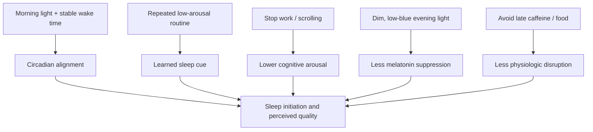

# Pre-sleep routines and stimulus control

A pre-sleep routine is a repeatable transition from daytime activity to sleep opportunity. It can work through stimulus control—learning that a stable sequence and context predict sleep—while displacing alerting behavior, large meals, caffeine, and bright light. Reading is one possible routine, not a uniquely established sleep treatment. Small protein-dominant feedings have a different evidence base from large late meals and may be useful when they close a daily protein gap without disturbing sleep or digestion. (@NutritionMadeSimple (Nutrition Made Simple!) — "STOP Doing This Before Bed (1,000-Person Study)", 2026-07-03, [link](https://www.youtube.com/watch?v=bWXF65SZJps)) (@drandygalpin (Andy Galpin) — "The Truth About Eating Before Bed | Dr. Michael Ormsbee & Dr. Andy Galpin", 2026-08-01, [link](https://www.youtube.com/watch?v=fOeZrm7LlZs)) [[pre-sleep-protein-feeding]]

## Mechanism

Sleep timing reflects accumulated sleep pressure, circadian timing, learned arousal, and environment. A consistent wind-down cue can reduce cognitive activation; replacing work or social-media scrolling removes stimulating tasks; dimmer, less blue-enriched light reduces evening melatonin suppression. Consistent wake timing and morning light provide a daily phase-setting signal. These pathways can act together, so a reading trial cannot identify the active component unless they are separately controlled. (@NutritionMadeSimple (Nutrition Made Simple!) — "STOP Doing This Before Bed (1,000-Person Study)", 2026-07-03, [link](https://www.youtube.com/watch?v=bWXF65SZJps))

Stimulus control becomes especially important when attempts to compensate for insomnia—going to bed early, remaining in bed while alert, or sleeping in irregularly—teach wakefulness in the sleep environment. The behavioral rule is to go to bed when sleepy, leave the bed during sustained wakefulness for a quiet activity in dim light, and return only when sleepy. This is one component of evidence-based insomnia treatment; it does not exclude apnea, circadian misalignment, medication effects, pain, or other causes of fragmented sleep. (@NutritionMadeSimple (Nutrition Made Simple!) — "The #1 WORST Sleep Mistake Destroying Your Heart", 2026-05-21, [link](https://www.youtube.com/watch?v=2BAX8mJ27gA)) [[sleep-quality-and-circadian-alignment]]

## What the reading trial establishes

In a randomized trial of about 1,000 people, 42% assigned to read for 15–30 minutes before sleep reported better sleep after seven days, compared with 28% assigned not to read: a 14-percentage-point absolute difference. This supports a short-term effect of the assigned reading package on self-reported sleep, not the claim that reading caused all improvement. Both groups were also instructed not to eat or consume caffeine during the hour before bed, and there was no usual-behavior group. Observation, expectation, altered routines, regression to the mean, or the shared restriction could explain some comparison-group improvement. (@NutritionMadeSimple (Nutrition Made Simple!) — "STOP Doing This Before Bed (1,000-Person Study)", 2026-07-03, [link](https://www.youtube.com/watch?v=bWXF65SZJps))

The hypothesis that reading works mainly by replacing phones and laptops is plausible but was not isolated. Meditation or breathing may provide comparable routines, but the trial did not compare them. The Hawthorne effect labels behavior change under observation, yet it is one of several explanations and cannot be measured here without a no-intervention comparator. (@NutritionMadeSimple (Nutrition Made Simple!) — "STOP Doing This Before Bed (1,000-Person Study)", 2026-07-03, [link](https://www.youtube.com/watch?v=bWXF65SZJps))

## Practical implications

- **Nightly for at least one week: reserve 15–30 minutes for a repeatable, low-arousal, dim-light routine — moderate for the reading package, emerging for alternatives.** A paper book or dim e-reader is reasonable; meditation or breathing is plausible but not established here. Keep stimulating work and scrolling outside the routine. (@NutritionMadeSimple (Nutrition Made Simple!) — "STOP Doing This Before Bed (1,000-Person Study)", 2026-07-03, [link](https://www.youtube.com/watch?v=bWXF65SZJps))
- **If experimenting with slow breathing: use about five comfortable minutes as part of the routine — emerging for the combined protocol.** Avoid forceful breathing and assess whether it actually improves arousal, sleep, and next-day function. (@drandygalpin (Andy Galpin) — "5 Tools for Reducing Chronic Stress in Your Body | Dr. Andy Galpin & Jill Miller", 2026-07-24, [link](https://www.youtube.com/watch?v=70Gi-IE21oM)) [[breathing-mechanics-and-state-regulation]]
- **Daily: keep wake time reasonably consistent and obtain outdoor light within the first one to two hours after waking — moderate support in the source.** Treat this as circadian anchoring, not a guarantee that every sleep disorder will resolve. (@NutritionMadeSimple (Nutrition Made Simple!) — "STOP Doing This Before Bed (1,000-Person Study)", 2026-07-03, [link](https://www.youtube.com/watch?v=bWXF65SZJps))

## Gaps & open questions

- How much of the effect came from reading, screen displacement, shared food/caffeine restriction, expectation, or observation?
- Do objective sleep measures and daytime function improve, and are effects sustained beyond seven days?
- Which routine works best for insomnia, delayed circadian phase, anxiety, caregiving constraints, or shift work?
- What light spectrum, intensity, viewing distance, and timing matter in real conditions?

## Related

[[sleep-quality-and-circadian-alignment]] · [[pre-sleep-protein-feeding]] · [[breathing-mechanics-and-state-regulation]] · [[neuromodulators-and-state-control]] · [[cognitive-reserve-and-brain-health]] · [[environmental-pollution-and-health]] · [[practice-playbook]] · [[aging-model]]
