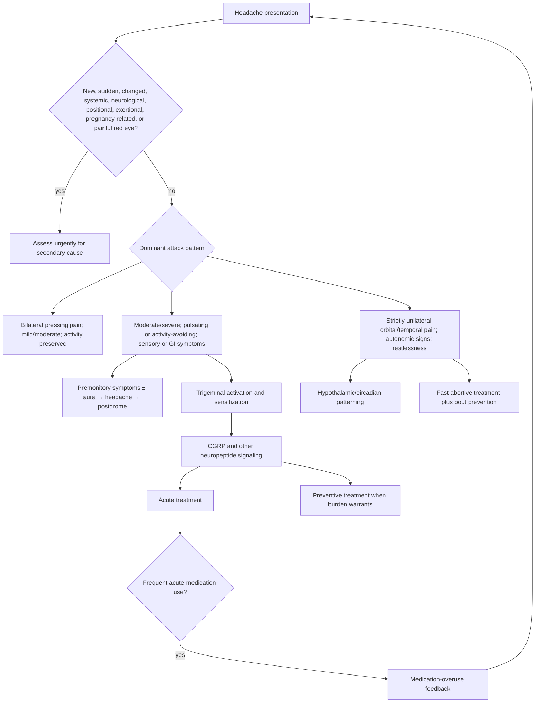

# Primary headache disorders

Primary headache disorders are recurrent syndromes in which headache is the disorder itself rather than a symptom attributed to another disease. Migraine, tension-type headache, and cluster headache are the major clinical patterns. Secondary headache instead arises from another cause, which can be dangerous (hemorrhage, infection, tumor, arteritis) or non-life-threatening (caffeine withdrawal or medication overuse). Normal imaging does not prove a primary disorder, and most primary headaches have no diagnostic biomarker; diagnosis depends on the time course, associated symptoms, examination, and exclusion of secondary causes when indicated.[^nice-2025] (@PeterAttiaMD (Peter Attia MD) — "406 ‒ Migraine, cluster headache, and tension headache: symptoms, causes, prevention, and treatment", 2026-08-31, [link](https://www.youtube.com/watch?v=uiNEP8A34SE))

## Pattern recognition before treatment

Tension-type headache is usually bilateral, pressing or tightening rather than pulsating, mild to moderate, and not aggravated by routine activity. Migraine may be unilateral or bilateral, usually lasts 4–72 hours in adults, and combines moderate-to-severe pain or activity avoidance with light/sound sensitivity, nausea, or vomiting. Cluster headache produces severe or very severe unilateral pain around the eye or temple for 15–180 minutes, often with same-sided tearing, eye redness, nasal symptoms, eyelid change, sweating, and conspicuous restlessness; attacks can recur from every other day to eight times daily during a bout.[^nice-2025] The sharp contrast between lying still in migraine and pacing in cluster headache is diagnostically useful but not sufficient by itself. (@PeterAttiaMD (Peter Attia MD) — "406 ‒ Migraine, cluster headache, and tension headache: symptoms, causes, prevention, and treatment", 2026-08-31, [link](https://www.youtube.com/watch?v=uiNEP8A34SE))

Migraine is a multiphase brain disorder, not only the pain interval. Premonitory yawning, fatigue, food craving, irritability, light sensitivity, or neck stiffness may precede pain; a minority experience fully reversible aura; and fatigue or cognitive after-effects can persist after pain resolves. Typical aura develops gradually over at least five minutes, may progress through visual, sensory, or speech symptoms, and lasts 5–60 minutes. First, atypical, abrupt-maximal, monocular, motor, balance, consciousness, or otherwise changed neurological symptoms require evaluation rather than self-labeling as aura.[^nice-2025] (@PeterAttiaMD (Peter Attia MD) — "406 ‒ Migraine, cluster headache, and tension headache: symptoms, causes, prevention, and treatment", 2026-08-31, [link](https://www.youtube.com/watch?v=uiNEP8A34SE))

## Migraine mechanism: a sensitizing trigeminovascular network

The brain tissue itself is relatively insensitive to pain, whereas meninges and cranial vessels contain pain-sensitive terminals. In migraine, trigeminal afferents carry meningeal and vascular signals into the brainstem; upper-cervical input converges in the same region, helping explain referred neck pain. Sustained signaling can move from peripheral sensitization to central sensitization, expressed clinically as cutaneous allodynia—ordinary pressure from hair, glasses, or a hat becomes uncomfortable. Signals then ascend through thalamic and cortical pain networks while parasympathetic reflexes can cause tearing or nasal symptoms that are easily misread as sinus disease. (@PeterAttiaMD (Peter Attia MD) — "406 ‒ Migraine, cluster headache, and tension headache: symptoms, causes, prevention, and treatment", 2026-08-31, [link](https://www.youtube.com/watch?v=uiNEP8A34SE))

Calcitonin gene-related peptide (CGRP) is released within this network and contributes to nociceptive transmission and neurogenic inflammatory signaling. Its role is supported not merely by biomarker association but by randomized trials of agents that block the peptide or receptor. Large monoclonal antibodies and small-molecule gepants are pharmacologically different ways of acting on this node. The American Headache Society now considers CGRP-targeting therapies a first-line preventive option alongside older first-line treatments, without requiring failure of two older drug classes; cost, coverage, route, comorbidity, reproductive considerations, and individual response still shape selection.[^ahs-2024] (@PeterAttiaMD (Peter Attia MD) — "406 ‒ Migraine, cluster headache, and tension headache: symptoms, causes, prevention, and treatment", 2026-08-31, [link](https://www.youtube.com/watch?v=uiNEP8A34SE))

Genetic susceptibility is polygenic and interacts with environment. Hormonal transitions can change attack frequency, particularly the rate of estradiol withdrawal around menstruation and fluctuation during perimenopause. A calendar association should be demonstrated rather than assumed: NICE recommends a headache diary across at least two menstrual cycles when menstrual-related migraine is suspected.[^nice-2025] Hormonal contraception or menopause therapy may improve, worsen, or leave migraine unchanged, so migraine phenotype, aura, vascular risk, indication for hormones, and response need joint clinical review rather than a universal hormone rule. (@PeterAttiaMD (Peter Attia MD) — "406 ‒ Migraine, cluster headache, and tension headache: symptoms, causes, prevention, and treatment", 2026-08-31, [link](https://www.youtube.com/watch?v=uiNEP8A34SE))

## Treatment is matched to attack speed, burden, and risk

Acute migraine therapy aims to restore function during an attack. Guideline-supported options include a triptan, NSAID, aspirin, or paracetamol in appropriate patients, with route chosen partly by nausea, speed of onset, and previous response; a consistently ineffective triptan does not prove that every triptan will fail.[^nice-2025] Preventive therapy aims to reduce attack frequency, intensity, duration, disability, and interictal burden rather than cure susceptibility. Older options include propranolol, topiramate, amitriptyline, and—specifically for chronic migraine—onabotulinumtoxinA; pregnancy, asthma, blood pressure, exercise tolerance, mood, sleep, weight, and adverse effects can make the same drug suitable for one person and poor for another.[^nice-2025] (@PeterAttiaMD (Peter Attia MD) — "406 ‒ Migraine, cluster headache, and tension headache: symptoms, causes, prevention, and treatment", 2026-08-31, [link](https://www.youtube.com/watch?v=uiNEP8A34SE))

Cluster attacks demand fast delivery because pain reaches peak intensity rapidly. NICE recommends oxygen and/or subcutaneous or nasal triptan for acute treatment and verapamil as a preventive option during a bout, with specialist input and electrocardiographic monitoring; oral analgesics and oral triptans are too slow for this purpose.[^nice-2025] The transcript's description of very high-dose verapamil illustrates specialist practice, not a self-directed dose protocol. The nickname “suicide headache” reflects both extreme pain and suicide risk; suicidal thoughts during a bout require immediate crisis and medical support. (@PeterAttiaMD (Peter Attia MD) — "406 ‒ Migraine, cluster headache, and tension headache: symptoms, causes, prevention, and treatment", 2026-08-31, [link](https://www.youtube.com/watch?v=uiNEP8A34SE))

Medication-overuse headache is a secondary feedback loop layered onto an underlying headache disorder. NICE flags headache that develops or worsens after at least three months of triptans, opioids, ergots, or combination analgesics on 10 or more days per month, or paracetamol, aspirin, or NSAIDs on 15 or more days per month.[^nice-2025] Opioids and barbiturate-containing combinations are especially poor routine migraine tools because dependence, adverse effects, and overuse can compound disability. (@PeterAttiaMD (Peter Attia MD) — "406 ‒ Migraine, cluster headache, and tension headache: symptoms, causes, prevention, and treatment", 2026-08-31, [link](https://www.youtube.com/watch?v=uiNEP8A34SE))

External electrical, magnetic, trigeminal, vagal, or remote-arm neuromodulation devices offer non-drug options for selected patients, but evidence and indications are device-specific and should not be generalized from “stimulation” as a category. Cannabis evidence is weaker still: variable THC/CBD composition, route, dose, co-treatments, sleep or anxiety effects, and drug interactions make observational reports hard to interpret. Neither category justifies abandoning established acute or preventive care. (@PeterAttiaMD (Peter Attia MD) — "406 ‒ Migraine, cluster headache, and tension headache: symptoms, causes, prevention, and treatment", 2026-08-31, [link](https://www.youtube.com/watch?v=uiNEP8A34SE))

## Practical implications

- **For a sudden maximal-intensity headache, a major new or changed pattern, fever or rash, neurological deficit, confusion, painful red eye, pregnancy-associated new headache, or headache triggered by exertion/cough/sex or strongly changed by posture: seek urgent clinical assessment—strong safety guidance.** Do not use a prior migraine label to explain away a new red flag.[^nice-2025] (@PeterAttiaMD (Peter Attia MD) — "406 ‒ Migraine, cluster headache, and tension headache: symptoms, causes, prevention, and treatment", 2026-08-31, [link](https://www.youtube.com/watch?v=uiNEP8A34SE))
- **For recurrent headache: keep an eight-week diary—moderate-to-strong diagnostic guidance.** Record timing, duration, severity, associated symptoms, menstrual timing when relevant, sleep, caffeine, acute medicines, response, and disability; this can distinguish patterns and reveal medication overuse.[^nice-2025] (@PeterAttiaMD (Peter Attia MD) — "406 ‒ Migraine, cluster headache, and tension headache: symptoms, causes, prevention, and treatment", 2026-08-31, [link](https://www.youtube.com/watch?v=uiNEP8A34SE))
- **At each clinical review: choose acute treatment by diagnosis and attack profile, and discuss prevention when attacks are frequent, disabling, prolonged, or poorly controlled—strong guideline-based practice.** Preventive benefit may take weeks to months and often requires adjustment rather than one universal sequence.[^nice-2025] (@PeterAttiaMD (Peter Attia MD) — "406 ‒ Migraine, cluster headache, and tension headache: symptoms, causes, prevention, and treatment", 2026-08-31, [link](https://www.youtube.com/watch?v=uiNEP8A34SE))
- **Daily: protect regular sleep, meals, hydration, activity, and mood care, while testing only diary-supported individual triggers—moderate as supportive care, weak for universal trigger lists.** Avoid broad elimination diets unless a reproducible relationship or separate diagnosis justifies them. (@PeterAttiaMD (Peter Attia MD) — "406 ‒ Migraine, cluster headache, and tension headache: symptoms, causes, prevention, and treatment", 2026-08-31, [link](https://www.youtube.com/watch?v=uiNEP8A34SE))
- **Do not self-escalate acute medication frequency or preventive doses—strong safety principle.** Review frequent use with a clinician because thresholds and harms differ by drug, and specialist-monitored cluster protocols cannot be copied safely.[^nice-2025] (@PeterAttiaMD (Peter Attia MD) — "406 ‒ Migraine, cluster headache, and tension headache: symptoms, causes, prevention, and treatment", 2026-08-31, [link](https://www.youtube.com/watch?v=uiNEP8A34SE))

## Gaps & open questions

- Which biological markers will distinguish migraine subtypes or predict response before trial-and-error prescribing?
- Which patients obtain durable benefit from specific neuromodulation devices, and how do they compare directly with medicines?
- How should migraine prevention be individualized across pregnancy, perimenopause, menopause therapy, and vascular risk?
- Which lifestyle regularity components have causal preventive effects independent of comorbidity treatment and regression to the mean?
- What standardized cannabis formulations, if any, improve headache outcomes without unacceptable cognitive, psychiatric, cardiovascular, or medication-interaction harms?

## References

[^nice-2025]: National Institute for Health and Care Excellence. “Headaches in over 12s: diagnosis and management (CG150).” Updated June 3, 2025. [clinical guideline]. [NICE guidance](https://www.nice.org.uk/guidance/cg150/chapter/recommendations)
[^ahs-2024]: Charles AC, Digre KB, Goadsby PJ, Robbins MS, Hershey A. “Calcitonin gene-related peptide-targeting therapies are a first-line option for the prevention of migraine: An American Headache Society position statement update.” *Headache*. 2024;64:333–341. [professional-society position statement]. [doi:10.1111/head.14692](https://doi.org/10.1111/head.14692)

## Related

[[neuromodulators-and-state-control]] · [[sleep-quality-and-circadian-alignment]] · [[obstructive-sleep-apnea]] · [[neuroendocrine-regulation-of-mood]] · [[menopause-hormone-therapy]] · [[caffeinated-coffee-and-cognitive-aging]] · [[brian-grosberg]] · [[peter-attia]]
