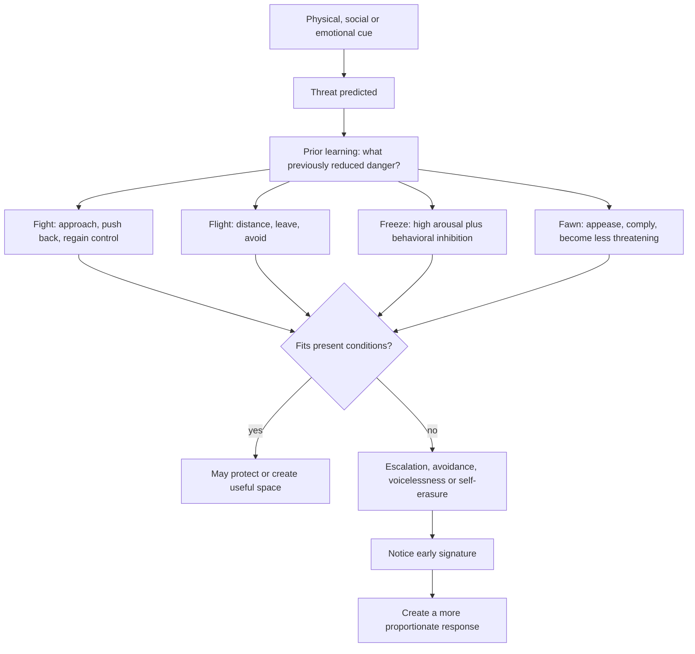
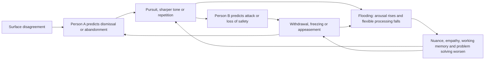

# Protective threat responses

Fight, flight, and freeze describe recurrent action patterns organized when the nervous system detects threat; fawn describes appeasement used to reduce interpersonal danger. They are functional categories, not fixed personalities or moral rankings. The same person may use different responses across contexts, and a response that once reduced danger can become costly when automatically reused in a safer present setting. (@DrTraceyMarks (Dr. Tracey Marks) — "Fight, Flight, Freeze, Fawn—Which One Is Your Pattern?", 2026-07-22, [link](https://www.youtube.com/watch?v=25kZd9Deums))

## Response selection and expression

**Fight** moves toward the threat through forceful correction, argument, interruption, rigidity, or an urgent effort to regain control; mobilization is not automatically aggression, though it can escalate harm. **Flight** creates distance by leaving, ending contact, changing the subject, distracting, or avoiding follow-up; apparently productive cleaning, work, or scrolling can serve the same distancing function. **Freeze** combines substantial internal arousal with inhibition, producing blankness, immobility, or loss of accessible words rather than simple calm or indifference. **Fawn** uses apology, agreement, pleasing, or self-minimization to reduce another person's perceived threat. (@DrTraceyMarks (Dr. Tracey Marks) — "Fight, Flight, Freeze, Fawn—Which One Is Your Pattern?", 2026-07-22, [link](https://www.youtube.com/watch?v=25kZd9Deums))

Fawn requires a taxonomic caveat: Tracey Marks describes it as clinically relevant and widely observed but not as settled a fourth category in the same sense as fight, flight, and freeze. Its defining distinction from generosity is constrained choice—automatic self-erasure under perceived threat rather than freely chosen care or compromise. This is a useful clinical framing, not evidence that four exhaustive, biologically discrete response systems have been established. (@DrTraceyMarks (Dr. Tracey Marks) — "Fight, Flight, Freeze, Fawn—Which One Is Your Pattern?", 2026-07-22, [link](https://www.youtube.com/watch?v=25kZd9Deums))

## Learning, mismatch, and choice

Response selection is history-dependent. If pushing back, escaping, remaining still, or appeasing previously reduced danger, the nervous system may prioritize that pattern before slower deliberation has evaluated the current situation. This can make a response appear disproportionate and explains why better options become visible only after arousal settles. The model is mechanistically plausible, but the source offers no comparative studies showing that each person's repertoire reduces to one or two stable defaults or that the proposed early-signature practice changes clinical outcomes. (@DrTraceyMarks (Dr. Tracey Marks) — "Fight, Flight, Freeze, Fawn—Which One Is Your Pattern?", 2026-07-22, [link](https://www.youtube.com/watch?v=25kZd9Deums))

Early signatures create a possible intervention point: chest heat, jaw tension, or interruption urges for fight; exit scanning or restlessness for flight; blankness or loss of words for freeze; and automatic apology, rapid agreement, or hyperfocus on another person's mood for fawn. Recognition does not require suppressing the response. It creates time to test whether the old protection fits the present and to use [[stress-threat-discrimination]] before acting. (@DrTraceyMarks (Dr. Tracey Marks) — "Fight, Flight, Freeze, Fawn—Which One Is Your Pattern?", 2026-07-22, [link](https://www.youtube.com/watch?v=25kZd9Deums))

In close relationships, fawn can take the form of overgiving: anticipating needs, managing moods, initiating repair, or making oneself useful because stopping feels likely to produce rejection, conflict, withdrawal, or abandonment. The defining feature is not the quantity of help but its threat-regulatory function and loss of flexibility. Short-term relief can reinforce the behavior while increasing vigilance, burnout, weak reciprocity, and a sense that personal value depends on usefulness. The source's additional oxytocin explanation is plausible but unreviewed and should not be treated as an established biomarker or causal account. [[attachment-threat-and-relational-regulation]] (@DrTraceyMarks (Dr. Tracey Marks) — "Overgiving Isn't Kindness—It's a Threat Response", 2026-05-06, [link](https://www.youtube.com/watch?v=u0z4SNSZfn0))

Fight can likewise regulate closeness rather than answer an external attack. Defensive anger creates distance when intimacy increases perceived exposure, whereas protest anger pursues reassurance and boundary anger identifies a concrete violation. The surface behavior alone does not reveal the function, and this framework neither excuses aggression nor implies that valid anger is pathological. [[attachment-threat-and-relational-regulation]] (@DrTraceyMarks (Dr. Tracey Marks) — "Why You Pick Fights When You Feel Close", 2026-05-20, [link](https://www.youtube.com/watch?v=5Ow1rDBSKFc))

## Conflict flooding and reciprocal escalation

In conflict, the surface issue can acquire a deeper predicted meaning: disrespect, abandonment, loss of control, danger, or being misunderstood. One person's protective move then becomes the other's cue. Pursuit, louder speech, repetition, and insistence can be read as attack; silence, gaze aversion, brief answers, and withdrawal can be read as indifference. The resulting loop can intensify even when both people are attempting protection rather than harm. (@DrTraceyMarks (Dr. Tracey Marks) — "The Real Reason You Can't Stay Calm During Arguments", 2026-06-10, [link](https://www.youtube.com/watch?v=pXhG1Mt14Tk))

Flooding is the state in which physiological activation becomes high enough that effective listening, nuance, memory, empathy, and flexible problem solving deteriorate. The source associates this with rapid amygdala threat detection, sympathetic activation, reduced prefrontal influence, and heart rate around 100 beats per minute or higher. Those details are useful heuristics but not a universal diagnostic threshold, and the transcript does not establish that a single brain region or heart-rate cutoff determines whether a conversation is productive. The cited claim that men recover more slowly on average also describes a group tendency and cannot predict an individual's response. (@DrTraceyMarks (Dr. Tracey Marks) — "The Real Reason You Can't Stay Calm During Arguments", 2026-06-10, [link](https://www.youtube.com/watch?v=pXhG1Mt14Tk))

The proposed interruption sequence is to identify flooding, name what the brain believes is at stake, announce a time-limited pause, regulate rather than rehearse the case, and return at the agreed time. Marks recommends at least 20 minutes on the basis of Gottman research. A pause differs from stonewalling because it preserves an explicit commitment to resume; walking, slow breathing, cool water, or grounding are intended to lower activation, whereas rumination may maintain it. The exact minimum and techniques are not established by evidence reviewed in the transcript, so this is best classified as an emerging, source-reported protocol. Threat activation explains reduced capacity but does not excuse cruelty, indefinite withdrawal, coercion, or self-erasing appeasement. (@DrTraceyMarks (Dr. Tracey Marks) — "The Real Reason You Can't Stay Calm During Arguments", 2026-06-10, [link](https://www.youtube.com/watch?v=pXhG1Mt14Tk))

## Practical implications

- **Per triggering episode: identify the earliest bodily, attentional, and behavioral signature — emerging/clinically plausible.** Name the response without treating it as identity, then check whether the situation is dangerous, merely demanding, or uncertain. (@DrTraceyMarks (Dr. Tracey Marks) — "Fight, Flight, Freeze, Fawn—Which One Is Your Pattern?", 2026-07-22, [link](https://www.youtube.com/watch?v=25kZd9Deums))
- **Practice one functionally equivalent alternative weekly and in low-stakes situations — emerging.** Replace escalating fight with a boundary, automatic flight with an explicit time-limited break, freeze with a request for time, or fawn with a delayed answer that preserves choice. The cadence and substitutions are practical extrapolations, not validated prescriptions. (@DrTraceyMarks (Dr. Tracey Marks) — "Fight, Flight, Freeze, Fawn—Which One Is Your Pattern?", 2026-07-22, [link](https://www.youtube.com/watch?v=25kZd9Deums))
- **Use protection when protection is warranted — strong as a safety principle.** Leaving, resisting, becoming still, or de-escalating may be adaptive in genuine danger; the goal is contextual flexibility, not abolishing defensive capacity. (@DrTraceyMarks (Dr. Tracey Marks) — "Fight, Flight, Freeze, Fawn—Which One Is Your Pattern?", 2026-07-22, [link](https://www.youtube.com/watch?v=25kZd9Deums))
- **When conflict becomes flooded, take an explicit time-limited pause and return — emerging/source-reported.** Name the loss of processing capacity, agree on a return time, and use the break for down-regulation rather than rehearsing accusations; the source recommends at least 20 minutes, but individual recovery time is uncertain. (@DrTraceyMarks (Dr. Tracey Marks) — "The Real Reason You Can't Stay Calm During Arguments", 2026-06-10, [link](https://www.youtube.com/watch?v=pXhG1Mt14Tk))
- **When helping or anger feels compulsory, identify its immediate protective job — emerging.** Ask whether giving is responding to a current need or preventing a feared rupture, and whether anger clarifies a crossed limit or mainly creates distance from vulnerability. Use the fuller decision protocols in [[attachment-threat-and-relational-regulation]]. (@DrTraceyMarks (Dr. Tracey Marks) — "Overgiving Isn't Kindness—It's a Threat Response", 2026-05-06, [link](https://www.youtube.com/watch?v=u0z4SNSZfn0); @DrTraceyMarks (Dr. Tracey Marks) — "Why You Pick Fights When You Feel Close", 2026-05-20, [link](https://www.youtube.com/watch?v=5Ow1rDBSKFc))

## Gaps & open questions

- How stable are response tendencies across relationships, threat types, development, and culture?
- Does fawn represent a distinct response system, a family of learned appeasement behaviors, or overlap with other constructs?
- Which observable measures can distinguish freeze from dissociation, indecision, fatigue, or strategic silence?
- Do early-signature interventions improve safety, agency, or relationship outcomes, and for whom can self-monitoring increase distress?
- What physiological or behavioral measure best identifies flooding, and how much recovery time is needed across people and conflict types?
- Does a structured pause-and-return protocol reduce escalation or merely defer unresolved conflict, and how should it be adapted where one person does not reliably return?
- Can low-risk receiving tests reduce threat-driven overgiving, and can functional labeling reliably distinguish defensive, protest, and boundary anger?

## Related

[[stress-threat-discrimination]] · [[attachment-threat-and-relational-regulation]] · [[interpersonal-regulation-and-emotional-capacity]] · [[social-evaluative-threat-and-criticism]] · [[cognitive-reserve-and-brain-health]] · [[aging-model]] · [[practice-playbook]]
