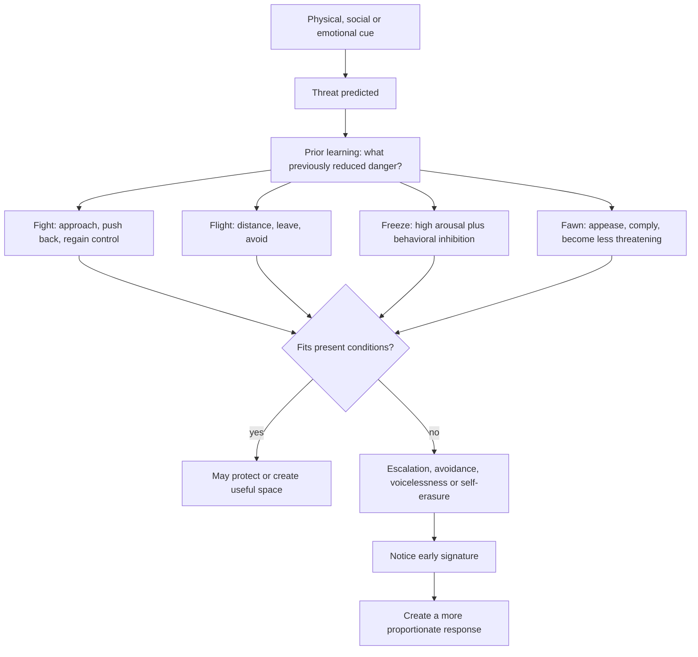

# Protective threat responses

Fight, flight, and freeze describe recurrent action patterns organized when the nervous system detects threat; fawn describes appeasement used to reduce interpersonal danger. They are functional categories, not fixed personalities or moral rankings. The same person may use different responses across contexts, and a response that once reduced danger can become costly when automatically reused in a safer present setting. (@DrTraceyMarks (Dr. Tracey Marks) — "Fight, Flight, Freeze, Fawn—Which One Is Your Pattern?", 2026-07-22, [link](https://www.youtube.com/watch?v=25kZd9Deums))

## Response selection and expression

**Fight** moves toward the threat through forceful correction, argument, interruption, rigidity, or an urgent effort to regain control; mobilization is not automatically aggression, though it can escalate harm. **Flight** creates distance by leaving, ending contact, changing the subject, distracting, or avoiding follow-up; apparently productive cleaning, work, or scrolling can serve the same distancing function. **Freeze** combines substantial internal arousal with inhibition, producing blankness, immobility, or loss of accessible words rather than simple calm or indifference. **Fawn** uses apology, agreement, pleasing, or self-minimization to reduce another person's perceived threat. (@DrTraceyMarks (Dr. Tracey Marks) — "Fight, Flight, Freeze, Fawn—Which One Is Your Pattern?", 2026-07-22, [link](https://www.youtube.com/watch?v=25kZd9Deums))

Fawn requires a taxonomic caveat: Tracey Marks describes it as clinically relevant and widely observed but not as settled a fourth category in the same sense as fight, flight, and freeze. Its defining distinction from generosity is constrained choice—automatic self-erasure under perceived threat rather than freely chosen care or compromise. This is a useful clinical framing, not evidence that four exhaustive, biologically discrete response systems have been established. (@DrTraceyMarks (Dr. Tracey Marks) — "Fight, Flight, Freeze, Fawn—Which One Is Your Pattern?", 2026-07-22, [link](https://www.youtube.com/watch?v=25kZd9Deums))

## Learning, mismatch, and choice

Response selection is history-dependent. If pushing back, escaping, remaining still, or appeasing previously reduced danger, the nervous system may prioritize that pattern before slower deliberation has evaluated the current situation. This can make a response appear disproportionate and explains why better options become visible only after arousal settles. The model is mechanistically plausible, but the source offers no comparative studies showing that each person's repertoire reduces to one or two stable defaults or that the proposed early-signature practice changes clinical outcomes. (@DrTraceyMarks (Dr. Tracey Marks) — "Fight, Flight, Freeze, Fawn—Which One Is Your Pattern?", 2026-07-22, [link](https://www.youtube.com/watch?v=25kZd9Deums))

Early signatures create a possible intervention point: chest heat, jaw tension, or interruption urges for fight; exit scanning or restlessness for flight; blankness or loss of words for freeze; and automatic apology, rapid agreement, or hyperfocus on another person's mood for fawn. Recognition does not require suppressing the response. It creates time to test whether the old protection fits the present and to use [[stress-threat-discrimination]] before acting. (@DrTraceyMarks (Dr. Tracey Marks) — "Fight, Flight, Freeze, Fawn—Which One Is Your Pattern?", 2026-07-22, [link](https://www.youtube.com/watch?v=25kZd9Deums))

## Practical implications

- **Per triggering episode: identify the earliest bodily, attentional, and behavioral signature — emerging/clinically plausible.** Name the response without treating it as identity, then check whether the situation is dangerous, merely demanding, or uncertain. (@DrTraceyMarks (Dr. Tracey Marks) — "Fight, Flight, Freeze, Fawn—Which One Is Your Pattern?", 2026-07-22, [link](https://www.youtube.com/watch?v=25kZd9Deums))
- **Practice one functionally equivalent alternative weekly and in low-stakes situations — emerging.** Replace escalating fight with a boundary, automatic flight with an explicit time-limited break, freeze with a request for time, or fawn with a delayed answer that preserves choice. The cadence and substitutions are practical extrapolations, not validated prescriptions. (@DrTraceyMarks (Dr. Tracey Marks) — "Fight, Flight, Freeze, Fawn—Which One Is Your Pattern?", 2026-07-22, [link](https://www.youtube.com/watch?v=25kZd9Deums))
- **Use protection when protection is warranted — strong as a safety principle.** Leaving, resisting, becoming still, or de-escalating may be adaptive in genuine danger; the goal is contextual flexibility, not abolishing defensive capacity. (@DrTraceyMarks (Dr. Tracey Marks) — "Fight, Flight, Freeze, Fawn—Which One Is Your Pattern?", 2026-07-22, [link](https://www.youtube.com/watch?v=25kZd9Deums))

## Gaps & open questions

- How stable are response tendencies across relationships, threat types, development, and culture?
- Does fawn represent a distinct response system, a family of learned appeasement behaviors, or overlap with other constructs?
- Which observable measures can distinguish freeze from dissociation, indecision, fatigue, or strategic silence?
- Do early-signature interventions improve safety, agency, or relationship outcomes, and for whom can self-monitoring increase distress?

## Related

[[stress-threat-discrimination]] · [[social-evaluative-threat-and-criticism]] · [[cognitive-reserve-and-brain-health]] · [[aging-model]] · [[practice-playbook]]
