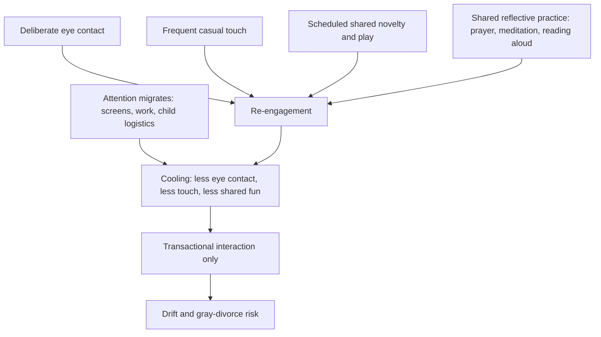

# Relationship maintenance and friendship

Close relationships are the strongest single correlate of late-life happiness and health in long-run cohort data: in Arthur Brooks's summary of the Harvard Study of Adult Development, the "happy-well" in old age had a strong marriage and/or close friendships, and parent–child bonds — asymmetric and subject to departure — did not substitute for peer love. This page covers the maintenance problem: relationships decay by default through inattention rather than rupture, and both partnerships and friendships respond to deliberate, scheduled work. Cohort association is not proof of causation, but the social-connection literature (including meta-analyses linking isolation to mortality) makes the direction of the recommendation low-risk. (FoundMyFitness — "How To Build Lasting Happiness | Dr. Arthur Brooks", 2026-03-24, [link](https://www.youtube.com/watch?v=IVVVvbfRiDo))

The public-health framing has hardened: the 2023 US Surgeon General advisory on loneliness and social isolation — reported as the first such advisory a US public-health officer has issued — characterized loneliness as a greater premature-mortality risk factor than smoking 15 cigarettes a day and more than twice the risk factor of obesity. These comparisons translate observational meta-analysis into rhetorically vivid equivalences and should not be read as measured dose-for-dose exchange rates; the reverse-causation objection (illness reduces socializing) is acknowledged by proponents, who argue bidirectionality on the strength of randomized connection-practice trials that move health-relevant biology such as inflammatory markers. One proposed mechanism for why connection helps: it redirects attention away from the self, and excessive self-focus is itself a robust correlate of psychological suffering. Trainable connection practices (appreciation, compassion, gratitude) and their trial evidence are covered at [[meditation-and-contemplative-training]]. (FoundMyFitness — "Meditation Does Far More Than Reduce Stress | Dr. Richard Davidson", 2026-08-26, [link](https://www.youtube.com/watch?v=3NiQF9_Vxi8))

## Drift, not rupture, is the default failure mode

In this framework the main threat to long partnerships is neither betrayal nor conflict but cooling — gradual disengagement of shared attention, accelerated when both partners live heavily online and their interaction narrows to logistics. Brooks connects this to the rise of "gray divorce" (divorce after 25+ years); the trend is documented demographically, the attentional explanation is expert interpretation. A companion failure mode is the child-centered marriage: when children are the only shared project, their departure leaves partners who have become transactional co-managers rather than friends. (FoundMyFitness — "How To Build Lasting Happiness | Dr. Arthur Brooks", 2026-03-24, [link](https://www.youtube.com/watch?v=IVVVvbfRiDo))

Brooks's four repair practices are eye contact during conversation, frequent casual (non-sexual) touch, deliberately scheduled shared fun, and a shared reflective or transcendent practice — praying, meditating, or reading aloud together, which he calls joint metacognition. He attaches sexed neurochemical rationales (eye contact acting through oxytocin, said to matter more to women; touch partly through vasopressin, said to matter more to men; a threefold female-male oxytocin difference) that should be treated as loose expert glosses on a contested hormone literature, not established quantitative physiology — he acknowledges on-air that the mechanisms are contested. The behavioral practices themselves are low-risk and align with couples-therapy emphases on attention, positive shared affect, and ritual; the source offers no trial of this specific four-part package. (FoundMyFitness — "How To Build Lasting Happiness | Dr. Arthur Brooks", 2026-03-24, [link](https://www.youtube.com/watch?v=IVVVvbfRiDo))

The search phase preceding any of this — deciding to look, absorbing its costs, meeting people, and the avoidance patterns that terminate promising starts before a bond forms — is treated separately at [[partner-search-and-dating-behavior]], which also records a converging recommendation from a different source: spend unstructured time with existing friends, partly because being present in others' networks is how introductions actually happen. (@maxlugavere (Max Lugavere) — "The BRUTAL Truth About Modern Dating", 2026-06-10, [link](https://www.youtube.com/watch?v=7bjB0obX-Og))

On partner choice, the framework distinguishes compatibility from complementarity: durable bonds form with someone alike in values but different enough to complete rather than mirror, whereas matching algorithms tend to optimize similarity. Brooks states that dating apps now account for about 62% of new long-term relationships — an uncited figure, roughly consistent with published how-couples-meet research showing online meeting as the leading channel — and recommends supplementing apps with interest-based in-person venues and deputized mutual friends, whose involvement also raises the social cost of bad behavior such as ghosting. Expert practical guidance, not trial evidence. (FoundMyFitness — "How To Build Lasting Happiness | Dr. Arthur Brooks", 2026-03-24, [link](https://www.youtube.com/watch?v=IVVVvbfRiDo))

## Real friends, deal friends, and the male friendship deficit

The framework's central distinction is between deal friends — useful, transactional, career-adjacent — and real friends, valued in themselves; in Brooks's formulation real friendship is "useless" in the sense that nothing worldly is exchanged. Perfect friendship in the Aristotelian sense is usually organized around a shared third love — an interest, practice, or faith — rather than around utility or mere proximity. Successful strivers can be socially saturated yet lonely because their portfolio is all deal friends. (FoundMyFitness — "How To Build Lasting Happiness | Dr. Arthur Brooks", 2026-03-24, [link](https://www.youtube.com/watch?v=IVVVvbfRiDo))

Men's friendships, in this account, atrophy with age because the institutional scaffolding (school, teams, dorms) disappears and men less often rebuild it; women's friendships tend to strengthen. Brooks repeats a statistic he explicitly flags as unsourceable — that for about 60% of 60-year-old men the best friend is their wife, while only about 30% of the wives reciprocate — and links the pattern to the observed excess vulnerability of widowed men, who can be left with no confidant at all. Treat the specific numbers as folklore-grade; the underlying pattern (smaller male confidant networks in later life, worse male bereavement outcomes) has support in the social-network and bereavement literatures. Retirement compounds the risk when work supplied all structure and contact. His remediation is unglamorous: take initiative, reconnect with dormant past friendships (a cold call or text is normally welcomed), schedule recurring contact, and treat the time as non-negotiable rather than residual. (FoundMyFitness — "How To Build Lasting Happiness | Dr. Arthur Brooks", 2026-03-24, [link](https://www.youtube.com/watch?v=IVVVvbfRiDo))

Solitude and isolation are distinct throughout: chosen solitude with a loved activity is framed as healthy; isolation is the unchosen absence of connection. (FoundMyFitness — "How To Build Lasting Happiness | Dr. Arthur Brooks", 2026-03-24, [link](https://www.youtube.com/watch?v=IVVVvbfRiDo))

## Practical implications

All items below are Investigational practice: expert-designed relationship habits with mechanistic and cohort-level rationale but no direct outcome trials in the source. They are low risk for ordinary relationships; abuse, coercion, or safety concerns are outside their scope and warrant professional or protective responses instead.

- **Daily in a partnership: deliberate eye contact during real conversation and frequent casual touch — Investigational practice.** (FoundMyFitness — "How To Build Lasting Happiness | Dr. Arthur Brooks", 2026-03-24, [link](https://www.youtube.com/watch?v=IVVVvbfRiDo))
- **Weekly: one scheduled block of genuinely shared fun (novel or playful, not logistics), plus one shared reflective practice — prayer, meditation, or reading aloud together — Investigational practice.** (FoundMyFitness — "How To Build Lasting Happiness | Dr. Arthur Brooks", 2026-03-24, [link](https://www.youtube.com/watch?v=IVVVvbfRiDo))
- **Before the nest empties: cultivate at least one shared non-child interest with a partner — Investigational practice with a clear cohort-level rationale.** (FoundMyFitness — "How To Build Lasting Happiness | Dr. Arthur Brooks", 2026-03-24, [link](https://www.youtube.com/watch?v=IVVVvbfRiDo))
- **Monthly: initiate contact with one real (non-instrumental) friend, including dormant ones; especially for men approaching retirement, build friendship structure before work structure disappears — Investigational practice; the isolation-mortality association it targets is well documented.** (FoundMyFitness — "How To Build Lasting Happiness | Dr. Arthur Brooks", 2026-03-24, [link](https://www.youtube.com/watch?v=IVVVvbfRiDo))
- **When seeking a partner: add interest-based in-person settings and ask trusted friends for introductions rather than relying on matching apps alone — Investigational practice.** (FoundMyFitness — "How To Build Lasting Happiness | Dr. Arthur Brooks", 2026-03-24, [link](https://www.youtube.com/watch?v=IVVVvbfRiDo))

## Gaps & open questions

- Do the four re-engagement practices improve relationship satisfaction in randomized or well-controlled designs, separately or as a package?
- How much of the marriage/friendship–health association is causal versus selection on health, temperament, and socioeconomic position?
- Does algorithmic matching on similarity actually reduce long-term bond quality relative to complementarity, or is the distinction post-hoc?
- Which friendship-rekindling behaviors work for men specifically, and what dose of contact maintains a confidant relationship?
- Are widowed men's worse outcomes driven by confidant loss, caregiving loss, health selection, or all three?

## Related

[[partner-search-and-dating-behavior]] · [[durable-well-being-and-hedonic-adaptation]] · [[meaning-boredom-and-technology]] · [[interpersonal-regulation-and-emotional-capacity]] · [[attachment-threat-and-relational-regulation]] · [[trust-repair-and-safety-learning]] · [[sexual-desire-arousal-and-aging]] · [[meditation-and-contemplative-training]] · [[arthur-brooks]] · [[cognitive-reserve-and-brain-health]] · [[practice-playbook]]
