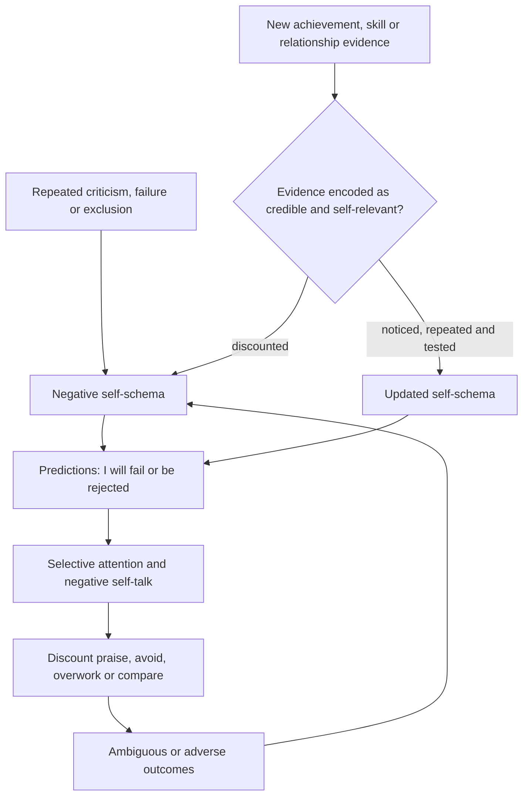

# Self-schema updating after achievement

A self-schema is a learned model of one’s traits, abilities, social value, and likely outcomes. Because it compresses repeated experience, it can lag behind changed circumstances: a person may become more capable or accepted while continuing to predict failure, rejection, or inadequacy. This is not proof that old beliefs are literally fixed neural roots; it is a learning model in which strong, early, frequent, or emotionally salient evidence can retain influence until enough credible counterevidence is noticed and used. (@MikeIsraetelMakingProgress (Mike Israetel) — "Why Success Still Feels Like Failure | Episode #159", 2026-07-30, [link](https://www.youtube.com/watch?v=lUwPaKZqId8))

## Why objective success may not feel subjectively real

Mike Israetel proposes two reinforcing mechanisms. First, many years of earlier failure, shame, criticism, or isolation may outweigh a shorter period of recent success, especially when the earlier learning occurred during development. Second, negative feedback may once have been frequent and explicit, whereas adult competence is often met with silence because others assume it is normal; the old belief thus continues receiving internally generated rehearsal while new evidence receives little attention. The transcript offers no neural measurements or longitudinal study, so the developmental-neuroplasticity explanation is a hypothesis rather than an established dose ratio. (@MikeIsraetelMakingProgress (Mike Israetel) — "Why Success Still Feels Like Failure | Episode #159", 2026-07-30, [link](https://www.youtube.com/watch?v=lUwPaKZqId8))

Negative self-talk can also be protected by a control belief: the person fears that self-criticism is what prevents regression. Yet the same critical voice may have been present before improvement, so coexistence does not show that it caused achievement. A more testable model asks whether criticism improves adherence and performance relative to specific planning, accurate feedback, and supportive accountability—and whether its costs include anxiety, avoidance, inability to savor progress, or burnout. (@MikeIsraetelMakingProgress (Mike Israetel) — "Why Success Still Feels Like Failure | Episode #159", 2026-07-30, [link](https://www.youtube.com/watch?v=lUwPaKZqId8))

This produces a real distinction rather than a contradiction: negative valence does not automatically make a thought dysfunctional. Wiersma’s functional criterion retains accurate corrective self-talk when it improves action and rejects both harsh global attacks and implausible positive claims when they do not. The contested practical question is therefore whether a given style supplies usable feedback or preserves shame and threat; the available transcripts offer frameworks but no head-to-head outcome evidence. (@drandygalpin (Andy Galpin) — "Tool for Reducing Negative Self-Talk | Dr. Andy Galpin &  Dr. Lenny Wiersma", 2026-07-17, [link](https://www.youtube.com/watch?v=Fr97nAnACMU))

## Updating requires credible counterevidence

Israetel’s protocol is deliberate positive self-acknowledgment: inspect real changes, view them from the perspective of one’s younger self, accept sincere compliments instead of reflexively rejecting them, and state specific positive conclusions repeatedly. He uniquely recommends mirror-based affirmations five to ten times, potentially daily, and interprets discomfort as a reason to practice. This may increase attention to disconfirmed beliefs, but the transcript does not demonstrate that mirror repetition re-architects neural networks, that cringe predicts need, or that generic praise is superior to evidence-specific reflection. (@MikeIsraetelMakingProgress (Mike Israetel) — "Why Success Still Feels Like Failure | Episode #159", 2026-07-30, [link](https://www.youtube.com/watch?v=lUwPaKZqId8))

Credibility matters. A statement such as having completed three planned training sessions is easier to integrate than an absolute global affirmation that conflicts with current belief. The learning loop is strongest when a prediction is specified, behavior generates observable evidence, and the interpretation is updated proportionally. This is a conservative implementation of the transcript's positive-self-talk proposal: it extends the thought–emotion–behavior model in [[mental-strength-and-behavioral-skills]] and avoids replacing harsh distortion with positive distortion. (@MikeIsraetelMakingProgress (Mike Israetel) — "Why Success Still Feels Like Failure | Episode #159", 2026-07-30, [link](https://www.youtube.com/watch?v=lUwPaKZqId8))

## Practical implications

- **Daily for two to four weeks: record one old prediction, one observable piece of current counterevidence, and a calibrated updated belief — moderate as a cognitive-learning practice; the exact protocol is untested here.** Prefer specific claims over global worth judgments.
- **When receiving genuine praise: acknowledge it without immediate denial and note the behavior or change it refers to — plausible, limited evidence in the source.** Do not make social approval the sole measure of worth.
- **At milestones: deliberately savor progress and compare with a relevant past baseline — plausible and linked to [[durable-well-being-and-hedonic-adaptation]].** Continue using goals and feedback; self-acknowledgment need not imply superiority or complacency.
- **If trying mirror affirmations: treat them as an optional experiment, not a proven neural treatment — very limited evidence.** Stop or modify the exercise if it intensifies shame, compulsive checking, body-image symptoms, or distress.
- **Seek professional help when entrenched worthlessness, trauma symptoms, depression, disordered eating, or body dysmorphia impairs function or safety — strong clinical-safety principle.** Self-praise is not a substitute for assessment or evidence-based care.

## Gaps & open questions

- Which forms of self-affirmation update negative self-beliefs, and which backfire because they are too discrepant or feel coerced?
- How much of self-schema persistence reflects attention and memory versus social environment, depression, trauma, or body-image pathology?
- Does reducing negative self-talk preserve motivation when paired with concrete planning and accountability?
- What cadence and duration of evidence logging, savoring, or imagery produces durable generalization?
- Do self-perception gains transfer across body image, academic competence, relationships, and work, or remain domain-specific?

## Related

[[durable-well-being-and-hedonic-adaptation]] · [[mental-strength-and-behavioral-skills]] · [[social-evaluative-threat-and-criticism]] · [[stress-threat-discrimination]] · [[practice-playbook]]
