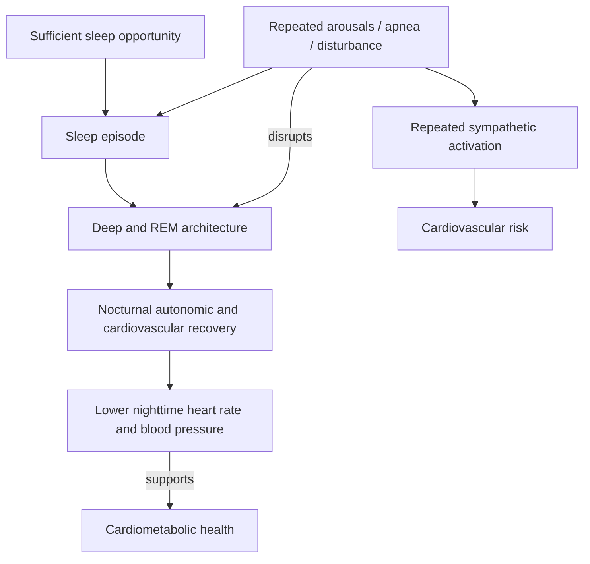
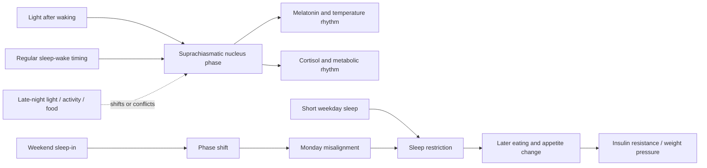

# Sleep quality and circadian alignment

Sleep health has at least three separable dimensions: sufficient duration, continuity and architecture, and alignment between sleep timing and the circadian system. Eight hours in bed does not guarantee restorative sleep if repeated arousals fragment deep or rapid-eye-movement sleep, and a full-duration episode can still be mistimed relative to internal physiology. Symptoms such as unrefreshing sleep and daytime sleepiness are useful signals, but they do not identify the cause; objective assessment may be needed for disorders such as sleep apnea. (@NutritionMadeSimple (Nutrition Made Simple!) — "The #1 WORST Sleep Mistake Destroying Your Heart", 2026-05-21, [link](https://www.youtube.com/watch?v=2BAX8mJ27gA))

## Continuity, architecture, and cardiovascular recovery

Polysomnography can detect arousals and sleep stages that a sleeper does not remember. Large prospective studies summarized in the source associate objectively measured sleep fragmentation with cardiovascular mortality even after matching sleep duration; the association was especially large in women, reaching roughly twice the risk in the most affected comparison. This is stronger than self-report alone but remains observational for mortality: fragmentation may be causal, a marker of apnea or illness, or both. (@NutritionMadeSimple (Nutrition Made Simple!) — "The #1 WORST Sleep Mistake Destroying Your Heart", 2026-05-21, [link](https://www.youtube.com/watch?v=2BAX8mJ27gA))

## Circadian alignment and social jet lag

The suprachiasmatic nucleus coordinates daily rhythms in melatonin, cortisol, metabolism, temperature, and cardiovascular function using light and other time cues. Circadian misalignment occurs when behavior repeatedly demands wake, food intake, or activity during the biological night and sleep during the biological day. Short forced-desynchrony or schedule-inversion experiments increase blood pressure, inflammatory markers, and insulin resistance; some effects accompany shorter sleep, while others persist after accounting for duration. Long-term shift-work associations strengthen concern but cannot fully remove occupational and lifestyle confounding. (@NutritionMadeSimple (Nutrition Made Simple!) — "The #1 WORST Sleep Mistake Destroying Your Heart", 2026-05-21, [link](https://www.youtube.com/watch?v=2BAX8mJ27gA))

Social jet lag is the recurring difference between workday and free-day timing. In a short experiment summarized by the source, five nights restricted to five hours increased late eating, weight, and insulin resistance; two recovery nights did not prevent similar metabolic deterioration when restriction resumed. This does not show that recovery sleep has no value after an isolated loss. It shows that a repeating restriction–catch-up cycle did not reproduce the metabolic state of consistently adequate sleep under that protocol. (@NutritionMadeSimple (Nutrition Made Simple!) — "The #1 WORST Sleep Mistake Destroying Your Heart", 2026-05-21, [link](https://www.youtube.com/watch?v=2BAX8mJ27gA)) [[visceral-and-ectopic-fat]]

## Chronotype versus imposed schedule

Chronotype is the partly genetic tendency toward earlier or later sleep and activity. Late chronotype is observationally associated with several adverse outcomes, but it also correlates with smoking, alcohol use, lower activity, obesity, and conflict with early social schedules. A cohort of roughly 65,000 nurses summarized in the source found diabetes risk depended on the match between chronotype and work schedule: early types were at greater risk with prolonged night work, while late types were at greater risk on daytime schedules. The distinctive, still unsettled interpretation is that schedule–chronotype conflict may be more harmful than late timing itself. Evidence supports consistency and adequate duration more strongly than forcing every person onto the same clock time. (@NutritionMadeSimple (Nutrition Made Simple!) — "The #1 WORST Sleep Mistake Destroying Your Heart", 2026-05-21, [link](https://www.youtube.com/watch?v=2BAX8mJ27gA))

## Practical implications

- **Daily: keep bedtime and wake time within roughly a 30–60-minute window while preserving adequate sleep opportunity — moderate.** Occasional deviations matter less than a recurring weekday/weekend oscillation. Adapt clock time to chronotype and obligations where feasible. (@NutritionMadeSimple (Nutrition Made Simple!) — "The #1 WORST Sleep Mistake Destroying Your Heart", 2026-05-21, [link](https://www.youtube.com/watch?v=2BAX8mJ27gA))
- **After waking: obtain outdoor light within roughly the first hour — moderate for circadian entrainment.** The exact dose depends on brightness, season, latitude, and individual phase. (@NutritionMadeSimple (Nutrition Made Simple!) — "The #1 WORST Sleep Mistake Destroying Your Heart", 2026-05-21, [link](https://www.youtube.com/watch?v=2BAX8mJ27gA))
- **In the last hours before bed: dim bright light, avoid alcohol as a sleep aid, stop caffeine at least about eight hours before bed if sleep is impaired, and avoid individually disruptive large meals or intense exercise — moderate overall, with heterogeneous effect sizes.** A dark, quiet, comfortably cool room supports sleep onset and continuity; 17–20°C (63–68°F) is a starting range, not a universal prescription. (@NutritionMadeSimple (Nutrition Made Simple!) — "The #1 WORST Sleep Mistake Destroying Your Heart", 2026-05-21, [link](https://www.youtube.com/watch?v=2BAX8mJ27gA))
- **If time awake in bed becomes prolonged: use stimulus control consistently — strong within behavioral insomnia treatment.** Go to bed when sleepy, leave bed during sustained wakefulness for a low-stimulation activity in dim light, and return when sleepy; use the bed principally for sleep and sex. [[pre-sleep-routines-and-stimulus-control]] (@NutritionMadeSimple (Nutrition Made Simple!) — "The #1 WORST Sleep Mistake Destroying Your Heart", 2026-05-21, [link](https://www.youtube.com/watch?v=2BAX8mJ27gA))
- **When sleep remains unrefreshing despite adequate opportunity, or when morning headaches or daytime sleepiness persist: seek evaluation rather than adding more time in bed — strong clinical precaution.** Sleep apnea commonly fragments sleep without remembered awakenings and requires cause-directed treatment. (@NutritionMadeSimple (Nutrition Made Simple!) — "The #1 WORST Sleep Mistake Destroying Your Heart", 2026-05-21, [link](https://www.youtube.com/watch?v=2BAX8mJ27gA))

## Gaps & open questions

- How much of fragmentation-associated cardiovascular mortality is mediated by apnea, autonomic activation, inflammation, or underlying disease?
- What degree of day-to-day timing variability is clinically meaningful across chronotypes and ages?
- Can long-term schedule matching reduce disease risk in shift workers, and which workplace changes are feasible?
- Which recovery-sleep patterns reverse which consequences of acute versus chronic restriction?
- How should light timing and intensity be personalized for late chronotype, seasonal variation, and eye disease?
- What bedroom temperature range optimizes sleep without sacrificing comfort or safety for different people?

## Related

[[pre-sleep-routines-and-stimulus-control]] · [[visceral-and-ectopic-fat]] · [[cardiorespiratory-fitness]] · [[proactive-health-monitoring]] · [[aging-model]] · [[practice-playbook]]
