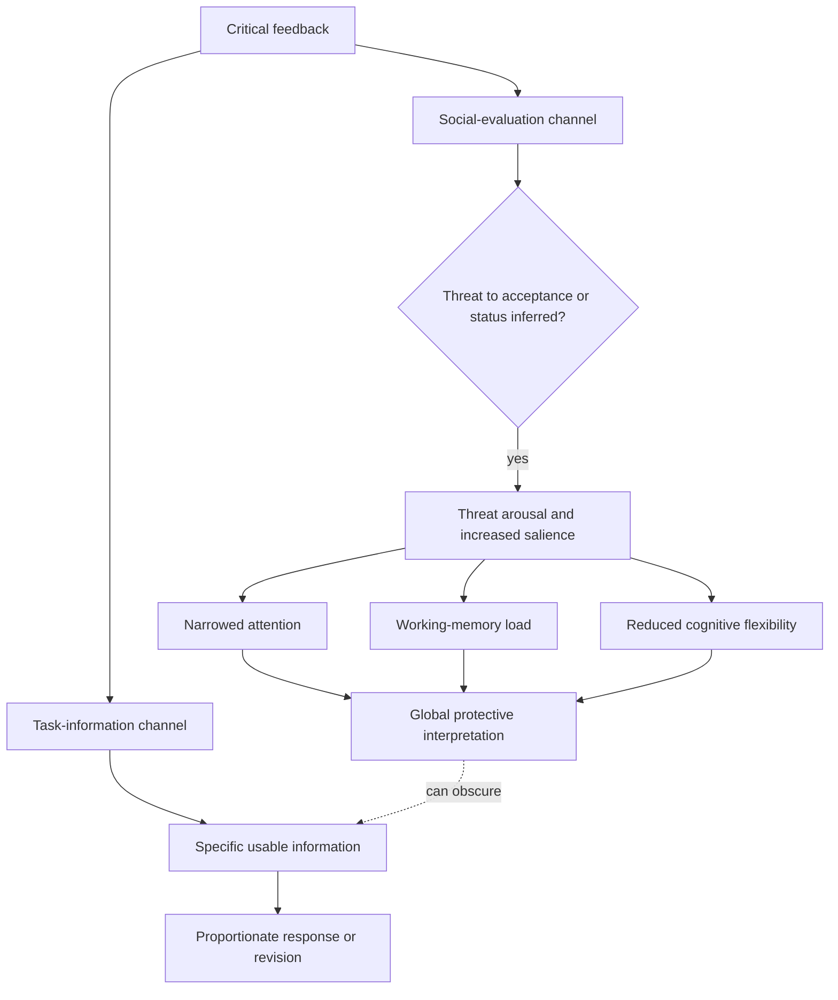

# Social-evaluative threat and criticism

Social-evaluative threat is the stress produced when a person expects negative judgment by others. Criticism can therefore carry two signals at once: task information about a behavior or result, and a social inference about acceptance, competence, trustworthiness, or status. The signals need not agree. A comment may accurately identify a weak paragraph while the recipient additionally infers a global judgment about personal worth or future standing. (@DrTraceyMarks (Dr. Tracey Marks) — "The Reason You Can't Stop Thinking About That Insult", 2026-08-05, [link](https://www.youtube.com/watch?v=x2oU1eskv0M))

## Mechanism: from evaluation to narrowed interpretation

Salience is priority, not truth. When criticism is tagged as consequential for belonging or status, attention may lock onto the negative sentence before its accuracy has been assessed. Under sufficiently high arousal, working memory has less room to hold mixed propositions and cognitive flexibility has less room to compare interpretations; a bounded observation can then collapse into a global conclusion such as failure or rejection. This account explains why evaluation may be more destabilizing than the difficulty of the work itself and why public feedback can feel more threatening than the same information delivered privately. The source presents the mechanism as applied neuroscience but supplies no named study, effect size, or boundary conditions, so the evidentiary strength of the full chain is **plausible but unquantified in this corpus**. (@DrTraceyMarks (Dr. Tracey Marks) — "The Reason You Can't Stop Thinking About That Insult", 2026-08-05, [link](https://www.youtube.com/watch?v=x2oU1eskv0M))

The bodily and attentional response can arrive before deliberate interpretation: facial heat, jaw tension, abdominal constriction, an urge to flee or argue, loss of the rest of the conversation, or rehearsal of a defense while the other person is still speaking. These signs do not establish that the criticism is wrong or that the environment is safe; they indicate that evaluation has recruited a protective mode related to [[protective-threat-responses]]. (@DrTraceyMarks (Dr. Tracey Marks) — "The Reason You Can't Stop Thinking About That Insult", 2026-08-05, [link](https://www.youtube.com/watch?v=x2oU1eskv0M))

## Separating information from identity inference

A useful analysis distinguishes four questions. First, what observable words were actually said? Second, what conclusion did the mind add about identity, relationship, or future? Third, is there a specific behavior, decision, or output that can be inspected or changed? Fourth, does anything require an immediate response? This converts a broad social alarm into a bounded decision without assuming that all criticism is valid or benign. Asking for the unclear part, or delaying a non-urgent response until arousal falls, can improve specificity and reduce defensive over-response. This is a proposed self-regulation protocol with **clinically plausible but not trial-established evidence in the supplied source**. (@DrTraceyMarks (Dr. Tracey Marks) — "The Reason You Can't Stop Thinking About That Insult", 2026-08-05, [link](https://www.youtube.com/watch?v=x2oU1eskv0M))

This distinction also prevents two opposite errors. Treating every painful reaction as proof of mistreatment confuses arousal with external evidence; treating every criticism as useful information ignores humiliation, coercion, bias, and genuinely unsafe relationships. [[stress-threat-discrimination]] requires checking present facts and power conditions, not reflexively relabeling danger as ordinary stress. (@DrTraceyMarks (Dr. Tracey Marks) — "Your Brain Is Misinterpreting Stress as Danger", 2026-07-29, [link](https://www.youtube.com/watch?v=1v5lDzKAPz0))

## Practical implications

- **At each noticeable criticism response: pause and separate the four questions above — emerging/clinically plausible.** Record the exact feedback before interpreting motive; identify one usable item; ask for specificity or defer a non-urgent answer until attention broadens. (@DrTraceyMarks (Dr. Tracey Marks) — "The Reason You Can't Stop Thinking About That Insult", 2026-08-05, [link](https://www.youtube.com/watch?v=x2oU1eskv0M))
- **After important feedback: revisit it once calm — emerging.** Check whether the global identity story is supported, whether a concrete revision is warranted, and whether the delivery itself crossed a boundary. The source does not establish an optimal delay or show that the protocol improves outcomes. (@DrTraceyMarks (Dr. Tracey Marks) — "The Reason You Can't Stop Thinking About That Insult", 2026-08-05, [link](https://www.youtube.com/watch?v=x2oU1eskv0M))
- **When criticism is coercive, discriminatory, threatening, or part of chronic harm: prioritize support, boundaries, protection, or environmental change — strong as a safety principle, not an effect estimate.** Cognitive reframing is not a substitute for responding to real danger. (@DrTraceyMarks (Dr. Tracey Marks) — "Your Brain Is Misinterpreting Stress as Danger", 2026-07-29, [link](https://www.youtube.com/watch?v=1v5lDzKAPz0))

## Gaps & open questions

- How accurately do bodily and attentional signs distinguish social-evaluative threat from justified concern about real consequences?
- Which parts of the four-question protocol improve comprehension, emotion regulation, or relationship outcomes in controlled studies?
- How do trauma history, workplace power, culture, neurodivergence, and public versus private delivery change the response?
- When does delaying a reply improve judgment, and when does it worsen avoidance or leave urgent harm unaddressed?

## Related

[[stress-threat-discrimination]] · [[protective-threat-responses]] · [[cognitive-reserve-and-brain-health]] · [[aging-model]] · [[practice-playbook]]
