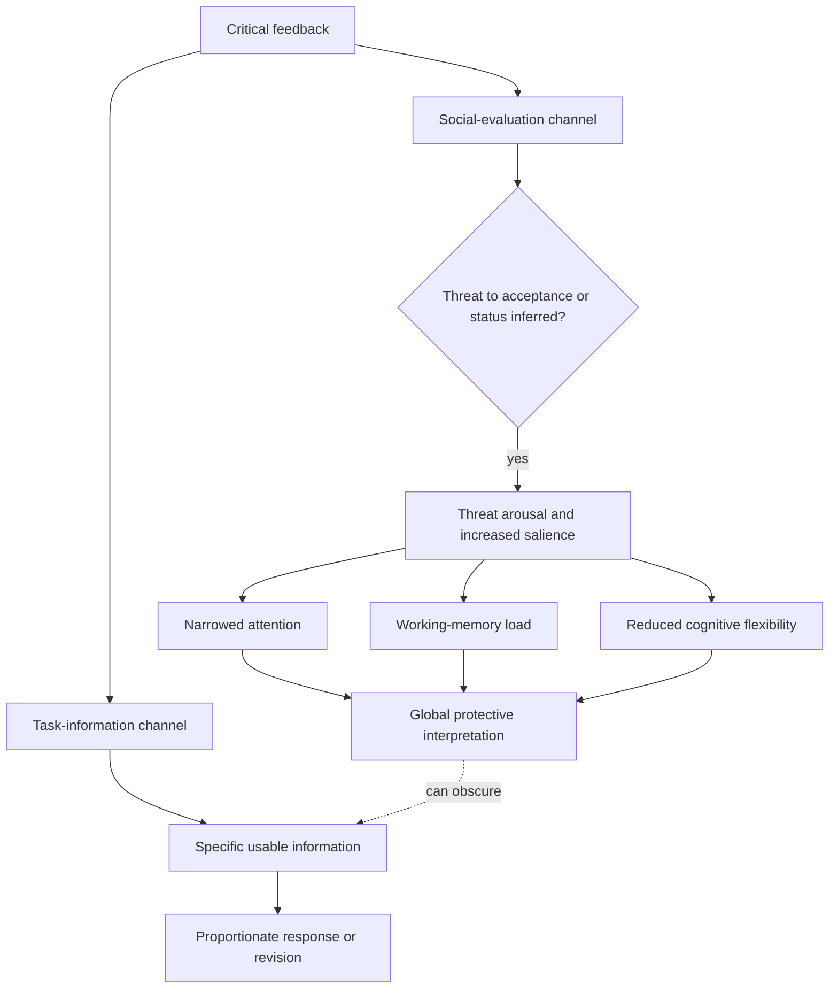
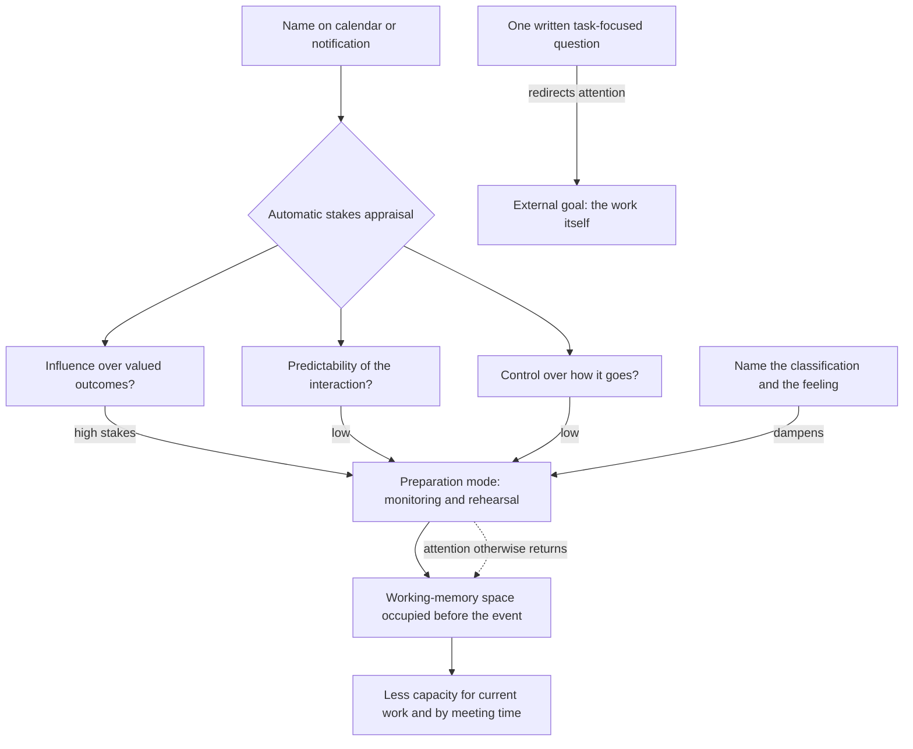

# Social-evaluative threat and criticism

Social-evaluative threat is the stress produced when a person expects negative judgment by others. Criticism can therefore carry two signals at once: task information about a behavior or result, and a social inference about acceptance, competence, trustworthiness, or status. The signals need not agree. A comment may accurately identify a weak paragraph while the recipient additionally infers a global judgment about personal worth or future standing. (@DrTraceyMarks (Dr. Tracey Marks) — "The Reason You Can't Stop Thinking About That Insult", 2026-08-05, [link](https://www.youtube.com/watch?v=x2oU1eskv0M))

## Mechanism: from evaluation to narrowed interpretation

```mermaid
flowchart TD
  C[Critical feedback] --> I[Task-information channel]
  C --> S[Social-evaluation channel]
  S --> T{Threat to acceptance or status inferred?}
  T -->|yes| A[Threat arousal and increased salience]
  A --> N[Narrowed attention]
  A --> W[Working-memory load]
  A --> F[Reduced cognitive flexibility]
  N --> G[Global protective interpretation]
  W --> G
  F --> G
  I --> U[Specific usable information]
  G -. can obscure .-> U
  U --> R[Proportionate response or revision]
```

Salience is priority, not truth. When criticism is tagged as consequential for belonging or status, attention may lock onto the negative sentence before its accuracy has been assessed. Under sufficiently high arousal, working memory has less room to hold mixed propositions and cognitive flexibility has less room to compare interpretations; a bounded observation can then collapse into a global conclusion such as failure or rejection. This account explains why evaluation may be more destabilizing than the difficulty of the work itself and why public feedback can feel more threatening than the same information delivered privately. The source presents the mechanism as applied neuroscience but supplies no named study, effect size, or boundary conditions, so the evidentiary strength of the full chain is **plausible but unquantified in this corpus**. (@DrTraceyMarks (Dr. Tracey Marks) — "The Reason You Can't Stop Thinking About That Insult", 2026-08-05, [link](https://www.youtube.com/watch?v=x2oU1eskv0M))

Evaluative threat also taxes cognition when no explicit criticism is delivered. Anticipating judgment converts a conversation into a dual-monitoring task — one stream scanning others for signs of judgment, a second supervising one's own voice, face, posture, and visible anxiety — both running above the conversation itself and drawing on the same working memory needed to follow it; this ongoing cost, not any single critical comment, explains much of the exhaustion that follows evaluative social settings ([[interpersonal-regulation-and-emotional-capacity]]). The asymmetric persistence of negative cues has a memory-level correlate: in some visual working-memory research, angry or fearful faces were remembered better than neutral or happy ones, consistent with one ambiguous or displeased expression outlasting many warm ones in the post-event replay. (@DrTraceyMarks (Dr. Tracey Marks) — "The Real Reason You're Exhausted After Talking to People", 2026-08-19, [link](https://www.youtube.com/watch?v=G8SMB-2m6tY))

The bodily and attentional response can arrive before deliberate interpretation: facial heat, jaw tension, abdominal constriction, an urge to flee or argue, loss of the rest of the conversation, or rehearsal of a defense while the other person is still speaking. These signs do not establish that the criticism is wrong or that the environment is safe; they indicate that evaluation has recruited a protective mode related to [[protective-threat-responses]]. (@DrTraceyMarks (Dr. Tracey Marks) — "The Reason You Can't Stop Thinking About That Insult", 2026-08-05, [link](https://www.youtube.com/watch?v=x2oU1eskv0M))

## Anticipatory evaluative threat: the cost estimate before the interaction

Evaluative threat does not require an evaluator to be present. Seeing a name on a calendar or a sender in an inbox can start the stress response hours or a day before any contact, because the brain runs a rapid, largely unconscious appraisal of what being around that person will cost. The appraisal is not about rank or likability: a person can feel at ease with the most senior figure in an organization if that figure is predictable and uninvolved in outcomes they care about, and simultaneously feel braced around someone they genuinely like whose opinion carries consequence. What the appraisal tracks is stakes — how much this person can influence a valued outcome (an evaluation, a resource, a next opportunity), how predictable the interaction is, and how much control one has over how it goes. A history of being misread or having one's words turned against one in past interactions with the same person teaches the system to prepare even earlier. The consequences of an audience's judgment need not be negative to trigger the response: wanting to be received well by strangers whose opinions have influence (a conference audience, for example) engages the same machinery. (@DrTraceyMarks (Dr. Tracey Marks) — "Why Some People Drain You Before You Even See Them", 2026-09-02, [link](https://www.youtube.com/watch?v=x4wEpHMlJpI))

```mermaid
flowchart TD
  CUE[Name on calendar or notification] --> APP{Automatic stakes appraisal}
  APP --> INF[Influence over valued outcomes?]
  APP --> PRED[Predictability of the interaction?]
  APP --> CTRL[Control over how it goes?]
  INF -->|high stakes| PREP[Preparation mode: monitoring and rehearsal]
  PRED -->|low| PREP
  CTRL -->|low| PREP
  PREP --> WM[Working-memory space occupied before the event]
  WM --> COST[Less capacity for current work and by meeting time]
  LABEL[Name the classification and the feeling] -->|dampens| PREP
  Q[One written task-focused question] -->|redirects attention| WORK[External goal: the work itself]
  PREP -. attention otherwise returns .-> WM
```

The preparation itself is the cost. Resources shift from general thinking and problem-solving to monitoring — reading the situation, rehearsing one's performance, forecasting questions and pauses — and because attention is limited, this leaves less capacity for current work and for spontaneous thinking. The working-memory picture is a desk already covered with the files of today's tasks onto which the mind stacks files for a meeting that has not happened yet and is not needed until tomorrow. By the time the interaction actually begins, hours of anticipatory vigilance may have already spent much of the capacity the interaction requires. The source states that research identifies two situational features producing the largest stress responses — being evaluated by others and having little control over the outcome — but names no study, so the claim's grounding is presented rather than examined in this corpus. The framing throughout is predictive-processing: the alert is a forecast produced outside conscious control, not a reaction to anything that has occurred, and reacting this way is not evidence of low confidence or oversensitivity — though sensitivity to evaluation can be heightened by a history of consequential scrutiny or criticism. (@DrTraceyMarks (Dr. Tracey Marks) — "Why Some People Drain You Before You Even See Them", 2026-09-02, [link](https://www.youtube.com/watch?v=x4wEpHMlJpI))

Two countermeasures are proposed, both aimed at bounding the anticipation's cognitive cost rather than eliminating preparation, which sometimes serves a real function. First, affect labeling: on noticing the shift, name what happened — that the brain has classified this interaction as consequential — and optionally name the feeling it produces. The claimed mechanism is that quiet, unacknowledged threat loops run stronger than explicitly stated ones, so labeling slows the spiral without pretending to stop it; recognizing the reaction as the brain's prediction rather than one's own choice also reduces identification with it. Second, attention needs a destination or it returns to the loop: write one question — a single question, not a page of bullet points — that points at the work rather than at one's performance (what decision has to be made today; which part of the proposal matters to them; what information is needed before the next step). These are the same emotional-labeling and attention-allocation tools Marks applies to in-conversation drain ([[interpersonal-regulation-and-emotional-capacity]]), extended earlier in time to the anticipation window. Neither has outcome-trial support in the supplied source, and the available transcript for this video is an auto-translated caption track, so all wording here is paraphrase. (@DrTraceyMarks (Dr. Tracey Marks) — "Why Some People Drain You Before You Even See Them", 2026-09-02, [link](https://www.youtube.com/watch?v=x4wEpHMlJpI))

## Separating information from identity inference

A useful analysis distinguishes four questions. First, what observable words were actually said? Second, what conclusion did the mind add about identity, relationship, or future? Third, is there a specific behavior, decision, or output that can be inspected or changed? Fourth, does anything require an immediate response? This converts a broad social alarm into a bounded decision without assuming that all criticism is valid or benign. Asking for the unclear part, or delaying a non-urgent response until arousal falls, can improve specificity and reduce defensive over-response. This is a proposed self-regulation protocol with **clinically plausible but not trial-established evidence in the supplied source**. (@DrTraceyMarks (Dr. Tracey Marks) — "The Reason You Can't Stop Thinking About That Insult", 2026-08-05, [link](https://www.youtube.com/watch?v=x2oU1eskv0M))

This distinction also prevents two opposite errors. Treating every painful reaction as proof of mistreatment confuses arousal with external evidence; treating every criticism as useful information ignores humiliation, coercion, bias, and genuinely unsafe relationships. [[stress-threat-discrimination]] requires checking present facts and power conditions, not reflexively relabeling danger as ordinary stress. (@DrTraceyMarks (Dr. Tracey Marks) — "Your Brain Is Misinterpreting Stress as Danger", 2026-07-29, [link](https://www.youtube.com/watch?v=1v5lDzKAPz0))

## Practical implications

- **At each noticeable criticism response: pause and separate the four questions above — emerging/clinically plausible.** Record the exact feedback before interpreting motive; identify one usable item; ask for specificity or defer a non-urgent answer until attention broadens. (@DrTraceyMarks (Dr. Tracey Marks) — "The Reason You Can't Stop Thinking About That Insult", 2026-08-05, [link](https://www.youtube.com/watch?v=x2oU1eskv0M))
- **After important feedback: revisit it once calm — emerging.** Check whether the global identity story is supported, whether a concrete revision is warranted, and whether the delivery itself crossed a boundary. The source does not establish an optimal delay or show that the protocol improves outcomes. (@DrTraceyMarks (Dr. Tracey Marks) — "The Reason You Can't Stop Thinking About That Insult", 2026-08-05, [link](https://www.youtube.com/watch?v=x2oU1eskv0M))
- **When criticism is coercive, discriminatory, threatening, or part of chronic harm: prioritize support, boundaries, protection, or environmental change — strong as a safety principle, not an effect estimate.** Cognitive reframing is not a substitute for responding to real danger. (@DrTraceyMarks (Dr. Tracey Marks) — "Your Brain Is Misinterpreting Stress as Danger", 2026-07-29, [link](https://www.youtube.com/watch?v=1v5lDzKAPz0))
- **When a calendar entry or notification triggers pre-interaction dread: name the classification (the brain has tagged this as consequential) and the feeling, then write one task-focused question to anchor attention — investigational practice.** The aim is to bound anticipatory vigilance's working-memory cost, not to skip genuinely needed preparation; no outcome trial supports the specific protocol. (@DrTraceyMarks (Dr. Tracey Marks) — "Why Some People Drain You Before You Even See Them", 2026-09-02, [link](https://www.youtube.com/watch?v=x4wEpHMlJpI))

## Gaps & open questions

- How accurately do bodily and attentional signs distinguish social-evaluative threat from justified concern about real consequences?
- Which parts of the four-question protocol improve comprehension, emotion regulation, or relationship outcomes in controlled studies?
- How do trauma history, workplace power, culture, neurodivergence, and public versus private delivery change the response?
- When does delaying a reply improve judgment, and when does it worsen avoidance or leave urgent harm unaddressed?
- How accurate are automatic stakes appraisals — do the people who trigger the most anticipatory threat actually influence outcomes more — and does affect labeling measurably reduce anticipatory working-memory load or next-day performance cost?

## Related

[[stress-threat-discrimination]] · [[protective-threat-responses]] · [[interpersonal-regulation-and-emotional-capacity]] · [[executive-function-under-social-stress]] · [[catastrophizing-and-uncertainty]] · [[trust-repair-and-safety-learning]] · [[cognitive-reserve-and-brain-health]] · [[tracey-marks]] · [[aging-model]] · [[practice-playbook]]
