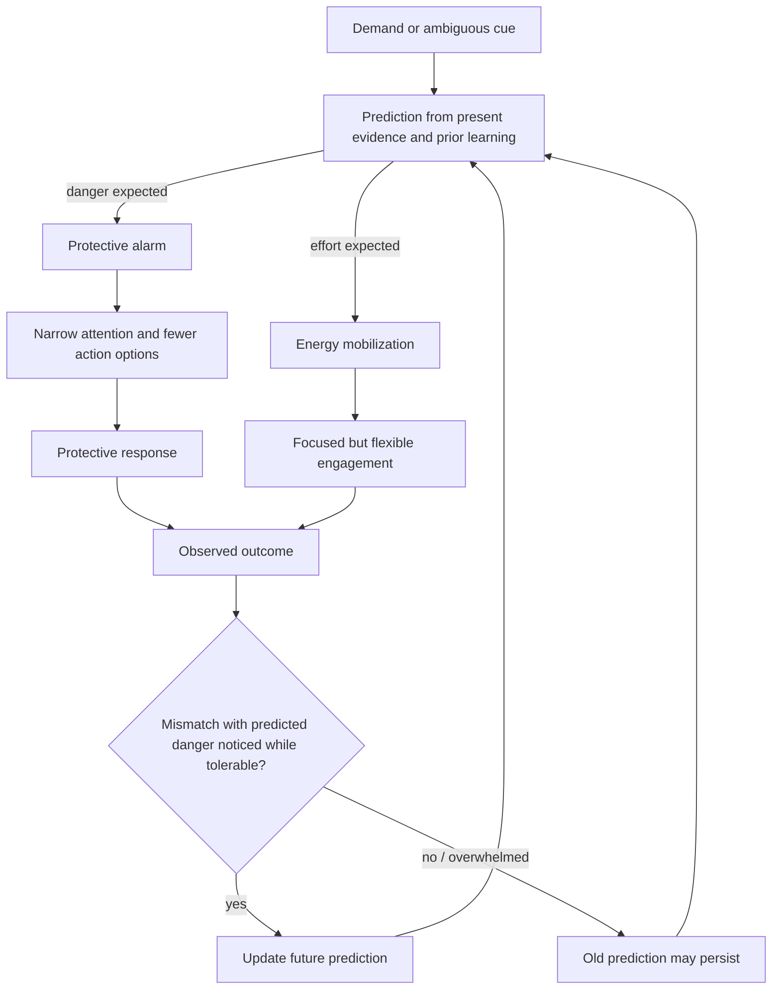
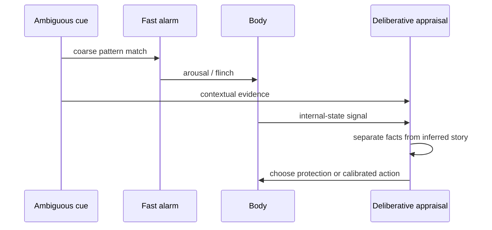
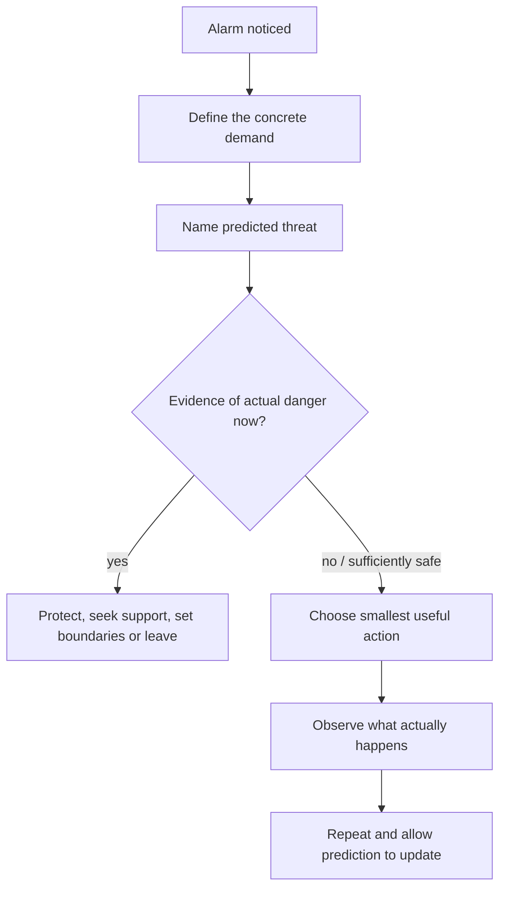

# Stress-threat discrimination

Stress is a demand that requires effort; threat is an appraisal that safety is at risk. Both can mobilize heart rate, breathing, and muscle tension, so bodily activation alone cannot reliably classify the situation. The distinction depends on what the nervous system predicts the demand means: preparation for effort can preserve flexible engagement, whereas preparation for danger tends to narrow attention and favor protection, avoidance, attack, or shutdown. (@DrTraceyMarks (Dr. Tracey Marks) — "Your Brain Is Misinterpreting Stress as Danger", 2026-07-29, [link](https://www.youtube.com/watch?v=1v5lDzKAPz0))

## Predictive appraisal and updating

Threat processing is asymmetric in time. Rapid pattern matching can initiate autonomic arousal and a protective movement before slower interpretation has assembled the facts; under stress, narrowed attention then makes the first danger-consistent story unusually available. This timing advantage is protective when a snake-like shape may be a snake, but it also means the reaction is evidence that an alarm fired, not evidence that the alarm's explanation is correct. Logic is delayed rather than absent. (@DrTraceyMarks (Dr. Tracey Marks) — "Why Stress Hits Before Logic Can Catch Up", 2026-07-08, [link](https://www.youtube.com/watch?v=MP-l3L6qb7s))

An ordinary deadline can remain a demand for time and planning, or become a perceived threat when it is linked to humiliation, rejection, exposure as incompetent, or loss of control. In this model, a high-alert system responds not only to the present event but to a rapidly predicted consequence. The mobilized sensations are real even when the predicted danger is overstated. Conversely, chronic overload, trauma, or an unsafe environment can make the danger appraisal accurate; the model does not imply that all distress is a cognitive error. (@DrTraceyMarks (Dr. Tracey Marks) — "Your Brain Is Misinterpreting Stress as Danger", 2026-07-29, [link](https://www.youtube.com/watch?v=1v5lDzKAPz0))

Automatic threat appraisal continuously combines external cues—tone, facial expression, posture, silence, and incomplete information—with internal cues such as bodily sensations and memory fragments. Because the cost of a missed danger can exceed the cost of a false alarm, a protective system can rationally favor sensitivity over perfect specificity. Ambiguity therefore becomes a reason to attend rather than proof of safety or danger. The resulting bodily state is genuine, but its first interpretation is a prediction assembled from partial current evidence and prior learning, not a direct measurement of the environment. (@DrTraceyMarks (Dr. Tracey Marks) — "Why Your Body Freaks Out When Nothing's Wrong", 2026-07-01, [link](https://www.youtube.com/watch?v=nWmTKnuDDbA))

This asymmetry explains why an innocuous present cue can retrieve an old danger model. A short request to talk may produce bracing when similar requests previously preceded criticism, even in a safer relationship or workplace. Once arousal narrows attention, danger-consistent details receive priority and alternatives become harder to notice, creating a feedback loop in which the prediction shapes the evidence sampled. Marks's distinctive framing is that protection and accuracy are separate objectives: respecting the alarm means interpreting it, not automatically obeying or dismissing it. (@DrTraceyMarks (Dr. Tracey Marks) — "Why Your Body Freaks Out When Nothing's Wrong", 2026-07-01, [link](https://www.youtube.com/watch?v=nWmTKnuDDbA))

The proposed learning mechanism is prediction error: repeated, tolerable experiences in which anticipated danger does not fully occur provide evidence that can revise future expectations. Verbal reassurance may reduce distress temporarily, but the source's distinctive position is that experience is the primary updater. The exposure must remain manageable enough for the person to notice the outcome; an overwhelming encounter may consolidate only that the situation was intolerable. This is consistent with a learning-based framework, but the transcript provides no direct trials comparing this sequence with reassurance, exposure therapy, or other treatments, so its therapeutic evidence here is **emerging and indirect**. (@DrTraceyMarks (Dr. Tracey Marks) — "Your Brain Is Misinterpreting Stress as Danger", 2026-07-29, [link](https://www.youtube.com/watch?v=1v5lDzKAPz0))

## A real-time discrimination sequence

The sequence is: notice the alarm's bodily onset; state the concrete demand; name the catastrophe being predicted; identify present evidence about safety, capacity, and actual danger; then take the smallest useful next step. A small action—reading the message once, asking one clarifying question, or requesting a minute—generates new information while retaining enough deliberative capacity to observe it. Repetition matters more than eliminating the first wave of arousal. (@DrTraceyMarks (Dr. Tracey Marks) — "Your Brain Is Misinterpreting Stress as Danger", 2026-07-29, [link](https://www.youtube.com/watch?v=1v5lDzKAPz0))

At the earliest stage, a shorter bridge is useful: label the event as an initial flinch, ask what is actually known, and delay interpretation long enough for contextual processing to catch up. The label separates a real physiological response from the story added after it; it is not forced positivity and does not require declaring the situation safe. This protocol is mechanistically plausible and consistent with the broader discrimination sequence, but the video reports no trial of the exact wording or pause duration. (@DrTraceyMarks (Dr. Tracey Marks) — "Why Stress Hits Before Logic Can Catch Up", 2026-07-08, [link](https://www.youtube.com/watch?v=MP-l3L6qb7s))

A complementary three-part version begins with concrete interoception, then metacognition, then reality testing: name the bodily state without diagnosing the situation; classify it as a possible safety prediction; and inspect what is happening now, including alternative explanations such as fatigue, background stress, ambiguity, or a learned cue. If danger is present, act on it. If it is not established, withhold obedience to the first story and gather more information. Self-criticism is counterproductive within this model because shame adds social threat to an already activated system. The protocol is **clinically plausible but untested as a package in the supplied source**. (@DrTraceyMarks (Dr. Tracey Marks) — "Why Your Body Freaks Out When Nothing's Wrong", 2026-07-01, [link](https://www.youtube.com/watch?v=nWmTKnuDDbA))

This sequence connects upstream appraisal to [[protective-threat-responses]] and downstream learning. It is not a diagnostic test and should not be used to override pain, panic, medical symptoms, coercion, or credible environmental danger. Persistent or disabling high alert may require clinical assessment rather than self-training alone. (@DrTraceyMarks (Dr. Tracey Marks) — "Your Brain Is Misinterpreting Stress as Danger", 2026-07-29, [link](https://www.youtube.com/watch?v=1v5lDzKAPz0))

## Practical implications

- **During a familiar, non-emergency alarm: run the five-step sequence and take one bounded action — emerging/clinically plausible.** Use it per episode, not as a demand to suppress arousal. (@DrTraceyMarks (Dr. Tracey Marks) — "Your Brain Is Misinterpreting Stress as Danger", 2026-07-29, [link](https://www.youtube.com/watch?v=1v5lDzKAPz0))
- **When a reaction precedes a clear explanation: name the flinch, pause, and list only established facts before choosing an interpretation — emerging/clinically plausible.** Use per episode; do not delay urgent protective action when danger is credible. (@DrTraceyMarks (Dr. Tracey Marks) — "Why Stress Hits Before Logic Can Catch Up", 2026-07-08, [link](https://www.youtube.com/watch?v=MP-l3L6qb7s))
- **When the body signals danger without a clear cause: name the sensation, identify it as a possible prediction, and check current evidence — emerging/clinically plausible.** Use per episode; include fatigue, overload, ambiguity, and old cue associations among possible explanations, while treating credible danger as actionable. (@DrTraceyMarks (Dr. Tracey Marks) — "Why Your Body Freaks Out When Nothing's Wrong", 2026-07-01, [link](https://www.youtube.com/watch?v=nWmTKnuDDbA))
- **Weekly: review several predictions against outcomes — emerging.** Note what danger was expected, what occurred, and whether the experience stayed tolerable enough to learn from; the exact cadence is pragmatic and not validated by the source. (@DrTraceyMarks (Dr. Tracey Marks) — "Your Brain Is Misinterpreting Stress as Danger", 2026-07-29, [link](https://www.youtube.com/watch?v=1v5lDzKAPz0))
- **For real or chronic danger: act on the environment — strong as a safety principle.** Seek support, boundaries, protection, or substantial change rather than repeatedly relabeling danger as stress. (@DrTraceyMarks (Dr. Tracey Marks) — "Your Brain Is Misinterpreting Stress as Danger", 2026-07-29, [link](https://www.youtube.com/watch?v=1v5lDzKAPz0))

## Gaps & open questions

- Which physiological or contextual measures best distinguish effort mobilization from danger mobilization in real time?
- What intensity window permits prediction updating without overwhelm, and how should it differ for trauma-related disorders?
- Does the five-step sequence reduce avoidance, symptoms, or impairment beyond ordinary graded exposure or problem solving?
- How durable and context-general are learned safety updates, and how many repetitions are usually required?
- How long a pause is sufficient to improve interpretation without becoming avoidance, and for whom does pausing worsen rumination or dissociation?
- How much of everyday high-alert responding is explained by learned cue associations versus sleep loss, current chronic stress, anxiety disorders, trauma-related pathology, medication, or medical illness?

## Related

[[catastrophizing-and-uncertainty]] · [[protective-threat-responses]] · [[social-evaluative-threat-and-criticism]] · [[emotional-memory-reactivation-and-rumination]] · [[trust-repair-and-safety-learning]] · [[tracey-marks]] · [[cognitive-reserve-and-brain-health]] · [[aging-model]] · [[practice-playbook]]
