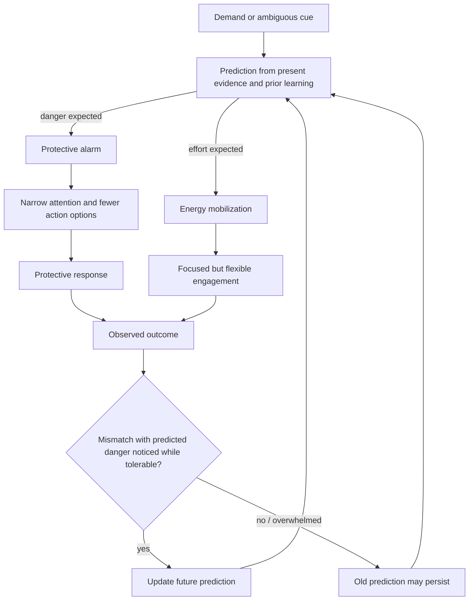
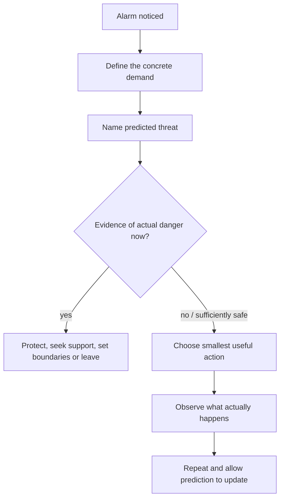

# Stress-threat discrimination

Stress is a demand that requires effort; threat is an appraisal that safety is at risk. Both can mobilize heart rate, breathing, and muscle tension, so bodily activation alone cannot reliably classify the situation. The distinction depends on what the nervous system predicts the demand means: preparation for effort can preserve flexible engagement, whereas preparation for danger tends to narrow attention and favor protection, avoidance, attack, or shutdown. (@DrTraceyMarks (Dr. Tracey Marks) — "Your Brain Is Misinterpreting Stress as Danger", 2026-07-29, [link](https://www.youtube.com/watch?v=1v5lDzKAPz0))

## Predictive appraisal and updating

An ordinary deadline can remain a demand for time and planning, or become a perceived threat when it is linked to humiliation, rejection, exposure as incompetent, or loss of control. In this model, a high-alert system responds not only to the present event but to a rapidly predicted consequence. The mobilized sensations are real even when the predicted danger is overstated. Conversely, chronic overload, trauma, or an unsafe environment can make the danger appraisal accurate; the model does not imply that all distress is a cognitive error. (@DrTraceyMarks (Dr. Tracey Marks) — "Your Brain Is Misinterpreting Stress as Danger", 2026-07-29, [link](https://www.youtube.com/watch?v=1v5lDzKAPz0))

The proposed learning mechanism is prediction error: repeated, tolerable experiences in which anticipated danger does not fully occur provide evidence that can revise future expectations. Verbal reassurance may reduce distress temporarily, but the source's distinctive position is that experience is the primary updater. The exposure must remain manageable enough for the person to notice the outcome; an overwhelming encounter may consolidate only that the situation was intolerable. This is consistent with a learning-based framework, but the transcript provides no direct trials comparing this sequence with reassurance, exposure therapy, or other treatments, so its therapeutic evidence here is **emerging and indirect**. (@DrTraceyMarks (Dr. Tracey Marks) — "Your Brain Is Misinterpreting Stress as Danger", 2026-07-29, [link](https://www.youtube.com/watch?v=1v5lDzKAPz0))

## A real-time discrimination sequence

The sequence is: notice the alarm's bodily onset; state the concrete demand; name the catastrophe being predicted; identify present evidence about safety, capacity, and actual danger; then take the smallest useful next step. A small action—reading the message once, asking one clarifying question, or requesting a minute—generates new information while retaining enough deliberative capacity to observe it. Repetition matters more than eliminating the first wave of arousal. (@DrTraceyMarks (Dr. Tracey Marks) — "Your Brain Is Misinterpreting Stress as Danger", 2026-07-29, [link](https://www.youtube.com/watch?v=1v5lDzKAPz0))

This sequence connects upstream appraisal to [[protective-threat-responses]] and downstream learning. It is not a diagnostic test and should not be used to override pain, panic, medical symptoms, coercion, or credible environmental danger. Persistent or disabling high alert may require clinical assessment rather than self-training alone. (@DrTraceyMarks (Dr. Tracey Marks) — "Your Brain Is Misinterpreting Stress as Danger", 2026-07-29, [link](https://www.youtube.com/watch?v=1v5lDzKAPz0))

## Practical implications

- **During a familiar, non-emergency alarm: run the five-step sequence and take one bounded action — emerging/clinically plausible.** Use it per episode, not as a demand to suppress arousal. (@DrTraceyMarks (Dr. Tracey Marks) — "Your Brain Is Misinterpreting Stress as Danger", 2026-07-29, [link](https://www.youtube.com/watch?v=1v5lDzKAPz0))
- **Weekly: review several predictions against outcomes — emerging.** Note what danger was expected, what occurred, and whether the experience stayed tolerable enough to learn from; the exact cadence is pragmatic and not validated by the source. (@DrTraceyMarks (Dr. Tracey Marks) — "Your Brain Is Misinterpreting Stress as Danger", 2026-07-29, [link](https://www.youtube.com/watch?v=1v5lDzKAPz0))
- **For real or chronic danger: act on the environment — strong as a safety principle.** Seek support, boundaries, protection, or substantial change rather than repeatedly relabeling danger as stress. (@DrTraceyMarks (Dr. Tracey Marks) — "Your Brain Is Misinterpreting Stress as Danger", 2026-07-29, [link](https://www.youtube.com/watch?v=1v5lDzKAPz0))

## Gaps & open questions

- Which physiological or contextual measures best distinguish effort mobilization from danger mobilization in real time?
- What intensity window permits prediction updating without overwhelm, and how should it differ for trauma-related disorders?
- Does the five-step sequence reduce avoidance, symptoms, or impairment beyond ordinary graded exposure or problem solving?
- How durable and context-general are learned safety updates, and how many repetitions are usually required?

## Related

[[protective-threat-responses]] · [[social-evaluative-threat-and-criticism]] · [[cognitive-reserve-and-brain-health]] · [[aging-model]] · [[practice-playbook]]
