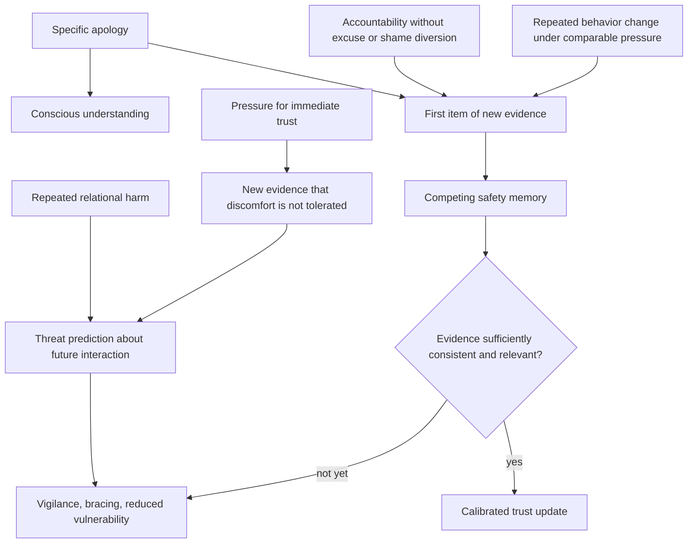

# Trust repair and safety learning

Trust is an expectation that another person's future behavior will remain within tolerable bounds. Forgiveness can be a deliberate decision to release resentment or punishment, whereas restored trust requires the predictive system to revise what it expects under conditions similar to the original harm. The two can therefore diverge: a person may consciously forgive while still bracing, monitoring, or withholding vulnerability. The source maps this difference onto cortical decision-making versus automatic threat prediction; that sharp anatomical separation is best treated as an explanatory simplification rather than an established one-region-per-process account. (@DrTraceyMarks (Dr. Tracey Marks) — "The Reason Trust Doesn't Return After an Apology", 2026-06-17, [link](https://www.youtube.com/watch?v=BiRBu5dS9KM))

## Why an apology is necessary but insufficient

Predictive processing aggregates patterns, not isolated intentions. One apology becomes one item of new evidence competing with the history that produced the distrust prediction. Drawing on fear-extinction research, the source proposes that repair creates a competing safety memory rather than deleting the original threat memory. Which expectation controls behavior depends on the recency, strength, context, and consistency of evidence. This explains both slow updating after repeated harm and the possibility that old vigilance returns under stress or in a context resembling the injury. The extension from conditioned fear to interpersonal trust is **mechanistically plausible but indirect** in the supplied source. (@DrTraceyMarks (Dr. Tracey Marks) — "The Reason Trust Doesn't Return After an Apology", 2026-06-17, [link](https://www.youtube.com/watch?v=BiRBu5dS9KM))

A useful apology specifies the action, recognizes its effect, and states the intended change. Specificity gives the recipient a model that can be tested; vague regret leaves unclear whether the actor understood the injury or what should differ. Accountability then owns the choice without immediately excusing it or collapsing into self-condemnation. Shame diversion can shift emotional labor back to the injured person, who is then pressured to comfort the apologizer rather than assess repair. Finally, consistent changed behavior supplies the repeated evidence required for prediction updating. Marks's distinctive three-layer framework is therefore apology, accountability, and repair, with behavioral consistency carrying more updating weight than improved wording alone. (@DrTraceyMarks (Dr. Tracey Marks) — "The Reason Trust Doesn't Return After an Apology", 2026-06-17, [link](https://www.youtube.com/watch?v=BiRBu5dS9KM))

## Calibrating evidence and boundaries

For the injured person, bodily vigilance is information about the learned prediction, not conclusive proof that the person remains unsafe. Evaluation should focus on comparable moments: whether the person responds differently under the pressure that previously elicited harm, accepts responsibility when embarrassed, follows through, and respects the pace of recovery. This avoids both forced trust and treating every alarm as infallible. For the person repairing harm, demanding reassurance or closeness immediately after apologizing can become new confirming evidence that the other's discomfort is still not tolerated. (@DrTraceyMarks (Dr. Tracey Marks) — "The Reason Trust Doesn't Return After an Apology", 2026-06-17, [link](https://www.youtube.com/watch?v=BiRBu5dS9KM))

Trust repair is not always the appropriate goal. The source explicitly distinguishes needing time for safety learning from punishing someone indefinitely and does not present forgiveness as equivalent to trust; by extension as a safety principle, ongoing abuse, coercive control, credible threats, manipulation, or repeated boundary violations call for protection rather than exposure to more relational tests. A specific apology does not create an obligation to reconcile. (@DrTraceyMarks (Dr. Tracey Marks) — "The Reason Trust Doesn't Return After an Apology", 2026-06-17, [link](https://www.youtube.com/watch?v=BiRBu5dS9KM))

## Practical implications

- **When making repair: give one specific apology, take responsibility without excuse or self-attack, and state an observable change — emerging/clinically plausible.** Then demonstrate that change whenever the relevant pressure recurs; there is no validated universal number of repetitions or timeline. (@DrTraceyMarks (Dr. Tracey Marks) — "The Reason Trust Doesn't Return After an Apology", 2026-06-17, [link](https://www.youtube.com/watch?v=BiRBu5dS9KM))
- **When evaluating repair: review behavior in comparable situations rather than forcing a feeling of trust — emerging/clinically plausible.** Reassess after relevant interactions, attending to accountability, follow-through, non-defensiveness, and respect for recovery pace. (@DrTraceyMarks (Dr. Tracey Marks) — "The Reason Trust Doesn't Return After an Apology", 2026-06-17, [link](https://www.youtube.com/watch?v=BiRBu5dS9KM))
- **Do not use trust rebuilding to remain exposed to ongoing harm — strong as a safety principle.** Credible danger, coercion, or abuse warrants protective support and professional or emergency resources appropriate to the situation; this is a safety boundary inferred from, rather than tested by, the source's distinction between conscious forgiveness and evidence-based trust. (@DrTraceyMarks (Dr. Tracey Marks) — "The Reason Trust Doesn't Return After an Apology", 2026-06-17, [link](https://www.youtube.com/watch?v=BiRBu5dS9KM))

## Gaps & open questions

- Which apology components independently improve trust, and which work only when followed by behavioral change?
- How many consistent experiences, over what duration and contexts, typically change interpersonal safety predictions?
- How directly can fear-extinction findings be generalized to complex trust, attachment, morality, and power?
- Which signs distinguish appropriately slow trust from overgeneralized vigilance that would benefit from treatment?
- How do culture, relationship type, severity of harm, neurodivergence, and trauma history alter repair?

## Related

[[stress-threat-discrimination]] · [[social-evaluative-threat-and-criticism]] · [[emotional-memory-reactivation-and-rumination]] · [[protective-threat-responses]] · [[attachment-threat-and-relational-regulation]] · [[tracey-marks]] · [[practice-playbook]]
