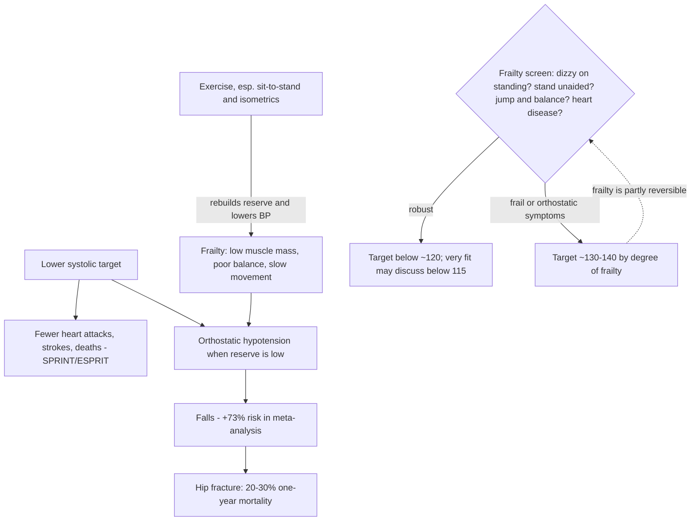

# Blood-pressure targets and frailty

Blood pressure is the force blood exerts on arterial walls, written as systolic over diastolic (e.g. 120/80 mmHg). Sustained elevation strains the vessel wall and, over years, drives heart attacks and strokes; it produces no symptoms until an event occurs, which is why hypertension is called the silent killer. The central claim of this page is that the right treatment target is not one number and not primarily a function of age: it is a function of frailty and medical history, because the same intensive lowering that prevents cardiovascular events in robust people causes orthostatic symptoms, falls, and excess mortality in frail ones. (@DrBradStanfield (Dr Brad Stanfield) — "The 120/80 Blood Pressure Target Is Wrong", 2026-07-20, [link](https://www.youtube.com/watch?v=4vytb0MOE6M))

Cumulative pressure exposure is also a partly independent input into atherosclerosis itself — it injures the endothelium and convectively drives ApoB particles into the arterial wall — so blood-pressure control belongs beside lipid lowering rather than behind it. [[lipoprotein-retention-and-atherogenesis]]

## Why targets moved down: SPRINT and ESPRIT

Targets fell because trials kept rewarding intensive lowering. SPRINT (2015) randomized 9,361 people over age 50 to a standard systolic target of 140 versus intensive lowering toward 120; it was stopped early at about three years because the intensive group had a 25% lower relative risk of the combined endpoint of heart attacks, strokes, and deaths. The absolute difference was about half a percentage point per year — 1.65% versus 2.19% of patients per year having major events — small in one year but compounding over decades of exposure. (@DrBradStanfield (Dr Brad Stanfield) — "The 120/80 Blood Pressure Target Is Wrong", 2026-07-20, [link](https://www.youtube.com/watch?v=4vytb0MOE6M))

SPRINT's applicability is bounded by who was enrolled and how pressure was measured: it excluded people with diabetes, prior stroke, and frailty, and it measured blood pressure with an automated device while the patient sat alone — a technique that typically reads about 5–10 mmHg lower than a routine clinic check, so "120 in SPRINT" is not "120 at your doctor's office". ESPRIT (2024), a trial of over 10,000 people that added diabetics and stroke survivors, extended the finding: the 120 target produced a 12% lower relative risk of the combined cardiovascular endpoint versus 140 — smaller than SPRINT's effect but still significant. Intensive lowering therefore wins in fit people and in the broader trial-eligible population including diabetes and prior stroke. (@DrBradStanfield (Dr Brad Stanfield) — "The 120/80 Blood Pressure Target Is Wrong", 2026-07-20, [link](https://www.youtube.com/watch?v=4vytb0MOE6M))

There is also no threshold below which lower pressure stops being associated with lower risk in observational data: a 2002 analysis across roughly a million adults found cardiovascular death approximately doubling for every 20 mmHg of systolic pressure, all the way down to 115/75. This motivates the attributed suggestion that very fit people might reasonably target below 115 — an extrapolation beyond the trial targets, not a trial-tested threshold. (@DrBradStanfield (Dr Brad Stanfield) — "The 120/80 Blood Pressure Target Is Wrong", 2026-07-20, [link](https://www.youtube.com/watch?v=4vytb0MOE6M))

## The frailty boundary

The harm side concentrates in frailty, not in age. In frail nursing-home residents over 80, those with systolic pressure under 130 while taking two or more blood-pressure drugs had a 78% higher risk of dying over two years than those above 130 (2015 study). The proposed mechanism runs through orthostatic hypotension: on standing, an over-lowered system fails to perfuse the brain, producing dizziness and falls — a meta-analysis of 50,000 people found orthostatic hypotension carried a 73% higher fall risk, and an older person who falls and breaks a hip has a 20–30% chance of dying within a year. Critically, when the intensive-lowering trials examined their fittest participants over age 75, those people still benefited from the sub-120 target and did not fall more — so the falls problem tracks frailty, not birthdays. Frailty can also arrive early: a deconditioned, sarcopenic 55-year-old who wobbles on standing needs the conservative target, while a fit 90-year-old may tolerate the intensive one. (@DrBradStanfield (Dr Brad Stanfield) — "The 120/80 Blood Pressure Target Is Wrong", 2026-07-20, [link](https://www.youtube.com/watch?v=4vytb0MOE6M))

## Measurement precedes targeting

Arguing about 115 versus 130 is premature when the measurement is wrong, and single clinic readings usually are: white-coat elevation, rushed technique, and bad cuff practice distort them, and the trials' unattended automated readings sit 5–10 mmHg below clinic values. The home protocol the source recommends to patients: no exercise or caffeine within 30 minutes; seated with back supported, feet flat and legs uncrossed, arm supported at heart height, correct cuff size, no talking, empty bladder, about five minutes of quiet sitting first. Take two readings daily — morning and evening — for a week, discard the first day as unrepresentative, and average the rest. Only that average is worth comparing to a target. This aligns with standard home-blood-pressure-monitoring guidance. (@DrBradStanfield (Dr Brad Stanfield) — "The 120/80 Blood Pressure Target Is Wrong", 2026-07-20, [link](https://www.youtube.com/watch?v=4vytb0MOE6M))

A quick bedside frailty screen then picks the target: any dizziness on standing, ability to stand unaided, ability to jump and land balanced, and presence of heart conditions. Favorable answers point to a sub-120 target; orthostatic symptoms or advancing frailty point to roughly 130–140 depending on degree. This screen is the source's clinical practice, not a validated instrument. A normal clinic or home average still does not exclude masked hypertension, in which ambulatory daytime or nighttime averages are elevated; see [[proactive-health-monitoring]] and [[endurance-exercise-and-coronary-atherosclerosis]]. (@DrBradStanfield (Dr Brad Stanfield) — "The 120/80 Blood Pressure Target Is Wrong", 2026-07-20, [link](https://www.youtube.com/watch?v=4vytb0MOE6M))

## Levers that lower pressure

Pooled randomized evidence (a recent analysis combining 270 trials) ranks isometric exercise — wall sits are the canonical example — first at about 8 mmHg of systolic lowering, with aerobic exercise at about 4.5 mmHg. For people becoming frail, repeated unaided sit-to-stand from a chair doubles as quadriceps/glute strengthening and blood-pressure exercise, attacking both sides of the target trade-off at once. Dietary potassium from non-starchy vegetables and legumes (broccoli, peas, carrots, chickpeas, lentils, beans — kidney function permitting) lowered systolic pressure by about 3.5 mmHg in people with high readings in a 2013 trial of fruit-and-vegetable-based potassium. Halving intake from six or more alcohol units daily lowered systolic pressure by about 5.5 mmHg (2017). Weight loss delivers roughly 1 mmHg per kilogram lost across 25 randomized trials, and GLP-1 medications now make clinically meaningful weight loss achievable when diet and exercise alone fail. [[glp-1-receptor-agonists]] [[resistance-training]] (@DrBradStanfield (Dr Brad Stanfield) — "The 120/80 Blood Pressure Target Is Wrong", 2026-07-20, [link](https://www.youtube.com/watch?v=4vytb0MOE6M))

Resistant hypertension warrants a secondary-cause work-up rather than dose escalation alone. The screening set described: Cushing's syndrome (late-night salivary cortisol), hypothyroidism, primary aldosteronism (aldosterone–renin ratio), pheochromocytoma (plasma free metanephrines), and renal artery stenosis — the last suspected especially in hypertension arising under age 40. Once secondary causes are excluded, excess weight is the most common remaining driver in the source's clinical experience. (@DrBradStanfield (Dr Brad Stanfield) — "The 120/80 Blood Pressure Target Is Wrong", 2026-07-20, [link](https://www.youtube.com/watch?v=4vytb0MOE6M))

## Practical implications

- **Before adjusting any target: measure properly at home — strong, consistent with standard guidance.** Two seated, rested readings daily for a week (morning and evening), first day discarded, remainder averaged; no caffeine or exercise in the prior 30 minutes, back supported, feet flat, cuffed arm at heart height, correct cuff size, empty bladder, no talking. (@DrBradStanfield (Dr Brad Stanfield) — "The 120/80 Blood Pressure Target Is Wrong", 2026-07-20, [link](https://www.youtube.com/watch?v=4vytb0MOE6M))
- **Set the target by frailty and history with a clinician, not by age — moderate-to-strong; direct trial evidence for benefit of intensive targets in robust people including fit elders, observational and mechanistic evidence for harm of intensive targets in frailty.** Robust screen answers support a sub-120 discussion; orthostatic dizziness or frailty supports ~130–140 and a medication review. A sub-115 target for the very fit is expert extrapolation from observational gradients — `Investigational practice`. (@DrBradStanfield (Dr Brad Stanfield) — "The 120/80 Blood Pressure Target Is Wrong", 2026-07-20, [link](https://www.youtube.com/watch?v=4vytb0MOE6M))
- **Weekly, as tolerated: include isometric holds (e.g. wall sits) and aerobic work for their pooled-trial blood-pressure effects (~8 and ~4.5 mmHg systolic) — moderate-to-strong.** If frailty is emerging, prioritize sit-to-stand repetitions safely; strength work partly reverses the very state that forces a higher target. [[resistance-training]] (@DrBradStanfield (Dr Brad Stanfield) — "The 120/80 Blood Pressure Target Is Wrong", 2026-07-20, [link](https://www.youtube.com/watch?v=4vytb0MOE6M))
- **Daily pattern: potassium-rich vegetables and legumes if kidneys are healthy, alcohol reduction, and weight management (~1 mmHg per kg) — moderate-to-strong, effect sizes from randomized evidence.** (@DrBradStanfield (Dr Brad Stanfield) — "The 120/80 Blood Pressure Target Is Wrong", 2026-07-20, [link](https://www.youtube.com/watch?v=4vytb0MOE6M))
- **When pressure stays high despite treatment, or arises under 40: ask about secondary causes — strong as standard clinical practice.** Cortisol excess, thyroid disease, primary aldosteronism, pheochromocytoma, renal artery stenosis. (@DrBradStanfield (Dr Brad Stanfield) — "The 120/80 Blood Pressure Target Is Wrong", 2026-07-20, [link](https://www.youtube.com/watch?v=4vytb0MOE6M))

## Gaps & open questions

- No randomized trial has enrolled frail participants to test whether relaxed targets actually reduce their mortality; the 78% signal is observational and confounded by the reasons pressure runs low in the frail.
- What validated, practical frailty instrument best selects the target — and does the source's four-question screen agree with formal frailty indices?
- Does treating to below 115 in very fit people improve outcomes over 120, or does the observational gradient overstate achievable benefit?
- How much of the isometric-exercise blood-pressure effect persists long-term and translates to events rather than readings?
- How should home averages be mapped onto trial targets measured with unattended automated devices — is a fixed 5–10 mmHg offset valid across people?

## Related

[[lipoprotein-retention-and-atherogenesis]] · [[proactive-health-monitoring]] · [[muscle-strength-and-mortality]] · [[resistance-training]] · [[glp-1-receptor-agonists]] · [[visceral-and-ectopic-fat]] · [[endurance-exercise-and-coronary-atherosclerosis]] · [[brad-stanfield]] · [[practice-playbook]] · [[aging-model]]
