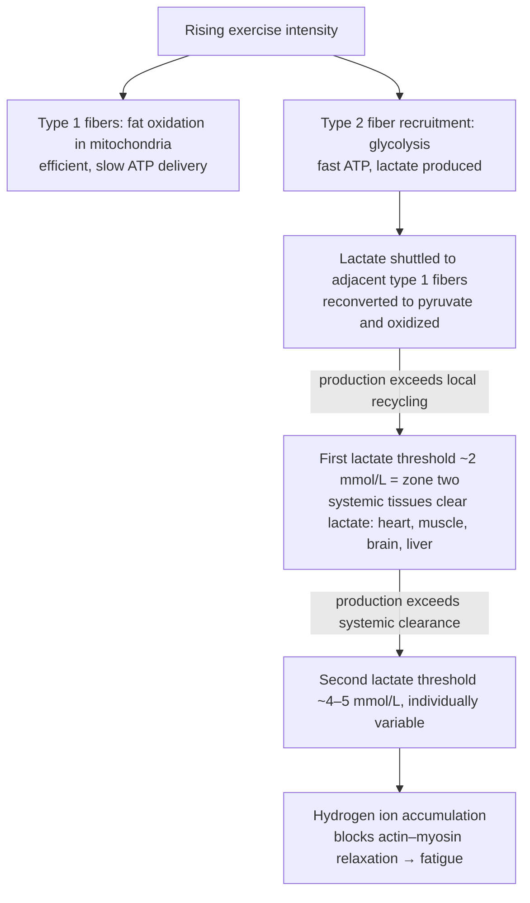
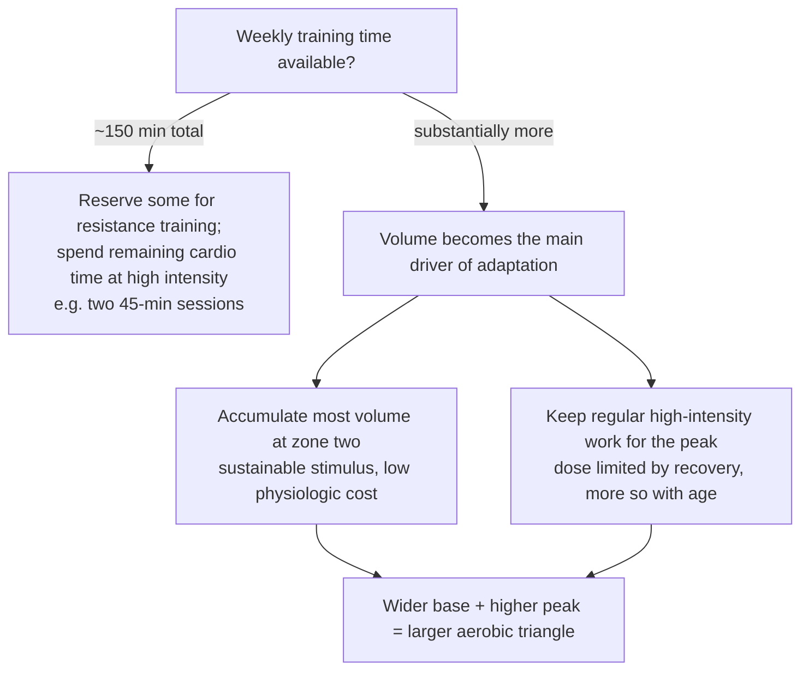

# Cardiorespiratory fitness

Cardiorespiratory fitness (CRF) is the integrated capacity of the heart, lungs, blood, and muscles to deliver and utilize oxygen. The more efficient that system, the more physiological reserve the body holds — reserve drawn on during infection, surgery, and the ordinary physical demands of living. Among measurable predictors of all-cause mortality, CRF outperforms every other variable, including blood pressure, cholesterol, BMI, smoking, and even chronological age, which makes it — alongside strength ([[muscle-strength-and-mortality]]) — one of the two most consequential modifiable capacities in this wiki. (@PeterAttiaMD (Peter Attia MD) — "A guide to cardiorespiratory training at any fitness level to improve longevity (AMA 79 sneak peek)", 2026-01-12, [link](https://www.youtube.com/watch?v=yisfGtcV5xk))

## Measurement

The standard measure is VO2 max: the maximum rate of oxygen utilization during a maximal effort, expressed in milliliters of oxygen per kilogram of body weight per minute. It can be estimated in METs (metabolic equivalents), where 1 MET equals 3.5 mL/kg/min, and the two are used interchangeably in the literature. VO2 max dominates the epidemiology because a maximal test is standardizable — telling someone to go to failure is operationally simple — whereas zone two is an intermediate effort that is much harder to locate consistently. Test quality still varies enough that some clinics run the test in-house rather than rely on outside labs. (@PeterAttiaMD (Peter Attia MD) — "A guide to cardiorespiratory training at any fitness level to improve longevity (AMA 79 sneak peek)", 2026-01-12, [link](https://www.youtube.com/watch?v=yisfGtcV5xk))

The mortality gradient is steep and continuous: the bottom quintile-to-quartile of the VO2 max distribution carries roughly four-to-five-fold higher annual all-cause mortality than the top 2–3%, and even one-quartile moves (second to third) associate with something like a 50–75% improvement. The proposed explanation for the strength of this association is that VO2 max, like strength, is an integrator of work done: raising it requires hundreds of hours of coordinated adaptation across the cardiovascular, pulmonary, hematologic, muscular, and metabolic systems, so the number certifies accumulated physiology in a way no pill-induced biomarker change can. (@PeterAttiaMD (Peter Attia MD) — "A guide to cardiorespiratory training at any fitness level to improve longevity (AMA 79 sneak peek)", 2026-01-12, [link](https://www.youtube.com/watch?v=yisfGtcV5xk))

## Why CRF bounds healthspan

VO2 max declines predictably with age, at about 10% per decade, while the oxygen cost of fixed tasks — stairs, lifting, carrying, play — does not change. A declining capacity curve against a constant demand line must eventually cross, and each crossing removes an activity from the person's option set. Maintaining late-life optionality is therefore tantamount to entering the decline with as high a VO2 max (and as much strength) as possible. (@PeterAttiaMD (Peter Attia MD) — "A guide to cardiorespiratory training at any fitness level to improve longevity (AMA 79 sneak peek)", 2026-01-12, [link](https://www.youtube.com/watch?v=yisfGtcV5xk))

## The base-and-peak model

A useful teaching framework (used by Peter Attia, credited to one of his cycling coaches) pictures aerobic capacity as a triangle. The base is capacity for sustained submaximal output — what can be held for hours — built on mitochondrial density and efficiency, fat oxidation, and lactate utilization. The peak is maximal aerobic output — what can be held for roughly 5–10 minutes — set primarily by oxygen delivery. Gradations such as functional threshold power (about one hour) sit between. Training at any single intensity raises both base and peak given enough volume, but maximizing the triangle's area requires training them differently, which is why no high-level endurance athlete trains at one intensity. (@PeterAttiaMD (Peter Attia MD) — "A guide to cardiorespiratory training at any fitness level to improve longevity (AMA 79 sneak peek)", 2026-01-12, [link](https://www.youtube.com/watch?v=yisfGtcV5xk))

Oxygen delivery to mitochondria — the peak's bottleneck — has four drivers: diffusion from lungs into blood, cardiac output (stroke volume × heart rate), the blood's hemoglobin carrying capacity, and muscle extraction. Cardiac output dominates: some 70–85% of between-person variability in VO2 max is accounted for by it alone. (@PeterAttiaMD (Peter Attia MD) — "A guide to cardiorespiratory training at any fitness level to improve longevity (AMA 79 sneak peek)", 2026-01-12, [link](https://www.youtube.com/watch?v=yisfGtcV5xk))

## Fuel selection, muscle fibers, and lactate thresholds

Mitochondria generate most ATP, from fatty acids or from pyruvate (the glycolytic breakdown product of glucose). The governing tradeoff is efficiency versus rate: oxidative metabolism yields far more ATP per carbon but cannot accelerate indefinitely, so as demand rises the muscle shifts toward fast, low-yield glycolysis ending in lactate. In fiber terms, low intensities run on type 1 (slow-twitch, slow-to-fatigue, mitochondria-rich, fat-oxidizing) fibers; rising intensity recruits type 2 (fast-twitch, fast-to-fatigue, glycolysis-reliant) fibers. (@PeterAttiaMD (Peter Attia MD) — "A guide to cardiorespiratory training at any fitness level to improve longevity (AMA 79 sneak peek)", 2026-01-12, [link](https://www.youtube.com/watch?v=yisfGtcV5xk))

Lactate is not a waste product but a shuttled fuel. It is first recycled locally — generated in type 2 fibers, shuttled to neighboring type 1 fibers, converted back to pyruvate, and oxidized (the lactate shuttle, per George Brooks's work). When production outruns local recycling, lactate spills into blood, where the heart, resting muscle, brain, and liver (via gluconeogenesis) clear it, establishing a new elevated steady state. That first systemic steady state — the first lactate threshold, about 2 mmol/L in a metabolically flexible person — operationally defines zone two. (People with impaired metabolic flexibility can rest above 2 mmol/L, so the cutoff is not universal.) At still-higher outputs production surpasses whole-body clearance — the second lactate threshold, typically somewhere between 4 and 5 mmol/L and much more individually variable — and blood lactate climbs steeply. The accompanying hydrogen ion, not lactate itself, is what poisons contraction, by preventing actin–myosin relaxation. (@PeterAttiaMD (Peter Attia MD) — "A guide to cardiorespiratory training at any fitness level to improve longevity (AMA 79 sneak peek)", 2026-01-12, [link](https://www.youtube.com/watch?v=yisfGtcV5xk))

## Zone two versus high intensity: a time-budget problem, not a rivalry

Critics of zone two argue that high-intensity work produces the same or greater adaptations, and per unit time that is true. The claim that zone two has no place is, however, context-dependent, and the shorter someone's weekly exercise time, the more the critics are right. At the guideline minimum of 150 minutes per week — part of which should be resistance training — the remaining cardio time (roughly 90 minutes) does not provide enough zone-two volume to drive meaningful adaptation, and is better spent as two 45-minute high-intensity sessions. Once weekly volume grows beyond that, the limiting factors become fatigue, recoverability, and adherence — especially past the 40s and 50s, when several weekly zone-five sessions stop being sustainable — and zone two becomes the intensity at which large volumes can be accumulated safely: a strong enough stimulus to engage both fuel systems and the lactate shuttle, without the acidity and wear of work above the second threshold. This is why endurance athletes training 15–20 hours weekly spend roughly 80% of their time there ([[elite-endurance-development]]). In Attia's summary of the dispute: "It's not that zone two is magical, it's that it's practical." Volume above the zone-two floor is the primary driver of total adaptation — walking below that floor does not count toward it — and zone two is the cornerstone that makes sufficient volume sustainable for decades. Movement-economy gains and the ability to do something else (podcasts, audiobooks) while training are secondary adherence benefits. (@PeterAttiaMD (Peter Attia MD) — "A guide to cardiorespiratory training at any fitness level to improve longevity (AMA 79 sneak peek)", 2026-01-12, [link](https://www.youtube.com/watch?v=yisfGtcV5xk))

A more operational minimal-dose option is six to ten rounds of one minute hard and one minute easy, initially once weekly and potentially twice when recovery permits. Because heart rate lags during one-minute work, fixed power or speed and perceived effort are better immediate controls than chasing a percentage of maximum heart rate. This protocol is feasible across fitness levels in the work described, but it has not been shown superior to every other interval design. [[time-efficient-concurrent-training]] (@PeterAttiaMD (Peter Attia MD) — "How Busy Moms Can Build Strength and Cardio Fitness | Abbie Smith-Ryan, Ph.D.", 2026-01-07, [link](https://www.youtube.com/watch?v=9Rxp2a0m8wM))

## Gaps & open questions

- The zone-two definition by first lactate threshold breaks down in metabolically inflexible people who rest above 2 mmol/L; how zone two should be prescribed for them is not resolved in this source.
- The 150-minute triage rule (all-high-intensity when time-poor) is expert reasoning from stimulus sufficiency, not a tested head-to-head allocation trial.
- Continuous lactate monitors were described as at prototype stage; whether field lactate data improves training outcomes over heart-rate or power proxies is untested.
- The healthspan argument (capacity–demand curve crossing) is mechanistically compelling but harder to quantify than the mortality association, because healthspan endpoints are individual.
- Sex-specific modifications and how the volume–intensity balance should shift across decades of age were deferred to the full episode and are not yet captured here.

## Practical implications

- **Train to raise or defend VO2 max and the zone-two base as a lifelong priority — strong for the mortality association, expert-graded for specific programming.** The bottom-to-top mortality gradient (four-to-five-fold) exceeds that of conventional risk factors, and every quartile gained matters. (@PeterAttiaMD (Peter Attia MD) — "A guide to cardiorespiratory training at any fitness level to improve longevity (AMA 79 sneak peek)", 2026-01-12, [link](https://www.youtube.com/watch?v=yisfGtcV5xk))
- **If constrained to ~150 minutes weekly: keep some resistance training and make the cardio remainder high-intensity — expert protocol.** Zone two at that dose is an inefficient stimulus. (@PeterAttiaMD (Peter Attia MD) — "A guide to cardiorespiratory training at any fitness level to improve longevity (AMA 79 sneak peek)", 2026-01-12, [link](https://www.youtube.com/watch?v=yisfGtcV5xk))
- **If training for the long term with more time: build most weekly volume at zone two (talk-test / ~2 mmol/L effort) and retain regular but recovery-limited high-intensity work — moderate-to-strong, consistent with elite intensity-distribution practice.** Expect the tolerable high-intensity dose to fall with age; volume only counts above the zone-two floor, so walking, while healthful, is not aerobic base training. (@PeterAttiaMD (Peter Attia MD) — "A guide to cardiorespiratory training at any fitness level to improve longevity (AMA 79 sneak peek)", 2026-01-12, [link](https://www.youtube.com/watch?v=yisfGtcV5xk))
- **Interpret VO2 max tests with protocol quality in mind — moderate.** The test is standardized in principle but frequently done poorly; trend measurements should come from a consistent, competent protocol. (@PeterAttiaMD (Peter Attia MD) — "A guide to cardiorespiratory training at any fitness level to improve longevity (AMA 79 sneak peek)", 2026-01-12, [link](https://www.youtube.com/watch?v=yisfGtcV5xk))

## Related

[[muscle-strength-and-mortality]] · [[elite-endurance-development]] · [[resistance-training]] · [[time-efficient-concurrent-training]] · [[womens-exercise-across-the-lifespan]] · [[daily-movement-mobility-and-pain]] · [[visceral-and-ectopic-fat]] · [[peter-attia]] · [[aging-model]] · [[practice-playbook]]
