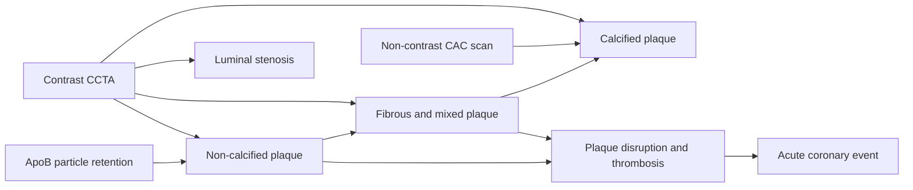

# Coronary CT angiography

Coronary CT angiography (CCTA) is contrast-enhanced computed tomography timed to visualize the lumen and wall of the coronary arteries. It differs from a non-contrast coronary artery calcium (CAC) scan: CAC detects radiodense calcification, whereas CCTA can show luminal narrowing and both calcified and non-calcified plaque. Neither test directly images histology, and neither substitutes for clinical risk assessment or proof that screening a particular population improves outcomes. (@matt.kaeberlein (Healthspan Medicine) — "THIS Helps Detect Heart Disease Before It Happens", 2026-03-08, [link](https://www.youtube.com/watch?v=SSFkNCVXv6U))

## What the images represent

Atherosclerosis begins when ApoB-containing particles enter and are retained in the arterial wall, provoking lipid accumulation, inflammation, fibrous remodeling, and sometimes calcification. A plaque can grow outward before it markedly narrows the lumen; later stenosis, plaque disruption, and superimposed thrombosis can produce ischemia or infarction. CCTA adds anatomical information about plaque and stenosis to the upstream probability supplied by age, blood pressure, lipids, diabetes, smoking, symptoms, and family history. [[lipoprotein-retention-and-atherogenesis]] (@matt.kaeberlein (Healthspan Medicine) — "THIS Helps Detect Heart Disease Before It Happens", 2026-03-08, [link](https://www.youtube.com/watch?v=SSFkNCVXv6U))

A CAC score of zero therefore means no detected coronary calcium, not no coronary atherosclerosis. Brockenbrough reports that 69.8% of zero-CAC patients in the first 100 patients at her specialty practice in 2024 had non-calcified plaque, including a 48-year-old runner with severe LAD stenosis. This is a selected, uncontrolled practice series and an anecdote, not a population estimate; it demonstrates the modality distinction but cannot establish the prevalence of important plaque among asymptomatic zero-CAC adults. (@matt.kaeberlein (Healthspan Medicine) — "THIS Helps Detect Heart Disease Before It Happens", 2026-03-08, [link](https://www.youtube.com/watch?v=SSFkNCVXv6U))

## Acquisition and interpretation

Image quality depends on limiting cardiac motion and opacifying the coronary lumen. The described protocol evaluates resting heart rate, sometimes uses a beta blocker or verapamil to slow it, gives nitroglycerin to dilate the coronary arteries, and injects iodinated contrast before scanning; a non-contrast calcium score may be acquired in the same session. These medicines and contrast require patient-specific screening and clinical supervision. (@matt.kaeberlein (Healthspan Medicine) — "THIS Helps Detect Heart Disease Before It Happens", 2026-03-08, [link](https://www.youtube.com/watch?v=SSFkNCVXv6U))

CCTA and functional stress testing answer different questions. CCTA depicts anatomy before obstruction necessarily produces inducible ischemia, whereas a stress test asks whether exertion creates a perfusion or electrical abnormality. The transcript presents an approximate 70% narrowing threshold for stress-test positivity and less than 25% narrowing as visible on CCTA; real test performance is not determined by a single stenosis cutoff and varies with modality, patient, lesion, and image quality. The defensible inference is narrower: a normal functional test does not exclude non-obstructive plaque, and anatomy alone does not prove that revascularization will improve an asymptomatic person's outcome. (@matt.kaeberlein (Healthspan Medicine) — "THIS Helps Detect Heart Disease Before It Happens", 2026-03-08, [link](https://www.youtube.com/watch?v=SSFkNCVXv6U))

Radiation, iodinated-contrast reaction, renal vulnerability, cost, incidental findings, downstream testing, and interpretive error are part of the net-benefit calculation. Brockenbrough favors a somewhat higher radiation dose to discriminate plaque density and proposes repeat CCTA after one to two years for extensive disease or three to five years for minimal disease, while acknowledging that the transcript supplies no evidence choosing one versus two years. These are practitioner protocols, not validated universal intervals. (@matt.kaeberlein (Healthspan Medicine) — "THIS Helps Detect Heart Disease Before It Happens", 2026-03-08, [link](https://www.youtube.com/watch?v=SSFkNCVXv6U))

## Serial plaque measurement and treatment response

Effective lipid lowering can reduce lipid-rich plaque and may increase plaque calcification or density as lesions stabilize. Consequently, an increasing CAC score during statin therapy cannot be read in isolation as treatment failure; the clinically relevant picture includes non-calcified plaque, stenosis, overall burden, risk factors, and treatment exposure. Brockenbrough's stronger claim that a rising score is exactly the desired response goes beyond what her clinical observations alone establish, and it conflicts with using raw CAC progression as a universal treatment target. [[proactive-health-monitoring]] (@matt.kaeberlein (Healthspan Medicine) — "THIS Helps Detect Heart Disease Before It Happens", 2026-03-08, [link](https://www.youtube.com/watch?v=SSFkNCVXv6U))

Serial numerical comparison has measurement error. Heart rate, contrast phase, scanner and reconstruction, motion, partial-volume averaging, and segmentation can change apparent plaque volume between scans. Brockenbrough's contrarian position is that current AI plaque quantification can add false precision and mishandle artifacts; she reports an apparent high-grade stenosis caused by an incompletely captured artery and says expert visual review has not yet been changed by the software in her practice. This is useful failure-mode evidence but not a comparative accuracy study. (@matt.kaeberlein (Healthspan Medicine) — "THIS Helps Detect Heart Disease Before It Happens", 2026-03-08, [link](https://www.youtube.com/watch?v=SSFkNCVXv6U))

CT-derived fractional flow reserve estimates lesion-specific flow effects from CCTA data. The transcript's position is that it should be reserved for moderate-to-high-grade stenosis and only when the answer would change management; routine addition to a scan without stenosis creates cost and information without a clear decision. The guest reports that published accuracy appears favorable but her own experience is less convincing, so this remains an attributed clinical judgment rather than a settled performance estimate. (@matt.kaeberlein (Healthspan Medicine) — "THIS Helps Detect Heart Disease Before It Happens", 2026-03-08, [link](https://www.youtube.com/watch?v=SSFkNCVXv6U))

## Position in the larger system

CCTA measures a downstream anatomical state in the cardiovascular branch of [[aging-model]]; it does not replace the upstream causal targets of cumulative ApoB exposure, blood pressure, smoking, glycemic control, movement, or diet. Its value is highest when anatomy resolves a genuine uncertainty and triggers an intervention already supported by outcome evidence. The question of broad asymptomatic use is treated separately in [[coronary-cta-screening-asymptomatic]]. (@matt.kaeberlein (Healthspan Medicine) — "THIS Helps Detect Heart Disease Before It Happens", 2026-03-08, [link](https://www.youtube.com/watch?v=SSFkNCVXv6U))

## Practical implications

- **For symptoms or a clinician-defined coronary question, choose anatomical versus functional testing according to the question—strong as a decision principle; this transcript alone is weak evidence for exact indications.** CCTA can identify non-calcified plaque and stenosis that CAC cannot, while stress testing evaluates functional consequence. (@matt.kaeberlein (Healthspan Medicine) — "THIS Helps Detect Heart Disease Before It Happens", 2026-03-08, [link](https://www.youtube.com/watch?v=SSFkNCVXv6U))
- **Do not interpret CAC zero as proof of plaque-free arteries—strong for the modality limitation.** Continue risk-factor assessment and indicated prevention; do not automatically escalate every zero-CAC asymptomatic adult to CCTA because the net benefit of that screening pathway is unestablished here. (@matt.kaeberlein (Healthspan Medicine) — "THIS Helps Detect Heart Disease Before It Happens", 2026-03-08, [link](https://www.youtube.com/watch?v=SSFkNCVXv6U))
- **Before CCTA, review contrast and medication risks and whether the result will change treatment—strong as risk management.** Kidney status, prior contrast reaction, heart-rate-control suitability, radiation, cost, incidental findings, and downstream procedures belong in the decision. (@matt.kaeberlein (Healthspan Medicine) — "THIS Helps Detect Heart Disease Before It Happens", 2026-03-08, [link](https://www.youtube.com/watch?v=SSFkNCVXv6U))
- **Do not schedule serial CCTA by a universal calendar—moderate-to-strong caution.** If repeat imaging is considered, use disease burden, treatment change, image comparability, cumulative exposure, and a prespecified management decision; the proposed one-to-five-year intervals are expert practice with acknowledged evidence gaps. (@matt.kaeberlein (Healthspan Medicine) — "THIS Helps Detect Heart Disease Before It Happens", 2026-03-08, [link](https://www.youtube.com/watch?v=SSFkNCVXv6U))

## Gaps & open questions

- Which asymptomatic risk groups gain better clinical outcomes, rather than merely more diagnoses, from CCTA-based screening?
- What repeat-scan interval, if any, improves decisions enough to outweigh radiation, contrast, cost, measurement error, and downstream procedures?
- How reproducible are non-calcified-plaque volume and composition across scanners, protocols, readers, and AI systems?
- Does showing plaque improve long-term adherence and outcomes beyond risk-factor counseling without imaging?
- Which CCTA findings add actionable prognostic information beyond ApoB, blood pressure, diabetes status, smoking, CAC, and established risk scores?

## Related

[[coronary-cta-screening-asymptomatic]] · [[lipoprotein-retention-and-atherogenesis]] · [[proactive-health-monitoring]] · [[pcsk9-inhibition]] · [[ezetimibe]] · [[aging-model]] · [[practice-playbook]]
