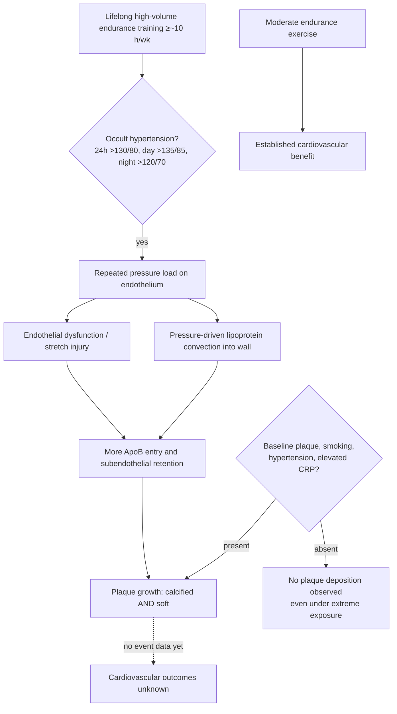

# Endurance exercise and coronary atherosclerosis

Exercise, including endurance exercise in moderation, is among the best-supported interventions for cardiovascular health ([[cardiorespiratory-fitness]]). Against that background sits a consistent and initially paradoxical observational finding: lifelong high-volume endurance training — the studied cutoff is roughly 10 or more hours per week sustained over years — associates with *more* coronary plaque than lighter activity, including both calcified and non-calcified (soft) plaque. The claim sometimes offered in mitigation, that athletes accumulate only the more stable calcified form, is contradicted by the same data: non-calcified plaque and the proportion of athletes with at least 50% stenosis are also elevated. No study in this literature has measured cardiovascular events, so whether the extra plaque translates into extra heart attacks remains unknown. This page teaches the association, the candidate mechanisms, and the moderators that may decide who is actually at risk. (@Physionic (Physionic) — "More Exercise = More Plaque - Why?", 2026-08-13, [link](https://www.youtube.com/watch?v=ibfahpJWOWQ))

## Masked (occult) hypertension as a candidate mechanism

Blood pressure measured once in a clinic is one sample of a fluctuating quantity. Masked or occult hypertension is the state in which clinic readings are normal while ambulatory averages are high — in the athlete study discussed, defined as a 24-hour average above 130/80 mmHg, a daytime average above 135/85, or a nighttime average above 120/70. In roughly 200 healthy, highly trained endurance athletes in their 50s, those with occult hypertension had more low-attenuation (soft) plaque and more ≥50% stenosis than those without it. The study contains no lightly active comparison group, so it speaks to variation *within* high-volume trainees, not to whether training causes the hypertension. (@Physionic (Physionic) — "More Exercise = More Plaque - Why?", 2026-08-13, [link](https://www.youtube.com/watch?v=ibfahpJWOWQ))

The mechanistic route from pressure to plaque is established in outline. Higher pressure loads the endothelium — the single-cell lining of the artery's blood-facing surface — and cyclic stretch and stress can produce endothelial dysfunction, admitting more ApoB-containing lipoprotein particles into the subendothelial space where retention initiates plaque ([[lipoprotein-retention-and-atherogenesis]]). Pressure also drives particle entry directly by convection: animal experiments from the 1970s found that raising blood pressure increased LDL entry into susceptible arterial segments by more than 60%. (@Physionic (Physionic) — "More Exercise = More Plaque - Why?", 2026-08-13, [link](https://www.youtube.com/watch?v=ibfahpJWOWQ))

This mechanism also exposes a general methodological lesson about the original athlete–plaque studies. Those studies adjusted for blood pressure — but for *clinic* blood pressure. A statistical adjustment is only as good as the measurement behind it: if the relevant exposure is the 24-hour pressure profile, adjusting on a normal clinic reading leaves the pathway uncontrolled, and blood pressure can remain a contributing cause of the association even though it was nominally adjusted away. (@Physionic (Physionic) — "More Exercise = More Plaque - Why?", 2026-08-13, [link](https://www.youtube.com/watch?v=ibfahpJWOWQ))

## Host health as a moderator: the transcontinental-race series

The closest thing to a direct before/after test comes from a small pre/post study of runners in the Race Across the USA, a 140-day transcontinental event averaging about 26 miles per day with one rest day per week. Coronary plaque was measured immediately before and after. Of the eight finishers analyzed, four showed increased plaque after the race — and every one of those four had plaque at baseline, elevated C-reactive protein, and tracking histories of smoking or hypertension. The other four had no baseline plaque, no elevated CRP, and developed no plaque despite the identical extreme exposure. With eight participants this cannot establish anything, but it generates a specific moderation hypothesis: extreme endurance loads may deposit plaque preferentially in people whose overall vascular health is already compromised, while leaving healthy-vesseled participants unaffected. CRP here is best read as a marker traveling with baseline disease, not a demonstrated cause. [[inflammaging-and-il-6]] (@Physionic (Physionic) — "More Exercise = More Plaque - Why?", 2026-08-13, [link](https://www.youtube.com/watch?v=ibfahpJWOWQ))

## Why the nutrition-adjustment critique mostly misses

A recurring critique of the athlete cohorts is that diet was never adjusted for. The methodological answer is that the studies adjusted for nutrition's principal *mediators* — weight, blood pressure, cholesterol, blood sugar — which is the statistically appropriate way to capture the pathways through which excess or poor nutrition damages arteries. Two residues survive that answer: nutrition has non-mediated components (polyphenols, micronutrient adequacy, protein quality) that clinical chemistry does not capture; and, as the occult-hypertension finding shows, mediator adjustment inherits every weakness of the mediator's measurement. Both residues leave room for confounding, in either direction. (@Physionic (Physionic) — "More Exercise = More Plaque - Why?", 2026-08-13, [link](https://www.youtube.com/watch?v=ibfahpJWOWQ))

## Evidence conflicts

The association (more lifelong endurance volume, more plaque of both types) is now supported by multiple cohorts and one small pre/post series, but it is observational, confined to imaging endpoints, and unresolved against the strong outcome evidence that regular exercise — including endurance exercise at ordinary volumes — reduces cardiovascular events and mortality. The candidate resolutions are not mutually exclusive: the harm may be confined to people with occult hypertension, to those with poor non-exercise health habits and pre-existing plaque, or to imaging appearances that never become events. Until athlete cohorts report outcomes, the conflict stays open; nothing here licenses reducing moderate exercise. (@Physionic (Physionic) — "More Exercise = More Plaque - Why?", 2026-08-13, [link](https://www.youtube.com/watch?v=ibfahpJWOWQ))

## Practical implications

- **Keep exercising; treat this literature as a caveat about extreme volume, not a case against endurance training — strong.** The established benefit of regular aerobic exercise on cardiovascular outcomes is not in question; the association concerns lifelong training around 10+ hours per week, and even there no event excess is demonstrated. [[cardiorespiratory-fitness]] (@Physionic (Physionic) — "More Exercise = More Plaque - Why?", 2026-08-13, [link](https://www.youtube.com/watch?v=ibfahpJWOWQ))
- **If training at high volume, do not let training substitute for the ordinary risk factors — strong as risk management.** The plaque signal tracks smoking history, hypertension, baseline plaque, and inflammation; not smoking, maintaining normal weight and blood pressure, and managing ApoB remain the levers with outcome evidence. [[lipoprotein-retention-and-atherogenesis]] (@Physionic (Physionic) — "More Exercise = More Plaque - Why?", 2026-08-13, [link](https://www.youtube.com/watch?v=ibfahpJWOWQ))
- **Consider ambulatory (24-hour) blood-pressure measurement rather than relying on clinic readings if you train heavily — moderate.** Masked hypertension is invisible to clinic measurement by definition; ambulatory monitoring is the standard way to detect it, and the athlete data associate it with the higher-risk plaque phenotype. Thresholds used: 24-hour >130/80, daytime >135/85, nighttime >120/70. (@Physionic (Physionic) — "More Exercise = More Plaque - Why?", 2026-08-13, [link](https://www.youtube.com/watch?v=ibfahpJWOWQ))

## Gaps & open questions

- Do high-volume endurance athletes with elevated plaque actually have more cardiovascular events? No outcome study exists, and it is the decisive missing piece.
- Is occult hypertension in athletes a consequence of the training itself, of ordinary risk biology, or of selection — and does treating it change plaque trajectory?
- Does the moderation pattern from the eight-runner series (baseline plaque, CRP, smoking, hypertension) replicate in adequately sized cohorts?
- Where between ordinary recreational volumes and 10 hours per week does the association begin, and does intensity distribution (see [[elite-endurance-development]]) matter independently of volume?
- Do the non-mediated components of diet (polyphenols, micronutrients) explain any of the residual association?

## Related

[[cardiorespiratory-fitness]] · [[elite-endurance-development]] · [[lipoprotein-retention-and-atherogenesis]] · [[coronary-ct-angiography]] · [[inflammaging-and-il-6]] · [[proactive-health-monitoring]] · [[aging-model]] · [[practice-playbook]]
