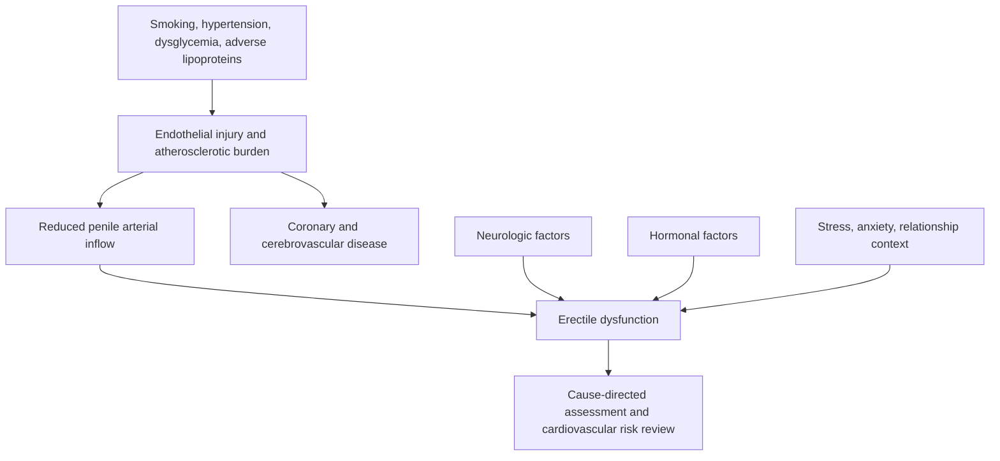

# Erectile dysfunction and vascular health

Erectile dysfunction (ED) is the persistent inability to obtain or maintain an erection sufficient for desired sexual activity. An erection requires coordinated arterial inflow, relaxation of cavernosal smooth muscle, restriction of venous outflow, intact neural signaling, and an adequate hormonal and psychological context. Failure at any layer can produce the same symptom, so ED is a syndrome rather than a single disease. Vascular dysfunction is a common cause and may become clinically apparent in penile arteries before larger coronary vessels because the penile vessels are smaller; the source describes ED as sometimes preceding recognized cardiovascular disease by roughly two to five years. (@RenaMalikMD (Rena Malik, M.D.) — "Want Stronger Erections for Years to Come? Your Blood May Hold the Answer", 2026-08-10, [link](https://www.youtube.com/watch?v=oFt7B9OAJPI))

## Lipoproteins and causal evidence

Apolipoprotein B (ApoB) is carried one-for-one on the major atherogenic lipoprotein particles, whereas apolipoprotein A-I (ApoA-I) is the principal structural protein of HDL particles. In a 224-man clinical cohort assessed with nocturnal penile tumescence and rigidity monitoring, lower ApoA-I, lower HDL cholesterol, higher ApoB, and a lower ApoA-I:ApoB ratio were associated with ED. Reported cut points included ApoA-I below 0.95 g/L and an ApoA-I:ApoB ratio below 1.26; low ApoA-I was associated with about 3.5-fold higher odds, while a higher ratio was associated with substantially lower odds. These cohort thresholds are associations from a small, geographically limited sample and are not universal diagnostic boundaries. (@RenaMalikMD (Rena Malik, M.D.) — "Want Stronger Erections for Years to Come? Your Blood May Hold the Answer", 2026-08-10, [link](https://www.youtube.com/watch?v=oFt7B9OAJPI))

The accompanying Mendelian-randomization analysis used genetic variants associated with apolipoprotein levels and ED outcomes from large biobanks. Because alleles are assigned before later lifestyle exposures, concordant genetic associations can reduce some confounding and reverse-causation problems. They do not automatically prove that changing ApoA-I itself will prevent ED: genetic instruments can affect multiple pathways, ancestry limits transportability, and lifelong genetically influenced exposure is not equivalent to a short clinical intervention. The transcript reports a total near 1,100 ED cases and 94,000 controls in this analysis and presents low ApoA-I as the stronger causal signal. (@RenaMalikMD (Rena Malik, M.D.) — "Want Stronger Erections for Years to Come? Your Blood May Hold the Answer", 2026-08-10, [link](https://www.youtube.com/watch?v=oFt7B9OAJPI))

Nocturnal erection monitoring can help distinguish impaired physiological erectile capacity from ED that occurs mainly while awake, but normal nocturnal erections do not reduce lived symptoms to being imaginary: attention, anxiety, medication effects, and relationship context can still be causal and treatable. A full assessment may therefore include cardiovascular and metabolic risk, medication and substance review, testosterone with appropriate follow-up testing, neurologic history, and psychological or relational factors. (@RenaMalikMD (Rena Malik, M.D.) — "Want Stronger Erections for Years to Come? Your Blood May Hold the Answer", 2026-08-10, [link](https://www.youtube.com/watch?v=oFt7B9OAJPI))

Loss of spontaneous or nocturnal erections can be an early sentinel because penile arteries are smaller than coronary arteries and may become functionally impaired earlier under shared endothelial and atherosclerotic stress. Florence Comite emphasizes this vascular interpretation and links it to diabetes and lipid disorders, but the symptom is not specific: sleep disruption, endocrine change, medicines, neurologic disease, and psychological context remain alternative or contributing pathways. (@maxlugavere (Max Lugavere) — "The Longevity Doctor: These 5 Biomarkers That Predict How Well You’ll Age!", 2026-07-22, [link](https://www.youtube.com/watch?v=_AM9XeATR2U)) [[proactive-health-monitoring]]

## Practical implications

- **When ED is persistent or new: seek a cause-directed clinical assessment rather than assuming aging or low testosterone — strong for evaluation, moderate for ED as an early vascular marker.** Include blood pressure, standard lipids, diabetes screening, smoking, medicines, and symptoms of cardiovascular disease; ApoB and ApoA-I may refine lipoprotein assessment but are not stand-alone ED tests. (@RenaMalikMD (Rena Malik, M.D.) — "Want Stronger Erections for Years to Come? Your Blood May Hold the Answer", 2026-08-10, [link](https://www.youtube.com/watch?v=oFt7B9OAJPI))
- **Weekly: accumulate at least 150 minutes of moderate aerobic activity when medically appropriate — strong for cardiovascular health, moderate for preserving erectile function.** Combine this with smoking cessation, blood-pressure and glucose control, and a fiber-rich Mediterranean-style dietary pattern rather than trying to raise HDL or ApoA-I as isolated targets. (@RenaMalikMD (Rena Malik, M.D.) — "Want Stronger Erections for Years to Come? Your Blood May Hold the Answer", 2026-08-10, [link](https://www.youtube.com/watch?v=oFt7B9OAJPI))
- **Urgently evaluate ED accompanied by exertional chest symptoms or other acute cardiovascular warning signs.** The transcript supports the shared vascular pathway but does not supply an emergency protocol; ordinary urgent-care guidance applies.

## Gaps & open questions

- Which change in spontaneous or nocturnal erections adds predictive value beyond age, symptoms, blood pressure, glycemia, smoking, and lipoproteins?

- Do ApoA-I or ApoA-I:ApoB measurements improve ED prediction beyond standard cardiovascular risk assessment and ApoB alone?
- Does treatment selected specifically from these apolipoprotein measures prevent incident ED or improve erections?
- How well do the reported thresholds generalize across ancestry, age, and comorbidity groups?
- What proportion of ED-associated cardiovascular events can be prevented by treating ED as an earlier screening opportunity?

## Related

[[nmr-blood-analysis]] · [[pcsk9-inhibition]] · [[visceral-and-ectopic-fat]] · [[male-fertility-and-exogenous-testosterone]] · [[proactive-health-monitoring]] · [[aging-model]] · [[practice-playbook]]
