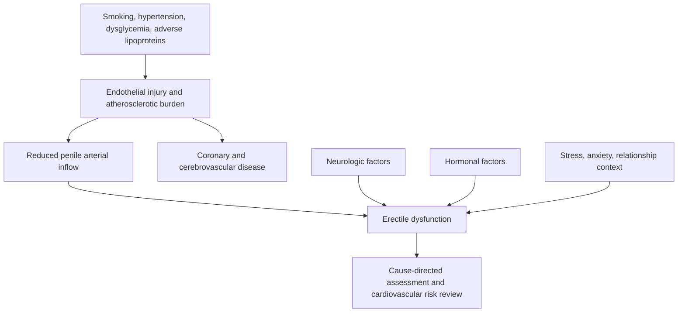

# Erectile dysfunction and vascular health

Erectile dysfunction (ED) is the persistent inability to obtain or maintain an erection sufficient for desired sexual activity. An erection requires coordinated arterial inflow, relaxation of cavernosal smooth muscle, restriction of venous outflow, intact neural signaling, and an adequate hormonal and psychological context. Failure at any layer can produce the same symptom, so ED is a syndrome rather than a single disease. Vascular dysfunction is a common cause and may become clinically apparent in penile arteries before larger coronary vessels because the penile vessels are smaller; the source describes ED as sometimes preceding recognized cardiovascular disease by roughly two to five years. (@RenaMalikMD (Rena Malik, M.D.) — "Want Stronger Erections for Years to Come? Your Blood May Hold the Answer", 2026-08-10, [link](https://www.youtube.com/watch?v=oFt7B9OAJPI))

```mermaid
flowchart TD
  R[Smoking, hypertension, dysglycemia, adverse lipoproteins] --> E[Endothelial injury and atherosclerotic burden]
  E --> P[Reduced penile arterial inflow]
  P --> ED[Erectile dysfunction]
  E --> C[Coronary and cerebrovascular disease]
  N[Neurologic factors] --> ED
  H[Hormonal factors] --> ED
  X[Stress, anxiety, relationship context] --> ED
  ED --> W[Cause-directed assessment and cardiovascular risk review]
```

## Lipoproteins and causal evidence

Apolipoprotein B (ApoB) is carried one-for-one on the major atherogenic lipoprotein particles, whereas apolipoprotein A-I (ApoA-I) is the principal structural protein of HDL particles. In a 224-man clinical cohort assessed with nocturnal penile tumescence and rigidity monitoring, lower ApoA-I, lower HDL cholesterol, higher ApoB, and a lower ApoA-I:ApoB ratio were associated with ED. Reported cut points included ApoA-I below 0.95 g/L and an ApoA-I:ApoB ratio below 1.26; low ApoA-I was associated with about 3.5-fold higher odds, while a higher ratio was associated with substantially lower odds. These cohort thresholds are associations from a small, geographically limited sample and are not universal diagnostic boundaries. (@RenaMalikMD (Rena Malik, M.D.) — "Want Stronger Erections for Years to Come? Your Blood May Hold the Answer", 2026-08-10, [link](https://www.youtube.com/watch?v=oFt7B9OAJPI))

The accompanying Mendelian-randomization analysis used genetic variants associated with apolipoprotein levels and ED outcomes from large biobanks. Because alleles are assigned before later lifestyle exposures, concordant genetic associations can reduce some confounding and reverse-causation problems. They do not automatically prove that changing ApoA-I itself will prevent ED: genetic instruments can affect multiple pathways, ancestry limits transportability, and lifelong genetically influenced exposure is not equivalent to a short clinical intervention. The transcript reports a total near 1,100 ED cases and 94,000 controls in this analysis and presents low ApoA-I as the stronger causal signal. (@RenaMalikMD (Rena Malik, M.D.) — "Want Stronger Erections for Years to Come? Your Blood May Hold the Answer", 2026-08-10, [link](https://www.youtube.com/watch?v=oFt7B9OAJPI))

Nocturnal erection monitoring can help distinguish impaired physiological erectile capacity from ED that occurs mainly while awake, but normal nocturnal erections do not reduce lived symptoms to being imaginary: attention, anxiety, medication effects, and relationship context can still be causal and treatable. A full assessment may therefore include cardiovascular and metabolic risk, medication and substance review, testosterone with appropriate follow-up testing, neurologic history, and psychological or relational factors. (@RenaMalikMD (Rena Malik, M.D.) — "Want Stronger Erections for Years to Come? Your Blood May Hold the Answer", 2026-08-10, [link](https://www.youtube.com/watch?v=oFt7B9OAJPI))

Treatment restores one component of sexual function rather than guaranteeing satisfying sex. Oral phosphodiesterase-5 inhibitors can improve rigidity when appropriate, while a penile prosthesis provides mechanical rigidity after less invasive options fail; neither substitutes for desire, arousal, comfort, communication, or partner context. The staged source also proposes short-term prescribed oral medication as a bridge for performance anxiety, but supplies no trial or selection criteria for that use. Firmer erections may reduce buckling during penetration, yet the claim that partial rigidity commonly causes Peyronie's disease was not substantiated in the transcript and should not be treated as an established causal estimate. (@RenaMalikMD (Rena Malik, M.D.) — "Why The Average Penis Is Better Than Most Men Think", 2026-07-29, [link](https://www.youtube.com/watch?v=P3UbnEG8aaI))

PDE5 inhibitors work downstream of nitric oxide by slowing cGMP degradation, thereby sustaining cavernosal smooth-muscle relaxation and blood inflow. Their vascular mechanism and observational associations with fewer cardiovascular events do not establish cardiovascular prevention; proposed brain and muscle benefits are still preclinical, observational, or based on small studies. Nitrate co-use is a major contraindication because convergent cGMP signaling can produce severe hypotension. (@RenaMalikMD (Rena Malik, M.D.) — "Why ED Pills May Protect Your Heart, Brain, and Make You Stronger", 2026-07-13, [link](https://www.youtube.com/watch?v=dLqPxKeYF04)) [[pde5-inhibitors]]

Loss of spontaneous or nocturnal erections can be an early sentinel because penile arteries are smaller than coronary arteries and may become functionally impaired earlier under shared endothelial and atherosclerotic stress. Florence Comite emphasizes this vascular interpretation and links it to diabetes and lipid disorders, but the symptom is not specific: sleep disruption, endocrine change, medicines, neurologic disease, and psychological context remain alternative or contributing pathways. (@maxlugavere (Max Lugavere) — "The Longevity Doctor: These 5 Biomarkers That Predict How Well You’ll Age!", 2026-07-22, [link](https://www.youtube.com/watch?v=_AM9XeATR2U)) [[proactive-health-monitoring]]

## Diet, supplements, and single-nutrient logic

Because ED is closely tied to endothelial function, nutrients that support cardiovascular health are repeatedly proposed as erection aids. The best current test of that logic for polyunsaturated fat is negative: a mixed-exposure analysis of NHANES 2001–2004 data (roughly 3,700 men aged 20+, just under 1,400 analyzed after propensity-score matching) modeled seven dietary fatty acids — linoleic, alpha-linolenic, stearidonic, arachidonic, EPA, DPA, and DHA — jointly, since intakes are highly correlated, and found no significant protection against self-reported ED individually or in combination. Limitations are real (cross-sectional design, one 24-hour recall, self-reported ED, no blood fatty-acid levels), but the finding undercuts the supplement-first strategy: benefit in one health domain does not automatically transfer to another, and dietary patterns such as the Mediterranean pattern remain better supported for the cardiometabolic substrate of erectile function than any single nutrient. What retains support for erectile function is the fundamentals — regular exercise, healthy weight, blood-pressure and blood-sugar control, not smoking, adequate sleep, and stress reduction. (@RenaMalikMD (Rena Malik, M.D.) — "Taking Fish Oil for Better Erections? The Research Says Something Different", 2026-07-20, [link](https://www.youtube.com/watch?v=HriavIhCp1I)) [[omega-3-fatty-acids]] [[supplement-evidence-and-safety]]

ED also interacts with ejaculatory timing: a man worried his erection will fail before orgasm tends to rush to finish, and sexual-medicine specialists identify this compensation as a driver of acquired premature ejaculation — which is why comorbid ED is assessed and treated before or alongside any latency-directed treatment, and why a patient who says only that he has an erection problem when the actual complaint is early ejaculation can leave with a prescription that will not help. A normal post-ejaculation refractory period that lengthens with age is likewise commonly misreported as ED and resolves with education. [[premature-ejaculation]] (@RenaMalikMD (Rena Malik, M.D.) — "The #1 Sex Mistake Men Make: Why Lasting Longer Doesn’t Mean Better Sex", 2026-08-14, [link](https://www.youtube.com/watch?v=aJlK0qZD-Xo))

Attribution of ED to pornography is a related misdirection with psychological cost. The claim that watching pornography causes erectile dysfunction is contradicted by the research summarized in the sources: the dysfunction-associated variable is moral incongruence — shame and anxiety about use in people who believe it is wrong — rather than the visual material itself, and shame-driven anxiety directly impairs sexual function. Young men referred for ED who have self-diagnosed "porn-induced ED" online are described as a common clinical presentation. The mechanism and boundaries are developed in [[pornography-motivation-and-sexual-health]]. (@RenaMalikMD (Rena Malik, M.D.) — "Watching Porn And Feeling Guilty? That Anxiety Could Be Hurting Your Sex Life", 2026-07-22, [link](https://www.youtube.com/watch?v=u0fCMM_xEy8))

## Practical implications

- **When ED is persistent or new: seek a cause-directed clinical assessment rather than assuming aging or low testosterone — strong for evaluation, moderate for ED as an early vascular marker.** Include blood pressure, standard lipids, diabetes screening, smoking, medicines, and symptoms of cardiovascular disease; ApoB and ApoA-I may refine lipoprotein assessment but are not stand-alone ED tests. (@RenaMalikMD (Rena Malik, M.D.) — "Want Stronger Erections for Years to Come? Your Blood May Hold the Answer", 2026-08-10, [link](https://www.youtube.com/watch?v=oFt7B9OAJPI))
- **Choose ED treatment for the diagnosed mechanism and the person's sexual goals — strong general principle; specific sequencing not reviewed here.** Medication or a prosthesis can improve rigidity but cannot by itself resolve pain, anxiety, desire, pelvic-floor dysfunction, or relationship barriers. (@RenaMalikMD (Rena Malik, M.D.) — "Why The Average Penis Is Better Than Most Men Think", 2026-07-29, [link](https://www.youtube.com/watch?v=P3UbnEG8aaI))
- **Weekly: accumulate at least 150 minutes of moderate aerobic activity when medically appropriate — strong for cardiovascular health, moderate for preserving erectile function.** Combine this with smoking cessation, blood-pressure and glucose control, and a fiber-rich Mediterranean-style dietary pattern rather than trying to raise HDL or ApoA-I as isolated targets. (@RenaMalikMD (Rena Malik, M.D.) — "Want Stronger Erections for Years to Come? Your Blood May Hold the Answer", 2026-08-10, [link](https://www.youtube.com/watch?v=oFt7B9OAJPI))
- **Do not buy fish oil (or another single supplement) as an erection strategy — moderate against, from a null mixed-exposure analysis and absent trial support.** Redirect the same effort to exercise, weight, blood pressure, glucose, smoking cessation, sleep, and stress — the modifiable drivers of the vascular substrate. (@RenaMalikMD (Rena Malik, M.D.) — "Taking Fish Oil for Better Erections? The Research Says Something Different", 2026-07-20, [link](https://www.youtube.com/watch?v=HriavIhCp1I))
- **Urgently evaluate ED accompanied by exertional chest symptoms or other acute cardiovascular warning signs.** The transcript supports the shared vascular pathway but does not supply an emergency protocol; ordinary urgent-care guidance applies.

## Gaps & open questions

- Which change in spontaneous or nocturnal erections adds predictive value beyond age, symptoms, blood pressure, glycemia, smoking, and lipoproteins?

- Do ApoA-I or ApoA-I:ApoB measurements improve ED prediction beyond standard cardiovascular risk assessment and ApoB alone?
- Does treatment selected specifically from these apolipoprotein measures prevent incident ED or improve erections?
- How well do the reported thresholds generalize across ancestry, age, and comorbidity groups?
- What proportion of ED-associated cardiovascular events can be prevented by treating ED as an earlier screening opportunity?

## Related

[[nmr-blood-analysis]] · [[pcsk9-inhibition]] · [[visceral-and-ectopic-fat]] · [[male-fertility-and-exogenous-testosterone]] · [[testosterone-replacement-therapy]] · [[pde5-inhibitors]] · [[genital-modification-and-sexual-function]] · [[omega-3-fatty-acids]] · [[pornography-motivation-and-sexual-health]] · [[premature-ejaculation]] · [[sexual-desire-arousal-and-aging]] · [[rena-malik]] · [[proactive-health-monitoring]] · [[aging-model]] · [[practice-playbook]]
