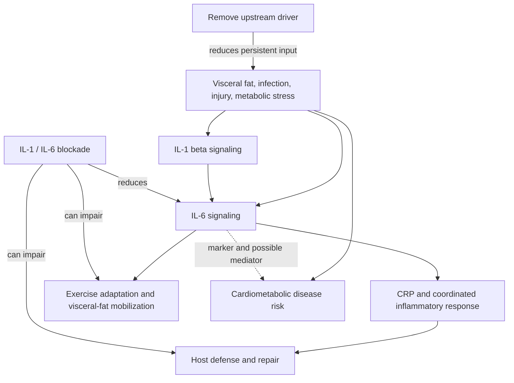

# Inflammaging and IL-6 signaling

Inflammaging is the age-associated rise in persistent, low-grade inflammatory activity in the absence of an acute infection. Interleukin-6 (IL-6) is one component of this state: circulating IL-6 is often higher in older adults and high concentrations are associated with mortality, strength loss, and earlier loss of independence. These associations make IL-6 a risk marker, but they do not by themselves establish that removing IL-6 will reverse aging or prevent disease. (@DrBradStanfield (Dr Brad Stanfield) — "Wrong About Inflammation & Heart Disease (new study)", 2026-08-09, [link](https://www.youtube.com/watch?v=tR0ueKzXmZ8))

## Context-dependent signaling

IL-6 is not simply a toxin. It is a signaling cytokine whose meaning depends on its source, timing, concentration, and the tissue receiving the signal. Acute IL-6 participates in infection defense, tissue repair, and the metabolic response to exercise; chronic elevation can instead reflect persistent input from visceral adipose tissue, infection, injury, or metabolic stress. CRP is a downstream inflammatory marker and similarly reports pathway activity without identifying its cause. (@DrBradStanfield (Dr Brad Stanfield) — "Wrong About Inflammation & Heart Disease (new study)", 2026-08-09, [link](https://www.youtube.com/watch?v=tR0ueKzXmZ8))

## Evidence from genetics and trials

Mendelian-randomization studies associate genetically reduced IL-6 signaling with lower coronary risk and possibly longer life. This supports a causal role for the pathway, but genetic exposure is lifelong, modest, and may not reproduce the pharmacology of abruptly neutralizing a circulating cytokine in later life. (@DrBradStanfield (Dr Brad Stanfield) — "Wrong About Inflammation & Heart Disease (new study)", 2026-08-09, [link](https://www.youtube.com/watch?v=tR0ueKzXmZ8))

Interventional results depend on target and population. In CANTOS, blocking IL-1β upstream of IL-6 in 10,061 people with prior myocardial infarction and elevated CRP reduced major cardiovascular events by about 15% without lowering cholesterol, but increased fatal infection. Low-dose methotrexate did not reduce cardiovascular events in a nearly 5,000-person trial and also failed to lower IL-6, CRP, or IL-1β, so it did not cleanly test whether suppressing this pathway prevents events. (@DrBradStanfield (Dr Brad Stanfield) — "Wrong About Inflammation & Heart Disease (new study)", 2026-08-09, [link](https://www.youtube.com/watch?v=tR0ueKzXmZ8))

The newer ZEUS trial provides a sharper challenge to cytokine-centered treatment: among more than 6,300 statin-treated people with residual inflammation and mean LDL cholesterol around 77 mg/dL, direct IL-6 removal lowered IL-6 and CRP but did not reduce cardiovascular events (hazard ratio 0.99) and increased infection. The result weakens the proposition that lowering these inflammatory messengers is sufficient, while leaving open whether inflammation remains a mediator and whether other inflammatory targets or upstream-cause treatment can reduce risk. (@DrBradStanfield (Dr Brad Stanfield) — "Wrong About Inflammation & Heart Disease (new study)", 2026-08-09, [link](https://www.youtube.com/watch?v=tR0ueKzXmZ8))

IL-6 blockade also prevented the visceral-fat reduction normally produced by 12 weeks of cycling in a trial of adults with abdominal obesity. This supports a functional role for exercise-induced IL-6 signaling and illustrates why chronic basal inflammation and transient exercise signaling should not be treated as biologically interchangeable. (@DrBradStanfield (Dr Brad Stanfield) — "Wrong About Inflammation & Heart Disease (new study)", 2026-08-09, [link](https://www.youtube.com/watch?v=tR0ueKzXmZ8))

## Practical implications

- **At routine cardiometabolic reviews: interpret CRP or IL-6 as context-dependent signals, not standalone treatment targets — moderate.** Investigate and treat plausible upstream contributors such as [[visceral-and-ectopic-fat]], smoking, insulin resistance, blood pressure, and infection while managing ApoB-related risk independently. (@DrBradStanfield (Dr Brad Stanfield) — "Wrong About Inflammation & Heart Disease (new study)", 2026-08-09, [link](https://www.youtube.com/watch?v=tR0ueKzXmZ8))
- **Weekly: retain regular exercise rather than trying to suppress its transient inflammatory signaling — strong for exercise benefit, moderate for the specific IL-6 mechanism.** A temporary cytokine rise during exercise need not mean harmful chronic inflammation. (@DrBradStanfield (Dr Brad Stanfield) — "Wrong About Inflammation & Heart Disease (new study)", 2026-08-09, [link](https://www.youtube.com/watch?v=tR0ueKzXmZ8))
- **Do not use broad cytokine blockade as a self-directed anti-aging strategy — strong.** Direct IL-6 suppression failed to reduce cardiovascular events in ZEUS and increased infections; any anti-inflammatory drug belongs to indication-specific clinical decision-making. (@DrBradStanfield (Dr Brad Stanfield) — "Wrong About Inflammation & Heart Disease (new study)", 2026-08-09, [link](https://www.youtube.com/watch?v=tR0ueKzXmZ8))

## Gaps & open questions

- Why did upstream IL-1β blockade reduce events while direct IL-6 removal did not: target biology, drug properties, population, or chance?
- Which sources, temporal patterns, or downstream branches of IL-6 distinguish harmful chronic signaling from useful acute signaling?
- Does reducing visceral fat lower events specifically through inflammatory mediation, or mainly through parallel metabolic changes?
- Can an inflammatory intervention preserve infection defense and exercise adaptation while reducing vascular inflammation?
- Does any manipulation of this pathway change organism-level aging rather than selected disease risk?

## Related

[[visceral-and-ectopic-fat]] · [[glp-1-receptor-agonists]] · [[ezetimibe]] · [[aging-model]] · [[practice-playbook]]
