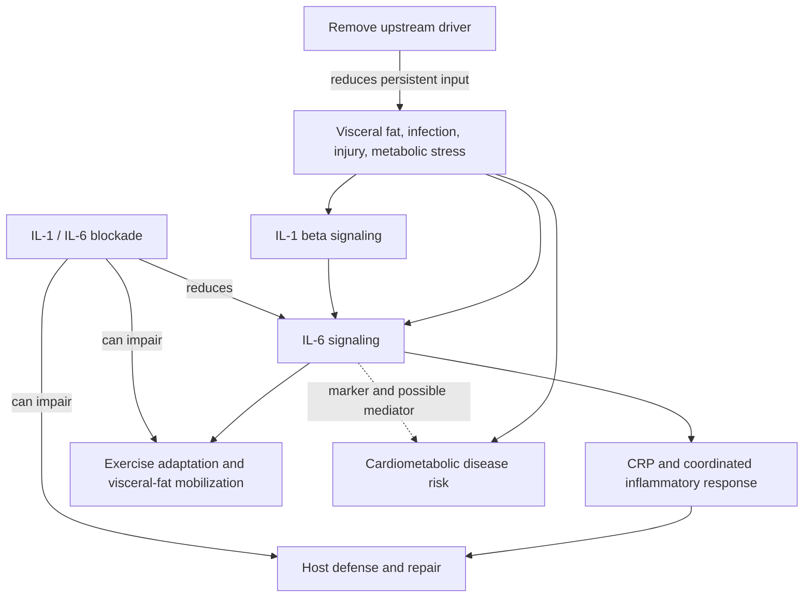

# Inflammaging and IL-6 signaling

Inflammaging is the age-associated rise in persistent, low-grade inflammatory activity in the absence of an acute infection. Interleukin-6 (IL-6) is one component of this state: circulating IL-6 is often higher in older adults and high concentrations are associated with mortality, strength loss, and earlier loss of independence. These associations make IL-6 a risk marker, but they do not by themselves establish that removing IL-6 will reverse aging or prevent disease. (@DrBradStanfield (Dr Brad Stanfield) — "Wrong About Inflammation & Heart Disease (new study)", 2026-08-09, [link](https://www.youtube.com/watch?v=tR0ueKzXmZ8))

## Context-dependent signaling

IL-6 is not simply a toxin. It is a signaling cytokine whose meaning depends on its source, timing, concentration, and the tissue receiving the signal. Acute IL-6 participates in infection defense, tissue repair, and the metabolic response to exercise; chronic elevation can instead reflect persistent input from visceral adipose tissue, infection, injury, or metabolic stress. CRP is a downstream inflammatory marker and similarly reports pathway activity without identifying its cause. (@DrBradStanfield (Dr Brad Stanfield) — "Wrong About Inflammation & Heart Disease (new study)", 2026-08-09, [link](https://www.youtube.com/watch?v=tR0ueKzXmZ8))

```mermaid
flowchart TD
  DRIVERS[Visceral fat, infection, injury, metabolic stress] --> IL1[IL-1 beta signaling]
  DRIVERS --> IL6[IL-6 signaling]
  IL1 --> IL6
  IL6 --> CRP[CRP and coordinated inflammatory response]
  CRP --> DEF[Host defense and repair]
  IL6 --> EX[Exercise adaptation and visceral-fat mobilization]
  DRIVERS --> RISK[Cardiometabolic disease risk]
  IL6 -. marker and possible mediator .-> RISK
  BLOCK[IL-1 / IL-6 blockade] -->|reduces| IL6
  BLOCK -->|can impair| DEF
  BLOCK -->|can impair| EX
  CAUSE[Remove upstream driver] -->|reduces persistent input| DRIVERS
```

## Resolution as a distinct process from suppression

Inflammation does not end passively when its trigger clears; termination is an actively signaled programme. Long-chain omega-3 fatty acids are substrates for that programme: EPA yields E-series resolvins, DHA yields D-series resolvins, protectins, and neuroprotectins, and these specialized pro-resolving mediators drive the switch from recruitment to clearance and repair rather than blocking cytokine signaling upstream. The distinction predicts different harm profiles for the two strategies: pharmacological blockade removes the signal and with it part of host defense — the infection excess seen in the blockade trials below — whereas resolution ends a response on schedule and leaves the initiating signal available. The mechanism is well characterized in human and animal tissue; that supplying more substrate improves clinical outcomes is a separate and much weaker claim, and no resolution-directed intervention has an outcome trial comparable to the blockade trials. [[omega-3-fatty-acids]] (FoundMyFitness — "How Omega-3s May Slow Biological Aging (New Evidence)", 2026-04-06, [link](https://www.youtube.com/watch?v=nmReeTIZMos))

An extreme-longevity cohort supplies the strongest observational argument that this axis matters at the organism level. In a Japanese study comparing older adults, centenarians, semi-supercentenarians (105+), and supercentenarians (110+), the capacity to keep inflammatory markers suppressed was reported as the only measured biomarker predicting progression to each successive longevity stage — glucose, lipids, and kidney and liver function did not — and it also tracked retained cognitive function. This is a cross-sectional and prospective comparison among survivors, so it identifies an axis rather than a lever: low inflammation in extreme survivors may report on the absence of disease as readily as on a protective capacity, and the ZEUS result below shows that lowering a downstream marker pharmacologically does not inherit the association's benefit. (FoundMyFitness — "How Omega-3s May Slow Biological Aging (New Evidence)", 2026-04-06, [link](https://www.youtube.com/watch?v=nmReeTIZMos))

The same chronic inflammatory tone has a brain-facing output: circulating cytokines cross the blood–brain barrier by several routes, modulate interoceptive circuits, and are proposed to drive an inflammatory subtype of depression and to accelerate (not initiate) neurodegenerative progression — the neuroimmune mechanism, its candidate sources (obesity, microbiome, gum disease, menopause, aging, early-life stress), and its evidence limits are developed at [[inflammation-and-depression]]. (@joinzoe (ZOE) — "Doctors are ignoring the root cause! What inflammation is really doing to your mind and body", 2026-06-11, [link](https://www.youtube.com/watch?v=EVqoCjYFhT0))

A third input to chronic inflammatory tone arrives from the gut on a per-meal basis: endotoxin (lipopolysaccharide) crosses transiently loosened intestinal junctions after eating, in amounts that vary with meal composition and mucosal integrity. This postprandial inflammatory response is a proposed contributor to both atherogenesis and mood symptoms, and is developed with its evidence limits in [[omega-3-fatty-acids]] and [[food-patterns-and-gut-ecology]]. (FoundMyFitness — "How Omega-3s May Slow Biological Aging (New Evidence)", 2026-04-06, [link](https://www.youtube.com/watch?v=nmReeTIZMos))

## Evidence from genetics and trials

Mendelian-randomization studies associate genetically reduced IL-6 signaling with lower coronary risk and possibly longer life. This supports a causal role for the pathway, but genetic exposure is lifelong, modest, and may not reproduce the pharmacology of abruptly neutralizing a circulating cytokine in later life. (@DrBradStanfield (Dr Brad Stanfield) — "Wrong About Inflammation & Heart Disease (new study)", 2026-08-09, [link](https://www.youtube.com/watch?v=tR0ueKzXmZ8))

Interventional results depend on target and population. In CANTOS, blocking IL-1β upstream of IL-6 in 10,061 people with prior myocardial infarction and elevated CRP reduced major cardiovascular events by about 15% without lowering cholesterol, but increased fatal infection. Low-dose methotrexate did not reduce cardiovascular events in a nearly 5,000-person trial and also failed to lower IL-6, CRP, or IL-1β, so it did not cleanly test whether suppressing this pathway prevents events. (@DrBradStanfield (Dr Brad Stanfield) — "Wrong About Inflammation & Heart Disease (new study)", 2026-08-09, [link](https://www.youtube.com/watch?v=tR0ueKzXmZ8))

The newer ZEUS trial provides a sharper challenge to cytokine-centered treatment: among more than 6,300 statin-treated people with residual inflammation and mean LDL cholesterol around 77 mg/dL, direct IL-6 removal lowered IL-6 and CRP but did not reduce cardiovascular events (hazard ratio 0.99) and increased infection. The result weakens the proposition that lowering these inflammatory messengers is sufficient, while leaving open whether inflammation remains a mediator and whether other inflammatory targets or upstream-cause treatment can reduce risk. (@DrBradStanfield (Dr Brad Stanfield) — "Wrong About Inflammation & Heart Disease (new study)", 2026-08-09, [link](https://www.youtube.com/watch?v=tR0ueKzXmZ8))

IL-6 blockade also prevented the visceral-fat reduction normally produced by 12 weeks of cycling in a trial of adults with abdominal obesity. This supports a functional role for exercise-induced IL-6 signaling and illustrates why chronic basal inflammation and transient exercise signaling should not be treated as biologically interchangeable. (@DrBradStanfield (Dr Brad Stanfield) — "Wrong About Inflammation & Heart Disease (new study)", 2026-08-09, [link](https://www.youtube.com/watch?v=tR0ueKzXmZ8))

A metabolic-repletion route into this pathway has trial-level biomarker support: oral nicotinamide riboside (~1 g/day) lowered inflammatory markers including IL-6 across several randomized trials — first as a secondary finding in a crossover trial in older men whose grip-strength primary endpoint failed, later with inflammatory sputum markers as the prespecified primary endpoint in a COPD population. The proposed mechanism is rebuilding an NAD system consumed by inflammatory PARP activation rather than blocking a cytokine, which would leave host defense intact ([[nad-metabolism]]). The claim states matter here: the trial summary comes from the NR pathway's discoverer, who advises the leading NR manufacturer; secondary-endpoint findings carry a multiplicity problem; and — the lesson of ZEUS above — lowering IL-6 is not itself an outcome benefit. Whether the biomarker effect translates to function or disease events is unresolved and is the crux of [[nad-precursors-and-healthy-aging]]. (FoundMyFitness — "How To Boost NAD Levels To Fight Inflammation, Improve Recovery, and Slow Aging", 2026-02-10, [link](https://www.youtube.com/watch?v=ELcVYRJJdK4))

A behavioral route into the same marker now has randomized support: an average of five minutes daily of app-guided contemplative practice for 28 days produced a significant IL-6 decrease measured three months after the trial ended, versus untreated controls, in roughly 1,200 moderately depressed US adults — with parallel reports of a more robust flu-vaccine antibody response and butyrate-pathway gut-microbiome changes. The claim states matter as much as they do for NR above: the results are investigator-reported (the app's producer is a nonprofit founded by the investigator), the durability trial is not yet peer-reviewed, the population was depressed rather than general, the comparator was untreated rather than active, and — the ZEUS lesson again — lowering IL-6 is not itself an outcome benefit. What the behavioral route uniquely offers is a cost and harm profile compatible with universal use while the outcome question stays open; unlike blockade it removes no signal and should leave host defense intact. Mechanistic details and practice formats live at [[meditation-and-contemplative-training]]. (FoundMyFitness — "Meditation Does Far More Than Reduce Stress | Dr. Richard Davidson", 2026-08-26, [link](https://www.youtube.com/watch?v=3NiQF9_Vxi8))

## Practical implications

- **At routine cardiometabolic reviews: interpret CRP or IL-6 as context-dependent signals, not standalone treatment targets — moderate.** Investigate and treat plausible upstream contributors such as [[visceral-and-ectopic-fat]], smoking, insulin resistance, blood pressure, and infection while managing ApoB-related risk independently. (@DrBradStanfield (Dr Brad Stanfield) — "Wrong About Inflammation & Heart Disease (new study)", 2026-08-09, [link](https://www.youtube.com/watch?v=tR0ueKzXmZ8))
- **Weekly: retain regular exercise rather than trying to suppress its transient inflammatory signaling — strong for exercise benefit, moderate for the specific IL-6 mechanism.** A temporary cytokine rise during exercise need not mean harmful chronic inflammation. (@DrBradStanfield (Dr Brad Stanfield) — "Wrong About Inflammation & Heart Disease (new study)", 2026-08-09, [link](https://www.youtube.com/watch?v=tR0ueKzXmZ8))
- **Do not use broad cytokine blockade as a self-directed anti-aging strategy — strong.** Direct IL-6 suppression failed to reduce cardiovascular events in ZEUS and increased infections; any anti-inflammatory drug belongs to indication-specific clinical decision-making. (@DrBradStanfield (Dr Brad Stanfield) — "Wrong About Inflammation & Heart Disease (new study)", 2026-08-09, [link](https://www.youtube.com/watch?v=tR0ueKzXmZ8))

## Gaps & open questions

- Why did upstream IL-1β blockade reduce events while direct IL-6 removal did not: target biology, drug properties, population, or chance?
- Which sources, temporal patterns, or downstream branches of IL-6 distinguish harmful chronic signaling from useful acute signaling?
- Does reducing visceral fat lower events specifically through inflammatory mediation, or mainly through parallel metabolic changes?
- Can an inflammatory intervention preserve infection defense and exercise adaptation while reducing vascular inflammation?
- Does any manipulation of this pathway change organism-level aging rather than selected disease risk?
- Does a resolution-directed strategy (supplying pro-resolving-mediator substrate) lower events without the infection cost seen with cytokine blockade, and has it ever been tested head-to-head?
- Is low inflammatory tone in extreme survivors a protective capacity or a readout of absent disease?
- Does postprandial endotoxemia contribute measurably to chronic inflammatory tone in free-living people, and does reducing it change any clinical endpoint?
- Does the NAD-repletion route (raising supply consumed by inflammation) differ in outcome from cytokine blockade (suppressing the signal), as its mechanism predicts?
- Do the meditation IL-6 and vaccine-response findings replicate in non-depressed populations, against active controls, in trials independent of the program's developers — and does any behavioral inflammation reduction change a clinical endpoint?

## Related

[[visceral-and-ectopic-fat]] · [[inflammation-and-depression]] · [[omega-3-fatty-acids]] · [[food-patterns-and-gut-ecology]] · [[glp-1-receptor-agonists]] · [[ezetimibe]] · [[nad-metabolism]] · [[nad-supplementation]] · [[nad-precursors-and-healthy-aging]] · [[meditation-and-contemplative-training]] · [[aging-model]] · [[practice-playbook]]
