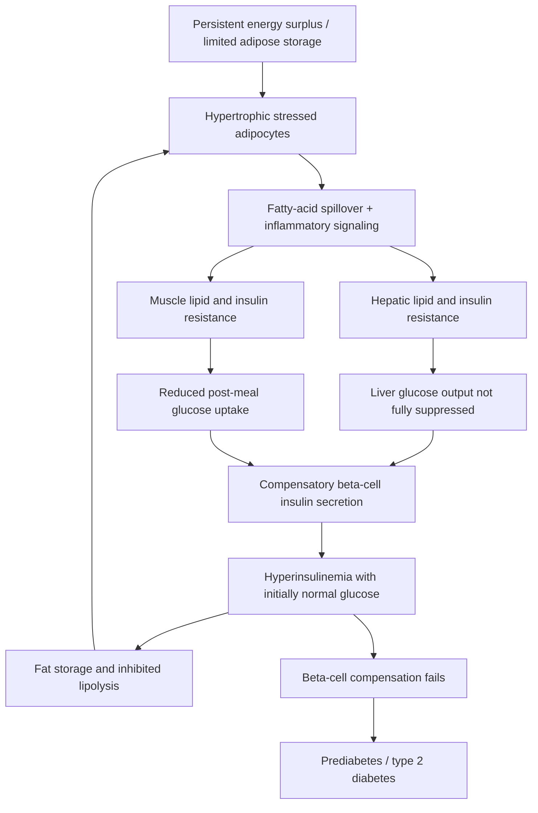

# Insulin resistance

Insulin resistance is a reduced biological response to a given insulin concentration. It is tissue-specific: muscle may require more insulin to take up glucose, liver may inadequately suppress glucose production, and adipose tissue may inadequately restrain lipolysis. Pancreatic beta cells can initially compensate by secreting more insulin, so fasting glucose may remain normal while insulin exposure is already elevated. This is why normal glucose alone does not exclude early insulin resistance. (@FoundMyFitness (FoundMyFitness) — "Dr. Ben Bikman: How To Reverse Insulin Resistance Through Diet, Exercise, & Sleep", 2025-07-15, [link](https://www.youtube.com/watch?v=gMyosH19G24))

## Tissue mechanisms and feedback

When adipocytes exceed safe storage capacity, they enlarge, become stressed, and release more fatty acids and inflammatory signals. Lipid then accumulates in liver and muscle, where lipid intermediates interfere with insulin signaling. The liver continues exporting glucose and triglyceride-rich particles; muscle clears less post-meal glucose; compensatory hyperinsulinemia restrains fat release only incompletely. Individual sequence varies: adipose dysfunction can initiate the loop, but hepatic or muscle resistance may dominate a measured phenotype. (@FoundMyFitness (FoundMyFitness) — "Dr. Ben Bikman: How To Reverse Insulin Resistance Through Diet, Exercise, & Sleep", 2025-07-15, [link](https://www.youtube.com/watch?v=gMyosH19G24)) [[visceral-and-ectopic-fat]]

Compensatory hyperinsulinemia is increasingly treated as an exposure in its own right rather than a passive marker. Beyond its fat-storage and appetite effects, mechanistic work in mice locates an insulin-receptor-dependent pathway by which hyperinsulinemia drives pancreatic acinar cells to overproduce digestive enzymes, injuring the pancreas and promoting tumor initiation — one concrete disease route through which years of compensated insulin resistance may matter even while glucose remains normal ([[metabolic-drivers-of-pancreatic-cancer]]). (@Physionic (Physionic) — "Pancreatic Cancer Risk is High - Why?", 2026-08-27, [link](https://www.youtube.com/watch?v=gr8mi7dvE5A))

The energy-balance and carbohydrate–insulin accounts are not mutually exclusive at the mechanistic level but disagree about priority. Energy conservation governs long-term body-energy change; insulin helps partition fuel and influences hunger and lipolysis, but elevated insulin does not create energy from nothing. Ben Bikman's stronger position is that lowering insulin exposure first can make spontaneous energy reduction easier and that refined carbohydrate plus saturated fat is more metabolically disruptive than either nutrient considered without context. That is a mechanistic and clinical interpretation, not proof that one macronutrient ratio is universally superior. (@FoundMyFitness (FoundMyFitness) — "Dr. Ben Bikman: How To Reverse Insulin Resistance Through Diet, Exercise, & Sleep", 2025-07-15, [link](https://www.youtube.com/watch?v=gMyosH19G24)) [[energy-balance-and-calorie-counting]] [[ketogenic-diet-apob-and-atherosclerosis]]

## Measurement and causal limits

Fasting glucose and HbA1c detect dysglycemia after compensation is strained; fasting insulin, glucose–insulin combinations, oral glucose tolerance with insulin measurements, triglyceride-to-HDL patterns, waist and ectopic-fat measures can provide earlier clues but are not interchangeable or universally standardized diagnostic tests. Continuous glucose monitors show glucose excursions, not insulin action directly, and a normal trace cannot prove insulin sensitivity. Acanthosis nigricans—a thick, velvety plaque often found on the posterior neck or in folds—and skin tags can be clinical clues but are neither necessary nor sufficient. Hyperinsulinemia and insulin-like-growth-factor signaling provide a plausible keratinocyte-proliferation mechanism; the finding is not dirt and scrubbing does not address the driver. (@FoundMyFitness (FoundMyFitness) — "Dr. Ben Bikman: How To Reverse Insulin Resistance Through Diet, Exercise, & Sleep", 2025-07-15, [link](https://www.youtube.com/watch?v=gMyosH19G24)) (@DrDrayzday (Dr Dray) — "7 Skin Signs That Could Reveal a Health Problem | Dermatologist Explains", 2026-08-26, [link](https://www.youtube.com/watch?v=QKDlc1r8fQk)) [[cutaneous-signs-of-systemic-disease]]

Acute sleep loss can reduce measured insulin sensitivity, and chronic circadian disruption, inactivity, excess visceral fat, smoking and air pollution plausibly reinforce the phenotype. Exercise creates insulin-independent muscle glucose uptake during contraction and improves subsequent insulin signaling; resistance training also expands the principal glucose-disposal tissue. The transcript's claim that strength training categorically beats aerobic work is too broad: both modalities act through partly different pathways and their comparative effect depends on dose, baseline fitness, and outcome. (@FoundMyFitness (FoundMyFitness) — "Dr. Ben Bikman: How To Reverse Insulin Resistance Through Diet, Exercise, & Sleep", 2025-07-15, [link](https://www.youtube.com/watch?v=gMyosH19G24)) [[sleep-quality-and-circadian-alignment]] [[environmental-pollution-and-health]]

## Practical implications

- **Daily and weekly: use a sustainable energy-appropriate dietary pattern, minimize refined carbohydrate and sugar-sweetened drinks, accumulate regular movement, and perform both resistance and aerobic training — strong for risk-factor improvement; no universal carbohydrate threshold.** Prefer changes that improve waist, fitness, strength, glucose status, and adherence without worsening ApoB or nutritional adequacy. (@FoundMyFitness (FoundMyFitness) — "Dr. Ben Bikman: How To Reverse Insulin Resistance Through Diet, Exercise, & Sleep", 2025-07-15, [link](https://www.youtube.com/watch?v=gMyosH19G24))
- **Daily: protect adequate sleep and avoid making large late-night meals routine — moderate.** One poor night can acutely impair insulin sensitivity, but a rigid dinner cutoff or a promised 90-day reversal is not established for everyone. (@FoundMyFitness (FoundMyFitness) — "Dr. Ben Bikman: How To Reverse Insulin Resistance Through Diet, Exercise, & Sleep", 2025-07-15, [link](https://www.youtube.com/watch?v=gMyosH19G24))
- **At routine risk review: interpret glucose in context of waist, triglycerides, HDL, blood pressure, family history, medications, sleep, and adiposity — strong as integrated assessment; investigational for routine fasting-insulin thresholds.** Do not diagnose or treat from a consumer glucose trace alone. (@FoundMyFitness (FoundMyFitness) — "Dr. Ben Bikman: How To Reverse Insulin Resistance Through Diet, Exercise, & Sleep", 2025-07-15, [link](https://www.youtube.com/watch?v=gMyosH19G24))
- **Do not use vinegar, ketone supplements, cold exposure, or self-sourced insulin as primary treatment — strong safety boundary for insulin; limited or absent outcome evidence for the adjuncts.** Prescription metabolic therapy is indication- and clinician-directed. (@FoundMyFitness (FoundMyFitness) — "Dr. Ben Bikman: How To Reverse Insulin Resistance Through Diet, Exercise, & Sleep", 2025-07-15, [link](https://www.youtube.com/watch?v=gMyosH19G24))

## Gaps & open questions

- Which practical measure best detects compensated insulin resistance before dysglycemia and changes an outcome-relevant decision?
- In which people does hepatic, muscle, or adipose resistance arise first?
- How much benefit of low-carbohydrate diets is mediated by insulin exposure versus protein, food selection, appetite, and energy intake?
- Which meal timing changes add durable benefit after diet quality, energy balance, activity, and sleep are controlled?
- Which benefits of GLP-1-class drugs are independent of weight loss?

## Related

[[visceral-and-ectopic-fat]] · [[metabolic-liver-disease]] · [[metabolic-drivers-of-pancreatic-cancer]] · [[energy-balance-and-calorie-counting]] · [[free-sugars-and-glycemic-response]] · [[cutaneous-signs-of-systemic-disease]] · [[glp-1-receptor-agonists]] · [[sleep-quality-and-circadian-alignment]] · [[aging-model]] · [[practice-playbook]]
