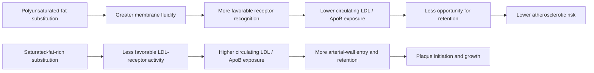

# Lipoprotein retention and atherogenesis

Atherosclerosis begins when ApoB-containing lipoproteins enter and are retained in the arterial wall. LDL concentration is therefore not merely correlated with events: particle exposure over time supplies the substrate for plaque initiation and growth. Mendelian-randomization evidence shows a consistent dose–response between lifelong lower LDL/ApoB and lower cardiovascular risk across different genetic mechanisms, which makes cumulative ApoB exposure a causal pathway rather than a stand-alone biomarker. (@PeterAttiaMD (Peter Attia MD) — "380 ‒ The seed oil debate: are they uniquely harmful relative to other dietary fats?", 2026-01-19, [link](https://www.youtube.com/watch?v=iB49uq-t1UM))

Diet changes this pathway partly through hepatic LDL-receptor behavior. Compared isocalorically with saturated fat, polyunsaturated fat increases membrane fluidity, supports LDL-receptor recognition, reduces LDL aggregation, and lowers circulating LDL by roughly 15%; monounsaturated fat has a smaller favorable effect. Although adding double bonds can make each fatty acid more chemically oxidizable, the net pathway can still improve because fewer particles circulate, remain available for retention, or aggregate. This distinction prevents a molecular property of one lipid from being mistaken for whole-person cardiovascular risk. [[dietary-fat-quality-and-cardiovascular-risk]] (@PeterAttiaMD (Peter Attia MD) — "380 ‒ The seed oil debate: are they uniquely harmful relative to other dietary fats?", 2026-01-19, [link](https://www.youtube.com/watch?v=iB49uq-t1UM))

The vascular consequence is not confined to coronary disease. High LDL cholesterol was added to the 2024 Lancet dementia-risk framework, and sustained hypertension and diabetes can injure the cerebral microvasculature in parallel. LDL-C is an imperfect proxy for particle burden; ApoB more directly counts atherogenic particles, while Lp(a) identifies an inherited particle-related risk that usually needs measurement only once. The transcript's claim that this process is completely preventable overstates what risk-factor control can guarantee, but cumulative exposure is modifiable and links the cardiovascular and brain-maintenance branches of [[aging-model]]. [[cognitive-reserve-and-brain-health]] (@NutritionMadeSimple (Nutrition Made Simple!) — "The REAL Dementia Risk Factors Doctors Won't Tell You", 2026-05-08, [link](https://www.youtube.com/watch?v=Tyy4UZO_MwI))

## Gaps & open questions

- How much of the cardiovascular effect of dietary fat substitution is mediated through ApoB versus blood pressure, thrombosis, inflammation, or other pathways?
- Once ApoB is pharmacologically controlled, does saturated-fat intake retain an independent outcome effect?
- Which particle properties add useful risk information beyond particle number and cumulative exposure?
- How much dementia risk attributed to LDL is mediated by large-vessel atherosclerosis, cerebral small-vessel disease, mixed pathology, or correlated metabolic exposures?

## Practical implications

- **Treat LDL/ApoB exposure as cumulative and causal — strong.** Interpret dietary and pharmacologic changes by their effect on long-term particle burden and absolute cardiovascular risk, not by short-term oxidation narratives alone. (@PeterAttiaMD (Peter Attia MD) — "380 ‒ The seed oil debate: are they uniquely harmful relative to other dietary fats?", 2026-01-19, [link](https://www.youtube.com/watch?v=iB49uq-t1UM))
- **Prefer unsaturated fat when replacing saturated fat — strong for LDL lowering, moderate-to-strong for cardiovascular outcomes.** The substitution, rather than adding oil without changing the rest of the diet, is the active comparison. [[dietary-fat-quality-and-cardiovascular-risk]] (@PeterAttiaMD (Peter Attia MD) — "380 ‒ The seed oil debate: are they uniquely harmful relative to other dietary fats?", 2026-01-19, [link](https://www.youtube.com/watch?v=iB49uq-t1UM))

## Related

[[dietary-fat-quality-and-cardiovascular-risk]] · [[food-label-literacy-and-health-halos]] · [[cognitive-reserve-and-brain-health]] · [[seed-oils]] · [[ezetimibe]] · [[pcsk9-inhibition]] · [[ketogenic-diet-apob-and-atherosclerosis]] · [[aging-model]] · [[practice-playbook]]
