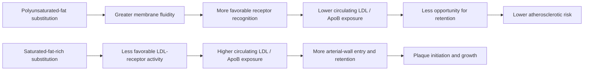

# Lipoprotein retention and atherogenesis

Atherosclerosis begins when ApoB-containing lipoproteins enter and are retained in the arterial wall. LDL concentration is therefore not merely correlated with events: particle exposure over time supplies the substrate for plaque initiation and growth. Mendelian-randomization evidence shows a consistent dose–response between lifelong lower LDL/ApoB and lower cardiovascular risk across different genetic mechanisms, which makes cumulative ApoB exposure a causal pathway rather than a stand-alone biomarker. (@PeterAttiaMD (Peter Attia MD) — "380 ‒ The seed oil debate: are they uniquely harmful relative to other dietary fats?", 2026-01-19, [link](https://www.youtube.com/watch?v=iB49uq-t1UM))

Diet changes this pathway partly through hepatic LDL-receptor behavior. Compared isocalorically with saturated fat, polyunsaturated fat increases membrane fluidity, supports LDL-receptor recognition, reduces LDL aggregation, and lowers circulating LDL by roughly 15%; monounsaturated fat has a smaller favorable effect. Although adding double bonds can make each fatty acid more chemically oxidizable, the net pathway can still improve because fewer particles circulate, remain available for retention, or aggregate. This distinction prevents a molecular property of one lipid from being mistaken for whole-person cardiovascular risk. [[dietary-fat-quality-and-cardiovascular-risk]] (@PeterAttiaMD (Peter Attia MD) — "380 ‒ The seed oil debate: are they uniquely harmful relative to other dietary fats?", 2026-01-19, [link](https://www.youtube.com/watch?v=iB49uq-t1UM))

The vascular consequence is not confined to coronary disease. High LDL cholesterol was added to the 2024 Lancet dementia-risk framework, and sustained hypertension and diabetes can injure the cerebral microvasculature in parallel. LDL-C is an imperfect proxy for particle burden; ApoB more directly counts atherogenic particles, while Lp(a) identifies an inherited particle-related risk that usually needs measurement only once. The transcript's claim that this process is completely preventable overstates what risk-factor control can guarantee, but cumulative exposure is modifiable and links the cardiovascular and brain-maintenance branches of [[aging-model]]. [[cognitive-reserve-and-brain-health]] (@NutritionMadeSimple (Nutrition Made Simple!) — "The REAL Dementia Risk Factors Doctors Won't Tell You", 2026-05-08, [link](https://www.youtube.com/watch?v=Tyy4UZO_MwI))

```mermaid
flowchart LR
  SF[Saturated-fat-rich substitution] --> REC[Less favorable LDL-receptor activity]
  PUFA[Polyunsaturated-fat substitution] --> FLUID[Greater membrane fluidity]
  FLUID --> REC2[More favorable receptor recognition]
  REC --> APOB[Higher circulating LDL / ApoB exposure]
  REC2 --> LOW[Lower circulating LDL / ApoB exposure]
  APOB --> RET[More arterial-wall entry and retention]
  LOW --> RET2[Less opportunity for retention]
  RET --> PLAQUE[Plaque initiation and growth]
  RET2 --> LESS[Lower atherosclerotic risk]
```

Particle concentration is not the only determinant of how much ApoB crosses into the wall; the pressure driving it across matters too. Higher arterial pressure both injures the endothelium — stretch and shear stress producing endothelial dysfunction that admits more particles — and drives convective entry directly, with animal work from the 1970s reporting more than 60% greater LDL entry into susceptible aortic segments under raised pressure. This makes blood pressure a partly independent input to the retention step rather than only a parallel risk factor, and it explains why a population with normal clinic blood pressure but abnormal 24-hour readings can accumulate plaque that adjustment on clinic measurements fails to explain away. [[endurance-exercise-and-coronary-atherosclerosis]] (@Physionic (Physionic) — "More Exercise = More Plaque - Why?", 2026-08-13, [link](https://www.youtube.com/watch?v=ibfahpJWOWQ))

A further proposed input acts on clearance rather than on entry, and is worth recording as mechanism rather than as established pathway. Lipoproteins participate in innate immunity by binding bacterial lipopolysaccharide (endotoxin), which reaches circulation in small amounts after ordinary meals as intestinal tight junctions transiently loosen. The proposal is that bound LPS obscures the ApoB epitope the hepatic LDL receptor recognizes, so the particle escapes clearance, circulates longer, is remodeled toward a small dense phenotype, and is retained in the wall — where the LPS it carries additionally signals macrophages to attempt phagocytosis they cannot complete, accelerating foam-cell formation. If correct, this makes postprandial endotoxin exposure a modifiable input to retention that is invisible to a fasting lipid panel, and gives a distinct rationale for meal composition and gut-barrier integrity beyond their effects on particle number. The steps are individually plausible and partly demonstrated in human and animal work, but the chain has not been shown to cause plaque in humans, and the immediate practical consequence is narrower: acute infection or major stress can transiently raise measured LDL, so a panel drawn under either should be repeated ([[blood-marker-variability-and-reference-change]]). [[omega-3-fatty-acids]] [[inflammaging-and-il-6]] (FoundMyFitness — "How Omega-3s May Slow Biological Aging (New Evidence)", 2026-04-06, [link](https://www.youtube.com/watch?v=nmReeTIZMos))

Retained plaque later differentiates by composition, and composition is not a mere descriptive detail: calcified plaque is generally the more stable phenotype and soft (non-calcified, low-attenuation) plaque the more event-prone one. A measurement of one compartment therefore cannot stand in for total atherosclerotic burden, which is what makes calcium-score-only endpoints ambiguous in both directions. [[vitamin-k2]] [[coronary-ct-angiography]] (@Physionic (Physionic) — "Could this change Everything about Vitamin K2 and Calcified Arteries? [New Study]", 2026-08-17, [link](https://www.youtube.com/watch?v=STML7Yugs70))

## Gaps & open questions

- How much of the cardiovascular effect of dietary fat substitution is mediated through ApoB versus blood pressure, thrombosis, inflammation, or other pathways?
- Once ApoB is pharmacologically controlled, does saturated-fat intake retain an independent outcome effect?
- Which particle properties add useful risk information beyond particle number and cumulative exposure?
- How much of arterial-wall particle entry is attributable to pressure-driven convection versus endothelial dysfunction versus particle concentration, and does ambulatory rather than clinic blood pressure change that partition?
- How much dementia risk attributed to LDL is mediated by large-vessel atherosclerosis, cerebral small-vessel disease, mixed pathology, or correlated metabolic exposures?
- Does endotoxin binding to ApoB particles measurably delay clearance in free-living humans, and does reducing postprandial endotoxemia slow plaque progression?

## Practical implications

- **Treat LDL/ApoB exposure as cumulative and causal — strong.** Interpret dietary and pharmacologic changes by their effect on long-term particle burden and absolute cardiovascular risk, not by short-term oxidation narratives alone. (@PeterAttiaMD (Peter Attia MD) — "380 ‒ The seed oil debate: are they uniquely harmful relative to other dietary fats?", 2026-01-19, [link](https://www.youtube.com/watch?v=iB49uq-t1UM))
- **Prefer unsaturated fat when replacing saturated fat — strong for LDL lowering, moderate-to-strong for cardiovascular outcomes.** The substitution, rather than adding oil without changing the rest of the diet, is the active comparison. [[dietary-fat-quality-and-cardiovascular-risk]] (@PeterAttiaMD (Peter Attia MD) — "380 ‒ The seed oil debate: are they uniquely harmful relative to other dietary fats?", 2026-01-19, [link](https://www.youtube.com/watch?v=iB49uq-t1UM))

## Related

[[dietary-fat-quality-and-cardiovascular-risk]] · [[dietary-protein-and-cardiovascular-risk]] · [[omega-3-fatty-acids]] · [[inflammaging-and-il-6]] · [[food-label-literacy-and-health-halos]] · [[cognitive-reserve-and-brain-health]] · [[endurance-exercise-and-coronary-atherosclerosis]] · [[vitamin-k2]] · [[coronary-ct-angiography]] · [[seed-oils]] · [[ezetimibe]] · [[pcsk9-inhibition]] · [[ketogenic-diet-apob-and-atherosclerosis]] · [[aging-model]] · [[practice-playbook]]
