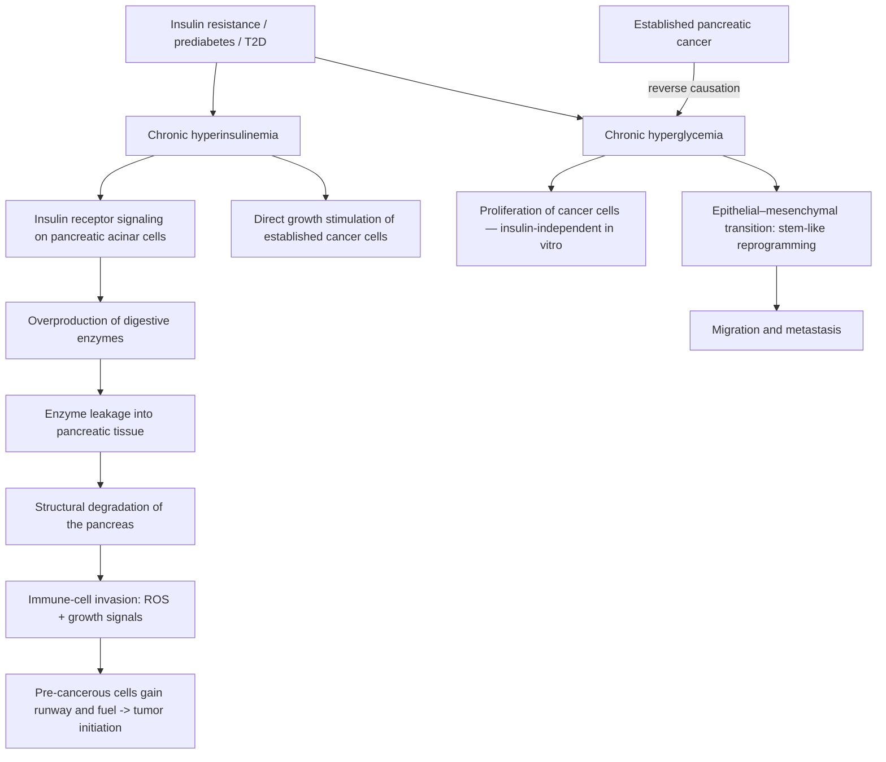

# Metabolic drivers of pancreatic cancer

Pancreatic cancer is among the deadliest common cancers, and part of the explanation appears to be metabolic: both insulin and glucose — the two signals chronically elevated in [[insulin-resistance]] and diabetes — act on the pancreas and on established tumor cells through separable mechanisms. Cohort evidence links elevated fasting glucose, even in the prediabetic range, to incrementally higher pancreatic cancer risk across many studies; the mechanistic work below addresses why. Two causal cautions bound the epidemiology: pancreatic cancer itself can cause hyperglycemia (reverse causation), so new-onset glucose elevation is sometimes a consequence rather than a cause, and the mechanistic studies are in animals and cells, so effect sizes in humans are not established. (@Physionic (Physionic) — "Pancreatic Cancer Risk is High - Why?", 2026-08-27, [link](https://www.youtube.com/watch?v=gr8mi7dvE5A))

## Hyperinsulinemia initiates: the acinar-cell pathway

The pancreas is two organs in one tissue: endocrine islets that secrete insulin, and exocrine acinar cells that produce digestive enzymes destined for the intestine. A 2023 mouse study (Cell Metabolism) knocked out insulin receptors specifically on acinar cells and found a stepwise reduction in precancerous and cancerous pancreatic lesions as receptor density fell — full knockout suppressed tumor formation most, partial knockout intermediately, in both sexes. The proposed mechanism: in a high-insulin environment, insulin signaling drives acinar cells to overproduce digestive enzymes, which effectively leak into the pancreatic tissue itself, degrading its structure. The resulting injury recruits immune cells whose sustained activation releases reactive oxygen species and growth signals — and a pre-cancerous cell sitting in that inflamed, growth-factor-rich environment gains both the runway and the fuel to expand into a tumor. This is initiation-stage evidence: hyperinsulinemia is positioned as promoting the birth of new pancreatic cancer, not merely feeding existing disease. Separately, applying insulin to already-established pancreatic cancer cells at increasing concentrations stimulates their growth, so the hormone acts at both stages. All of this is animal and cell-line research. (@Physionic (Physionic) — "Pancreatic Cancer Risk is High - Why?", 2026-08-27, [link](https://www.youtube.com/watch?v=gr8mi7dvE5A))

## Hyperglycemia promotes: proliferation and metastatic reprogramming

Glucose has effects separable from insulin's. In cell experiments run without insulin present, raising glucose concentration increased pancreatic cancer cell proliferation — with the honest caveat, which the source itself raises, that only the lowest tested concentration was physiologically relevant and intermediate doses were missing, so the dose–response shape in the physiological range is not well characterized. High-glucose conditions also push pancreatic cancer cells into epithelial–mesenchymal transition (EMT) — a reprogramming toward a stem-cell-like state in which cells both divide more and migrate away from their origin, the cellular prerequisite for metastasis. Related work ties the high-glucose EMT effect to hydrogen peroxide signaling and links a hyperglycemic tumor microenvironment to perineural invasion, the nerve-tracking spread characteristic of pancreatic cancer. These are mechanism-level findings in cells and animal models; they explain plausibility and direction, not human effect magnitude. (@Physionic (Physionic) — "Pancreatic Cancer Risk is High - Why?", 2026-08-27, [link](https://www.youtube.com/watch?v=gr8mi7dvE5A))

## How this connects to the rest of the system

This pathway gives the metabolic-syndrome cluster a second cancer-relevant output beyond the established cardiovascular one: the same compensatory hyperinsulinemia that precedes dysglycemia in [[insulin-resistance]] is here an active tissue-damaging signal, which strengthens the case for treating hyperinsulinemia as exposure rather than mere marker. The interventions are the familiar ones — the diet, activity, sleep, and weight levers on [[insulin-resistance]], [[visceral-and-ectopic-fat]], and [[free-sugars-and-glycemic-response]] — with no pancreatic-specific action added. It also sharpens interpretation of new-onset diabetes in older adults, which can be an early consequence of pancreatic cancer rather than a cause; that diagnostic sentinel logic belongs with [[proactive-health-monitoring]]. (@Physionic (Physionic) — "Pancreatic Cancer Risk is High - Why?", 2026-08-27, [link](https://www.youtube.com/watch?v=gr8mi7dvE5A))

## Practical implications

- **Ongoing: keep fasting glucose in the normal range and insulin resistance low through the standard levers (dietary pattern, activity, sleep, weight) — moderate for the pancreatic-cancer outcome specifically: consistent cohort associations plus coherent mechanism, no interventional cancer-prevention trial.** The source frames this as risk reduction, explicitly not guaranteed protection. The same actions carry strong evidence for cardiometabolic outcomes, so the recommendation costs nothing extra. (@Physionic (Physionic) — "Pancreatic Cancer Risk is High - Why?", 2026-08-27, [link](https://www.youtube.com/watch?v=gr8mi7dvE5A)) [[insulin-resistance]]
- **No supplement, drug, or screening action follows from this mechanistic work — explicit boundary.** Nothing here validates pancreatic imaging or tumor-marker screening in asymptomatic people, and drug-level insulin lowering for cancer prevention is untested. (@Physionic (Physionic) — "Pancreatic Cancer Risk is High - Why?", 2026-08-27, [link](https://www.youtube.com/watch?v=gr8mi7dvE5A))

## Gaps & open questions

- Does lowering insulin exposure in insulin-resistant humans (by weight loss, diet, or drugs) measurably reduce pancreatic cancer incidence? No interventional evidence exists.
- What is the glucose dose–response for proliferation and EMT within the physiological-to-prediabetic range, where the in-vitro designs are thinnest?
- How much of the fasting-glucose–pancreatic-cancer association in cohorts is reverse causation from occult tumors, and over what lead time?
- Do acinar-cell enzyme leakage and subclinical pancreatic inflammation occur in insulin-resistant humans, and can they be imaged or biomarked?
- Is there a threshold of hyperinsulinemia below which the acinar pathway is quiescent?

## Related

[[insulin-resistance]] · [[visceral-and-ectopic-fat]] · [[free-sugars-and-glycemic-response]] · [[metabolic-liver-disease]] · [[cancer-screening-and-overdiagnosis]] · [[proactive-health-monitoring]] · [[colorectal-cancer-prevention-and-screening]] · [[aging-model]] · [[practice-playbook]]
