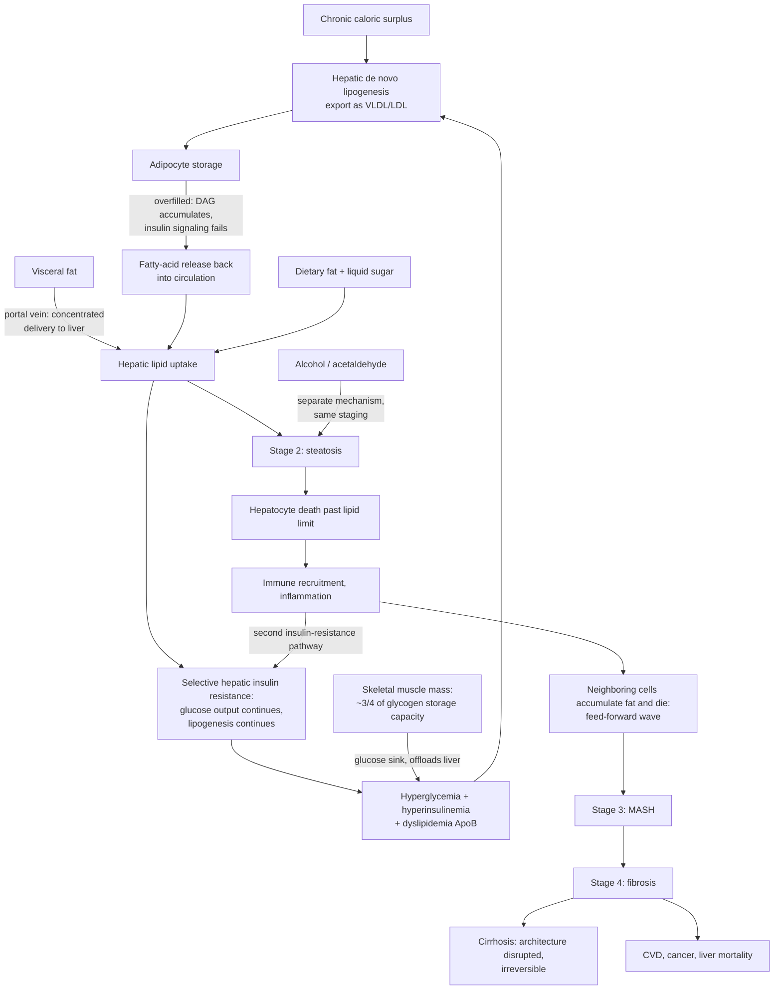

# Metabolic liver disease (MASLD and MASH)

Metabolic dysfunction–associated steatotic liver disease (MASLD, formerly NAFLD) is the accumulation of fat in the liver in the presence of at least one cardiometabolic risk factor — hypertension, prediabetes or type 2 diabetes, dyslipidemia, or elevated BMI/obesity. Its inflammatory stage is metabolic dysfunction–associated steatohepatitis (MASH, formerly NASH). The renaming moved the definition from what the disease is not (non-alcoholic) to what causes it (metabolic dysfunction); the underlying disease is unchanged. Estimated prevalence exceeds 38% of the world's adult population, which makes this a default trajectory for anyone in an energy-abundant environment who is not paying attention rather than a rare condition. (@PeterAttiaMD (Peter Attia MD) — "Metabolic liver health: how to assess risk, catch dysfunction early, and more (AMA 88 sneak peek)", 2026-08-24, [link](https://www.youtube.com/watch?v=9FMwKc4DfSM))

The liver matters for longevity out of proportion to liver-specific mortality because it sits at the center of systemic metabolism for every macronutrient plus cholesterol and ethanol. Liver stress and systemic metabolic stress are two views of the same process: a liver under metabolic strain overproduces ApoB-containing lipoproteins and amplifies the insulin resistance that drives atherosclerosis, which is why the leading cause of death in people with liver disease is cardiovascular disease, not liver failure. The liver is in this sense a sentinel — a "canary in the coal mine" — for metabolic dysfunction, and liver disease is better understood as a parallel expression of systemic metabolic dysfunction than as a standalone organ problem. [[lipoprotein-retention-and-atherogenesis]] (@PeterAttiaMD (Peter Attia MD) — "Metabolic liver health: how to assess risk, catch dysfunction early, and more (AMA 88 sneak peek)", 2026-08-24, [link](https://www.youtube.com/watch?v=9FMwKc4DfSM))

## What the liver does

The liver's several hundred functions group into four categories: detoxification (clearing alcohol and essentially any toxin reaching the blood from food, drink, drugs, or inhalation); immune surveillance (all blood draining the gut passes through the portal vein to the liver first, making it a first responder to ingested toxins and bacterial leakage); protein synthesis and secretion (albumin, clotting factors, ApoB lipoproteins, peptide hormones such as IGF-1); and energy metabolism — uptake and synthesis of circulating fats and cholesterol, and the central balancing act of blood glucose. (@PeterAttiaMD (Peter Attia MD) — "Metabolic liver health: how to assess risk, catch dysfunction early, and more (AMA 88 sneak peek)", 2026-08-24, [link](https://www.youtube.com/watch?v=9FMwKc4DfSM))

The glucose-buffering role illustrates why early dysfunction hides. A fasting glucose of 90 mg/dL corresponds to only about 4.5 grams of glucose in the entire bloodstream — roughly a teaspoon — yet a single large meal can deliver on the order of 90 grams, twenty times that amount. After a meal, insulin directs the liver to absorb glucose and store it as glycogen; during fasting the liver reverses direction, breaking glycogen down and, in prolonged fasting, manufacturing glucose de novo. A healthy person's circulating glucose rarely moves more than about a teaspoon above baseline despite these twenty-fold input swings. That enormous homeostatic reserve is exactly why early liver dysfunction is easy to miss: the system keeps the visible number normal until buffering capacity is substantially eroded. (@PeterAttiaMD (Peter Attia MD) — "Metabolic liver health: how to assess risk, catch dysfunction early, and more (AMA 88 sneak peek)", 2026-08-24, [link](https://www.youtube.com/watch?v=9FMwKc4DfSM))

## The four-stage progression

Metabolic liver disease is usefully modeled as four stages: (1) metabolic stress, (2) steatosis — storage of excess energy as intrahepatic fat, (3) steatohepatitis (MASH) — fat burden tipping into inflammation and self-injury, and (4) fibrosis — scar tissue laid down in response to injury. The first three stages are largely reversible. Fibrosis is biologically reversible to varying degrees when caught early, but becomes irreversible once accumulated scarring disrupts the liver's architecture, the territory of cirrhosis. Fibrosis is the stage that predicts the outcomes that matter — cardiovascular disease, cancer (hepatocellular risk climbs sharply with advanced fibrosis), and liver-specific mortality — which is why staging fibrosis, not merely detecting fat, is the clinically decisive assessment. (@PeterAttiaMD (Peter Attia MD) — "Metabolic liver health: how to assess risk, catch dysfunction early, and more (AMA 88 sneak peek)", 2026-08-24, [link](https://www.youtube.com/watch?v=9FMwKc4DfSM))

The chain from surplus to damage runs as follows. Sustained caloric excess is converted by the liver into triglycerides through de novo lipogenesis, packaged into ApoB-containing particles (VLDL, LDL), and shipped to adipose tissue — a normal, evolutionarily essential storage response. As adipocytes overfill, the lipid intermediate diacylglycerol (DAG) accumulates and interrupts insulin signaling; malfunctioning fat cells then release fatty acids back into an already energy-replete circulation. The liver takes those up on top of dietary fat, accumulates its own lipid intermediates, and becomes insulin resistant in a characteristically selective way: insulin's instruction to stop releasing glucose fails first, while its drive on fat synthesis persists. The liver therefore keeps exporting glucose into an already-high glucose pool (prompting more insulin, which drives more lipogenesis) while continuing to make fat — selective hepatic insulin resistance, a defining feature of metabolic disease and the reason dyslipidemia accompanies it. When triglyceride production outpaces export, fat accumulates in the liver: steatosis. Steatosis itself is a warning state, not yet damage; damage begins when hepatocytes loaded past their limit die, recruiting immune cells whose inflammatory signals disable insulin signaling through a second, separate pathway and push neighboring cells into the same fate — a feed-forward amplification loop that marks the transition to MASH. The liver responds to dying cells as any tissue does, by laying down scar. (@PeterAttiaMD (Peter Attia MD) — "Metabolic liver health: how to assess risk, catch dysfunction early, and more (AMA 88 sneak peek)", 2026-08-24, [link](https://www.youtube.com/watch?v=9FMwKc4DfSM))

## Visceral fat: the concentrated input

Visceral fat is a first-order modifier of liver risk for an anatomical reason: it drains directly into the portal vein, so its released fatty acids arrive at the liver concentrated, whereas subcutaneous fat's release diffuses through the systemic circulation first. Visceral depots are also intrinsically more lipolytically active at baseline. Two quantitative anchors from the source: in one cohort, CT-estimated visceral fat area predicted steatosis independent of BMI and liver enzymes, with visceral fat above 200 cm² carrying about 7.5-fold higher steatosis prevalence than below 100 cm²; and in NHANES participants with diagnosed MASLD, all-cause mortality in the top quartile of visceral adiposity was nearly 3.5 times that of the lowest quartile. Visceral fat thus predicts both liver pathology and, in those who already have it, death. Mechanism, measurement, and reduction levers are covered in [[visceral-and-ectopic-fat]]. (@PeterAttiaMD (Peter Attia MD) — "Metabolic liver health: how to assess risk, catch dysfunction early, and more (AMA 88 sneak peek)", 2026-08-24, [link](https://www.youtube.com/watch?v=9FMwKc4DfSM))

## Muscle: the competing glucose sink

Skeletal muscle is the body's largest glucose sink — roughly three quarters of total glycogen storage capacity sits in muscle versus about one quarter in the liver — so less muscle shifts the glucose-buffering burden onto the liver. This explains metabolic liver disease in normal-BMI individuals with low muscle mass (sarcopenic obesity). Longitudinal cohorts consistently associate more muscle with both fewer new MASLD cases and higher resolution rates; in a large 7-year Korean cohort, participants who gained the most muscle resolved MASLD at more than four times the rate of those who gained the least. These are observational cohorts — muscle gain travels with training, diet, and weight change — but the direction is consistent enough that resistance training functions as a non-negotiable component of addressing metabolic dysfunction in this framework. [[muscle-strength-and-mortality]] [[resistance-training]] (@PeterAttiaMD (Peter Attia MD) — "Metabolic liver health: how to assess risk, catch dysfunction early, and more (AMA 88 sneak peek)", 2026-08-24, [link](https://www.youtube.com/watch?v=9FMwKc4DfSM))

## Fructose, liquid calories, and the honest attribution

Whether fructose is uniquely harmful separates cleanly into an intermediate endpoint and an outcome. In a randomized trial of 94 healthy men consuming fructose-, sucrose-, or glucose-sweetened beverages for seven weeks at enforced weight stability, fructose and sucrose roughly doubled hepatic de novo lipogenesis capacity while glucose did not — a real, fructose-specific effect on the liver's fat-making machinery. But on the harder outcome of actual steatosis, controlled feeding studies show the dominant driver is caloric excess: swapping fructose isocalorically for other carbohydrate barely moves liver fat. Fructose's practical danger lies in its delivery form — sugar-sweetened beverages are calorie-dense, non-satiating, and trivially easy to consume, and cohort data link them to higher MASLD risk. The resulting counsel for anyone with fatty liver: do not drink calories at all, especially not carbohydrate calories, and especially not fructose-containing ones — with the chief benefit running through total calorie reduction rather than fructose chemistry. [[free-sugars-and-glycemic-response]] (@PeterAttiaMD (Peter Attia MD) — "Metabolic liver health: how to assess risk, catch dysfunction early, and more (AMA 88 sneak peek)", 2026-08-24, [link](https://www.youtube.com/watch?v=9FMwKc4DfSM))

## Alcohol: a second mechanism converging on the same staging

Alcohol produces fatty liver through a different mechanism — acetaldehyde, its primary hepatotoxic metabolite — but the disease passes through the same stages of steatosis, inflammation, fibrosis, and cirrhosis, and alcohol-associated liver disease is more common than commonly credited (a substantial share of liver transplants). Because the mechanisms differ, alcohol plus metabolic dysfunction is a two-pronged synergistic attack, recently given its own designation (MetALD: metabolic and alcohol-associated liver disease). An NHANES cohort makes the synergy concrete: among people with cardiometabolic risk factors, steatosis alone was not associated with increased all-cause mortality, but steatosis plus moderate-and-above alcohol consumption (self-reported roughly 40–60 g/day of ethanol in men, about three to four standard drinks — a level many fully functional people drink) carried hazard ratios of about 1.4 for all-cause mortality, 2.35 for cancer mortality, and roughly 15 for liver-specific mortality versus no steatotic liver disease. On drinking pattern, acetaldehyde accumulates faster once intake exceeds roughly one drink per hour, so seven drinks in one evening is mechanistically expected to be worse than one drink on seven nights — an inference from mechanism; direct human comparisons of binge versus daily patterns in metabolic liver disease do not exist. (@PeterAttiaMD (Peter Attia MD) — "Metabolic liver health: how to assess risk, catch dysfunction early, and more (AMA 88 sneak peek)", 2026-08-24, [link](https://www.youtube.com/watch?v=9FMwKc4DfSM))

## Baseline risk: genetics, ancestry, and menopause

The most important single inherited variant is in PNPLA3: carrying two copies of the risk variant roughly doubles the likelihood of hepatic fat accumulation, with elevated inflammation and fibrosis risk persisting after adjustment for standard metabolic factors. A loss-of-function variant in HSD17B13 appears protective — lower liver enzymes and fibrosis risk — and may partially offset PNPLA3 risk. The PNPLA3 risk variant is more common in people of Hispanic ancestry and less common in people of African ancestry, which contributes to population-level differences in MASLD susceptibility without determining any individual's outcome. Body-composition differences also hide risk from standard measures: many people of Asian ancestry develop metabolic risk at lower or normal BMI because visceral adiposity can be higher at a given body weight, one reason BMI is useful at population scale and nearly uninformative for the individual compared with measured body composition. The other major baseline modifier is menopause: estrogen's net effect restrains visceral and hepatic fat accumulation, so premenopausal women are relatively protected, and after menopause fatty liver becomes more common and can progress more aggressively. All of these belong in risk assessment, but none replaces directly measuring the person's metabolic phenotype. [[menopause-hormone-therapy]] [[nutrition-evidence-and-personalization]] (@PeterAttiaMD (Peter Attia MD) — "Metabolic liver health: how to assess risk, catch dysfunction early, and more (AMA 88 sneak peek)", 2026-08-24, [link](https://www.youtube.com/watch?v=9FMwKc4DfSM))

## Practical implications

- **Do not interpret normal routine labs as proof of liver health — the buffering-reserve argument implies early dysfunction is silent.** The source flags normal liver enzymes as false reassurance and uses dedicated assessment (FIB-4 scoring, FibroScan elastography) for staging, but the transcript available here ends before that section, so no threshold or cadence is recorded; treat staging specifics as an open item pending a fuller source. (@PeterAttiaMD (Peter Attia MD) — "Metabolic liver health: how to assess risk, catch dysfunction early, and more (AMA 88 sneak peek)", 2026-08-24, [link](https://www.youtube.com/watch?v=9FMwKc4DfSM))
- **Daily: do not drink calories, especially sugar-sweetened beverages — moderate-to-strong as a calorie-reduction lever for anyone with insulin resistance or steatosis; the fructose-specific mechanism is an intermediate-endpoint finding.** (@PeterAttiaMD (Peter Attia MD) — "Metabolic liver health: how to assess risk, catch dysfunction early, and more (AMA 88 sneak peek)", 2026-08-24, [link](https://www.youtube.com/watch?v=9FMwKc4DfSM))
- **Ongoing: maintain or build muscle through progressive resistance training as a core metabolic-liver lever — moderate (consistent longitudinal cohorts plus a strong glucose-sink mechanism; no randomized MASLD-resolution trial cited).** The population where this most changes the picture is normal-weight, low-muscle individuals whose BMI conceals their risk. [[resistance-training]] (@PeterAttiaMD (Peter Attia MD) — "Metabolic liver health: how to assess risk, catch dysfunction early, and more (AMA 88 sneak peek)", 2026-08-24, [link](https://www.youtube.com/watch?v=9FMwKc4DfSM))
- **If steatosis or metabolic risk factors are present, treat alcohol as a multiplier, not an independent hobby: the combination, at three-plus self-reported drinks daily, carried a roughly 15-fold liver-mortality hazard in NHANES — observational, but large and coherent with mechanism.** Spreading intake (staying near or under one drink per hour, avoiding binge dosing) is a mechanism-based harm-reduction inference, not a trial-tested protocol. (@PeterAttiaMD (Peter Attia MD) — "Metabolic liver health: how to assess risk, catch dysfunction early, and more (AMA 88 sneak peek)", 2026-08-24, [link](https://www.youtube.com/watch?v=9FMwKc4DfSM))
- **Weight loss remains the disease-modifying intervention for MASLD (the source's fuller treatment discussion covers GLP-1-based therapy and caloric deficit); the reversibility window — stages one through three, and early fibrosis — is the reason to act before symptoms.** [[glp-1-receptor-agonists]] [[visceral-and-ectopic-fat]] (@PeterAttiaMD (Peter Attia MD) — "Metabolic liver health: how to assess risk, catch dysfunction early, and more (AMA 88 sneak peek)", 2026-08-24, [link](https://www.youtube.com/watch?v=9FMwKc4DfSM))
- **Liver detoxes and cleanses are framed by the source's episode outline as myth, with only select supplements possibly beneficial — but that segment falls outside the available transcript, so no specific claim, product, or mechanism is recorded here.** (@PeterAttiaMD (Peter Attia MD) — "Metabolic liver health: how to assess risk, catch dysfunction early, and more (AMA 88 sneak peek)", 2026-08-24, [link](https://www.youtube.com/watch?v=9FMwKc4DfSM))

## Gaps & open questions

- Which lab panel and cadence best detects metabolic liver disease before enzymes rise? The source's FIB-4/FibroScan discussion falls outside the available transcript; the staging workflow (who gets elastography, at what interval) is unrecorded here.
- How much of the muscle–MASLD-resolution association is causal versus confounded by concurrent fat loss and behavior change? No randomized resistance-training trial with MASLD resolution as the endpoint is cited.
- Does binge drinking actually accelerate metabolic liver disease faster than the same weekly ethanol spread out, as the acetaldehyde kinetics predict? Direct human data do not exist.
- Where exactly is the point of no return in fibrosis — can stage-specific reversibility be predicted for an individual?
- Does menopause hormone therapy measurably slow post-menopausal hepatic fat accumulation and fibrosis progression, or is the estrogen-protection inference observational only?
- Do PNPLA3/HSD17B13 genotypes change management (screening intensity, alcohol thresholds), or only explain variance?

## Related

[[visceral-and-ectopic-fat]] · [[lipoprotein-retention-and-atherogenesis]] · [[free-sugars-and-glycemic-response]] · [[muscle-strength-and-mortality]] · [[resistance-training]] · [[glp-1-receptor-agonists]] · [[energy-balance-and-calorie-counting]] · [[satiety-oriented-diet-design]] · [[menopause-hormone-therapy]] · [[proactive-health-monitoring]] · [[peter-attia]] · [[aging-model]] · [[practice-playbook]]
