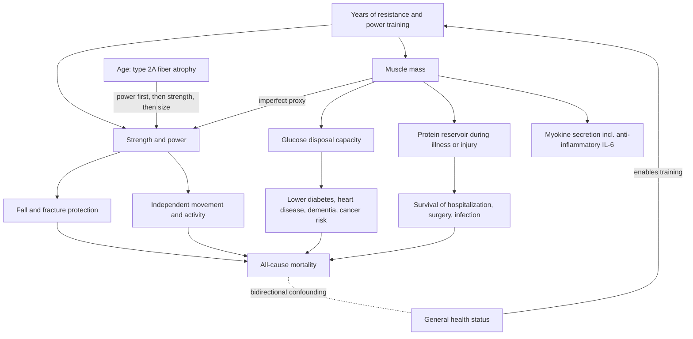

# Muscle mass, strength, and mortality

Skeletal muscle is the largest of the body's three muscle types (skeletal, cardiac, smooth) and serves two distinguishable roles: a structural role — generating the force that moves and protects the body — and a metabolic role as the main sink for glucose disposal, a secretory endocrine organ, and the body's only meaningful protein reservoir. Four related but distinct capacities are measured on it: muscle mass (the total amount of tissue), strength (the ability to exert force against resistance), hypertrophy (increase in muscle size), and power (force times velocity; power rises with resistance only until velocity falls enough that power declines even while strength continues to rise). Studies use mass and strength interchangeably mostly because mass is easy to standardize with DEXA, but strength is the quantity that matters: it is more strongly — and probably partly causally — associated with mortality, cardiovascular disease, and neurologic disease than mass itself, with mass serving as a reasonable but imperfect proxy outside the extremes of wiry-strong and big-but-weak individuals. (Peter Attia MD — "Building strength and muscle mass: optimize training & nutrition for longevity (AMA #71 rebroadcast)", 2026-07-06, [link](https://www.youtube.com/watch?v=CqNqfb37gig))

## The epidemiology

After age itself — which dominates every other mortality predictor via the Gompertz exponential — strength, muscle mass, and cardiorespiratory fitness carry hazard ratios that rival or exceed the classic risk factors. Comparing across cohort studies: low versus elite VO2 max carries roughly a fivefold difference in all-cause mortality and above-average versus elite roughly twofold; each 10 kg reduction in grip strength is associated with about a 30% increase in all-cause mortality; bottom-versus-middle-quartile muscle mass carries a hazard ratio of about 2.3 (roughly a 130% increase). For scale, type 2 diabetes carries about a 40% increase, uncontrolled hypertension about 60%, and smoking a hazard ratio around 2.8 in one study (as low as 1.4 in others, depending on duration of use). These are cross-study comparisons, not head-to-head trials. (Peter Attia MD — "Building strength and muscle mass: optimize training & nutrition for longevity (AMA #71 rebroadcast)", 2026-07-06, [link](https://www.youtube.com/watch?v=CqNqfb37gig))

Grip strength is the workhorse strength measure because it is easy, reproducible, and a good representation of overall upper-body strength. The PURE study measured it in roughly 140,000 people across 17 countries and found each 5 kg reduction associated with a 16% increase in all-cause mortality. In a cohort of adults aged 70–79 followed prospectively for seven years, with DEXA-measured muscle mass and leg-extension/grip strength divided into quartiles, the strongest and most-muscled quartiles maintained the highest Kaplan–Meier survival throughout. (Peter Attia MD — "Building strength and muscle mass: optimize training & nutrition for longevity (AMA #71 rebroadcast)", 2026-07-06, [link](https://www.youtube.com/watch?v=CqNqfb37gig))

Why do these measures predict so well? Like VO2 max, strength and muscle mass integrate years of accumulated work — they cannot be crammed for. A person starting in the bottom percentiles faces roughly a multi-year rebuild (on the order of three years to move a VO2 max from 30 to 50), which makes low strength both a risk marker and the slowest-to-fix part of a health program. (Peter Attia MD — "Building strength and muscle mass: optimize training & nutrition for longevity (AMA #71 rebroadcast)", 2026-07-06, [link](https://www.youtube.com/watch?v=CqNqfb37gig))

## Causality and bidirectionality

The association is almost certainly bidirectional: healthier people can train more, and training makes people healthier. Randomized lifetime experiments are impossible, but Mendelian randomization gives partial causal traction: in roughly 350,000 Finnish biobank participants, a polygenic score used as a proxy for grip strength showed that each standard deviation of genetically higher grip strength was linked to about 7% lower risk of vascular dementia, 6% lower obesity, 5% lower type 2 diabetes, 4% lower major adverse cardiovascular events, and 3% lower all-cause mortality — supporting at least partial causality rather than strength being only a proxy for general health, while the larger effect sizes in observational cohorts likely also reflect the health of people able to train. (Peter Attia MD — "Building strength and muscle mass: optimize training & nutrition for longevity (AMA #71 rebroadcast)", 2026-07-06, [link](https://www.youtube.com/watch?v=CqNqfb37gig))

A related attributed position on measurement: Attia regards aging clocks as unhelpful for mortality prediction because nothing has approached chronological age as a predictor, and claiming a meaningful biological–chronological distinction would require a clock that outpredicts chronological age. This aligns with the caution already recorded in [[biological-age-biomarkers]] and [[biological-age-reversal]]. (Peter Attia MD — "Building strength and muscle mass: optimize training & nutrition for longevity (AMA #71 rebroadcast)", 2026-07-06, [link](https://www.youtube.com/watch?v=CqNqfb37gig))

## The metabolic, endocrine, and reservoir roles

Muscle is the predominant sink for insulin-mediated (and some non-insulin-mediated) glucose uptake; a well-trained adult can hold roughly 300–500 g of glucose as muscle glycogen. More muscle, and more insulin-sensitive muscle, buffers blood glucose with less insulin — relevant not only to type 2 diabetes but to heart disease, dementia, and cancer risk. Muscle is also an endocrine organ secreting myokines: exercise-released IL-6, usually thought of as pro-inflammatory in other contexts, can act anti-inflammatorily and improve metabolism (see [[inflammaging-and-il-6]] for the context dependence). Attempts to bottle this — injecting irisin or other myokines to mimic exercise — have not panned out, which Attia reads as evidence of how vast and multi-cascade the exercise response is. Mike Israetel holds the attributed contrarian position that within about a decade injectable myokine mimetics could replace the need to exercise; Attia is explicitly not as bullish. (Peter Attia MD — "Building strength and muscle mass: optimize training & nutrition for longevity (AMA #71 rebroadcast)", 2026-07-06, [link](https://www.youtube.com/watch?v=CqNqfb37gig))

Unlike fat (stored in practically unlimited amounts) and carbohydrate (limited glycogen), protein has no dedicated storage form outside muscle itself. During illness, surgery, infection, burns, or hospitalization the body draws on muscle; the more muscle a person carries into a physiologic stress, the less functional tissue is proportionally lost — a plausible mediator of why higher-mass individuals survive hospitalizations and injuries more often. (Peter Attia MD — "Building strength and muscle mass: optimize training & nutrition for longevity (AMA #71 rebroadcast)", 2026-07-06, [link](https://www.youtube.com/watch?v=CqNqfb37gig))

## The aging trajectory and falls

Strength peaks in the 30s to early 40s and then declines about 1–2% per year, accelerating after roughly age 70; power peaks earlier and is lost first, then strength, then size. A hallmark of this sequence is preferential atrophy of type 2A (fast-twitch, high-force, glycolytic) fibers beginning in the 30s–40s, which is why power training belongs in programs at every age (a use-it-or-lose-it capacity; the fiber-type framing is attributed to Andy Galpin via this source). Population-average decline curves look smooth, but Luc van Loon's attributed observation is that individual decline is typically slow drift punctuated by rapid drops during periods of inactivity — most dangerously after injury, which is why Attia's stated rule for training in and after the 50s is: "rule number one of training is don't get injured". Two levers therefore matter: raise the peak as high as possible before decline begins (the reserve argument, see [[youth-resistance-training]]), and slow the slope by staying active and unbroken afterward. (Peter Attia MD — "Building strength and muscle mass: optimize training & nutrition for longevity (AMA #71 rebroadcast)", 2026-07-06, [link](https://www.youtube.com/watch?v=CqNqfb37gig))

Falls make the endgame concrete: about 300,000 fall-related hospitalizations occur yearly in the United States, with 10–30% one-year mortality in those over 60 and few femur-fracture patients returning to prior function. Fall death rates per 100,000 rise exponentially by decade: 1.1 (ages 25–35), 1.7 (35–45), 3.2 (45–55), 5.7 (55–65), 13.2 (65–75), 50 (75–85), and nearly 200 at 85+. Strength — especially eccentric control and power — is the modifiable defense. (Peter Attia MD — "Building strength and muscle mass: optimize training & nutrition for longevity (AMA #71 rebroadcast)", 2026-07-06, [link](https://www.youtube.com/watch?v=CqNqfb37gig))

## Measuring where you stand

DEXA-derived appendicular lean mass index (ALMI: summed arm and leg lean mass in kg divided by height in meters squared) and fat-free mass index (FFMI: total minus fat mass over height squared), placed on population nomograms, are the mass metrics; Attia's clinic targets at or above the 75th percentile while acknowledging that build and genetics put it out of reach for some, in which case strength goals replace size goals. Functional strength standards he uses instead of one-rep maxes: a standing broad jump of at least one's own height; five (men) or three (women) full-range pull-ups with a 3-second eccentric; a 2-minute (men) or 90-second (women) dead hang; a 2-minute wall sit with thighs parallel; a farmer's carry of 100% (men) or 75% (women) of body weight, split between hands, for one minute; a box step-up with 25% of body weight in each hand for five reps per side; and 20 (men) or 10 (women) strict push-ups with feet braced against a wall to prevent rocking. One-rep maxes can also be imputed safely from 2–5-rep maxes via standard formulas. Progress matters more than hitting any absolute target. (Peter Attia MD — "Building strength and muscle mass: optimize training & nutrition for longevity (AMA #71 rebroadcast)", 2026-07-06, [link](https://www.youtube.com/watch?v=CqNqfb37gig))

## Practical implications

- **Treat strength as a primary longevity target on par with cardiorespiratory fitness and lipid or glucose control — strong association evidence, moderate causal evidence (Mendelian randomization plus mechanism).** Build it through progressive [[resistance-training]]; expect years, not months, when starting from a low base. (Peter Attia MD — "Building strength and muscle mass: optimize training & nutrition for longevity (AMA #71 rebroadcast)", 2026-07-06, [link](https://www.youtube.com/watch?v=CqNqfb37gig))
- **Include power (fast concentric) work at every age because type 2A fibers atrophy first — moderate mechanistic and training-study evidence.** Warm up thoroughly first; power is the earliest capacity lost and the one most tied to fall protection. (Peter Attia MD — "Building strength and muscle mass: optimize training & nutrition for longevity (AMA #71 rebroadcast)", 2026-07-06, [link](https://www.youtube.com/watch?v=CqNqfb37gig))
- **Periodically (once or twice a year) test yourself: broad jump, pull-ups, dead hang, wall sit, loaded carry, step-up, push-ups, and DEXA ALMI/FFMI if available — expert-clinic standards, not outcome-validated thresholds.** Track trajectory rather than pass/fail. (Peter Attia MD — "Building strength and muscle mass: optimize training & nutrition for longevity (AMA #71 rebroadcast)", 2026-07-06, [link](https://www.youtube.com/watch?v=CqNqfb37gig))
- **From midlife onward, prioritize not getting injured over maximal loading, because injury-driven inactivity is the mechanism of rapid decline — strong observational and clinical rationale.** De-risk exercise selection before de-risking effort. (Peter Attia MD — "Building strength and muscle mass: optimize training & nutrition for longevity (AMA #71 rebroadcast)", 2026-07-06, [link](https://www.youtube.com/watch?v=CqNqfb37gig))

## Gaps & open questions

- How much of the observational strength–mortality association is causal beyond the modest Mendelian-randomization estimates, and through which mediators (falls, metabolic, reservoir, activity)?
- What is the dose–response between strength gained in later life and mortality or fracture reduction — is reaching a threshold enough, or does more keep helping?
- Do the clinic strength standards (broad jump equal to height, carry targets, dead-hang times) predict outcomes better than grip strength alone?
- How fast does type 2A fiber atrophy respond to power training initiated late in life, and is lost power fully recoverable?
- Does raising peak muscle mass in youth confer protection independent of activity maintained through adulthood?

## Related

[[resistance-training]] · [[training-frequency-and-hypertrophy]] · [[performance-nutrition-and-hydration]] · [[creatine]] · [[youth-resistance-training]] · [[tendon-adaptation-and-rehabilitation]] · [[strength-transfer-and-exercise-specificity]] · [[inflammaging-and-il-6]] · [[visceral-and-ectopic-fat]] · [[biological-age-biomarkers]] · [[daily-movement-mobility-and-pain]] · [[peter-attia]] · [[aging-model]] · [[practice-playbook]]
