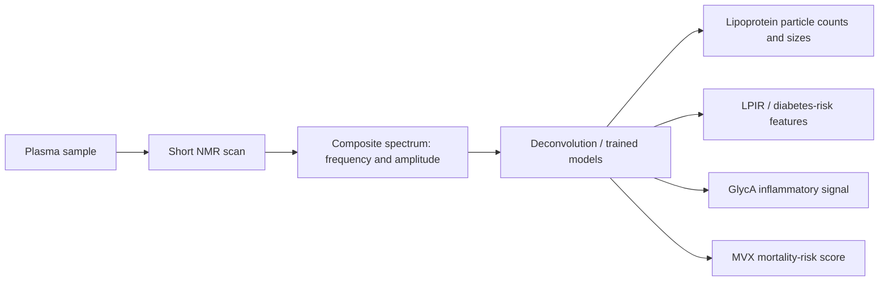
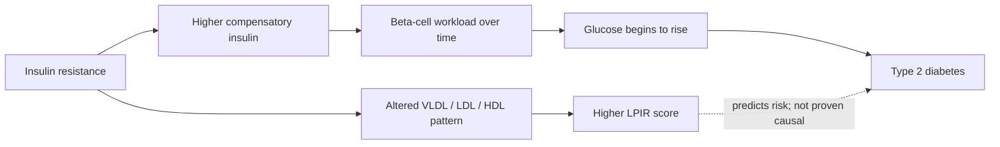

# NMR blood analysis

Nuclear magnetic resonance (NMR) blood analysis uses the frequency and intensity of signals from hydrogen nuclei in plasma molecules to infer their concentrations and chemical environments. In a lipoprotein assay, differently sized VLDL, LDL, and HDL particles contribute overlapping but distinguishable spectral shapes. A computational deconvolution model estimates the component signals whose sum reproduces the measured composite spectrum; signal amplitude then supplies concentration information. The scan itself can take roughly 30 seconds, and about 150 microliters of plasma can support several outputs from the same measurement. (@PeterAttiaMD (Peter Attia MD) — "402 ‒ NMR blood analysis: how mortality risk and more can be assessed from a single blood sample", 2026-08-03, [link](https://www.youtube.com/watch?v=IMbghqZ1iXI))

## Lipoproteins and insulin resistance

NMR can estimate particle concentrations and subclass sizes rather than only the cholesterol carried inside particles. For atherosclerotic risk, the transcript’s central interpretation is that particle number—LDL-P or ApoB—is more important than LDL size; size patterns are useful chiefly because they can reveal metabolic context. A high triglyceride, low-HDL, small-particle pattern often accompanies insulin resistance, but it should not displace particle number as the principal atherogenic exposure measure. (@PeterAttiaMD (Peter Attia MD) — "402 ‒ NMR blood analysis: how mortality risk and more can be assessed from a single blood sample", 2026-08-03, [link](https://www.youtube.com/watch?v=IMbghqZ1iXI))

The Lipoprotein Insulin Resistance score (LPIR) combines six VLDL, LDL, and HDL size or concentration features on a 0–100 scale, with higher values representing a more insulin-resistant pattern. The biological sequence is that sustained insulin resistance raises the insulin demand required to hold glucose stable; glucose may therefore remain normal until beta-cell compensation begins to fail. Longitudinal studies support LPIR as a predictor of future type 2 diabetes, while described but unpublished Diabetes Prevention Program analyses found that lifestyle treatment lowered LPIR more than metformin and that changes predicted diabetes incidence. This supports predictive validity but leaves the intervention-mediated result less secure until publication and independent review. (@PeterAttiaMD (Peter Attia MD) — "402 ‒ NMR blood analysis: how mortality risk and more can be assessed from a single blood sample", 2026-08-03, [link](https://www.youtube.com/watch?v=IMbghqZ1iXI))

## GlycA and metabolic vulnerability

GlycA is a composite NMR signal arising from glycan groups on several abundant acute-phase proteins. Because it integrates multiple proteins and their glycosylation, it is generally more stable than C-reactive protein, although infection and inflammatory disease can still raise it; it reflects systemic, not localized, inflammation and is nonspecific about the cause. It has associated prospectively with several adverse outcomes, but it is a marker rather than proof that its signal-generating molecules cause those outcomes. (@PeterAttiaMD (Peter Attia MD) — "402 ‒ NMR blood analysis: how mortality risk and more can be assessed from a single blood sample", 2026-08-03, [link](https://www.youtube.com/watch?v=IMbghqZ1iXI))

The Metabolic Vulnerability Index (MVX) is a 0–100 empirical mortality-risk score combining small HDL particle concentration, GlycA, citrate, and the branched-chain amino acids leucine, isoleucine, and valine. Its IVX subscore combines the inflammatory features, while MMX represents the metabolic-malnutrition features. Low branched-chain amino acids have the opposite meaning here from the high levels associated with insulin resistance: in severe illness, low levels may accompany catabolism, sarcopenia, or protein-energy wasting. The proposed construct is latent metabolic frailty—a reduced capacity to survive disease or physiological stress—rather than a direct measure of which disease a person will acquire. (@PeterAttiaMD (Peter Attia MD) — "402 ‒ NMR blood analysis: how mortality risk and more can be assessed from a single blood sample", 2026-08-03, [link](https://www.youtube.com/watch?v=IMbghqZ1iXI))

MVX was derived in a high-risk cardiac-catheterization cohort and replicated in an independent catheterization cohort; subsequent analyses described associations in heart failure and in apparently healthy populations. A reported MESA analysis showed graded mortality risk among disease-free adults around age 60. The transcript also describes an as-yet-unpublished cohort in which scores measured around age 30 predicted mortality over roughly 35 years. Replication makes the association promising, but derivation from stored observational cohorts, incomplete publication of key results, uncertain confounding, and lack of an intervention trial mean that MVX is not yet a validated treatment target or causal surrogate. (@PeterAttiaMD (Peter Attia MD) — "402 ‒ NMR blood analysis: how mortality risk and more can be assessed from a single blood sample", 2026-08-03, [link](https://www.youtube.com/watch?v=IMbghqZ1iXI))

## Analytical limits

Inference depends on the reference model matching the biology. Extreme drug-induced lipoprotein distributions can make neighboring spectral components overlap: very large HDL particles produced during CETP inhibition can be confused with small LDL unless the algorithm accounts for that state. Updated models may correct a known artifact, but an unusual result should be checked against ApoB and conventional assays rather than accepted solely because it is machine-generated. (@PeterAttiaMD (Peter Attia MD) — "402 ‒ NMR blood analysis: how mortality risk and more can be assessed from a single blood sample", 2026-08-03, [link](https://www.youtube.com/watch?v=IMbghqZ1iXI))

## Practical implications

At routine, risk-appropriate preventive testing—not at a fixed high-frequency cadence—use ApoB or LDL particle number to clarify atherogenic particle burden and consider LPIR when earlier assessment of insulin resistance would change diet, activity, weight-management, or follow-up decisions. Evidence is strong that ApoB-containing particle burden matters, moderate that LPIR predicts diabetes, and insufficient to show that LPIR-guided care outperforms established prevention. Do not treat LDL size alone. (@PeterAttiaMD (Peter Attia MD) — "402 ‒ NMR blood analysis: how mortality risk and more can be assessed from a single blood sample", 2026-08-03, [link](https://www.youtube.com/watch?v=IMbghqZ1iXI))

Do not use MVX as a stand-alone reason to start a drug, supplement, or procedure. A high score should prompt confirmation, review for acute infection or chronic inflammation, nutritional status, muscle loss, kidney or heart disease, and established clinical risk factors with a clinician. Evidence for mortality prediction is emerging to moderate across cohorts; evidence that lowering MVX lowers mortality or improves treatment selection is absent. (@PeterAttiaMD (Peter Attia MD) — "402 ‒ NMR blood analysis: how mortality risk and more can be assessed from a single blood sample", 2026-08-03, [link](https://www.youtube.com/watch?v=IMbghqZ1iXI))

## Gaps & open questions

- Does changing LPIR or MVX through an intervention change diabetes, treatment-response, or mortality outcomes independently of established risk factors?
- How much incremental discrimination and decision value do these scores add after ApoB, glucose, HbA1c, blood pressure, body composition, kidney function, and physical frailty?
- Why can MVX differ widely among young, apparently healthy adults, and how much is genetic, developmental, behavioral, or technical?
- Which acute states and unusual lipoprotein phenotypes produce clinically important false positives or deconvolution errors?

## Related

[[biological-age-biomarkers]] · [[caloric-restriction-and-meal-timing]] · [[pcsk9-inhibition]] · [[aging-model]] · [[practice-playbook]]
