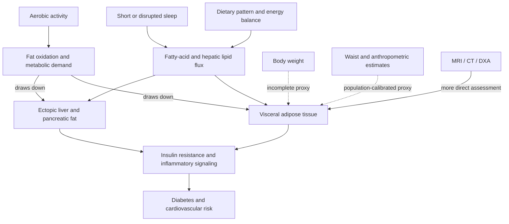

# Visceral and ectopic fat

Visceral adipose tissue is fat stored within the abdominal cavity around organs; ectopic fat is lipid stored where it is not normally a major energy depot, including within liver and pancreas. These compartments are distinct from subcutaneous fat beneath the skin and from total body weight. Excess visceral and organ fat is associated with insulin resistance, diabetes, cardiovascular disease, and some cancers, and it can change even when scale weight changes little. (@NutritionMadeSimple (Nutrition Made Simple!) — "It’s Boring, But It Will Destroy Visceral Fat FAST", 2026-08-02, [link](https://www.youtube.com/watch?v=C0PWUoDCaeg))

## Mechanism and measurement

MRI and CT can quantify abdominal fat more directly, while DXA and anthropometric equations provide estimates with different assumptions. A waist-and-thigh method combined with age, height, and weight may be useful for inexpensive longitudinal tracking, but unusually muscular or thin thighs can bias a population-derived estimate. Standardized repeated measurements are better suited to tracking direction than to claiming an exact anatomical fat mass. (@NutritionMadeSimple (Nutrition Made Simple!) — "It’s Boring, But It Will Destroy Visceral Fat FAST", 2026-08-02, [link](https://www.youtube.com/watch?v=C0PWUoDCaeg))

Normal scale weight does not exclude excess visceral fat: one cited study classified about one in eight normal-weight women and one in seven normal-weight men as having high internal fat despite a lean appearance. Waist-to-height ratio is a cheap screening proxy rather than a scan; measuring waist at a consistent abdominal level after a normal exhalation and keeping it below half of height is presented as a simple risk rule. (@DrBradStanfield (Dr Brad Stanfield) — "Fastest Way to Lose Visceral Fat Without Starving", 2026-08-04, [link](https://www.youtube.com/watch?v=KljR2O7DqOk))

## Dietary evidence

Food substitutions can alter organ fat through energy intake, nutrient composition, satiety, hepatic metabolism, and the foods displaced. In a randomized dietary study, a plant-rich pattern supplemented with about four daily cups of green tea and a Mankai duckweed drink reduced liver fat nearly twice as quickly as the comparison healthy diet despite similar weight loss. Because the intervention combined foods and drinks, the result does not isolate polyphenols as the sole mechanism or show that matcha, cloves, berries, walnuts, or dark chocolate reproduce the effect individually. (@NutritionMadeSimple (Nutrition Made Simple!) — "It’s Boring, But It Will Destroy Visceral Fat FAST", 2026-08-02, [link](https://www.youtube.com/watch?v=C0PWUoDCaeg))

Purified corn-derived type-2 resistant starch (RS2) mixed with water reduced visceral fat by about half over four months in one randomized trial without greater calorie reduction or weight loss than the comparator, with other trials also suggesting an effect. This is a promising intervention-level finding, not proof that ordinary servings of lentils, oats, or cooked-and-cooled starches deliver the same RS2 dose or effect. Those foods remain useful sources of fiber or resistant starch within a healthy pattern, but the evidentiary bridge from purified RS2 to food advice is incomplete. (@NutritionMadeSimple (Nutrition Made Simple!) — "It’s Boring, But It Will Destroy Visceral Fat FAST", 2026-08-02, [link](https://www.youtube.com/watch?v=C0PWUoDCaeg))

The broader randomized evidence summary likewise reports visceral-fat reduction with about 40 g/day of actual resistant starch. Because commercial powders can contain only a fraction of resistant starch, powder mass and active exposure are not interchangeable; [[resistant-starch]] treats formulation, mechanism, and dosing uncertainty in detail. (@Physionic (Physionic) — "I analyzed 1,000 Health Studies: Here are 10 Things I Learned", 2026-08-06, [link](https://www.youtube.com/watch?v=sx8MyamJf3g))

Trials discussed in the source suggest that carbohydrate quality matters more than eliminating all carbohydrate: both a very-low-carbohydrate group and a group retaining more carbohydrate while removing refined sources lost visceral fat. In an energy-restricted study, a diet providing 30% of calories from protein reduced liver fat by 42%, whereas a 10%-protein diet did not, despite similar total weight loss. These comparisons support adequate protein and minimally refined carbohydrate, but they do not define a universal protein percentage or prove that higher is always better. (@NutritionMadeSimple (Nutrition Made Simple!) — "It’s Boring, But It Will Destroy Visceral Fat FAST", 2026-08-02, [link](https://www.youtube.com/watch?v=C0PWUoDCaeg))

Replacing saturated fats such as butter, coconut oil, or animal fat with unsaturated-fat sources such as olive oil, nuts, seeds, and fish produced more favorable liver-fat changes under calorie-matched conditions. The key inference is substitution: adding calorie-dense unsaturated fats without displacing another food is not the tested comparison. (@NutritionMadeSimple (Nutrition Made Simple!) — "It’s Boring, But It Will Destroy Visceral Fat FAST", 2026-08-02, [link](https://www.youtube.com/watch?v=C0PWUoDCaeg))

Food structure can make an energy deficit more tolerable. In a 12-week ad-libitum trial, increasing protein from 15% to 30% of energy reduced reported intake by about 441 kcal/day and fat mass by about 4 kg; broader comparisons suggest higher-protein diets modestly preserve lean mass during weight loss. In a controlled inpatient crossover study, an ultra-processed menu produced about 500 kcal/day greater intake and weight gain than a minimally processed menu matched on listed calories, sugar, fat, and fiber. These findings support whole-food protein, legumes where tolerated, and minimally processed foods as satiety tools, but do not show that protein alone preferentially removes visceral fat. Fiber should be increased gradually and individualized in people with irritable or inflammatory bowel disease. (@DrBradStanfield (Dr Brad Stanfield) — "Fastest Way to Lose Visceral Fat Without Starving", 2026-08-04, [link](https://www.youtube.com/watch?v=KljR2O7DqOk))

Liquid sugar is weakly compensated by later eating and can make high energy intake easy. In a fructose-versus-glucose beverage experiment, both groups gained weight but fructose preferentially increased visceral and liver fat; pooled substitution trials found about 1 kg more weight loss when sugar-sweetened drinks were replaced with noncaloric drinks, similar to replacement with water. Whole fruit is not equivalent to a sugar drink because its fiber and food matrix constrain intake; juice and large smoothies can concentrate several fruits into a rapidly consumed dose. (@DrBradStanfield (Dr Brad Stanfield) — "Fastest Way to Lose Visceral Fat Without Starving", 2026-08-04, [link](https://www.youtube.com/watch?v=KljR2O7DqOk))

A calorie-matched 18-month trial found a plant- and polyphenol-rich “green Mediterranean” pattern produced about twice the visceral-fat loss of a conventional Mediterranean pattern, independent of total weight loss. Because the pattern simultaneously increased greens, walnuts, and green tea and reduced red and processed meats, no single component deserves credit. A high-strength coffee preparation produced a small visceral-fat reduction in one 12-week trial, too narrow a base to prescribe coffee for fat loss; proposed sulforaphane–NRF2 browning of fat remains an animal mechanism without demonstrated human visceral-fat reduction. (@DrBradStanfield (Dr Brad Stanfield) — "Fastest Way to Lose Visceral Fat Without Starving", 2026-08-04, [link](https://www.youtube.com/watch?v=KljR2O7DqOk))

## Exercise and recovery

Aerobic exercise can reduce visceral fat without large scale-weight change. One study using 45 minutes of stationary cycling twice weekly for two months reported roughly halved visceral fat without a dietary intervention; across the evidence summarized, aerobic training was more effective than resistance training specifically for visceral-fat loss, although resistance training retains independent benefits for strength and lean mass. (@NutritionMadeSimple (Nutrition Made Simple!) — "It’s Boring, But It Will Destroy Visceral Fat FAST", 2026-08-02, [link](https://www.youtube.com/watch?v=C0PWUoDCaeg))

A review of 117 studies and nearly 5,000 participants estimated that exercise reduced visceral fat by 6.1% even without weight loss. The relevant dose accumulates across the week, so stairs, movement breaks, and short home cycling sessions can contribute when long gym sessions are impractical; this supports distributed activity as an adherence strategy, not a uniquely proven exercise mode. (@DrBradStanfield (Dr Brad Stanfield) — "Fastest Way to Lose Visceral Fat Without Starving", 2026-08-04, [link](https://www.youtube.com/watch?v=KljR2O7DqOk))

Interval training can compress aerobic work into a shorter session, and one study favored running over cycling intervals. However, ordinary continuous cardio can perform similarly to high-intensity intervals, and a moderate intensity that is sustainable for longer was more effective than very high intensity in one comparison. The mechanism may be accumulated work and adherence rather than a unique visceral-fat-targeting intensity; the source explicitly states that the reason is unclear. (@NutritionMadeSimple (Nutrition Made Simple!) — "It’s Boring, But It Will Destroy Visceral Fat FAST", 2026-08-02, [link](https://www.youtube.com/watch?v=C0PWUoDCaeg))

Sleep is part of the causal system rather than merely recovery from exercise. A Mayo Clinic experiment restricting sleep to four hours nightly for two weeks increased visceral-fat gain, supporting sleep protection while leaving the long-term dose-response and reversibility uncertain. (@NutritionMadeSimple (Nutrition Made Simple!) — "It’s Boring, But It Will Destroy Visceral Fat FAST", 2026-08-02, [link](https://www.youtube.com/watch?v=C0PWUoDCaeg))

Heavier alcohol use is associated with disproportionate visceral fat and also fragments sleep and suppresses REM sleep. In an imaging study of more than 5,000 people, men consuming about 24 units weekly had over 10% more visceral fat as a share of total fat than lower-intake men after adjustment for total adiposity; because this comparison is observational, it supports risk reduction rather than a precise causal dose threshold. (@DrBradStanfield (Dr Brad Stanfield) — "Fastest Way to Lose Visceral Fat Without Starving", 2026-08-04, [link](https://www.youtube.com/watch?v=KljR2O7DqOk))

## Pharmacologic reduction

Semaglutide reduced ad-libitum energy intake by more than one third in a controlled comparison and produced about 15% weight loss versus 2% with placebo in a major trial in which both groups received diet and exercise support. Tirzepatide reduced visceral fat by about 40% in one study, proportionally more than total fat. SGLT2 inhibitors also reduce visceral and pericardial fat in indicated populations and may preserve lean mass, but they are diabetes, heart-failure, and kidney-disease medicines rather than general fat-loss supplements. GLP-1-class nausea and weight-loss-associated lean-mass loss require management; rare serious genital infection is a specific SGLT2 concern, especially relevant to contraindication in type 1 diabetes. [[glp-1-receptor-agonists]] (@DrBradStanfield (Dr Brad Stanfield) — "Fastest Way to Lose Visceral Fat Without Starving", 2026-08-04, [link](https://www.youtube.com/watch?v=KljR2O7DqOk))

## Practical implications

- **Weekly during an active behavior-change phase: measure waist or use the same validated anthropometric method under similar conditions — moderate for tracking, weak for exact visceral-fat quantification.** Daily measurement adds noise; imaging belongs to a clinical question rather than routine self-monitoring. (@NutritionMadeSimple (Nutrition Made Simple!) — "It’s Boring, But It Will Destroy Visceral Fat FAST", 2026-08-02, [link](https://www.youtube.com/watch?v=C0PWUoDCaeg))
- **At most meals: emphasize minimally refined carbohydrate, adequate protein, polyphenol-rich plant foods, and unsaturated fats in place of refined foods and saturated-fat sources — moderate-to-strong for cardiometabolic pattern improvement, moderate for preferential visceral-fat loss.** Treat substitutions and the whole pattern as primary; do not infer a purified-RS2 result from any fiber-containing food. (@NutritionMadeSimple (Nutrition Made Simple!) — "It’s Boring, But It Will Destroy Visceral Fat FAST", 2026-08-02, [link](https://www.youtube.com/watch?v=C0PWUoDCaeg))
- **Two or three times weekly: perform sustainable aerobic exercise, beginning gradually; retain resistance training for its separate benefits — moderate for the exact cadence, strong that regular activity improves cardiometabolic health.** Moderate continuous work is valid; intervals are an optional time-efficient format, not mandatory. (@NutritionMadeSimple (Nutrition Made Simple!) — "It’s Boring, But It Will Destroy Visceral Fat FAST", 2026-08-02, [link](https://www.youtube.com/watch?v=C0PWUoDCaeg))
- **Nightly: protect adequate sleep and a stable sleep schedule — moderate for visceral-fat control and strong for general health.** People unaccustomed to exercise or living with relevant disease should increase intensity gradually and seek clinical guidance where appropriate. (@NutritionMadeSimple (Nutrition Made Simple!) — "It’s Boring, But It Will Destroy Visceral Fat FAST", 2026-08-02, [link](https://www.youtube.com/watch?v=C0PWUoDCaeg))
- **Daily: replace sugar-sweetened drinks with water or a noncaloric alternative and use whole fruit in place of juice where practical — moderate.** At meals, use minimally processed protein- and fiber-containing foods to lower hunger rather than relying on sustained hunger alone. (@DrBradStanfield (Dr Brad Stanfield) — "Fastest Way to Lose Visceral Fat Without Starving", 2026-08-04, [link](https://www.youtube.com/watch?v=KljR2O7DqOk))
- **Throughout the week: accumulate movement in feasible bouts and limit heavy alcohol exposure — moderate for visceral-fat reduction, strong for broader health.** Preserve resistance work and adequate protein during intentional loss to reduce lean-mass loss. (@DrBradStanfield (Dr Brad Stanfield) — "Fastest Way to Lose Visceral Fat Without Starving", 2026-08-04, [link](https://www.youtube.com/watch?v=KljR2O7DqOk))

## Gaps & open questions

- Which inexpensive anthropometric equation best tracks within-person visceral-fat change across sexes, ethnicities, ages, and athletic body types?
- Do the large short-term RS2 effects replicate independently, persist after stopping, and improve clinical outcomes?
- Which components of combined polyphenol-rich dietary interventions are active, and how much is due to food displacement?
- Is moderate intensity intrinsically better for visceral-fat loss, or does it merely permit more volume and adherence?
- How much visceral or ectopic fat reduction is required to improve diabetes, cardiovascular, and cancer outcomes independently of weight loss?
- Which features of ultra-processed foods drive excess intake when labeled nutrient composition is matched?
- Do GLP-1 or SGLT2 medicines preferentially reduce visceral fat beyond what their total weight loss predicts, and does that mediation improve hard outcomes?
- Does sulforaphane activate clinically meaningful fat browning or reduce visceral fat in humans?

## Related

[[nutrition-evidence-and-personalization]] · [[resistant-starch]] · [[caloric-restriction-and-meal-timing]] · [[glp-1-receptor-agonists]] · [[inflammaging-and-il-6]] · [[nmr-blood-analysis]] · [[aging-model]] · [[practice-playbook]]
