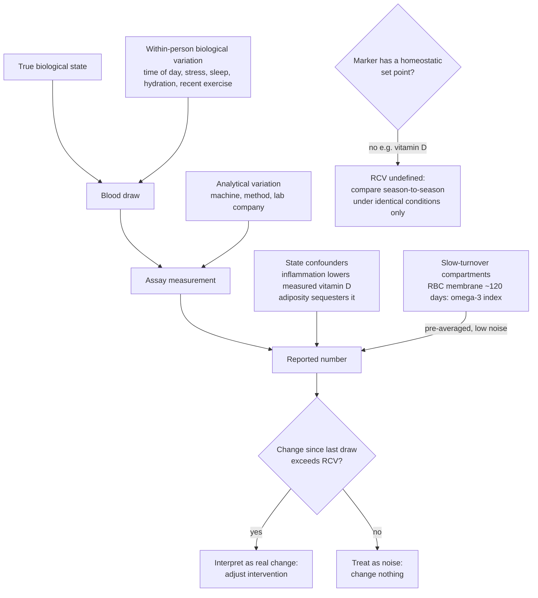

# Blood-marker variability and reference change values

A single blood-test number is a sample from a distribution, not a fixed property of the person. Any measured value contains at least three variance components: analytical variation (CVA — noise from the assay and machine itself), within-individual biological variation (CVI — the same person's marker genuinely fluctuates hour to hour and day to day with stress, sleep, hydration, and time of draw), and between-individual variation (CVG — how people differ from each other, which matters for population reference ranges but not for tracking one person against their own baseline). The reference change value (RCV) combines analytical and within-individual variation into the threshold a change between two draws must exceed before it can be counted as real change rather than noise. Interpreting serial labs without an RCV concept produces two symmetric errors: celebrating noise as progress, and treating noise as regression. (@drandygalpin (Andy Galpin) — "How to Reach Your Fitness Goals (Hard-to-Grow Muscles, Lose Fat, Busy Schedule & More) | Dan Garner", 2026-08-19, [link](https://www.youtube.com/watch?v=-M50mes3nig))

This framing enters the corpus through performance coach Dan Garner, who uses repeat blood work (roughly every 90 days) to find physiological constraints in athletes and executives, and whose taxonomy of markers as clocks is a genuinely useful teaching device: "testosterone is a fast and noisy clock. Vitamin D is a broken clock," and the omega-3 index is an honest one. The framework itself — biological variation, RCV — is standard laboratory medicine; the coaching application and specific numbers below carry his attribution. Note a disclosed conflict: Garner and Andy Galpin co-founded a blood-analysis company. (@drandygalpin (Andy Galpin) — "How to Reach Your Fitness Goals (Hard-to-Grow Muscles, Lose Fat, Busy Schedule & More) | Dan Garner", 2026-08-19, [link](https://www.youtube.com/watch?v=-M50mes3nig))

## The three clocks

**Fast and noisy — testosterone.** By the figures used in the source, "testosterone has an RCV of 29%": a 20% rise after three months of a testosterone-boosting supplement — the magnitude such products typically celebrate — is statistically indistinguishable from no change, and a 10% fall equally means nothing. Testosterone moves quickly because it is not tied to a slow cellular turnover compartment. The tracking consequence Garner draws on a base near 500 ng/dL: demand roughly ±150 ng/dL before treating a change as real. A related unit-comparability rule (articulated by Galpin, endorsed by Garner): never compare free-testosterone values across laboratories or across methods — calculated free testosterone (from total T, SHBG, and albumin) and directly assayed free testosterone can differ substantially even within one company. Total testosterone is the more robust tracking quantity. (@drandygalpin (Andy Galpin) — "How to Reach Your Fitness Goals (Hard-to-Grow Muscles, Lose Fat, Busy Schedule & More) | Dan Garner", 2026-08-19, [link](https://www.youtube.com/watch?v=-M50mes3nig))

**Broken — vitamin D.** In this framework "vitamin D actually doesn't have a known RCV": the marker has no homeostatic set point, drifting continuously with season and sun exposure, so the scatter-around-a-set-point model that defines an RCV does not apply (a cited 2023 attempt to derive one reportedly failed, with large analytical variation). Two state confounders make single readings actively misleading: "vitamin D is an acute phase reactant," so inflammation — including acute exercise before the draw — artificially lowers the measured value; and vitamin D is stored in adipose tissue, so higher body fat sequesters it. A person whose true status is adequate can measure low while inflamed, get supplemented, measure high later, and be mislabeled a hyper-responder — when both readings were artifact. The defensible protocol: compare like season to like season (winter to winter), standardize fasting, hydration, laboratory, and assay method, and co-interpret with inflammatory markers. Escalating doses because the number will not move is, on this view, usually a misread marker rather than true resistance. (@drandygalpin (Andy Galpin) — "How to Reach Your Fitness Goals (Hard-to-Grow Muscles, Lose Fat, Busy Schedule & More) | Dan Garner", 2026-08-19, [link](https://www.youtube.com/watch?v=-M50mes3nig))

**Honest — the omega-3 index.** Measured in the red-blood-cell membrane, whose ~120-day lifespan means the cell has already averaged intake over months; the known noise band is about 0.8 index points and the marker survives laboratory changes that scramble hormone panels. Details, thresholds, and the dosing dispute live in [[omega-3-fatty-acids]]. (@drandygalpin (Andy Galpin) — "How to Reach Your Fitness Goals (Hard-to-Grow Muscles, Lose Fat, Busy Schedule & More) | Dan Garner", 2026-08-19, [link](https://www.youtube.com/watch?v=-M50mes3nig))

## What moves the markers people try to supplement

The taxonomy has a deflationary practical core. Low testosterone in a training population is usually caused by low energy availability, poor sleep, and stress — a deficiency response to be answered with calories and recovery, not herbal boosters ([[low-energy-availability-and-menstrual-function]]). Within the male reference range Garner uses (roughly 400–900 ng/dL total; ~25–45 ng/dL for women), being higher confers much less muscle-growth advantage than commonly believed — a position he credits to researcher Ben House — with large differences appearing only at supraphysiologic exogenous doses; trajectory and context matter more than level (entering a planned energy deficit already at the floor is a problem; ending one at the floor after starting high is expected physiology). Vitamin D status below about 40 ng/mL is presented as an independent injury risk factor in military data, with stress-fracture risk elevated up to ten-fold — one of the few cases where an optimal-versus-normal distinction has empirical support — with typical repletion at 2,000–5,000 IU/day seasonally adjusted rather than megadosing. These specific thresholds are expert practice anchored in cohort and military observational data, not guideline-grade targets. (@drandygalpin (Andy Galpin) — "How to Reach Your Fitness Goals (Hard-to-Grow Muscles, Lose Fat, Busy Schedule & More) | Dan Garner", 2026-08-19, [link](https://www.youtube.com/watch?v=-M50mes3nig))

## Practical implications

- **Before interpreting any repeat lab: ask whether the change exceeds that marker's reference change value; if you do not know the RCV, you do not know whether anything happened — strong as a measurement principle (standard laboratory medicine), with the specific figures here carried as expert practice.** (@drandygalpin (Andy Galpin) — "How to Reach Your Fitness Goals (Hard-to-Grow Muscles, Lose Fat, Busy Schedule & More) | Dan Garner", 2026-08-19, [link](https://www.youtube.com/watch?v=-M50mes3nig))
- **For every serial marker: hold the laboratory company, assay method, draw time, fasting state, and recent-exercise state constant — strong.** A lab switch can make the same person look different on many markers; the omega-3 index is a noted exception. (@drandygalpin (Andy Galpin) — "How to Reach Your Fitness Goals (Hard-to-Grow Muscles, Lose Fat, Busy Schedule & More) | Dan Garner", 2026-08-19, [link](https://www.youtube.com/watch?v=-M50mes3nig))
- **Do not buy or judge a testosterone intervention on a sub-30% change, and do not panic over one — moderate (derived from the stated RCV; the exact figure is not independently verified here).** Address energy availability, sleep, and stress first when testosterone is low. [[testosterone-replacement-therapy]] (@drandygalpin (Andy Galpin) — "How to Reach Your Fitness Goals (Hard-to-Grow Muscles, Lose Fat, Busy Schedule & More) | Dan Garner", 2026-08-19, [link](https://www.youtube.com/watch?v=-M50mes3nig))
- **For vitamin D: compare season to matched season under identical draw conditions, co-read with inflammation, and involve a clinician before high-dose escalation — moderate for the interpretive cautions, expert practice for the 40 ng/mL injury threshold.** (@drandygalpin (Andy Galpin) — "How to Reach Your Fitness Goals (Hard-to-Grow Muscles, Lose Fat, Busy Schedule & More) | Dan Garner", 2026-08-19, [link](https://www.youtube.com/watch?v=-M50mes3nig))
- **Roughly quarterly testing cadence during active interventions is Garner's coaching practice, not an evidence-derived interval; routine asymptomatic panels remain governed by the decision-changing rule in [[proactive-health-monitoring]].**

## Gaps & open questions

- What are independently validated RCVs for the markers self-quantifiers track most (total and free testosterone, cortisol, TSH/T3, ferritin, hs-CRP), and how much do they differ by assay platform?
- Can vitamin D interpretation be corrected quantitatively for inflammation and adiposity, turning an artifact-prone marker into a usable one?
- Does the military vitamin D–stress fracture association replicate as a causal, supplementation-responsive effect in randomized prevention trials?
- Do consumer and AI lab-interpretation tools that ignore draw context (recent exercise, inflammation, season) measurably increase unnecessary supplementation?
- At what point does within-person tracking against RCVs outperform population reference ranges for decision-making, and for which markers?

## Related

[[proactive-health-monitoring]] · [[biological-age-biomarkers]] · [[nmr-blood-analysis]] · [[omega-3-fatty-acids]] · [[testosterone-replacement-therapy]] · [[low-energy-availability-and-menstrual-function]] · [[supplement-evidence-and-safety]] · [[dan-garner]] · [[practice-playbook]]
