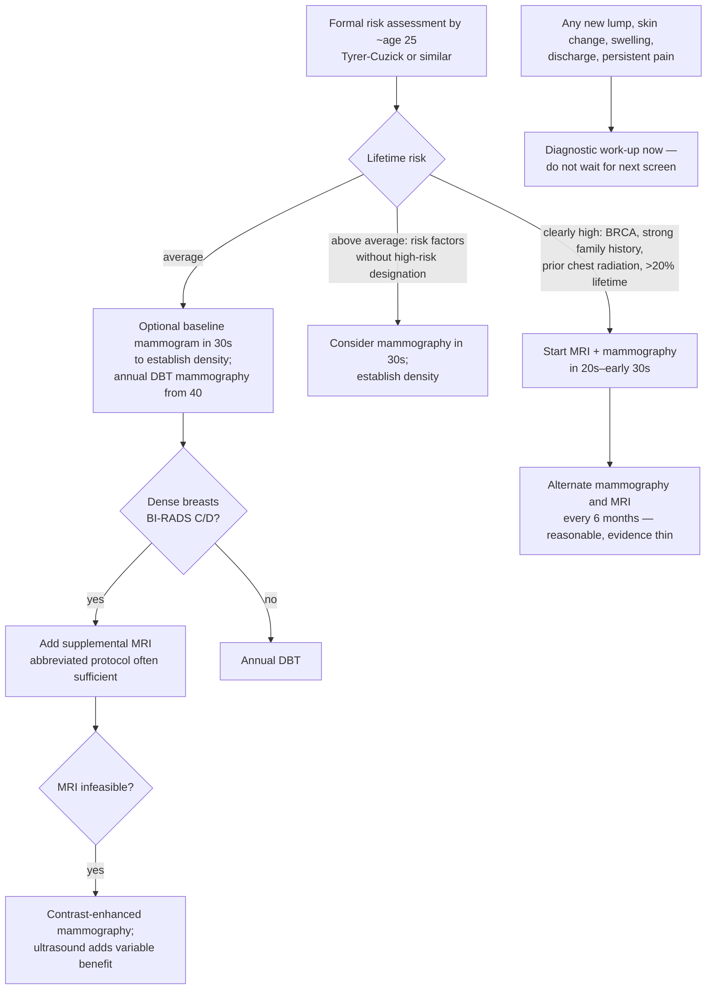

# Breast cancer screening

Breast cancer screening is the use of imaging in asymptomatic women to find cancer before it spreads. Its value rests on stage shift: cancers found early are treated more successfully, with 10-year survival above 96% at stage 1 versus roughly 30% 5-year survival at stage 4, and women who screen regularly are up to 40% less likely to die of the disease. About 1 in 8 US women develop invasive breast cancer over a lifetime and roughly 42,000 die of it each year, making it a leading cause of cancer death behind lung, colorectal, and pancreatic. (@PeterAttiaMD (Peter Attia MD) — "396 – Breast cancer screening: understanding risk, deciding when to start, and more", 2026-06-15, [link](https://www.youtube.com/watch?v=_9mBlZXA1Lk))

The persistence of high mortality despite effective tools has two causes of very different tractability. A minority of cases — back-of-the-envelope estimates around 7–10% — are biologically aggressive enough to evade even perfect screening. The larger, solvable cause is under-screening: roughly a third of US women over 40 have not had a mammogram in the past two years, about 20% of women aged 50–74 are not up to date, and while at least 9% of women meet major-guideline criteria for supplemental breast MRI, actual MRI utilization is about 0.4% — an execution failure rather than an evidence gap. (@PeterAttiaMD (Peter Attia MD) — "396 – Breast cancer screening: understanding risk, deciding when to start, and more", 2026-06-15, [link](https://www.youtube.com/watch?v=_9mBlZXA1Lk))

## Determinants of baseline risk

Most women who develop breast cancer do not carry one dramatic risk factor; risk is usually the sum of several smaller inputs. That is why formal risk assessment — recommended by about age 25, early enough to change the screening plan — matters more than scanning for a single red flag. (@PeterAttiaMD (Peter Attia MD) — "396 – Breast cancer screening: understanding risk, deciding when to start, and more", 2026-06-15, [link](https://www.youtube.com/watch?v=_9mBlZXA1Lk))

The principal inputs, per the same source:

- **Sex and age.** Lifetime risk is about 1 in 8 for women versus roughly 1 in 750 for men; median age at diagnosis is around 62, and risk accumulates continuously with age.
- **High-penetrance mutations.** Pathogenic BRCA1/BRCA2 variants substantially raise risk and shift it earlier in life, but only about 1 in 400 people in the general population carries one (higher in some groups, including Ashkenazi Jewish ancestry). BRCA1 risk is heavily front-loaded: relative risk versus non-carriers is roughly 100-fold in the late 20s, about 44-fold in the 30s, and about 3-fold by the 60s.
- **Family history.** A proxy not only for known mutations but for low-penetrance variants, shared environment, and inherited factors no single test covers. Multiple affected first- or second-degree relatives raise risk substantially, but absent family history does not establish average risk — families can be small, relatives may have died young, and some breast-cancer-associated mutations surface in a family as prostate or pancreatic cancer instead.
- **Ancestry.** In the US, Black women are more likely to be diagnosed younger and with more aggressive subtypes, with implications for how early and aggressively to screen.
- **Prior chest radiation.** Cumulative high-dose exposure (classically Hodgkin lymphoma treatment in adolescence) while breast tissue is developing carries the greatest risk; evidence that occasional diagnostic chest imaging meaningfully raises risk is very weak.
- **Breast density.** Dense tissue both raises baseline risk somewhat and masks tumors, since dense tissue and tumors are both white on mammography. About 50% of screening-age women have dense breasts (BI-RADS categories C and D), density is roughly 60–70% heritable, and the FDA now requires imaging centers to report it.
- **Reproductive, hormonal, and modifiable factors.** Earlier menarche, later menopause, nulliparity or first full-term pregnancy after 40, and not breastfeeding each contribute modestly, as do alcohol, obesity, poor metabolic health, and inactivity — rarely changing the screening plan alone, but shifting summed risk (and the modifiable ones being worth acting on regardless).

Because nobody integrates these accurately in their head, validated calculators such as Tyrer-Cuzick combine family history, personal factors, and density into 10-year and lifetime risk estimates. Most guidelines classify lifetime risk above 20% as high risk, a threshold that ancestry and other factors may shift. (@PeterAttiaMD (Peter Attia MD) — "396 – Breast cancer screening: understanding risk, deciding when to start, and more", 2026-06-15, [link](https://www.youtube.com/watch?v=_9mBlZXA1Lk))

## The sensitivity–false-positive trade

Every move toward higher sensitivity buys more detection at the cost of more callbacks. In the US, about 10% of screening mammograms trigger a callback, and only about 5% of callbacks end in a cancer diagnosis — so of 1,000 women screened, about 100 are recalled and about 95 of those do not have cancer. More than half of women screened annually for ten years experience at least one false positive, and the dominant harm is anxiety and follow-up burden rather than physical injury. The higher one's baseline risk, the easier it is to justify accepting more false positives for earlier detection; for average-risk women the balance is largely a preference about tolerable callback burden, not a reason to skip screening. (@PeterAttiaMD (Peter Attia MD) — "396 – Breast cancer screening: understanding risk, deciding when to start, and more", 2026-06-15, [link](https://www.youtube.com/watch?v=_9mBlZXA1Lk))

## The modality hierarchy

Breast imaging is a toolkit with a clear sensitivity ordering, not a set of interchangeable tests. (@PeterAttiaMD (Peter Attia MD) — "396 – Breast cancer screening: understanding risk, deciding when to start, and more", 2026-06-15, [link](https://www.youtube.com/watch?v=_9mBlZXA1Lk))

- **Mammography** is the foundation for virtually everyone and is particularly good at detecting calcifications such as those of ductal carcinoma in situ (DCIS, "stage zero"; an estimated 25–60% of DCIS may eventually become invasive — a wide range reflecting genuine uncertainty about its natural history). Digital breast tomosynthesis (DBT, "3D mammography", introduced 2011) images the breast in layers, detecting more cancer with fewer recalls than standard 2D digital mammography, especially in dense breasts, and is the version to prioritize.
- **MRI** uses gadolinium contrast to detect abnormal blood flow and tissue behavior mammography can miss, making it the most sensitive tool available — used in addition to, not instead of, mammography (which still sees certain calcifications better). In women with extremely dense breasts, adding MRI after a negative mammogram cut interval cancers in half, from 5 to 2.5 per 1,000. The abbreviated breast MRI preserves nearly all the sensitivity of the full exam in 10–15 minutes versus 30–60, making it cheaper and more scalable — characterized in this source as the most underutilized tool in breast screening.
- **Contrast-enhanced mammography (CEM)** — mammography plus intravenous iodine contrast — is the next-best functional option where MRI is unavailable or contraindicated, though not yet widely available.
- **Ultrasound** (handheld or automated) is the most operator-dependent modality with the highest false-positive burden. Its incremental detection depends on who performs it and what it is added to: physician-performed handheld ultrasound added 4.2 cancers per 1,000 over 2D mammography in one study, but technician-performed ultrasound added only about 1.1 per 1,000 over DBT in another. Its best roles are clarifying suspicious findings and guiding biopsies, not substituting for mammography (average risk) or MRI (high risk).

Where imaging is done also matters: high-volume and dedicated breast-imaging centers have more experienced interpretation and better protocol execution, which can directly determine whether a cancer is detected — especially for MRI, CEM, and ultrasound in dense tissue. (@PeterAttiaMD (Peter Attia MD) — "396 – Breast cancer screening: understanding risk, deciding when to start, and more", 2026-06-15, [link](https://www.youtube.com/watch?v=_9mBlZXA1Lk))

## Screening interval: population efficiency versus individual outcome

No randomized trial has directly compared annual versus biennial screening with mortality as the primary endpoint; interval recommendations rest on modeling (chiefly the NCI-funded CISNET consortium) and observational data. The USPSTF recommends biennial mammography for average-risk women 40–74 — guidance that often drives insurance coverage — while the American Cancer Society, NCCN, and American College of Radiology support annual screening from 40. The disagreement is real but turns on the question being asked, not on contradictory data: the original 2009 CISNET analysis (film-era mammography) found biennial screening retained about 81% of annual screening's mortality benefit with roughly half the false positives — an efficiency argument. A secondary analysis of the 2024 CISNET models found annual screening of women 40–79 produced a 42% mortality reduction versus 30% for biennial (230 versus 165 life-years gained per 1,000 women), and the per-exam false-positive and benign-biopsy rates are actually lowest with annual screening, likely because a recent comparison image aids interpretation. Observationally, annual screeners who developed cancer had far fewer interval cancers (11% versus 38%) and more stage-1 diagnoses (76% versus 56%) than biennial screeners. The source's conclusion: biennial screening is defensible population policy; for an individual optimizing her own odds of not dying of breast cancer, annual screening is the better strategy. (@PeterAttiaMD (Peter Attia MD) — "396 – Breast cancer screening: understanding risk, deciding when to start, and more", 2026-06-15, [link](https://www.youtube.com/watch?v=_9mBlZXA1Lk))

For women using both mammography and MRI, alternating them every six months (creating an effective six-month interval) is common practice and intuitively attractive for fast-growing tumors, but the comparative evidence against same-day stacking is thin and conflicting; the schedule matters less than actually completing both tests each year. Ultrasound timing has essentially never been studied directly. (@PeterAttiaMD (Peter Attia MD) — "396 – Breast cancer screening: understanding risk, deciding when to start, and more", 2026-06-15, [link](https://www.youtube.com/watch?v=_9mBlZXA1Lk))

## When to start

Only about 5% of breast cancer diagnoses occur before 40, and cumulative risk through age 40 is under 1% (versus about 13% through 90 — the 1-in-8 figure). Registry data and smoothly rising age-incidence curves indicate this low early incidence is real rather than an artifact of not screening. But risk factors reorder the picture: in a study of about 6 million US mammograms, women 35–39 with at least one risk factor (personal history, first-degree family history, or dense breasts) had a cancer detection rate of 2.1 per 1,000 versus 0.59 per 1,000 for average-risk women the same age — and versus 0.71 per 1,000 for average-risk women aged 40–44. Risk factors effectively shift a woman's screening profile forward by about a decade; above age 45, incidence rises enough that age dominates. (@PeterAttiaMD (Peter Attia MD) — "396 – Breast cancer screening: understanding risk, deciding when to start, and more", 2026-06-15, [link](https://www.youtube.com/watch?v=_9mBlZXA1Lk))

Tumor biology compounds the argument for risk-adapted early screening: about 20% of breast cancers in women under 40 are triple-negative (versus roughly 6–12% over 40), and these can double in size in under four months — fast enough to appear between annual screens — while the slow-growing tumors screening detects best are only about a third of under-40 cases. Because young high-risk women's tumors are both fast-growing and harder to see on mammography, MRI is the more appropriate screening tool for that group. A single baseline mammogram in the 30s is also worth considering for a different reason: establishing breast density, which is otherwise unknowable before screening begins and which changes the downstream strategy — a risk-stratification move without direct outcome evidence. (@PeterAttiaMD (Peter Attia MD) — "396 – Breast cancer screening: understanding risk, deciding when to start, and more", 2026-06-15, [link](https://www.youtube.com/watch?v=_9mBlZXA1Lk))

## What screening cannot do

Screening is designed for the asymptomatic. Inflammatory breast cancer (roughly 1–5% of cases) often presents without a discrete lump — rapid swelling or heaviness, redness, warmth, skin-texture change — is frequently misread as benign irritation, and may not be visible on mammography, so a recent normal screen does not exclude it. Any new lump, skin change, nipple discharge, or persistent pain warrants diagnostic evaluation now, not at the next scheduled screen. The same applies to men, who are not screened and for whom symptoms are typically the only path to diagnosis. (@PeterAttiaMD (Peter Attia MD) — "396 – Breast cancer screening: understanding risk, deciding when to start, and more", 2026-06-15, [link](https://www.youtube.com/watch?v=_9mBlZXA1Lk))

## Practical implications

- **Once, in the mid-20s: complete a formal risk assessment with a validated calculator (e.g. Tyrer-Cuzick), incorporating family history broadly (including prostate and pancreatic cancers) — strong on guideline consensus.** The point is to learn early whether the default plan fits you. (@PeterAttiaMD (Peter Attia MD) — "396 – Breast cancer screening: understanding risk, deciding when to start, and more", 2026-06-15, [link](https://www.youtube.com/watch?v=_9mBlZXA1Lk))
- **Establish breast density — from prior imaging, maternal history (density is 60–70% heritable), or a baseline mammogram in the 30s — moderate; the baseline-scan-for-density move is reasoned, not outcome-tested.** Density shifts both risk and modality choice. (@PeterAttiaMD (Peter Attia MD) — "396 – Breast cancer screening: understanding risk, deciding when to start, and more", 2026-06-15, [link](https://www.youtube.com/watch?v=_9mBlZXA1Lk))
- **Average risk: annual DBT mammography from age 40 — strong; the annual-over-biennial choice rests on modeling and observational data, not an interval RCT.** Prefer DBT over 2D, especially with dense breasts. (@PeterAttiaMD (Peter Attia MD) — "396 – Breast cancer screening: understanding risk, deciding when to start, and more", 2026-06-15, [link](https://www.youtube.com/watch?v=_9mBlZXA1Lk))
- **High risk (BRCA, >20% lifetime risk, prior chest radiation) or extremely dense breasts: add MRI — strong for detection benefit; abbreviated MRI is usually sufficient for screening.** Start in the 20s–early 30s if clearly high risk; alternating MRI and mammography every six months is reasonable but not evidence-mandated. Continue screening as long as you would accept treatment if cancer were found. (@PeterAttiaMD (Peter Attia MD) — "396 – Breast cancer screening: understanding risk, deciding when to start, and more", 2026-06-15, [link](https://www.youtube.com/watch?v=_9mBlZXA1Lk))
- **Choose high-volume or dedicated breast-imaging centers for advanced modalities — moderate-to-strong.** Interpretation quality can determine detection. (@PeterAttiaMD (Peter Attia MD) — "396 – Breast cancer screening: understanding risk, deciding when to start, and more", 2026-06-15, [link](https://www.youtube.com/watch?v=_9mBlZXA1Lk))
- **Any new breast symptom, any sex, any recent screen result: diagnostic evaluation immediately — strong.** Screening normality does not exclude symptomatic disease, notably inflammatory breast cancer. (@PeterAttiaMD (Peter Attia MD) — "396 – Breast cancer screening: understanding risk, deciding when to start, and more", 2026-06-15, [link](https://www.youtube.com/watch?v=_9mBlZXA1Lk))

## Gaps & open questions

- What fraction of DCIS progresses to invasive cancer, and can progressors be identified to reduce overtreatment? The cited 25–60% range spans very different management implications.
- No randomized trial has compared annual versus biennial screening on mortality, and none exists for screening average-risk women under 40.
- Does alternating mammography and MRI at six-month spacing outperform same-day stacking? Existing studies conflict and attribution of detections between staggered tests is methodologically hard.
- Does a baseline density-establishing mammogram in the 30s improve outcomes, or mainly reclassify risk?
- Can risk models incorporating ancestry-specific tumor biology (e.g. earlier, more aggressive disease in Black women) improve on generic lifetime-risk thresholds?
- How much of the MRI utilization gap (9% eligible, 0.4% screened) is access and insurance versus clinician failure to risk-assess?

## Related

[[proactive-health-monitoring]] · [[colorectal-cancer-prevention-and-screening]] · [[peter-attia]] · [[biological-age-biomarkers]] · [[practice-playbook]] · [[aging-model]]
