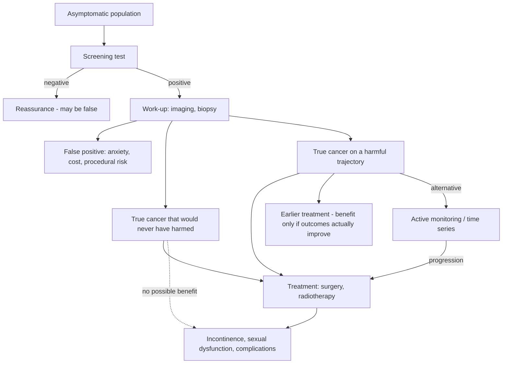

# Cancer screening and overdiagnosis

Cancer screening tests asymptomatic people to find disease before it declares itself. The intuition that more data is always better fails because a screening test is not an isolated measurement: a positive result initiates a diagnostic and treatment cascade — imaging, biopsy, sometimes surgery — whose harms accrue to everyone flagged, while its benefit accrues only to the subset whose cancer would otherwise have progressed, been caught later, and been less treatable. Overdiagnosis is the detection of real cancer that would never have caused symptoms or death; the person is harmed by everything that follows detection and helped by none of it. The clinical hesitation about broad screening reflects this arithmetic, not cost or paternalism — as the source puts it, "the test is never just a test". (@DrBradStanfield (Dr Brad Stanfield) — "'Lie to Your Doctor'", 2026-07-23, [link](https://www.youtube.com/watch?v=ZSLxwF1h9ik))

## The prostate example: mortality benefit and treatment cost measured in the same population

Prostate cancer screening is the best-quantified case where both sides of the ledger have numbers. The US Preventive Services Task Force's 2018 guidance makes PSA screening for men aged 55–69 an individual decision rather than a blanket rule. A large 2024 study with 15-year follow-up found the PSA-screened group died at a rate of 0.69% versus 0.78% in the unscreened group — a real but small absolute difference. Against that stands the reservoir of indolent disease: in a 2015 autopsy series, 59% of men aged 79 and above had prostate cancer they neither knew about nor died from, and the source's broader estimate is that around 40% of screen-detected cancers would never have hurt anyone. (@DrBradStanfield (Dr Brad Stanfield) — "'Lie to Your Doctor'", 2026-07-23, [link](https://www.youtube.com/watch?v=ZSLxwF1h9ik))

Treatment choice then determines the harm side. In a randomized three-arm trial of localized prostate cancer, surgery, radiotherapy, and active monitoring all produced roughly the same 2.7% prostate-cancer death rate over 15 years, with no significant differences between groups — equal survival, but not equal quality of life. A 2016 study found that six months after prostate surgery only 12% of men retained erections firm enough for intercourse and 46% were using absorbent pads for incontinence. The individual-decision framing of the guidelines follows directly: the trade weighs a small chance of living longer against a real chance of durable treatment harm, and the weighting is personal. (@DrBradStanfield (Dr Brad Stanfield) — "'Lie to Your Doctor'", 2026-07-23, [link](https://www.youtube.com/watch?v=ZSLxwF1h9ik))

## Detection without benefit: the pattern repeats

Two natural experiments show detection rising while mortality stays flat. South Korea introduced ultrasound thyroid screening in the early 2000s; thyroid-cancer diagnoses rose 15-fold and operations followed, but cancer death rates did not fall. A UK ovarian-cancer trial combining blood tests and ultrasound against usual care found no difference in death rates after long follow-up. Both are population-scale demonstrations that finding more cancer is not the same as preventing cancer death. (@DrBradStanfield (Dr Brad Stanfield) — "'Lie to Your Doctor'", 2026-07-23, [link](https://www.youtube.com/watch?v=ZSLxwF1h9ik))

The contrast class matters equally: bowel-cancer screening, mammography for breast cancer, cervical smears, and lung-cancer screening in selected populations have demonstrated mortality benefit and remain established programs. The open question is confined to screening whose outcome evidence is absent or negative — not to screening as a category. [[colorectal-cancer-prevention-and-screening]] [[breast-cancer-screening]] (@DrBradStanfield (Dr Brad Stanfield) — "'Lie to Your Doctor'", 2026-07-23, [link](https://www.youtube.com/watch?v=ZSLxwF1h9ik))

## Whole-body MRI and the informed-consent boundary

The American College of Radiology explicitly recommends against whole-body MRI screening of asymptomatic people. A 2026 meta-analysis of over 9,000 asymptomatic people found whole-body MRI detected cancer in 1.57%, but no study has shown that these scans lengthen or improve life, and roughly three in ten scanned people receive a finding that creates uncertainty — possible anxiety, more imaging, invasive procedures, or surgery. A published informed-consent statement the source reads verbatim concludes that "No medical guideline recommends that you undergo this test", that most detected cancers will be low-risk or already advanced, and that on current knowledge a person undergoing the test is more likely to be harmed than helped; its closing advice for purchasers is "buyer beware. You might lose more than just your money." The statement also notes the test does not replace effective but underused screening such as mammograms or colonoscopies. (@DrBradStanfield (Dr Brad Stanfield) — "'Lie to Your Doctor'", 2026-07-23, [link](https://www.youtube.com/watch?v=ZSLxwF1h9ik))

A separate integrity problem: the source reports that some doctors hold affiliate arrangements with whole-body MRI clinics and receive payment for referrals. Any screening recommendation made under such an arrangement is conflicted and, in the source's words, should never happen. (@DrBradStanfield (Dr Brad Stanfield) — "'Lie to Your Doctor'", 2026-07-23, [link](https://www.youtube.com/watch?v=ZSLxwF1h9ik))

Blood-based multi-cancer tests sit at the same evidentiary boundary: the NHS-funded trial of methylation-based multi-cancer screening reported in 2026 that it failed to meet its primary endpoint. [[multi-cancer-early-detection]] covers the assay, predictive-value arithmetic, and trial design in detail. (@DrBradStanfield (Dr Brad Stanfield) — "'Lie to Your Doctor'", 2026-07-23, [link](https://www.youtube.com/watch?v=ZSLxwF1h9ik))

## Attributed positions: patient autonomy and time-series screening

Two positions in this territory are Brad Stanfield's own, not consensus. First, on autonomy: he argues the doctor's job is to present the real numbers and then support whatever the patient chooses — he opposes doctors recommending whole-body MRI (no mortality data), but equally opposes doctors acting as a barrier to a fully informed patient who wants one, and he underwent a whole-body MRI himself against the ACR position. He endorses the underlying impulse in Jeremy Clarkson's viral advice — that patients denied a screening discussion should seek a second opinion — while framing the honest resolution as shared decision-making rather than lying about symptoms. Second, a hypothesis about where screening should go: as scanning becomes cheaper and faster (he cites an unapproved ultrasonic whole-body CT concept from an AI imaging company, claiming a 60-second scan, which radiologists have challenged because sound cannot penetrate bone and air the way MRI can), screening could shift from single-time-point detection with reflexive intervention to a time series — repeated cheap scans with a deliberate wait-and-watch response even to alarming findings, breaking the automatic cascade. He is explicit that no data yet show this strategy works. [[brad-stanfield]] (@DrBradStanfield (Dr Brad Stanfield) — "'Lie to Your Doctor'", 2026-07-23, [link](https://www.youtube.com/watch?v=ZSLxwF1h9ik))

## Practical implications

- **At the applicable age and interval: complete screening with demonstrated mortality benefit — bowel, breast, cervical, and risk-selected lung screening — strong.** These programs are the part of cancer screening that is not in dispute, and an unproven scan or blood test does not substitute for them. [[colorectal-cancer-prevention-and-screening]] [[breast-cancer-screening]] (@DrBradStanfield (Dr Brad Stanfield) — "'Lie to Your Doctor'", 2026-07-23, [link](https://www.youtube.com/watch?v=ZSLxwF1h9ik))
- **For PSA screening at 55–69: make an explicit individual decision with the numbers on both sides — strong as a decision process, per USPSTF guidance.** Weigh the 15-year mortality difference (0.69% vs 0.78% in the cited study) against the high prevalence of never-harmful disease and the documented incontinence and sexual-function costs of treatment; know that active monitoring had equivalent 15-year survival in the randomized comparison. (@DrBradStanfield (Dr Brad Stanfield) — "'Lie to Your Doctor'", 2026-07-23, [link](https://www.youtube.com/watch?v=ZSLxwF1h9ik))
- **Do not undergo whole-body MRI or multi-cancer blood screening expecting established benefit — strong for the absence of outcome evidence.** `Investigational practice`: if a fully informed person proceeds anyway, that is a defensible autonomous choice, but it should follow frank informed consent covering the ~3-in-10 uncertain-finding rate, the 1.57% detection rate, the unproven mortality benefit, out-of-pocket cost, and downstream cascade risk — and it should never follow a recommendation from a doctor with a referral-fee arrangement. (@DrBradStanfield (Dr Brad Stanfield) — "'Lie to Your Doctor'", 2026-07-23, [link](https://www.youtube.com/watch?v=ZSLxwF1h9ik))
- **If a clinician refuses to discuss a screening decision you want to make: seek a second opinion rather than fabricating symptoms — moderate as professional guidance.** Lying about symptoms converts a screening question into a diagnostic pathway with different pre-test probabilities and different downstream defaults. (@DrBradStanfield (Dr Brad Stanfield) — "'Lie to Your Doctor'", 2026-07-23, [link](https://www.youtube.com/watch?v=ZSLxwF1h9ik))

## Gaps & open questions

- Does any whole-body imaging strategy — single scan or time series — reduce cancer-specific or all-cause mortality in asymptomatic people?
- Can a monitoring-first response to incidental findings hold in practice, or does the psychological pressure of a known finding drive intervention regardless of protocol?
- What fraction of screen-detected cancers at each site are overdiagnosed, and can molecular features prospectively distinguish indolent from progressive disease at detection?
- Do cheap fast modalities (ultrasonic whole-body approaches) achieve diagnostic performance anywhere near MRI, given the physical limits of sound at bone and air interfaces?
- How common are referral-fee arrangements between clinicians and screening clinics, and do disclosure rules change referral behavior?

## Related

[[multi-cancer-early-detection]] · [[proactive-health-monitoring]] · [[colorectal-cancer-prevention-and-screening]] · [[breast-cancer-screening]] · [[coronary-cta-screening-asymptomatic]] · [[brad-stanfield]] · [[practice-playbook]]
