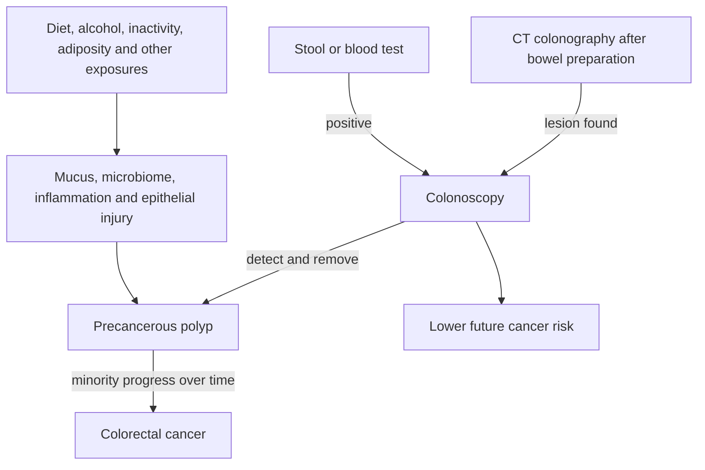

# Colorectal cancer prevention and screening

Most colorectal cancers develop through a multistep process in which a normal epithelial cell acquires molecular alterations, forms a precancerous polyp, and—only in a minority of polyps—progresses toward invasive cancer. Screening can therefore serve two different purposes: detect an existing cancer early, or find and remove a precursor before cancer exists. Colonoscopy uniquely combines direct inspection with polyp removal; stool, blood, and imaging tests are detection strategies whose positive results generally require colonoscopy. (@RenaMalikMD (Rena Malik, M.D.) — "The #1 Food Mistake Raising Young Adults’ Cancer Risk – Are You Guilty?", 2026-08-05, [link](https://www.youtube.com/watch?v=wyuknV4btfE))

## Diet, inflammation, and early-onset disease

Early-onset colorectal cancer has increased in younger birth cohorts, but no single cause is established. Genetics cannot explain a rapid population shift by itself, so earlier and longer exposure to changed environments is a leading framework. The transcript identifies ultra-processed food, sugar-sweetened beverages during adolescence or early adulthood, alcohol, processed meat, red meat, and sedentary behavior as candidate risks with unequal evidence strength. Associations with ultra-processed food and precancerous polyps are growing, while specific additives, childhood windows, and causal contributions remain less certain. (@RenaMalikMD (Rena Malik, M.D.) — "The #1 Food Mistake Raising Young Adults’ Cancer Risk – Are You Guilty?", 2026-08-05, [link](https://www.youtube.com/watch?v=wyuknV4btfE))

Ultra-processed diets may operate through both addition and displacement. Emulsifiers or other additives may weaken the colonic mucus barrier, alter microbial ecology, and promote inflammation, while low fiber displaces fermentable substrate. Microbial fermentation of fiber generates short-chain fatty acids with barrier-supporting and anti-inflammatory effects. This is a coherent mechanistic chain supported by laboratory and translational evidence, but it does not identify one additive as the cause of early-onset cancer in humans. (@RenaMalikMD (Rena Malik, M.D.) — "The #1 Food Mistake Raising Young Adults’ Cancer Risk – Are You Guilty?", 2026-08-05, [link](https://www.youtube.com/watch?v=wyuknV4btfE))

Processed meat has the clearer colorectal-risk signal; unprocessed red meat has a weaker observational association, described in the source as becoming apparent above roughly three servings weekly. High-temperature direct heat, smoking, and charring generate reaction products that offer a plausible additional route. The guest's distinctive view is that cooking method may explain an important part of the red-meat association and that marinating or gentler cooking may reduce formation of harmful compounds. Human studies have not established that these changes eliminate cancer risk, and the transcript explicitly treats that claim with limited confidence. (@RenaMalikMD (Rena Malik, M.D.) — "The #1 Food Mistake Raising Young Adults’ Cancer Risk – Are You Guilty?", 2026-08-05, [link](https://www.youtube.com/watch?v=wyuknV4btfE))

Temporary bloating after rapidly increasing legumes, vegetables, or whole grains is not evidence that fiber is damaging the colon. Microbial and gastrointestinal adaptation may take weeks; the source suggests roughly eight to ten weeks and favors increasing fiber gradually. Conversely, symptom relief on a low-fiber carnivore pattern does not establish long-term safety because symptoms and cancer risk are different endpoints. (@RenaMalikMD (Rena Malik, M.D.) — "The #1 Food Mistake Raising Young Adults’ Cancer Risk – Are You Guilty?", 2026-08-05, [link](https://www.youtube.com/watch?v=wyuknV4btfE))

A separate cross-sectional NHANES analysis of roughly 10,000 adults older than 50 associated a pooled category—regular yogurt, prebiotic, or probiotic consumption—with about 50% lower reported colon-cancer prevalence. It cannot establish prevention: disease may have preceded diet change, the three exposures were not separated, and consumers differed in income, education, smoking, and alcohol, with important factors reportedly left uncontrolled. The estimate is therefore hypothesis-generating rather than a reason to replace established dietary prevention or screening with a probiotic. (@biolayne1 (Dr. Layne Norton) — "Probiotics Cut Cancer Risk by 50% and Melt Fat! | Educational Video | Biolayne", 2026-08-05, [link](https://www.youtube.com/watch?v=RVN6GosoJUI)) [[probiotics-prebiotics-and-postbiotics]]

## Choosing a screening strategy

For average-risk adults, the transcript presents screening beginning at age 45 and a normal colonoscopy interval of about seven to ten years, while a multitarget stool test is repeated more often, approximately every three years. These are source-specific summaries, not universal instructions: family history, prior polyps, inflammatory bowel disease, genetic syndromes, symptoms, local guidelines, and test type alter both start age and cadence. Colonoscopy requires bowel preparation and carries small harms; the source estimates perforation at about 1 in 10,000. Its prevention advantage is balanced against anesthesia, time, access, preparation, and procedural risk. (@RenaMalikMD (Rena Malik, M.D.) — "The #1 Food Mistake Raising Young Adults’ Cancer Risk – Are You Guilty?", 2026-08-05, [link](https://www.youtube.com/watch?v=wyuknV4btfE))

Stool testing is a valid screening option for people who will complete it at the required cadence and proceed to colonoscopy after a positive result. Blood testing is convenient but was described as slightly less effective than stool testing and is better at cancer detection than precursor detection. CT colonography still requires bowel preparation and leads to colonoscopy if it detects a removable lesion; it may be useful when optical colonoscopy or anesthesia is unsuitable. The best screening test is therefore one with acceptable performance that the person can complete, coupled to reliable diagnostic follow-up. (@RenaMalikMD (Rena Malik, M.D.) — "The #1 Food Mistake Raising Young Adults’ Cancer Risk – Are You Guilty?", 2026-08-05, [link](https://www.youtube.com/watch?v=wyuknV4btfE))

## Practical implications

- **Daily: favor varied fiber-rich whole plant foods and limit habitual ultra-processed food, processed meat, sugar-sweetened drinks, and alcohol — moderate-to-strong for risk reduction.** Increase fiber gradually over weeks when baseline intake is low; persistent or alarming symptoms require assessment rather than forced escalation. (@RenaMalikMD (Rena Malik, M.D.) — "The #1 Food Mistake Raising Young Adults’ Cancer Risk – Are You Guilty?", 2026-08-05, [link](https://www.youtube.com/watch?v=wyuknV4btfE))
- **Weekly: maintain regular physical activity and avoid making charred or heavily processed meat a dietary default — moderate-to-strong.** Gentler cooking and marinating are plausible exposure-reduction measures, not proof that frequent red meat becomes risk-free. (@RenaMalikMD (Rena Malik, M.D.) — "The #1 Food Mistake Raising Young Adults’ Cancer Risk – Are You Guilty?", 2026-08-05, [link](https://www.youtube.com/watch?v=wyuknV4btfE))
- **At the age and interval set by current local guidance and personal risk: complete colorectal screening — strong.** For average risk, the source uses age 45 as the starting point; earlier assessment is appropriate for relevant family history, inherited risk, inflammatory bowel disease, or concerning symptoms. A positive non-colonoscopy test must be followed by colonoscopy. (@RenaMalikMD (Rena Malik, M.D.) — "The #1 Food Mistake Raising Young Adults’ Cancer Risk – Are You Guilty?", 2026-08-05, [link](https://www.youtube.com/watch?v=wyuknV4btfE))
- **Do not wait for routine screening when there is rectal bleeding, unexplained iron-deficiency anemia, persistent bowel-habit change, or unexplained weight loss.** This symptom rule is standard clinical framing; the transcript does not quantify it, so seek individualized evaluation.

## Gaps & open questions

- Which exposures explain the birth-cohort pattern of early-onset colorectal cancer, and during which developmental windows do they matter most?
- Which ultra-processed-food components act causally rather than serving as markers of the whole dietary pattern?
- How much risk is attributable to red meat itself versus dose, displacement of plant foods, processing, and cooking method?
- How do newer blood tests compare with stool tests for advanced precursors, mortality, adherence, and harms across repeated rounds?
- Which fiber types and escalation schedules best preserve long-term protection in people with gastrointestinal sensitivity?
- Do yogurt, a specific prebiotic, or a specific probiotic prospectively alter colorectal-cancer incidence after socioeconomic and behavioral confounding is controlled?

## Related

[[nutrition-evidence-and-personalization]] · [[dietary-fiber]] · [[probiotics-prebiotics-and-postbiotics]] · [[advanced-glycation-end-products]] · [[visceral-and-ectopic-fat]] · [[environmental-pollution-and-health]] · [[aging-model]] · [[practice-playbook]]
