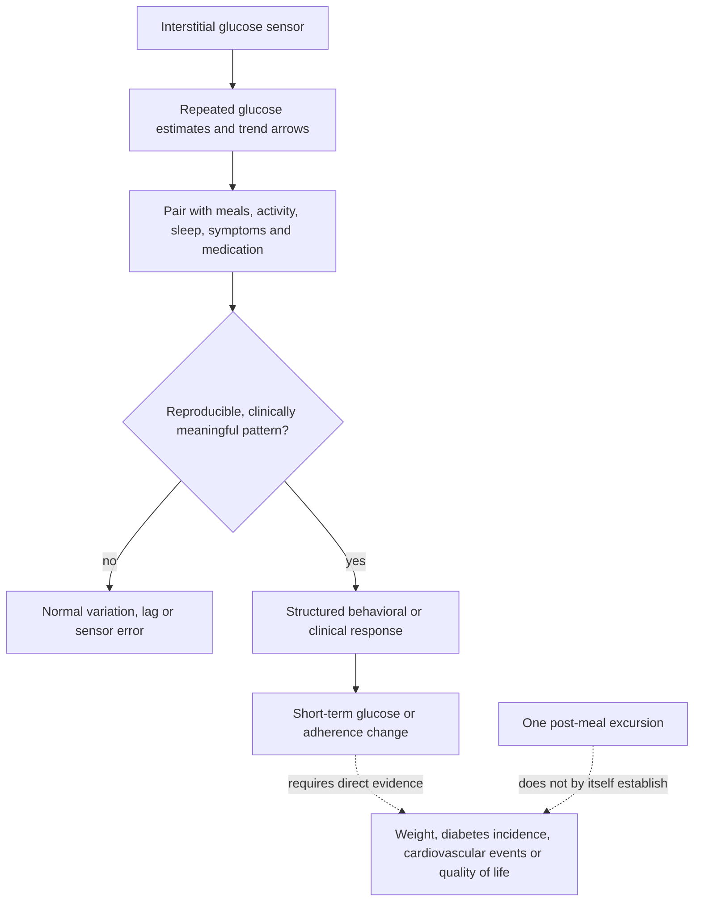

# Continuous glucose monitoring outside insulin-treated diabetes

Continuous glucose monitoring (CGM) uses a wearable sensor to estimate glucose in interstitial fluid repeatedly across the day. The result is a time series rather than the snapshots supplied by fasting glucose, an oral glucose-tolerance test, or hemoglobin A1c. That extra resolution can reveal meal, exercise, sleep, and fasting patterns, but more measurements do not automatically improve health: a useful monitor must identify a decision-relevant pattern, support an effective response, and improve an outcome that matters.[^fda-otc-cgm][^cgm-review-2026]

## From sensor signal to health outcome

CGM measures the downstream glucose response to many simultaneous inputs: carbohydrate amount and form, mixed-meal composition, recent activity, sleep, stress, illness, gastric emptying, and baseline insulin sensitivity. A single larger excursion therefore cannot identify which upstream factor caused it, and an acute curve is not a validated surrogate for future disease in a metabolically healthy person. Layne Norton's position is that social-media interpretations commonly turn normal post-meal physiology into pathology and mistake a visually salient excursion for evidence about long-term insulin sensitivity or outcomes. (@biolayne1 (Dr. Layne Norton) — "Are Continuous Glucose Monitors a Waste of Money? | Educational Video | Biolayne", 2026-08-19, [link](https://www.youtube.com/watch?v=bUvReH3HWZc)) [[free-sugars-and-glycemic-response]]

## Evidence by metabolic-risk group

A 2026 systematic review included 23 studies and 1,074 participants without diabetes: seven randomized trials, one cohort, seven prospective observational studies, four cross-sectional studies, and four other clinical trials. Across heterogeneous interventions, CGM reduced mean glucose compared with controls (standardized mean difference −0.54, 95% CI −1.02 to −0.07), did not significantly change BMI, and appeared to improve some short-term dietary behaviors and adherence. The review's qualitative subgroup synthesis found benefit in prediabetes but no appreciable glycemic benefit in healthy normoglycemic participants; it did not establish prevention of diabetes, cardiovascular events, or other durable clinical outcomes.[^cgm-review-2026] This supports Norton's risk-stratified direction while narrowing his categorical claim that CGMs are a waste of time and money outside diabetes: prediabetes may be a useful setting, and even healthy users may obtain information or behavioral feedback, but outcome benefit has not been shown. (@biolayne1 (Dr. Layne Norton) — "Are Continuous Glucose Monitors a Waste of Money? | Educational Video | Biolayne", 2026-08-19, [link](https://www.youtube.com/watch?v=bUvReH3HWZc))

This evidence is early rather than definitive. The studies were small, short, and methodologically mixed; many paired CGM with a lifestyle program, so any improvement cannot be attributed to the sensor alone. The pooled mean-glucose effect also crosses populations in which the same numerical change may have different clinical meaning. A separate systematic review found higher glycemic variability in prediabetes than normoglycemia but predominantly cross-sectional evidence and uncertain prediction of incident disease.[^variability-review-2024] The correct inference is therefore population-specific: CGM can expose patterns and may strengthen adherence, especially when dysglycemia is already plausible, but its incremental clinical value beyond established testing and structured lifestyle care remains uncertain. (@biolayne1 (Dr. Layne Norton) — "Are Continuous Glucose Monitors a Waste of Money? | Educational Video | Biolayne", 2026-08-19, [link](https://www.youtube.com/watch?v=bUvReH3HWZc))

Regulatory availability is a separate question from efficacy. The FDA cleared an over-the-counter CGM for adults who do not use insulin, including people without diabetes who want to understand diet and exercise responses; the agency also states that users should not make medical decisions from its output without a health professional and that the device is not intended for people with problematic hypoglycemia.[^fda-otc-cgm] Clearance establishes acceptable performance and labeling for a use, not proof that routine wear improves long-term outcomes in healthy users.

## Interpretation failures

The most common error is optimizing the graph rather than the person. Flattening every normal rise can displace attention from dietary pattern, fiber, physical activity, sleep, body composition, blood pressure, and ApoB, while restrictive food rules can be generated from sensor noise or one-off responses. Conversely, dismissing CGM entirely can miss its plausible role as biofeedback when prediabetes, unexplained patterns, or a defined behavioral experiment creates a real question. The distinction is not data versus no data; it is decision-linked measurement versus open-ended surveillance. Norton's practical recommendation to healthy people with normal glycemic control is to save the expense unless they knowingly value the data or gamification for its own sake. (@biolayne1 (Dr. Layne Norton) — "Are Continuous Glucose Monitors a Waste of Money? | Educational Video | Biolayne", 2026-08-19, [link](https://www.youtube.com/watch?v=bUvReH3HWZc)) [[proactive-health-monitoring]]

## Practical implications

- **Do not buy a CGM solely to suppress ordinary post-meal rises when established testing indicates normoglycemia—moderate evidence against glycemic or weight benefit, with no long-term outcome trials.** If curiosity or gamification is the goal, name that goal and set a time-limited experiment rather than treating every excursion as injury. (@biolayne1 (Dr. Layne Norton) — "Are Continuous Glucose Monitors a Waste of Money? | Educational Video | Biolayne", 2026-08-19, [link](https://www.youtube.com/watch?v=bUvReH3HWZc))[^cgm-review-2026]
- **For prediabetes, consider CGM only as an adjunct to a structured lifestyle or clinical program—emerging evidence.** Define the behavior to test, the interpretation rule, and the conventional follow-up measure in advance; the sensor has not independently been shown to prevent diabetes or cardiovascular events. (@biolayne1 (Dr. Layne Norton) — "Are Continuous Glucose Monitors a Waste of Money? | Educational Video | Biolayne", 2026-08-19, [link](https://www.youtube.com/watch?v=bUvReH3HWZc))[^cgm-review-2026]
- **Review trends over repeated comparable contexts, not isolated peaks—moderate measurement practice.** Confirm unexpected or consequential findings with an established diagnostic pathway, and do not change medication from an over-the-counter sensor without professional review.[^fda-otc-cgm]
- **Stop or redesign the experiment if it produces anxiety, progressively restrictive eating, or no decision change—pragmatic safety boundary.** More data are not beneficial when they worsen behavior or cannot alter management. [[health-misinformation-and-media-incentives]]

## Gaps & open questions

- Do CGM-guided programs prevent progression from prediabetes to diabetes beyond the same program without a sensor?
- Which CGM metrics in people without diabetes are reproducible, clinically meaningful, and incrementally predictive beyond fasting glucose, A1c, and oral glucose-tolerance testing?
- What duration of wear is sufficient for a defined behavioral question, and how much apparent food-specific response is day-to-day variation?
- Do consumer CGMs cause measurable anxiety, food avoidance, or disordered eating in susceptible users?
- Which component drives observed adherence changes: continuous feedback, coaching, novelty, accountability, or co-interventions?

## References

[^cgm-review-2026]: Sood R, et al. “Continuous glucose monitoring in non-diabetic populations: a systematic review of observational and interventional studies with meta-analysis.” 2026. [systematic review and meta-analysis; 23 studies, 1,074 participants]. [PubMed PMID: 41588451](https://pubmed.ncbi.nlm.nih.gov/41588451/)
[^variability-review-2024]: Rollo ME, et al. “Glycemic variability assessed using continuous glucose monitoring in individuals without diabetes and associations with cardiometabolic risk markers.” *Clinical Nutrition*. 2024. [systematic review and meta-analysis; predominantly cross-sectional evidence]. [PubMed PMID: 38401227](https://pubmed.ncbi.nlm.nih.gov/38401227/)
[^fda-otc-cgm]: US Food and Drug Administration. “FDA Clears First Over-the-Counter Continuous Glucose Monitor.” 2024. [device clearance and safety labeling]. [FDA](https://www.fda.gov/news-events/press-announcements/fda-clears-first-over-counter-continuous-glucose-monitor)

## Related

[[proactive-health-monitoring]] · [[free-sugars-and-glycemic-response]] · [[insulin-resistance]] · [[blood-marker-variability-and-reference-change]] · [[nutrition-evidence-and-personalization]] · [[health-misinformation-and-media-incentives]] · [[layne-norton]] · [[practice-playbook]]
