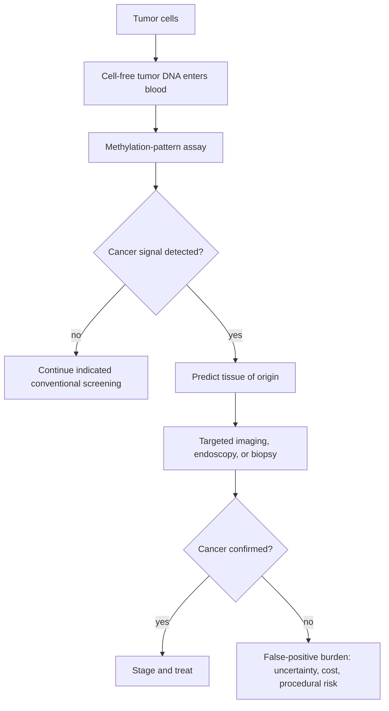
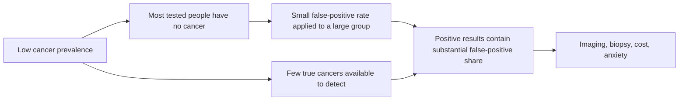

# Multi-cancer early detection

Multi-cancer early-detection (MCED) tests look in blood for molecular material associated with more than one cancer. Galleri analyzes methylation patterns in cell-free DNA: tumors can shed DNA into circulation, and tissue-specific epigenetic patterns can support both a cancer-signal call and a predicted tissue of origin. The intended role is additive to established breast, cervical, colorectal, and lung screening—not a replacement—because one negative blood result cannot exclude cancer. (@matt.kaeberlein (Healthspan Medicine) — "The NHS Galleri Trial: What you need to know about early cancer detection", 2026-03-27, [link](https://www.youtube.com/watch?v=LSLHw4bqXwI))

## Detection is not yet demonstrated benefit

The causal promise has several links: detect an otherwise occult cancer, identify it at an earlier stage, treat it more successfully, and thereby reduce late-stage disease or mortality. Each link must work for screening to improve outcomes. A higher detection count alone can include indolent disease that would never cause harm, while preferential sensitivity for larger or more aggressive tumors can make a test better at finding late disease than at producing the desired stage shift. (@matt.kaeberlein (Healthspan Medicine) — "The NHS Galleri Trial: What you need to know about early cancer detection", 2026-03-27, [link](https://www.youtube.com/watch?v=LSLHw4bqXwI))

The NHS-Galleri trial randomized more than 140,000 asymptomatic adults aged 50–77 to usual care or annual Galleri plus usual care, with three tests and up to three years of follow-up. It did not show a statistically significant reduction in its prespecified combined stage III/IV endpoint. Company-reported secondary descriptions included more early-stage detection, a fourfold higher overall detection rate, and a 20% stage-IV reduction in later screening rounds, but these were press-release results rather than a published full analysis at the time of the source. They are hypothesis-generating and do not rescue a failed primary endpoint or establish mortality benefit. (@matt.kaeberlein (Healthspan Medicine) — "The NHS Galleri Trial: What you need to know about early cancer detection", 2026-03-27, [link](https://www.youtube.com/watch?v=LSLHw4bqXwI))

## Sensitivity, specificity, and prior probability

Sensitivity is `true positives / (true positives + false negatives)`; specificity is `true negatives / (true negatives + false positives)`. The source describes Galleri's approximate overall sensitivity as 50% and specificity as 99%, while noting that sensitivity varies by cancer and stage and is generally higher for later, more aggressive disease. These figures mean neither that a positive result is 99% likely to be cancer nor that a negative result makes cancer unlikely enough to skip standard screening. (@matt.kaeberlein (Healthspan Medicine) — "The NHS Galleri Trial: What you need to know about early cancer detection", 2026-03-27, [link](https://www.youtube.com/watch?v=LSLHw4bqXwI))

Positive predictive value depends on prevalence. In a low-risk population, false-positive signals from the large cancer-free majority can rival true-positive signals even with 99% specificity; the source estimates that roughly half of positive Galleri signals are ultimately not confirmed as cancer. In a higher-risk population, the same sensitivity and specificity should yield a higher positive predictive value, but this mathematical improvement does not itself prove that testing that subgroup improves outcomes. (@matt.kaeberlein (Healthspan Medicine) — "The NHS Galleri Trial: What you need to know about early cancer detection", 2026-03-27, [link](https://www.youtube.com/watch?v=LSLHw4bqXwI))

## Population policy and individual choice

A population program must establish net benefit after false positives, false negatives, overdiagnosis, invasive work-up, anxiety, opportunity cost, and program expense. On the evidence described, routine population rollout is not justified. Matt Kaeberlein's more permissive position is that selected people with prior cancer, strong family history, or genetic risk may reasonably discuss testing even before definitive subgroup outcome evidence exists, provided they understand the uncertainty and are willing to complete diagnostic follow-up. That is an attributed risk-tolerance judgment, not a screening guideline. (@matt.kaeberlein (Healthspan Medicine) — "The NHS Galleri Trial: What you need to know about early cancer detection", 2026-03-27, [link](https://www.youtube.com/watch?v=LSLHw4bqXwI))

Repeating an initial positive blood test before invasive work-up might appear to reduce false positives, but the errors may be correlated and a repeat could delay diagnosis. Kaeberlein explicitly presents repeat testing as an unanswered idea without supporting data; it should not be invented as a clinical protocol. (@matt.kaeberlein (Healthspan Medicine) — "The NHS Galleri Trial: What you need to know about early cancer detection", 2026-03-27, [link](https://www.youtube.com/watch?v=LSLHw4bqXwI))

## Practical implications

- **At the cadence recommended for age and risk, continue established site-specific screening—strong.** An MCED result, especially a negative one, should not replace mammography, cervical screening, colorectal screening, or indicated low-dose lung CT. (@matt.kaeberlein (Healthspan Medicine) — "The NHS Galleri Trial: What you need to know about early cancer detection", 2026-03-27, [link](https://www.youtube.com/watch?v=LSLHw4bqXwI))
- **For average-risk asymptomatic adults, do not treat annual MCED testing as established population screening—moderate-to-strong.** The large NHS trial missed its stage-shift primary endpoint, and mortality benefit remains unshown in this source. (@matt.kaeberlein (Healthspan Medicine) — "The NHS Galleri Trial: What you need to know about early cancer detection", 2026-03-27, [link](https://www.youtube.com/watch?v=LSLHw4bqXwI))
- **For a high-risk person considering testing, use a one-time pretest consultation and a written follow-up pathway—moderate as a decision process, uncertain for outcome benefit.** Review prior risk, approximate false-positive and false-negative probabilities, which tests a positive result may trigger, cost, and tolerance for unresolved findings. (@matt.kaeberlein (Healthspan Medicine) — "The NHS Galleri Trial: What you need to know about early cancer detection", 2026-03-27, [link](https://www.youtube.com/watch?v=LSLHw4bqXwI))

## Gaps & open questions

- Will MCED-guided screening reduce cancer-specific or all-cause mortality rather than only change detection counts?
- Why did later NHS screening rounds appear more favorable, and will the effect persist in the full peer-reviewed analysis?
- Which cancers, stages, ages, and risk groups have a favorable benefit–harm balance?
- How much overdiagnosis, invasive follow-up, time to diagnostic resolution, and psychological harm does an MCED program produce?
- Is immediate repeat testing after a positive signal informative, or are assay errors sufficiently correlated to make it misleading?

## Related

[[proactive-health-monitoring]] · [[breast-cancer-screening]] · [[colorectal-cancer-prevention-and-screening]] · [[longevity-intervention-prioritization]]
