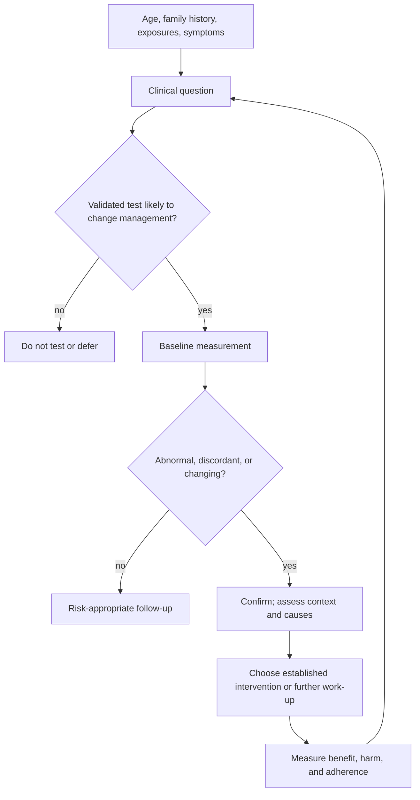
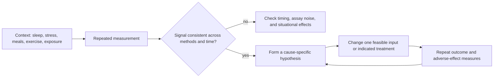

# Proactive health monitoring

Proactive health monitoring uses risk history, symptoms, validated measurements, and repeated trends to identify modifiable disease processes before a clinical event. Its purpose is to change decisions early, not to maximize the number of tests. A measurement is useful only when its result has an interpretable reference, alters an action, and is followed by confirmation or monitoring appropriate to the intervention. (@maxlugavere (Max Lugavere) — "The Longevity Doctor: These 5 Biomarkers That Predict How Well You’ll Age!", 2026-07-22, [link](https://www.youtube.com/watch?v=_AM9XeATR2U))

## From measurement to decision

Single values are vulnerable to biological variation, assay variation, recent illness, sleep loss, meals, training, medicines, and supplements. Trends can reveal a trajectory, but repeated testing also increases incidental findings and false alarms. Family history and symptoms determine prior risk; population screening rules and clinical guidelines determine when earlier detection is known to improve outcomes. This decision structure distinguishes proactive care from indiscriminate imaging, multi-cancer testing, or consumer dashboards. (@maxlugavere (Max Lugavere) — "The Longevity Doctor: These 5 Biomarkers That Predict How Well You’ll Age!", 2026-07-22, [link](https://www.youtube.com/watch?v=_AM9XeATR2U))

A longitudinal record can resolve context that a clinic snapshot cannot. In one 18-month case, repeated home blood-pressure readings showed that high office values were not sustained, CGM distinguished an early-morning glucose rise from fasting intake, serial DEXA separated fat loss from lean-mass change, and repeat mercury testing linked a rise to frequent large-fish intake and documented decline after dietary substitution. These are within-person observations, not proof that the full testing bundle improves population outcomes; their value came from each result changing a specific decision. (@matt.kaeberlein (Healthspan Medicine) — "Optispan Success Story: What 18 Months of Real Biomarker Data Actually Looks Like with Carlos Pinto", 2026-03-01, [link](https://www.youtube.com/watch?v=qlv8Q-CHWcc))

Attribution remains difficult when lifestyle, supplements, and medication change together. In the same case, ApoB and LDL fell most sharply after statin initiation, while body composition, A1c, stress practices, diet, and training also changed. The sequence supports the statin as a major lipid driver but cannot assign every improvement causally. Likewise, Kaeberlein reports personal A1c and fasting-glucose improvement with an SGLT2 inhibitor; that anecdote is not evidence for preventive prescribing to people without an established indication. Preventive medication should follow validated absolute-risk and benefit–harm assessment, not merely movement toward a self-selected biomarker target. (@matt.kaeberlein (Healthspan Medicine) — "Optispan Success Story: What 18 Months of Real Biomarker Data Actually Looks Like with Carlos Pinto", 2026-03-01, [link](https://www.youtube.com/watch?v=qlv8Q-CHWcc))

## A proposed five-marker panel

Florence Comite proposes fasting glucose, fasting insulin, hemoglobin A1c, total-cholesterol:HDL-cholesterol ratio, and free testosterone as five starting markers that she interprets together. The first three sample overlapping aspects of glycemic regulation: current fasting concentration, compensatory insulin output, and a longer average of glycemic exposure. Free testosterone estimates the unbound fraction in the context of binding proteins and symptoms. This is Comite’s clinical framework; the transcript does not establish that the five-marker bundle predicts aging better than validated cardiovascular and diabetes risk tools, nor that every marker should be optimized to her preferred range. (@maxlugavere (Max Lugavere) — "The Longevity Doctor: These 5 Biomarkers That Predict How Well You’ll Age!", 2026-07-22, [link](https://www.youtube.com/watch?v=_AM9XeATR2U))

The panel has important omissions. A cholesterol ratio can hide a high burden of atherogenic particles and does not replace LDL cholesterol, non-HDL cholesterol, or ApoB when clinically indicated. Free-testosterone assays and reference intervals vary, and a hormone value without compatible symptoms does not by itself diagnose deficiency or establish benefit from treatment. Blood pressure, smoking, kidney function, adiposity, medication exposure, sleep disorders, and age-appropriate screening can be more immediately actionable. [[nmr-blood-analysis]] and [[biological-age-biomarkers]] develop the difference between risk markers, surrogate endpoints, and validated outcomes. (@maxlugavere (Max Lugavere) — "The Longevity Doctor: These 5 Biomarkers That Predict How Well You’ll Age!", 2026-07-22, [link](https://www.youtube.com/watch?v=_AM9XeATR2U))

## Sentinels and risk-directed investigation

Disease processes may develop for years before an event, but earlier detection is beneficial only when an effective response exists and the screening pathway’s benefits exceed false positives, overdiagnosis, procedural harm, and anxiety. New erectile dysfunction can expose shared vascular, metabolic, neurologic, medication, hormonal, or psychological causes and should prompt cause-directed assessment rather than automatic testosterone treatment. (@maxlugavere (Max Lugavere) — "The Longevity Doctor: These 5 Biomarkers That Predict How Well You’ll Age!", 2026-07-22, [link](https://www.youtube.com/watch?v=_AM9XeATR2U)) [[erectile-dysfunction-and-vascular-health]]

The mirror-image failure is under-investigation of real symptoms. Endometriosis carries a 5–12-year delay from first symptom to diagnosis (about six years in the US), driven by cultural normalization of female pelvic pain, the lack of a blood biomarker, and reliance on low-sensitivity routine imaging — a normal transvaginal ultrasound does not exclude the disease, which requires MRI or a specialized ultrasound protocol. Recurrent severe dysmenorrhea, deep dyspareunia, cyclic bowel or urinary pain, or infertility should therefore trigger explicit, named diagnostic pursuit rather than reassurance; recent ACOG guidance permits clinical diagnosis and empiric treatment, making early identification actionable. This is a case where symptom-led testing has high yield and delay is itself pathogenic (central sensitization, fertility loss). [[endometriosis]] [[adenomyosis]] (Peter Attia MD — "397 - Endometriosis and adenomyosis: diagnosis, fertility, reproductive aging, & emerging treatments", 2026-06-22, [link](https://www.youtube.com/watch?v=IxHRYDM64dQ))

Breast cancer screening is the corpus's most developed example of risk-directed screening executed well or badly: formal risk assessment by the mid-20s (validated calculators, family history read broadly, breast density), modality matched to risk (DBT mammography as foundation, MRI supplementing for high risk or dense tissue), and consistent annual execution — with the observed failure mode being execution, not evidence (women meeting MRI criteria at least 9% versus 0.4% utilization). It also sharpens a framing tension worth keeping explicit on this page: Attia's position is that for cancers with demonstrated screening mortality benefit, an individual optimizing her own outcome should err toward more effective screening than population-efficiency guidelines (e.g. USPSTF biennial mammography) prescribe, accepting a higher false-positive burden knowingly — whereas this page's general caution is that screening more intensely is not automatically more preventive. The reconciliation is that both agree the deciding variables are baseline risk, an effective early intervention, and tolerance for false positives; they weight the default differently when evidence is intermediate. [[breast-cancer-screening]] (@PeterAttiaMD (Peter Attia MD) — "396 – Breast cancer screening: understanding risk, deciding when to start, and more", 2026-06-15, [link](https://www.youtube.com/watch?v=_9mBlZXA1Lk))

Comite favors risk-directed whole-body MRI and circulating methylated-DNA cancer tests, especially with relevant family history, while acknowledging the cost, follow-up burden, fear, and incidental abnormalities. The transcript does not provide mortality evidence or a validated universal screening protocol. These technologies should therefore remain clinician-mediated and indication-specific rather than routine longevity purchases. (@maxlugavere (Max Lugavere) — "The Longevity Doctor: These 5 Biomarkers That Predict How Well You’ll Age!", 2026-07-22, [link](https://www.youtube.com/watch?v=_AM9XeATR2U))

The NHS-Galleri trial sharpens that boundary: more than 140,000 asymptomatic adults received usual care or annual multi-cancer testing plus usual care, and the trial missed its prespecified reduction in combined stage III/IV cancer. Approximate 50% sensitivity and 99% specificity can still yield roughly as many false as true positive signals when prevalence is low, while a negative result can miss about half of existing cancers. Detection capability therefore does not establish population net benefit, and the result must not displace conventional screening. [[multi-cancer-early-detection]] (@matt.kaeberlein (Healthspan Medicine) — "The NHS Galleri Trial: What you need to know about early cancer detection", 2026-03-27, [link](https://www.youtube.com/watch?v=LSLHw4bqXwI))

Coronary calcium and non-calcified plaque measure different features. Comite reports a patient whose soft-plaque volume fell while calcium increased and interprets conversion toward calcification as stabilization; that longitudinal observation is not proof that a rising calcium score is generally favorable. Serial imaging decisions require the specific modality, radiation or contrast burden, measurement error, baseline risk, and whether the result changes evidence-based prevention. (@maxlugavere (Max Lugavere) — "The Longevity Doctor: These 5 Biomarkers That Predict How Well You’ll Age!", 2026-07-22, [link](https://www.youtube.com/watch?v=_AM9XeATR2U))

[[coronary-ct-angiography]] makes the modality distinction concrete: non-contrast CAC detects calcium, while contrast-enhanced CCTA can depict non-calcified plaque and stenosis. A zero CAC score therefore does not exclude plaque, but that diagnostic fact does not validate universal CCTA screening. Brockenbrough proposes age-based scans for asymptomatic adults and repeat imaging according to plaque burden; these are explicitly contested in [[coronary-cta-screening-asymptomatic]] because the transcript provides selected practice observations and expert protocol rather than screening-outcome evidence. (@matt.kaeberlein (Healthspan Medicine) — "THIS Helps Detect Heart Disease Before It Happens", 2026-03-08, [link](https://www.youtube.com/watch?v=SSFkNCVXv6U))

## Personalization without overinterpretation

Identical genomes do not produce identical lives: exposures, behavior, stochastic biology, and gene regulation can yield different phenotypes. That supports tailoring decisions to family history and measured response, but it does not validate every N-of-1 inference. Continuous glucose monitoring can reveal meal and fasting patterns, yet transient glucose differences between foods do not alone establish long-term harm, and routine CGM use in metabolically healthy people remains a weaker proposition than its use in diabetes. (@maxlugavere (Max Lugavere) — "The Longevity Doctor: These 5 Biomarkers That Predict How Well You’ll Age!", 2026-07-22, [link](https://www.youtube.com/watch?v=_AM9XeATR2U)) [[free-sugars-and-glycemic-response]]

The interview also advances unusually strong MTHFR claims: that common variants prevent useful conversion of ordinary folic acid or cyanocobalamin, that homocysteine above 8 strongly implies the genotype, and that methylated B vitamins should therefore be preferred broadly. These claims are contested by the need to distinguish genotype, folate or B12 status, renal and thyroid function, medicines, diet, and validated clinical outcomes. The transcript supplies no comparative trial evidence that genotype-directed methylated vitamins prevent hearing loss or extend healthspan; B-vitamin form and dose should follow a documented indication rather than genotype alone. (@maxlugavere (Max Lugavere) — "The Longevity Doctor: These 5 Biomarkers That Predict How Well You’ll Age!", 2026-07-22, [link](https://www.youtube.com/watch?v=_AM9XeATR2U)) [[supplement-evidence-and-safety]]

## Hormones are contextual variables

Sex hormones interact with reproductive function, bone, muscle, sexual function, and metabolism, but age-associated change is not automatically a disease. Comite’s position is that falling testosterone contributes causally to multiple disorders of aging and that free testosterone deserves routine attention in both sexes; she also describes long-term off-label testosterone use in women for bone protection. The transcript offers clinical experience rather than controlled outcome evidence, and these claims should not override diagnosis-specific guidelines, contraindication assessment, fertility goals, or approved osteoporosis therapies. Exogenous testosterone can suppress spermatogenesis, making causal evaluation and reproductive planning essential. (@maxlugavere (Max Lugavere) — "The Longevity Doctor: These 5 Biomarkers That Predict How Well You’ll Age!", 2026-07-22, [link](https://www.youtube.com/watch?v=_AM9XeATR2U)) [[male-fertility-and-exogenous-testosterone]]

Thyroid symptoms and sex-hormone symptoms can overlap. TSH reflects pituitary signaling to the thyroid, while free T4 and, in selected contexts, free T3 help characterize thyroid function. Testing should begin with a clinical question and accepted diagnostic sequence rather than attributing fatigue, weight change, cognition, or sexual symptoms to one longevity pathway. (@maxlugavere (Max Lugavere) — "The Longevity Doctor: These 5 Biomarkers That Predict How Well You’ll Age!", 2026-07-22, [link](https://www.youtube.com/watch?v=_AM9XeATR2U))

## Practical implications

- **At routine preventive care: review blood pressure, smoking, family history, metabolic risk, standard lipids, glucose status, and age-appropriate screening — strong.** Add tests when the result can change a defined decision; do not substitute a five-marker longevity panel for guideline-based risk assessment. (@maxlugavere (Max Lugavere) — "The Longevity Doctor: These 5 Biomarkers That Predict How Well You’ll Age!", 2026-07-22, [link](https://www.youtube.com/watch?v=_AM9XeATR2U))
- **When a value is surprising: repeat or confirm it under appropriate conditions before treatment — strong as a measurement principle.** Review illness, sleep, meals, exercise, medicines, supplements, assay method, and symptoms. (@maxlugavere (Max Lugavere) — "The Longevity Doctor: These 5 Biomarkers That Predict How Well You’ll Age!", 2026-07-22, [link](https://www.youtube.com/watch?v=_AM9XeATR2U))
- **When ED, major fatigue, loss of spontaneous erections, or other persistent change appears: seek cause-directed evaluation — moderate-to-strong.** Consider vascular, metabolic, sleep, thyroid, medication, neurologic, hormonal, and psychological pathways rather than assuming normal aging. (@maxlugavere (Max Lugavere) — "The Longevity Doctor: These 5 Biomarkers That Predict How Well You’ll Age!", 2026-07-22, [link](https://www.youtube.com/watch?v=_AM9XeATR2U))
- **Before hormone or high-dose vitamin treatment: document the indication, confirm relevant measurements, review fertility and contraindications, and define monitoring and stopping rules — strong.** Evidence is insufficient here for testosterone or methylated B vitamins as universal anti-aging treatments. (@maxlugavere (Max Lugavere) — "The Longevity Doctor: These 5 Biomarkers That Predict How Well You’ll Age!", 2026-07-22, [link](https://www.youtube.com/watch?v=_AM9XeATR2U))
- **When cyclic pelvic pain, painful intercourse, painful bowel movements, or difficulty conceiving persists: pursue a named diagnosis (endometriosis, adenomyosis) with appropriate imaging rather than accepting a normal routine ultrasound as exclusion — strong.** Reproductive planning adds a proactive measurement: for women who want future children, an AMH check and awareness of the exponential post-35 aneuploidy curve inform timing decisions while options remain wide. [[endometriosis]] [[oocyte-aneuploidy-and-reproductive-aging]] (Peter Attia MD — "397 - Endometriosis and adenomyosis: diagnosis, fertility, reproductive aging, & emerging treatments", 2026-06-22, [link](https://www.youtube.com/watch?v=IxHRYDM64dQ))
- **Before advanced imaging or multi-cancer blood testing: use shared decision-making about baseline risk, false positives, downstream procedures, cost, and uncertain outcome benefit — moderate-to-strong.** Screening more intensely is not automatically more preventive. (@maxlugavere (Max Lugavere) — "The Longevity Doctor: These 5 Biomarkers That Predict How Well You’ll Age!", 2026-07-22, [link](https://www.youtube.com/watch?v=_AM9XeATR2U))

## Gaps & open questions

- Does the proposed five-marker panel improve clinical prediction or outcomes beyond established risk models and standard preventive care?
- Which testing cadence detects meaningful trajectories without excessive false positives, cost, or anxiety?
- In which populations do CGM-guided dietary changes improve durable clinical outcomes rather than glucose curves alone?
- Do whole-body MRI or multi-cancer blood tests reduce cause-specific or all-cause mortality in asymptomatic average-risk people?
- Which free-testosterone methods and thresholds identify people who benefit from treatment, particularly women and older adults?
- Which system changes (clinician education, imaging access, empiric-treatment guidance) most compress the multi-year endometriosis diagnostic delay without inflating overdiagnosis?
- Do common MTHFR variants identify a population with better clinical outcomes from methylated rather than standard B-vitamin forms?
- When does serial plaque characterization change management beyond validated risk factors and established lipid-lowering treatment?

## Related

[[biological-age-biomarkers]] · [[breast-cancer-screening]] · [[multi-cancer-early-detection]] · [[coronary-ct-angiography]] · [[coronary-cta-screening-asymptomatic]] · [[nmr-blood-analysis]] · [[perimenopause-assessment-and-testing]] · [[endometriosis]] · [[adenomyosis]] · [[oocyte-aneuploidy-and-reproductive-aging]] · [[erectile-dysfunction-and-vascular-health]] · [[male-fertility-and-exogenous-testosterone]] · [[free-sugars-and-glycemic-response]] · [[supplement-evidence-and-safety]] · [[longevity-clinics-and-evidence]] · [[practice-playbook]] · [[aging-model]]
