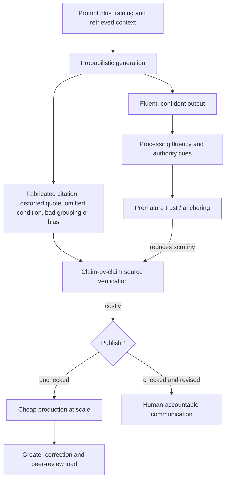

# AI-assisted science communication

AI-assisted science communication uses generative systems to search, summarize, organize, draft, illustrate, or edit scientific material. Its central risk is not simply occasional factual error: fluent output can obscure whether claims are entailed by sources, whether the chosen structure reflects the evidence, and whether a human has performed the judgment that communication requires. “AI slop” is a polemical label for high-volume, weakly checked output that substitutes plausible form for accountable synthesis. (@LabMuffinBeautyScience (Lab Muffin Beauty Science) — "AI slop has hit the science communicators", 2026-04-03, [link](https://www.youtube.com/watch?v=xcq5XYkFJfY))

## The verification asymmetry

Large language models generate sequences from statistical relationships learned from text and from subsequent tuning; factual correspondence is not guaranteed by fluent wording. They can perform impressively on some tasks yet fail at apparently simpler ones, a pattern often called jagged capability. Retrieval, calculators, and document grounding can reduce particular errors, but they do not transfer responsibility for quote fidelity, citation existence, study interpretation, or conclusion strength from the publisher to the tool. (@LabMuffinBeautyScience (Lab Muffin Beauty Science) — "AI slop has hit the science communicators", 2026-04-03, [link](https://www.youtube.com/watch?v=xcq5XYkFJfY))

Verification is harder than generation. Confident language activates authority cues; smooth prose feels easier to process and can therefore feel truer; and an initial machine-generated outline anchors what the reviewer notices and how ideas are grouped. A draft can omit the decisive condition in the first sentence, combine unrelated claims in one bullet, invent a reference, or preserve a widespread misconception. Correcting it may require reading every cited source and rebuilding the structure, which can cost more attention than writing from verified notes. This is an application of the broader asymmetry in which low-quality claims are cheaper to produce than to refute. (@LabMuffinBeautyScience (Lab Muffin Beauty Science) — "AI slop has hit the science communicators", 2026-04-03, [link](https://www.youtube.com/watch?v=xcq5XYkFJfY))

Science communication is not compression alone. A responsible explanation selects the causal hierarchy, separates mechanism from outcomes, identifies the studied population, retains negative and conflicting evidence, and chooses what the audience must know to reason further. A fluent summary can still fail if it distorts those relationships. Industry funding is similarly a reason to inspect design, reporting, replication, and applicability—not an automatic reason to accept or dismiss a study. (@LabMuffinBeautyScience (Lab Muffin Beauty Science) — "AI slop has hit the science communicators", 2026-04-03, [link](https://www.youtube.com/watch?v=xcq5XYkFJfY))

## Detection is weaker than provenance

Stylistic signals—repetitive triads, excessive headings, abrupt changes in voice, generic profundity, implausibly prolific output, malformed graphics, or formatting artifacts—can prompt scrutiny but cannot prove AI use. Human writers share these habits and model styles change. Stronger red flags concern the epistemic product: nonexistent references or quotes, contradictions between a post and its author’s advice, obvious misreading of an abstract, categories that do not cohere, unexplained shifts in output rate, and a history of uncorrected inaccuracies. Provenance, accessible sources, claim-level citations, disclosed assistance, and a visible correction process are more useful than trying to classify prose by style. (@LabMuffinBeautyScience (Lab Muffin Beauty Science) — "AI slop has hit the science communicators", 2026-04-03, [link](https://www.youtube.com/watch?v=xcq5XYkFJfY))

The source advances a contrarian cognitive-offloading concern: repeated delegation of ordinary reasoning may weaken critical-thinking practice and create learned dependence even when users feel more capable. The proposed mechanism—easy outsourcing reduces effortful practice, fluency inflates confidence, and environmental defaults reinforce the habit—is plausible, but claims of durable cognitive decline from general chatbot use remain unsettled and should not be upgraded from concern to established harm. (@LabMuffinBeautyScience (Lab Muffin Beauty Science) — "AI slop has hit the science communicators", 2026-04-03, [link](https://www.youtube.com/watch?v=xcq5XYkFJfY))

## Practical implications

- **For every scientific claim: open the cited source and verify identity, population, intervention, comparator, endpoint, direction, magnitude, uncertainty, and limitations before publication — strong epistemic practice.** Never use a generated citation or quotation without checking it against the primary text. (@LabMuffinBeautyScience (Lab Muffin Beauty Science) — "AI slop has hit the science communicators", 2026-04-03, [link](https://www.youtube.com/watch?v=xcq5XYkFJfY))
- **Draft from verified notes and a human-built causal outline; use AI only for bounded transformations whose output can be checked — precautionary practice.** “Starting point” does not remove anchoring or verification cost. (@LabMuffinBeautyScience (Lab Muffin Beauty Science) — "AI slop has hit the science communicators", 2026-04-03, [link](https://www.youtube.com/watch?v=xcq5XYkFJfY))
- **At publication and after correction: disclose material AI assistance, preserve provenance, and make substantive corrections visible — strong accountability practice.** Disclosure does not compensate for an unchecked claim.
- **When consuming content: inspect claims and sources rather than treating writing style as a detector — moderate.** Multiple epistemic red flags justify cross-checking with primary or authoritative sources; punctuation or three-item lists alone do not.
- **Weekly or monthly: audit which cognitive tasks are being outsourced and whether time, quality, skill, or satisfaction actually improved — investigational self-management practice.** If use has become automatic and net-negative, remove shortcuts, disable defaults, or set access limits rather than relying only on willpower. (@LabMuffinBeautyScience (Lab Muffin Beauty Science) — "AI slop has hit the science communicators", 2026-04-03, [link](https://www.youtube.com/watch?v=xcq5XYkFJfY))

## Gaps & open questions

- Which AI-assisted workflows improve accuracy and comprehension after counting the full verification cost?
- How do model use, task type, expertise, disclosure, and source access alter automation bias and overconfidence?
- Does long-term cognitive offloading cause durable skill loss, or do users reallocate effort to higher-level judgment?
- Which provenance standards let readers distinguish retrieval, drafting, editing, illustration, and autonomous synthesis?
- Can platforms reduce low-quality scale without suppressing legitimate assisted communication or accessible writing tools?

## Related

[[human-centered-ai-and-learning]] · [[health-misinformation-and-media-incentives]] · [[open-data-and-research-infrastructure]] · [[replication-and-research-incentives]] · [[public-trust-in-longevity-science]] · [[cognitive-dissonance-and-narrative-protection]]
