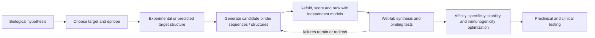
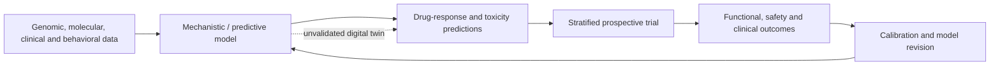

# AI-guided therapeutic design

AI-guided therapeutic design uses learned relationships among sequence, three-dimensional structure, binding, and prior experiments to propose molecules against a chosen biological target. It can narrow an enormous search space and give a designer some control over the binding site, or epitope, but it does not remove the need to establish that the target matters, manufacture candidates, test binding experimentally, and optimize drug-like behavior. The central distinction is between **designing a binder** and **developing a therapy**. (@TheSheekeyScienceShow (The Sheekey Science Show) — "how AI is inventing antibodies — Santiago Mille (Germinal)", 2026-07-17, [link](https://www.youtube.com/watch?v=g9GBoiOtibQ))

## Antibodies as a constrained design problem

An antibody combines a relatively conserved framework with variable complementarity-determining regions (CDRs) that provide much of its target recognition. This modularity makes antibody design more constrained than inventing an arbitrary protein: a model can preserve a known framework while searching CDR sequence and conformation for a surface complementary to a selected epitope. Traditional immunization and hybridoma methods can produce binders, but require biological generation and extensive characterization and offer less direct control over where on the antigen an antibody binds. (@TheSheekeyScienceShow (The Sheekey Science Show) — "how AI is inventing antibodies — Santiago Mille (Germinal)", 2026-07-17, [link](https://www.youtube.com/watch?v=g9GBoiOtibQ))

The open-source Germinal pipeline begins with a target structure and an antibody framework. AlphaFold-Multimer contributes a differentiable estimate of whether the antibody–antigen complex fits and docks at the specified region, while an antibody-specific protein language model penalizes sequences that are unlike known antibodies. Gradients through both models iteratively change the CDR sequence to reduce a combined structural-binding and antibody-likeness loss. This is model-guided optimization, not proof of affinity: the output remains a prediction until synthesized and measured. (@TheSheekeyScienceShow (The Sheekey Science Show) — "how AI is inventing antibodies — Santiago Mille (Germinal)", 2026-07-17, [link](https://www.youtube.com/watch?v=g9GBoiOtibQ))

Two independent 2025 results establish that the approach works across model architectures rather than depending on one pipeline. A structure-based diffusion model was used to design full-length antibodies from scratch against specified targets including a bacterial toxin and a viral spike protein, with the designs' structures then validated by electron microscopy and found to match the prediction. A separate group used a protein language model, named MAGE for monoclonal antibody generator, to design antibodies against an influenza strain absent from its training data — a genuine generalization test rather than a retrieval of something the model had seen. Architecture diversity plus an out-of-distribution success is stronger evidence than either result alone. (@TheSheekeyScienceShow (The Sheekey Science Show) — "This years biggest breakthroughs in longevity! (2025)", 2025-12-21, [link](https://www.youtube.com/watch?v=X-Hzyzo1Jpk))

What this displaces is worth stating precisely, because the saving is in a specific step rather than in drug development as a whole. Conventional antibody generation requires purifying the target antigen, immunizing rabbits or mice, waiting for an immune response, harvesting and screening blood cells to find the ones producing a binder against the desired target, cloning it, engineering it for human use, and testing — a long, expensive, animal-dependent pipeline. Computational design removes the animal and the screening entirely, going from a specified antigen to a candidate sequence. Everything downstream of the binder — developability, pharmacokinetics, immunogenicity, efficacy, safety — is unchanged, which is why cheaper binders shorten one segment of the path rather than the path. Because monoclonal antibodies remain a major therapeutic class, the aging field stands to inherit the benefit for whatever targets it eventually validates. (@TheSheekeyScienceShow (The Sheekey Science Show) — "This years biggest breakthroughs in longevity! (2025)", 2025-12-21, [link](https://www.youtube.com/watch?v=X-Hzyzo1Jpk))

The same design methods are being applied to non-antibody proteins with aging targets directly in view. A custom model optimized for protein design in aging was used to redesign the Yamanaka factors SOX2 and KLF4, reported as nearly 50-fold improvements over the original factors. Fold-improvement in a design objective is not a clinical claim, and in reprogramming specifically a more potent factor is not automatically a safer one, since the central hazard is loss of cell identity. [[epigenetic-alterations-and-reprogramming]] (@TheSheekeyScienceShow (The Sheekey Science Show) — "This years biggest breakthroughs in longevity! (2025)", 2025-12-21, [link](https://www.youtube.com/watch?v=X-Hzyzo1Jpk))

## Bridging text models and sequence models

That reprogramming result illustrates a design choice worth separating from its application, because it addresses a structural gap in the field's tooling. Protein and DNA language models have absorbed the corpus of biological sequence but cannot be asked about the literature; general text models can reason over literature but are not good at protein design. The model used for the Yamanaka work — GPT-4b micro, developed with OpenAI and initialized from a smaller version of GPT-4o — was built as a bridge between the two, and is autoregressive, predicting one token at a time. Its distinguishing feature is multi-modal conditioning: inherited text, tokenized structure data allowing it to fold sequences, protein–protein interaction context, and evolutionary context in the form of sequences of the same protein across many species. Its developers emphasize that it is general rather than domain-specific: "this is not a model designed for Yamanaka factors nor a model designed for longevity", with reprogramming chosen as a proof of concept because the factors are hard targets and the problem was the company's most pressing. Other in-house redesign work includes a receptor engineered to no longer receive a small-molecule-triggered apoptosis signal, for use in a cell therapy. (@TheSheekeyScienceShow (The Sheekey Science Show) — "OpenAI Meets Longevity: Inside the Retro Biosciences Partnership That Beat Evolution", 2025-09-12, [link](https://www.youtube.com/watch?v=dwWjpKzBNnY))

Which modality carries the signal turned out to be target-dependent in an instructive way. Structural information contributed little for the Yamanaka factors, because roughly 70 to 80% of those proteins are intrinsically disordered and acquire conformation only on binding partners, with no data available describing those bound states. Sequence and evolutionary context did the work instead — deep conservation marks which domains tolerate change and which are load-bearing, functioning as a learned prior over where to be adventurous. This inverts the usual assumption that structure-based design is the more powerful approach, and raises the possibility that a sequence-level code relating disordered regions to function is learnable where no structural representation exists. Disordered proteins are conventionally treated as intractable design targets, so if this generalizes it is a broader methodological result than the reprogramming application that demonstrated it. [[engineered-reprogramming-factors]] (@TheSheekeyScienceShow (The Sheekey Science Show) — "OpenAI Meets Longevity: Inside the Retro Biosciences Partnership That Beat Evolution", 2025-09-12, [link](https://www.youtube.com/watch?v=dwWjpKzBNnY))

Generation is effectively instantaneous and the model can emit unlimited sequences, so the operative constraints sit on either side of it: heuristic filters that discard candidates with broken core domains and select for diversity of hypothesis, and wet-lab capacity that limited testing to a few hundred SOX2 and about fifty KLF4 variants. One screening round sufficed, with no design-test-redesign iteration. A high enough hit rate to skip iteration is a strong result; it also means the campaign never ran the loop that usually exposes overfitting to a particular assay. (@TheSheekeyScienceShow (The Sheekey Science Show) — "OpenAI Meets Longevity: Inside the Retro Biosciences Partnership That Beat Evolution", 2025-09-12, [link](https://www.youtube.com/watch?v=dwWjpKzBNnY))

## Data quality decides which questions are answerable

A recurring practical claim from within this work is that the field's modeling progress is unevenly distributed because its data are unevenly clean, and that this — not model capability — sets what can currently be asked. Amino-acid and DNA sequence data are effectively ground truth requiring almost no cleaning beyond clustering out duplicates, which is why sequence models advanced first and fastest; contrast this with general web text, where most of the corpus must be filtered before it is useful. Single-cell RNA data is the opposite case: much of the available data is judged low quality, often from older platforms, and may contain little signal beyond coarse cell-type distinctions, so "the data quality is holding back actual progress on the modeling side of things." Genomic data poses a third problem — very low information density, with most of the genome consisting of retrotransposons — and no convincing demonstration yet exists that models trained on raw DNA extract patterns as meaningful as protein models do. (@TheSheekeyScienceShow (The Sheekey Science Show) — "OpenAI Meets Longevity: Inside the Retro Biosciences Partnership That Beat Evolution", 2025-09-12, [link](https://www.youtube.com/watch?v=dwWjpKzBNnY))

The deeper version of the argument is about modality-question mismatch rather than data volume: transcriptomic data may simply not contain the information about how cells age or how to reverse cellular age, in which case even a perfect model of that data cannot answer the question, and the remedy is generating a different kind of data rather than scaling the model. This is the same discipline the rest of this chapter applies to binders — a well-executed computation against the wrong object cannot be rescued downstream — and it converges with Fedichev's prioritization of causal target selection over molecule generation. (@TheSheekeyScienceShow (The Sheekey Science Show) — "OpenAI Meets Longevity: Inside the Retro Biosciences Partnership That Beat Evolution", 2025-09-12, [link](https://www.youtube.com/watch?v=dwWjpKzBNnY))

Rico Meinl's framing of where the bottleneck ultimately lies is consistent with, and sharper than, the general caution in this chapter: roughly two-thirds of drugs fail in later-phase trials and most do not translate from small-organism in vivo models to humans, so perfect in-silico design of binders and antibodies could still leave the field's throughput largely unchanged. His prescription is to align model objectives with the metric that matters — how many safe, effective drugs reach patients — and to collect data suited to that objective rather than to the objectives current data happen to support. On biosecurity he offers a deliberately deflationary view: models already in circulation are powerful enough that a sufficiently motivated bad actor could use them, and he draws an analogy to the caution around GPT-2's release looking overstated in retrospect, arguing against suppressing real utility over security detail. That position is contestable — the GPT-2 analogy concerns text rather than pathogen-relevant design, where the asymmetry between attacker effort and societal harm is far greater — and it is recorded here as one practitioner's view rather than a field consensus. (@TheSheekeyScienceShow (The Sheekey Science Show) — "OpenAI Meets Longevity: Inside the Retro Biosciences Partnership That Beat Evolution", 2025-09-12, [link](https://www.youtube.com/watch?v=dwWjpKzBNnY))

## Training on assay readouts rather than a single input modality

The mismatch argument above has a constructive counterpart: rather than choosing a better single modality, a model can be trained on the readouts of biological assays themselves. Transformer-based architectures of the current generation — the same family underlying general chat models — can ingest heterogeneous information and synthesize it in ways earlier models could not, which makes an assay-trained model feasible where a transcriptome-trained or single-input model would not be. The claimed advantage is that an assay readout is closer to the decision being made than an upstream molecular measurement is. (@TheSheekeyScienceShow (The Sheekey Science Show) — "Rewiring Immunity Against Cancer with AI & Gene Editing - Aaron Edwards (KiraGen Bio)", 2025-07-11, [link](https://www.youtube.com/watch?v=OMOCa8DmJxQ))

The precondition is stringent and is the real scarce resource: the assay must be correlative to what will happen in the clinic. For cell therapy this has been genuinely hard, and it is unusual for any cell-therapy product to have an assay with demonstrated clinical correlation. The enabling sequence in glioblastoma ran in a specific order — a group applied its CAR-T product to patient-derived organoids and ran cell-based assays *before* running the clinical trial, then after the trial published data connecting the assay results to the trial outcomes. Only the retrospective linkage turns a laboratory readout into a training signal with any claim to clinical meaning; running the organoid work alone would not have. An indication where that linkage exists is therefore a better starting point for model training than an indication with more data but no outcome anchor. (@TheSheekeyScienceShow (The Sheekey Science Show) — "Rewiring Immunity Against Cancer with AI & Gene Editing - Aaron Edwards (KiraGen Bio)", 2025-07-11, [link](https://www.youtube.com/watch?v=OMOCa8DmJxQ))

Transfer learning is the stated mechanism for extending such a model beyond its training indication: the cell type used for one indication is swapped for another indication's cell type and its characteristics, with each additional program improving the model's predictive ability. The load-bearing caveat is stated within the claim itself — this works only insofar as the substituted model system reliably resembles what occurs in patients, which returns the argument to the correlative-assay requirement rather than escaping it. Microenvironmental similarity across related brain indications, and partial signature overlap with tissues such as breast, is offered as the reason transfer is plausible here; it is a design rationale for a model in development, not a demonstrated generalization result. [[engineered-cell-therapy-for-solid-tumors]] (@TheSheekeyScienceShow (The Sheekey Science Show) — "Rewiring Immunity Against Cancer with AI & Gene Editing - Aaron Edwards (KiraGen Bio)", 2025-07-11, [link](https://www.youtube.com/watch?v=OMOCa8DmJxQ))

Where such a model earns its place is a search space too large to enumerate experimentally. Choosing roughly six suppressive pathways to block from a candidate set of 50 to 80 produces a number of permutations that cannot be tested in a wet lab even given unlimited money and personnel. The model's role in that setting is explicitly prioritization rather than decision: it steers toward promising combinations, which are then tested in the wet lab and confirmed as good or bad before anything is advanced. This is the same generate-then-confirm discipline described for binder design, applied to combinatorial edit selection rather than molecular structure. (@TheSheekeyScienceShow (The Sheekey Science Show) — "Rewiring Immunity Against Cancer with AI & Gene Editing - Aaron Edwards (KiraGen Bio)", 2025-07-11, [link](https://www.youtube.com/watch?v=OMOCa8DmJxQ))

## Filtering is part of the model

A design campaign may generate thousands of candidates and then refold them with a model different from the one used for generation, apply structural and interface thresholds, rank the survivors, and synthesize only a small set. Germinal campaigns were described as requiring roughly 200 GPU-hours to obtain a few thousand designs, with target-dependent yield. Because wet-lab capacity may limit testing to about 15 candidates, threshold selection can determine success as strongly as the generator itself. Flexible CDR loops remain difficult for structure predictors; experimentally binding designs tended to contain more regular secondary structure, which may partly reflect both physical stability and what the predictor can model confidently. (@TheSheekeyScienceShow (The Sheekey Science Show) — "how AI is inventing antibodies — Santiago Mille (Germinal)", 2026-07-17, [link](https://www.youtube.com/watch?v=g9GBoiOtibQ))

## Evidence and translational limits

Generative models can also compress literature review, integrate large multi-omic datasets, propose hypotheses, and rank experiments by expected information. This changes the cost of choosing and testing candidates, but computational speed does not accelerate cell culture, animal biology, manufacturing, recruitment, follow-up, or the appearance of rare delayed harms at the same rate. A useful pipeline treats AI output as a hypothesis and records prospective predictions, independent experiments, failures, and calibration rather than accepting a fluent report as validation. (@FoundMyFitness (FoundMyFitness) — "Why the Next 10 Years May Add 50 to Your Lifespan | Dr. Derya Unutmaz", 2026-07-22, [link](https://www.youtube.com/watch?v=OJCgQUT1aic))

Digital twins are proposed individualized simulations combining genetics, metabolism, immunity, microbiome, biomarkers, behavior, and environment to predict response and select trial participants. They could improve enrichment and reduce failed exposure, but a high-dimensional patient record is not yet a validated causal simulation of a human. Models must be tested prospectively across demographic and disease variation, against standard care, for both average and rare harms. Derya Unutmaz's forecast that sufficiently capable twins could reduce trials from years to weeks and enable treatments on demand is a contrarian technological projection, not a present clinical capability. (@FoundMyFitness (FoundMyFitness) — "Why the Next 10 Years May Add 50 to Your Lifespan | Dr. Derya Unutmaz", 2026-07-22, [link](https://www.youtube.com/watch?v=OJCgQUT1aic))

The evidence supports the narrower proposition that computational pipelines can produce experimentally binding antibodies against selected targets. It is **emerging proof-of-concept evidence**, not evidence that generated molecules are clinically effective drugs. A research binder can have affinity too low for therapy or fail through off-target binding, instability, aggregation, poor expression, unfavorable pharmacokinetics, or immunogenicity. Compute, DNA synthesis, and wet-lab testing also remain meaningful bottlenecks, and performance on familiar or training-set-adjacent targets may overstate generalization to novel targets. (@TheSheekeyScienceShow (The Sheekey Science Show) — "how AI is inventing antibodies — Santiago Mille (Germinal)", 2026-07-17, [link](https://www.youtube.com/watch?v=g9GBoiOtibQ))

Machine learning can also expand the evidence used for small-molecule design. The HARVEST system used language models to extract approximately three million protein–small-molecule binding-affinity records from patents, roughly adding another BindingDB-sized collection, and produced H-Bench to test models on chemistry and proteins absent from common public training sets. This supports automated evidence extraction and harder benchmarking; it does not verify every extracted record or demonstrate prospective drug discovery. Peter Fedichev's contrarian prioritization is that machine learning may currently add more value in finding causal disease and aging targets than in molecule generation, because an efficiently designed drug against the wrong target still fails. (@TheSheekeyScienceShow (The Sheekey Science Show) — "How We Should Target Aging | Peter Fedichev", 2026-04-10, [link](https://www.youtube.com/watch?v=buEPyBiKrXw))

## Practical implications

For researchers, define the biological endpoint before each campaign, preregister computational filters where feasible, use a genuinely independent refolding or scoring model, and test enough candidates to estimate hit rate rather than reporting only the winner. At every design round, measure binding, specificity, expression, stability, and relevant function; before therapeutic claims, add pharmacology, immunogenicity, toxicology, and outcome testing. Evidence is **moderate for computational triage**, **emerging for de novo experimental binders**, and **absent from these sources for clinical benefit**. For patients, there is no personal protocol: an AI-designed label does not change the evidentiary requirements for a medicine.

## Gaps & open questions

- How well do hit rates generalize to structurally novel, flexible, membrane-bound, or training-distant targets?
- Which filters predict wet-lab affinity and developability rather than predictor confidence alone?
- Can campaigns reach reliable one-design/one-hit performance without hiding failures through post hoc selection?
- How accurately can patent-extracted measurements be normalized across assays, units, and experimental conditions?
- Does faster molecule generation shift the principal bottleneck to causal target selection and clinical validation?
- What prospective benchmark would show that a digital twin predicts treatment benefit and rare harm better than conventional stratification?
- How should models represent changing tumors, immune repertoires, behavior, environment, and treatment adherence through time?
- Does removing animal immunization from antibody generation change the properties of the resulting molecules — for better or worse — in developability and immunogenicity?
- Do designed proteins optimized for potency, such as redesigned reprogramming factors, carry proportionally greater off-target or identity-loss risk?
- Now that binder generation is cheap, what fraction of programme failures is attributable to target selection rather than molecule quality?
- Is there a learnable sequence-level code for intrinsically disordered proteins, or did the reprogramming-factor result depend on the unusually deep evolutionary conservation of those particular targets?
- Which biological data modalities actually contain the information needed to answer aging questions, and which are being modeled only because they are available?
- Does skipping design–test–redesign iteration, as a single-round campaign does, conceal overfitting to the specific assay used to score candidates?
- How many indications possess an assay with published correlation to clinical outcome, and is the assay-trained-model approach therefore limited to the few that do?
- Does transfer learning across indications survive contact with a microenvironment that differs more than expected, and how would a failure of transfer be distinguished from a failure of the underlying biological hypothesis?
- When a model prioritizes a combination and the wet lab confirms it, how much of the credit belongs to the model versus to the candidate-list narrowing that preceded it?

## Related

[[aging-dynamics-and-resilience]] · [[aging-model]] · [[biological-age-biomarkers]] · [[human-centered-ai-and-learning]] · [[immune-aging-and-rejuvenation]] · [[engineered-cell-therapy-for-solid-tumors]] · [[epigenetic-alterations-and-reprogramming]] · [[engineered-reprogramming-factors]] · [[hallmarks-of-aging]] · [[experimental-peptides]] · [[supplement-evidence-and-safety]] · [[replication-and-research-incentives]]
