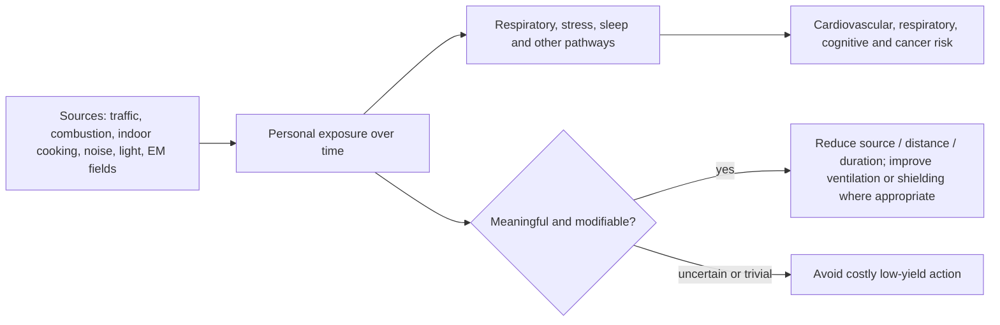
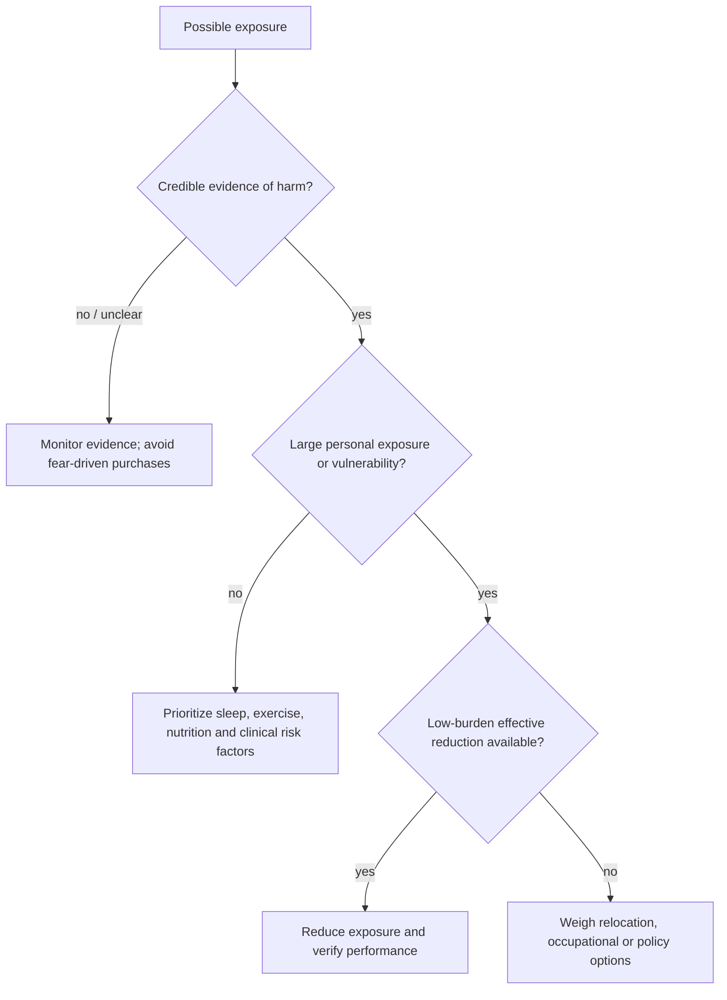

# Environmental pollution and health

Environmental pollution is the introduction of a substance or form of energy that can harm a living system. For human health this includes chemical exposures in air, water, and soil and physical exposures such as noise, artificial light, and electromagnetic fields. Detectability, artificial origin, or unfamiliarity does not by itself establish harm; the relevant variables are dose, duration, biological mechanism, and clinical effect. (@PeterAttiaMD (Peter Attia MD) — "Environmental pollution and longevity: air pollution, noise, light, EMFs, & more (AMA 87 sneak peek)", 2026-07-19, [link](https://www.youtube.com/watch?v=sDxAiqfy4-g))

## Exposure and causal inference

Microplastics sharpen the distinction between environmental presence, measured internal dose, and demonstrated disease. Widely repeated gram-scale intake estimates were modeled rather than measured, and laboratory glove stearates and endogenous tissue lipids can create signals misclassified as plastic by spectroscopy or mass spectrometry. This analytical challenge does not establish safety; it lowers confidence in unconfirmed dose estimates and tissue detections, making contamination controls and orthogonal identification prerequisites for causal interpretation. (@NutritionMadeSimple (Nutrition Made Simple!) — "The Internet has Lied to You About Microplastics (Doctor Reveals)", 2026-06-27, [link](https://www.youtube.com/watch?v=kDZlU0s-A2U)) [[microplastics-exposure-and-measurement]]

Chronic exposure is an accumulated dose: a few imperfect days may matter little while a modest elevation repeated for years may matter substantially. Air pollution has the clearest association with cardiovascular and respiratory disease, cancer, cognitive effects, and mortality among the categories introduced in this source; noise and artificial light can also plausibly act through sleep and stress pathways. The source does not present the promised exposure-specific evidence, however, because the available video ends before the air-pollution analysis begins. It therefore supports the framework and hierarchy, not quantitative claims about safe thresholds, filtration effect sizes, or electromagnetic-field harms. (@PeterAttiaMD (Peter Attia MD) — "Environmental pollution and longevity: air pollution, noise, light, EMFs, & more (AMA 87 sneak peek)", 2026-07-19, [link](https://www.youtube.com/watch?v=sDxAiqfy4-g))

Environmental exposures are difficult to randomize ethically over decades. Observational estimates are weakened by exposure misclassification—home address may not represent work, commuting, indoor ventilation, or changing behavior—and by correlated exposures: living near a highway may jointly increase particulate matter, nitrogen dioxide, noise, and nighttime light. Outcomes are also multifactorial, so genetics, smoking, sleep, diet, exercise, and socioeconomic conditions can confound or mediate an association. Modest hazard ratios can be important at population scale but are less decisive for individual causality than very large, consistent effects. (@PeterAttiaMD (Peter Attia MD) — "Environmental pollution and longevity: air pollution, noise, light, EMFs, & more (AMA 87 sneak peek)", 2026-07-19, [link](https://www.youtube.com/watch?v=sDxAiqfy4-g))

## Risk prioritization

The appropriate decision is not whether an exposure is natural, nor whether total elimination is possible. It is whether the evidence is credible, the absolute effect is material for this person, exposure is meaningfully reducible, and the intervention’s burden and opportunity cost are justified. Peter Attia’s explicit hierarchy places sleep, exercise, nutrition, blood pressure, lipids, and metabolic health above environmental optimization for most people; he treats severe local pollution as a possible exception and argues for low-burden, high-return exposure reduction after foundations are addressed. This is a prioritization framework, not proof that low-dose exposures are harmless. (@PeterAttiaMD (Peter Attia MD) — "Environmental pollution and longevity: air pollution, noise, light, EMFs, & more (AMA 87 sneak peek)", 2026-07-19, [link](https://www.youtube.com/watch?v=sDxAiqfy4-g))

## Practical implications

Daily, first maintain the high-evidence health foundations and avoid obvious high-dose exposures such as smoke or poorly ventilated combustion. When a real local source exists, reduce it with the least burdensome effective measure—for example source control and ventilation before expensive devices—and reassess seasonally or when wildfire, residence, workplace, or symptoms change. Evidence for prioritizing major pollution sources is moderate to strong in principle; this transcript supplies no product-specific or threshold-specific evidence. (@PeterAttiaMD (Peter Attia MD) — "Environmental pollution and longevity: air pollution, noise, light, EMFs, & more (AMA 87 sneak peek)", 2026-07-19, [link](https://www.youtube.com/watch?v=sDxAiqfy4-g))

Do not buy electromagnetic-field shields, premium filters, or other exposure products merely because an exposure is invisible or described as unnatural. Require evidence that the relevant exposure is harmful at the encountered dose and that the product measurably reduces it. For persistent sleep-disrupting noise or nighttime light, address the source and bedroom environment nightly, but interpret expected longevity benefit as indirect and not quantified by this source. (@PeterAttiaMD (Peter Attia MD) — "Environmental pollution and longevity: air pollution, noise, light, EMFs, & more (AMA 87 sneak peek)", 2026-07-19, [link](https://www.youtube.com/watch?v=sDxAiqfy4-g))

## Gaps & open questions

- What are the exposure-response curves and clinically relevant thresholds for each pollutant, especially at low chronic doses?
- Which filtration, ventilation, noise, and light interventions improve clinical outcomes rather than only environmental measurements?
- How can studies separate correlated air, noise, light, housing, occupation, and socioeconomic exposures?
- Which people have enough exposure or vulnerability for environmental controls to outrank other health investments?
- What does rigorous dose-specific evidence show for everyday electromagnetic fields and marketed shielding products?

## Related

[[microplastics-exposure-and-measurement]] · [[aging-model]] · [[practice-playbook]]
