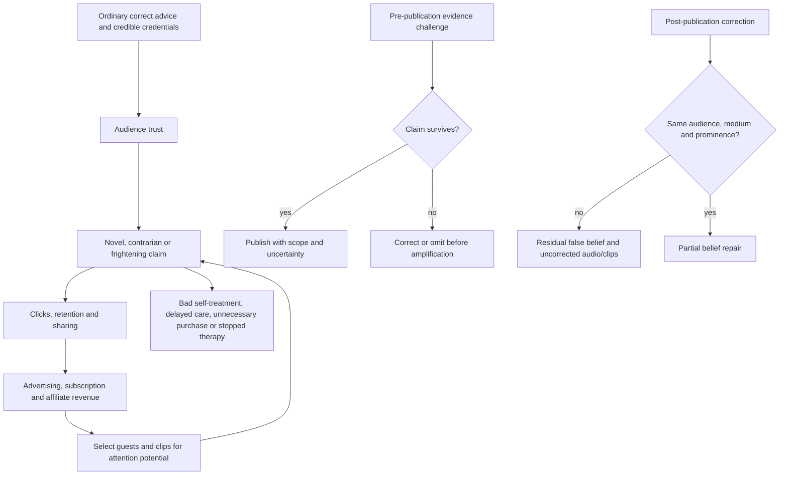
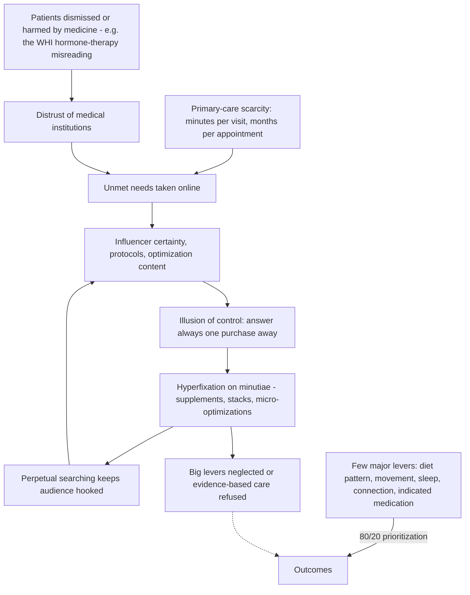

# Health misinformation and media incentives

Health misinformation is false, misleading, or materially incomplete health content, regardless of whether its publisher intended deception. The central systems problem is asymmetric: surprising claims can be produced and distributed quickly, while evaluating population, intervention, comparator, endpoint, applicability, and harm takes expertise and time. In a large Twitter dataset, false stories spread farther, faster, deeper, and more broadly than true ones and were more novel, although the strongest effect was political and should not be assumed identical for every health platform.[^vosoughi-2018] (@NutritionMadeSimple (Nutrition Made Simple!) — "Diary of a CEO Spreads Dangerous Health Misinformation. And They Know It.", 2026-08-28, [link](https://www.youtube.com/watch?v=C2bFpays_ik))

## The attention–authority–sales loop

Commercial interest does not prove a claim false, and contrarianism does not prove it novel or wrong. Both change the audit burden. Affiliate revenue creates a direct path from fear to purchase: a communicator can redefine normal physiology as a hidden problem, present a product as the solution, and earn when the audience buys. The FTC therefore says material connections must be clear and conspicuous, close to the endorsement, and disclosed in both a video and its description when commissions arise from linked purchases; the phrase “affiliate link” alone may not adequately explain payment.[^ftc-2023] (@NutritionMadeSimple (Nutrition Made Simple!) — "Diary of a CEO Spreads Dangerous Health Misinformation. And They Know It.", 2026-08-28, [link](https://www.youtube.com/watch?v=C2bFpays_ik))

A mixed message can be more persuasive than pure nonsense. Familiar advice—do not smoke, exercise, maintain a healthy weight—establishes credibility; a novel unsupported claim then borrows that credibility. The source summarizes this pattern as correct advice that is unoriginal followed by original advice that is incorrect. This is an attributed media criticism, not a universal law: minority positions sometimes become correct, so the decisive test remains evidence and prediction, not conformity. (@NutritionMadeSimple (Nutrition Made Simple!) — "Diary of a CEO Spreads Dangerous Health Misinformation. And They Know It.", 2026-08-28, [link](https://www.youtube.com/watch?v=C2bFpays_ik))

## Why buried corrections fail

A technically accurate reference packet does not repair a false headline, spoken claim, or short clip if most of the audience never encounters it. Corrections compete with the original claim's repetition, emotional salience, source authority, and distribution. A correction available only as a long PDF in show notes cannot reach audio-only listeners; a visual note cannot reliably reach a viewer who is driving or exercising; and leaving the original promotional clip untouched preserves the highest-reach version. The staged source documents a striking case in which producer-authored evidence notes contradicted featured claims about sodium, fruit, fiber, cancer metabolism, and ketogenic diets, yet the spoken or clipped claims remained available. That observation supports a channel-matching rule rather than proving what every listener believed. (@NutritionMadeSimple (Nutrition Made Simple!) — "Diary of a CEO Spreads Dangerous Health Misinformation. And They Know It.", 2026-08-28, [link](https://www.youtube.com/watch?v=C2bFpays_ik))

Correction research supports intervention but not magical erasure. In an experiment about sunscreen and skin-cancer misinformation, real-time user corrections and a news-literacy intervention reduced some misperceptions; effect depends on timing, clarity, prior belief, source, repetition, and whether the correction supplies a coherent alternative.[^vraga-2021] The responsible correction therefore leads with the supported account, explicitly identifies the false claim, explains the error, appears in the same medium and distribution surfaces, and remains attached to archives and clips. (@NutritionMadeSimple (Nutrition Made Simple!) — "Diary of a CEO Spreads Dangerous Health Misinformation. And They Know It.", 2026-08-28, [link](https://www.youtube.com/watch?v=C2bFpays_ik))

## Optimization culture and the illusion of control

The wellness industry's persuasive power is structural before it is rhetorical: it fills a vacuum. Primary-care internist Lucy McBride's account is that on the order of 100 million Americans lack access to a primary-care doctor, and those with access often get minutes per visit — so people take real, unanswered questions to search engines, chatbots, and influencers, where they meet confident, prescriptive answers. The industry's genuine contributions (protein awareness, exercise, sleep hygiene, mindfulness) earn trust that then transfers to its unsupported products — the same credibility-transfer mechanism described above. Her diagnostic red flag is certainty itself: science's lack of certainty is a feature, not a bug, so influencers professing certainty are selling what she calls the illusion of control, which lands hardest on people previously dismissed by doctors. The word protocol does similar work — Lugavere's observation that it implies rigor underlying recommendations that were often invented for profit. (@maxlugavere (Max Lugavere) — "Wellness Myths Debunked: How to Navigate 'Optimization Slop' Culture", 2026-08-12, [link](https://www.youtube.com/watch?v=z4A12iaH7I0)) [[lucy-mcbride]]

Two failure modes anchor the section. First, weaponized distrust: the medical establishment's own misreading of the Women's Health Initiative created a generation of hormone-therapy fear, and parts of the wellness industry now leverage that fear to sell supplements while the patient forgoes the treatment that works — McBride describes a patient whose menopausal symptoms resolved in three weeks on hormone therapy after years of ineffective supplements, one of which had caused a liver problem ([[whi-and-menopause-hormone-therapy]], [[menopause-hormone-therapy]]). Second, misdirected optimization: her college-athlete patient with significant coronary artery disease who refuses a statin, believing marginal exercise and diet tweaks can substitute — when the marginal benefit of two more minutes of running is minuscule against low-dose rosuvastatin toward the guideline LDL target below 70 mg/dL for established coronary disease. The general form: optimization has a cost, attention is finite, and the big levers are few; a segmented-marketing corollary she flags as a myth is population-specific overcomplication (special hormone-reset workouts or protein rules for menopausal women) that repackages unchanged fundamentals — protein, fiber, healthy fats, movement — as proprietary programs. Both discussants also note that overconfidence is not confined to influencers: credentialed physicians speaking outside their training (nutrition prominently) can broadcast the same unearned certainty. (@maxlugavere (Max Lugavere) — "Wellness Myths Debunked: How to Navigate 'Optimization Slop' Culture", 2026-08-12, [link](https://www.youtube.com/watch?v=z4A12iaH7I0)) [[womens-exercise-across-the-lifespan]] [[statins-and-glycemic-risk]]

Anti-aging marketing is the limiting case: aging is universal, so the goalpost moves forever and there is always more to sell — a brilliant business model precisely because the promise is unfalsifiable; McBride calls anti-aging an oxymoron and likens the sector to religion, fine as chosen belief but not as evidence. ([[longevity-clinics-and-evidence]], [[public-trust-in-longevity-science]]) (@maxlugavere (Max Lugavere) — "Wellness Myths Debunked: How to Navigate 'Optimization Slop' Culture", 2026-08-12, [link](https://www.youtube.com/watch?v=z4A12iaH7I0))

The highest-consequence failure is not merely believing one false proposition but entering an unmonitored stack whose harms add. Heat exposure, fluid-losing cleansing regimens, and psychoactive or thermoregulatory-active drugs each change circulation, hydration, electrolytes, judgment, or heat dissipation; the combined risk cannot be inferred from whether any component is marketed as natural, sacred, or therapeutic. A Miami Beach death attributed by the medical examiner to severe dehydration after a cleansing regimen, psychoactive drugs, and prolonged sauna exposure provides a sentinel case, while the related criminal charge remained unresolved at the evidence cutoff.[^miami-wellness-2026] Norton's distinctive position is that misinformation loses any claim to harmless pluralism when unsupported authority directs a person into a potentially lethal protocol. (@biolayne1 (Dr. Layne Norton) — "Holistic Treatment Turns Deadly in Miami | What the Fitness | Biolayne", 2026-08-21, [link](https://www.youtube.com/watch?v=c401VoJpdIA)) [[sauna-and-deliberate-heat-exposure]]

## Claim appraisal from first principles

The most common failure is outcome substitution. Cell metabolism does not establish cancer survival; a post-meal glucose rise in a metabolically healthy person does not establish damage; a biomarker change does not establish longer life; and averaging survival while most trial participants remain alive cannot answer a lifetime extension question. Compartment errors are equally important: circulating beta-hydroxybutyrate does not automatically reproduce every luminal and receptor-mediated effect of colonic short-chain fatty acids generated from fiber. These examples enter the wiki as evidence-reasoning lessons, not as a catalog of personalities. (@NutritionMadeSimple (Nutrition Made Simple!) — "Diary of a CEO Spreads Dangerous Health Misinformation. And They Know It.", 2026-08-28, [link](https://www.youtube.com/watch?v=C2bFpays_ik)) [[dietary-fiber]] [[free-sugars-and-glycemic-response]]

The safest production design moves disagreement upstream. A host or editor identifies consequential claims before recording, checks them against primary or authoritative evidence, and asks the guest to address applicable counterevidence during the conversation. Real-time lookup is useful for simple statistics but cannot adjudicate complex causal claims in seconds. When expertise is missing, an independent domain specialist can participate; after publication, transparent corrections supplement rather than replace pre-publication challenge. (@NutritionMadeSimple (Nutrition Made Simple!) — "Diary of a CEO Spreads Dangerous Health Misinformation. And They Know It.", 2026-08-28, [link](https://www.youtube.com/watch?v=C2bFpays_ik))

## Practical implications

- **Before changing treatment, diet, or supplementation because of a media claim: verify it in applicable guidelines, systematic reviews, or primary trials—strong epistemic and safety practice.** Consequential claims deserve more scrutiny when they promise one cause, one cure, or replacement of established care. (@NutritionMadeSimple (Nutrition Made Simple!) — "Diary of a CEO Spreads Dangerous Health Misinformation. And They Know It.", 2026-08-28, [link](https://www.youtube.com/watch?v=C2bFpays_ik))
- **Before any retreat or multi-part wellness protocol: inventory every drug, supplement, cleanse, fast, heat exposure, and fluid-loss pathway together—strong safety practice.** Require named licensed supervision, emergency and stopping rules, interaction review, and a plan for hydration and electrolyte monitoring; a waiver or spiritual framing does not perform this risk assessment. (@biolayne1 (Dr. Layne Norton) — "Holistic Treatment Turns Deadly in Miami | What the Fitness | Biolayne", 2026-08-21, [link](https://www.youtube.com/watch?v=c401VoJpdIA)) [[sauna-and-deliberate-heat-exposure]]
- **At every product endorsement: look for a clear financial disclosure adjacent to the spoken and linked recommendation—strong regulatory guidance in the United States.** An affiliate relationship is a reason to inspect the evidence and alternatives, not automatic proof of fraud.[^ftc-2023] (@NutritionMadeSimple (Nutrition Made Simple!) — "Diary of a CEO Spreads Dangerous Health Misinformation. And They Know It.", 2026-08-28, [link](https://www.youtube.com/watch?v=C2bFpays_ik))
- **For publishers, before recording or release: pre-register the consequential claims to check, prepare the strongest counterevidence, and put the challenge in the content itself—moderate systems recommendation.** Do not outsource the correction to a low-visibility PDF. (@NutritionMadeSimple (Nutrition Made Simple!) — "Diary of a CEO Spreads Dangerous Health Misinformation. And They Know It.", 2026-08-28, [link](https://www.youtube.com/watch?v=C2bFpays_ik))
- **When correcting: update audio, video, show notes, transcripts, titles, thumbnails, and derivative clips with the same or greater prominence as the original—moderate evidence-informed practice.** Preserve what changed and why rather than silently replacing the record. (@NutritionMadeSimple (Nutrition Made Simple!) — "Diary of a CEO Spreads Dangerous Health Misinformation. And They Know It.", 2026-08-28, [link](https://www.youtube.com/watch?v=C2bFpays_ik))
- **Monthly or per release cycle: audit incentives and correction reach—investigational governance cadence.** Track the proportion of high-consequence claims checked before release, disclosure visibility, correction exposure, and whether sensational false excerpts continue to outperform the repair. (@NutritionMadeSimple (Nutrition Made Simple!) — "Diary of a CEO Spreads Dangerous Health Misinformation. And They Know It.", 2026-08-28, [link](https://www.youtube.com/watch?v=C2bFpays_ik))

## Gaps & open questions

- Which correction formats produce durable belief change across audio, video, clips, newsletters, and recommendation algorithms?
- How often do affiliate and sponsorship disclosures change trust, purchasing, and treatment behavior rather than merely satisfy notice requirements?
- What pre-publication review process preserves genuine disagreement without rewarding unsupported certainty?
- How should platforms measure the health harm of delayed care or stopped treatment against engagement and revenue?
- Which audiences are most vulnerable to the credibility-transfer pattern of conventional advice surrounding one dangerous novel claim?
- Does hyperfixation on optimization minutiae measurably displace high-value care (screening adherence, indicated medication) in the worried-well population, and can lever-first framing repair it?
- Which licensing, disclosure, adverse-event reporting, and emergency-readiness rules reduce harm at wellness retreats that combine drugs, supplements, fasting, cleanses, or thermal exposure?

## References

[^vosoughi-2018]: Vosoughi S, Roy D, Aral S. “The spread of true and false news online.” *Science*. 2018;359:1146–1151. [retrospective observational diffusion study]. [doi:10.1126/science.aap9559](https://doi.org/10.1126/science.aap9559)
[^ftc-2023]: US Federal Trade Commission. “FTC's Endorsement Guides: What People Are Asking.” Revised 2023. [official regulatory guidance]. [FTC guidance](https://www.ftc.gov/business-guidance/resources/ftcs-endorsement-guides-what-people-are-asking)
[^vraga-2021]: Vraga EK, Bode L. “The Effects of a News Literacy Video and Real-Time Corrections to Video Misinformation Related to Sunscreen and Skin Cancer.” *Health Communication*. 2021. [randomized online experiment]. [PubMed PMID: 33840310](https://pubmed.ncbi.nlm.nih.gov/33840310/)
[^miami-wellness-2026]: Jones C. “Doctor charged with manslaughter over a year after woman died during psychedelic retreat in Miami Beach.” *CBS Miami*. 2026. [reporting from arrest warrant and medical-examiner determination]. [CBS Miami](https://www.cbsnews.com/miami/news/miami-beach-doctor-manslaughter-charge-psychedelic-retreat-death/)

## Related

[[ai-assisted-science-communication]] · [[replication-and-research-incentives]] · [[open-data-and-research-infrastructure]] · [[supplement-evidence-and-safety]] · [[nutrition-evidence-and-personalization]] · [[cognitive-dissonance-and-narrative-protection]] · [[proactive-health-monitoring]] · [[continuous-glucose-monitoring]] · [[whi-and-menopause-hormone-therapy]] · [[experimental-peptides]] · [[sauna-and-deliberate-heat-exposure]] · [[gil-carvalho]] · [[lucy-mcbride]] · [[layne-norton]]
