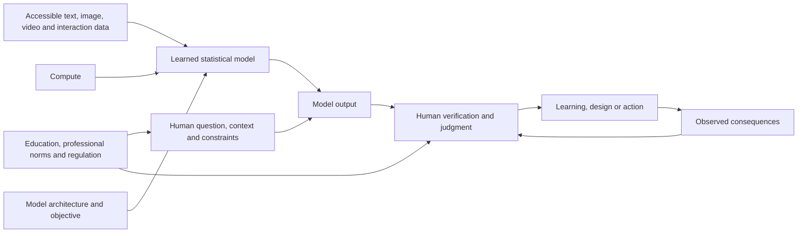
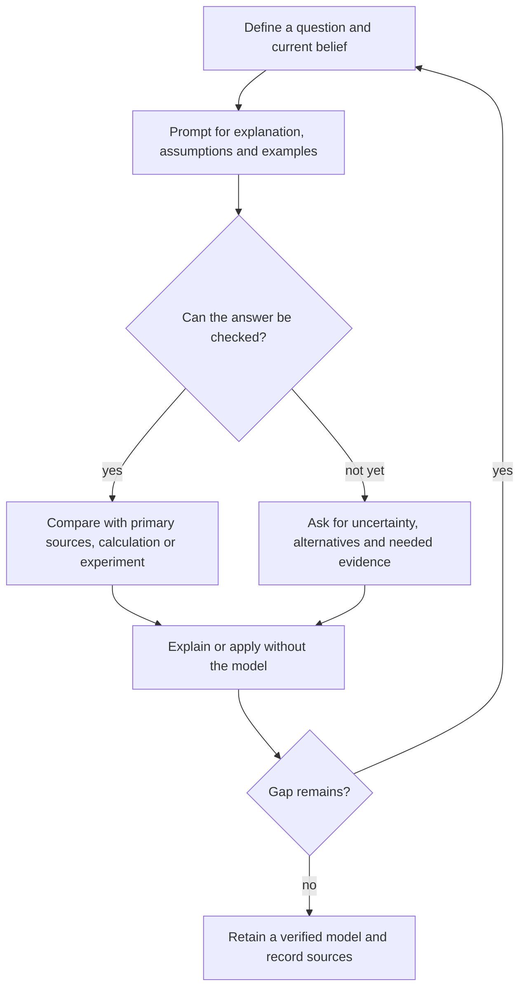

# Human-centered AI and learning

Human-centered artificial intelligence treats AI as infrastructure for extending human agency rather than as an autonomous substitute for human judgment. Present systems learn statistical regularities from accessible data and optimize an engineered objective; they can combine patterns in useful or surprising ways, but fluent language does not establish subjective understanding, emotion, motivation, or access to unrecorded experience. Human-centered use therefore joins technical capability to user choice, domain expertise, safety evaluation, and accountable institutions. (@hubermanlab (Andrew Huberman) — "Using AI to Increase Your Intelligence & Enrich Humanity | Dr. Fei-Fei Li", 2026-08-10, [link](https://www.youtube.com/watch?v=N5AQFYtqx8Q))

## How learned capability emerges

Modern computer vision illustrates a three-part scaling mechanism: sufficiently expressive neural-network algorithms, large labeled datasets, and parallel compute. ImageNet assembled roughly 15 million images; its public challenge used more than one million images across 1,000 categories. In 2012, the convergence of ImageNet-scale data, neural networks, and GPUs sharply reduced object-recognition error, and within several more years systems exceeded the approximately 4% error reported for a human benchmark on that particular labeling task. This was task-specific performance, not a general demonstration that machines see or understand as humans do. (@hubermanlab (Andrew Huberman) — "Using AI to Increase Your Intelligence & Enrich Humanity | Dr. Fei-Fei Li", 2026-08-10, [link](https://www.youtube.com/watch?v=N5AQFYtqx8Q))

Adding video gives a model statistical information about change through time: which poses, movements, collisions, and transitions tend to follow others. A generated moving cat can look physically plausible without the model explicitly representing feline muscles; extensive examples constrain the likely sequence of appearances. This supports useful prediction and generation while leaving a gap between pattern fit and a causal, embodied model of the world. (@hubermanlab (Andrew Huberman) — "Using AI to Increase Your Intelligence & Enrich Humanity | Dr. Fei-Fei Li", 2026-08-10, [link](https://www.youtube.com/watch?v=N5AQFYtqx8Q))

Human learning differs in data efficiency and embodiment. A child can generalize a category from relatively few encounters while simultaneously using touch, action, goals, social feedback, and an evolved body. An internet-trained model has access to vastly more recorded examples but not automatically to private sensations, tacit relationships, or observations that were never digitized. Fei-Fei Li’s distinctive position is that spatial and physical intelligence—not language alone—is the next major frontier, because useful agents and robots must predict and act in three-dimensional, changing environments. (@hubermanlab (Andrew Huberman) — "Using AI to Increase Your Intelligence & Enrich Humanity | Dr. Fei-Fei Li", 2026-08-10, [link](https://www.youtube.com/watch?v=N5AQFYtqx8Q))

## Learning with an AI system

An AI tutor lowers the cost of asking preliminary and follow-up questions, can adapt explanations, and can help a learner expose exactly where understanding fails. Its educational value depends on an active loop: the learner poses specific questions, tests the response, asks for counterexamples or derivations, and applies the result. Passive answer collection can remove the retrieval, generation, and error-correction work through which durable learning is built. Li frames prompting as a form of Socratic inquiry and argues that schools should teach it, while also warning that both banning the tool and letting it displace motivation can reduce student agency. This is an educational framework, not trial evidence that chatbot use improves long-term learning. (@hubermanlab (Andrew Huberman) — "Using AI to Increase Your Intelligence & Enrich Humanity | Dr. Fei-Fei Li", 2026-08-10, [link](https://www.youtube.com/watch?v=N5AQFYtqx8Q))

## Deployment, embodiment, and governance

Robotic systems can augment people where perception, precision, repetition, or physical labor is limiting. Surgical robots already operate under direct clinician control; care, hospital logistics, hazardous inspection, and disaster response are plausible assistance domains. Autonomy should rise only with task-specific data and validation: aggregating many demonstrations can improve a system, but rare procedures may never supply enough examples for reliable independent action, making human–robot collaboration safer than an under-trained autonomous system. (@hubermanlab (Andrew Huberman) — "Using AI to Increase Your Intelligence & Enrich Humanity | Dr. Fei-Fei Li", 2026-08-10, [link](https://www.youtube.com/watch?v=N5AQFYtqx8Q))

Market demand alone cannot resolve questions of consent, dignity, bias, liability, acceptable failure, or distribution of benefits. Li’s human-centered position assigns joint responsibility to developers, affected communities, educators, professional bodies, and government; high-stakes applications such as medicine require domain regulation and prospective safety evidence. This connects to [[ai-guided-therapeutic-design]]: faster generation or prediction changes the research funnel but does not waive experimental and clinical validation. (@hubermanlab (Andrew Huberman) — "Using AI to Increase Your Intelligence & Enrich Humanity | Dr. Fei-Fei Li", 2026-08-10, [link](https://www.youtube.com/watch?v=N5AQFYtqx8Q))

## Practical implications

- **For each consequential use: define the question, request assumptions and uncertainty, then verify against a primary source, calculation, test, or qualified professional — strong methodological principle.** Fluency is not validation, and the appropriate check becomes stricter as harm increases. (@hubermanlab (Andrew Huberman) — "Using AI to Increase Your Intelligence & Enrich Humanity | Dr. Fei-Fei Li", 2026-08-10, [link](https://www.youtube.com/watch?v=N5AQFYtqx8Q))
- **During study: use AI for iterative questioning, examples, and feedback, then retrieve and apply the idea without assistance — plausible, emerging educational evidence in this source.** Preserve the learner’s own problem formulation and final judgment rather than outsourcing both. (@hubermanlab (Andrew Huberman) — "Using AI to Increase Your Intelligence & Enrich Humanity | Dr. Fei-Fei Li", 2026-08-10, [link](https://www.youtube.com/watch?v=N5AQFYtqx8Q))
- **Before deploying an embodied or medical system: specify human oversight, failure handling, data coverage, consent, and outcome monitoring — strong safety principle; application-specific efficacy varies.** Do not infer autonomous competence from performance on a benchmark or simulation. (@hubermanlab (Andrew Huberman) — "Using AI to Increase Your Intelligence & Enrich Humanity | Dr. Fei-Fei Li", 2026-08-10, [link](https://www.youtube.com/watch?v=N5AQFYtqx8Q))

## Gaps & open questions

- Which AI-tutoring designs improve delayed retention and transfer rather than short-term task completion?
- How can schools assess individual understanding when assistance is ubiquitous without denying useful tools?
- What tests distinguish a world model that supports causal intervention from visual sequence prediction?
- How much real-world data is enough for safe robotic autonomy in rare or changing conditions?
- Which governance arrangements give affected people meaningful agency rather than consultation without control?

## Related

[[ai-guided-therapeutic-design]] · [[cognitive-reserve-and-brain-health]] · [[exercise-enhanced-learning]] · [[automation-employment-and-population]]
